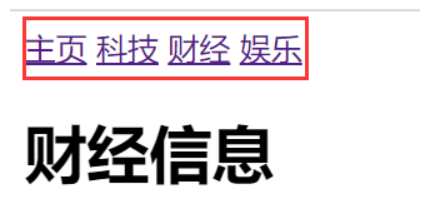
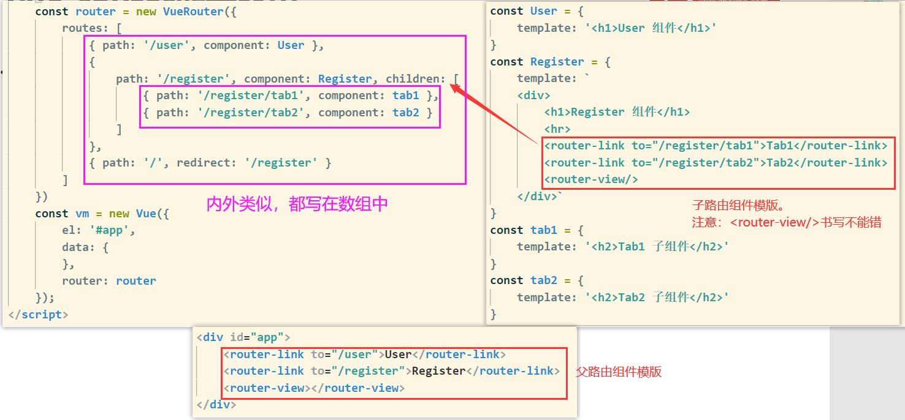
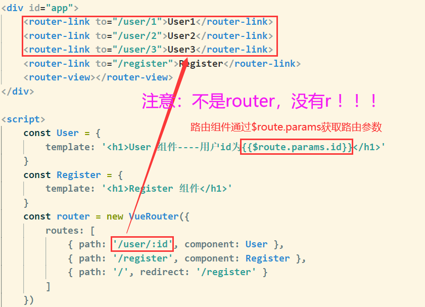
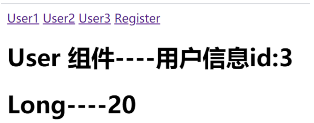
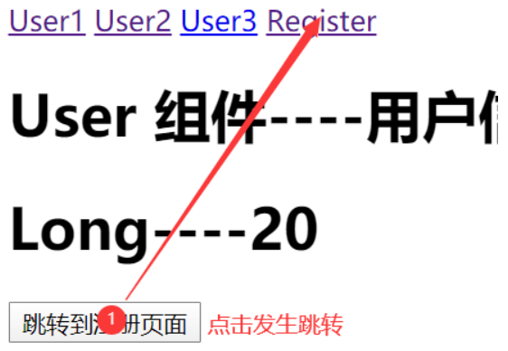

# 3.1 实现简易路由

```html
<!-- 被 vue 实例控制的 div 区域 -->
<div id="app">
    <!-- 切换组件的超链接 -->
    <a href="#/zhuye">主页</a>
    <a href="#/keji">科技</a>
    <a href="#/caijing">财经</a>
    <a href="#/yule">娱乐</a>
    <!-- 根据 :is 属性指定的组件名称，把对应的组件渲染到 component 标签所在的位置 -->
    <!-- 可以把 component 标签当做是【组件的占位符】 -->
    <component :is="comName"></component>
</div>
<script>
    // 主页组件
    const zhuye = {
        template: '<h1>主页信息</h1>'
    }
    // 科技组件
    const keji = {
        template: '<h1>科技信息</h1>'
    }
    // 财经组件
    const caijing = {
        template: '<h1>财经信息</h1>'
    }
    // 娱乐组件
    const yule = {
        template: '<h1>娱乐信息</h1>'
    }
    const vm = new Vue({
        el: '#app',
        data: {
            comName: 'zhuye'
        },
        // 注册私有组件
        components: {
            zhuye,
            keji,
            caijing,
            yule
        }
    })
    // 监听 window 的 onhashchange 事件，根据获取到的最新的 hash 值，切换要显示的组件的名称
    window.onhashchange = function () {
        // 通过 location.hash 获取到最新的 hash 值
        console.log(location.hash);
        switch (location.hash.slice(1)) {
            case '/zhuye':
                vm.comName = 'zhuye'
                break
            case '/keji':
                vm.comName = 'keji'
                break
            case '/caijing':
                vm.comName = 'caijing'
                break
            case '/yule':
                vm.comName = 'yule'
                break
        }
    }
</script>
```



# 3.2 vue-router

 + 支持HTML5 历史模式或 hash 模式
 + 支持嵌套路由
 + 支持路由参数
 + 支持编程式路由
 + 支持命名路由 

```html
<!DOCTYPE html>
<html lang="en">
<head>
    <meta charset="UTF-8">
    <meta name="viewport" content="width=device-width, initial-scale=1.0">
    <title>Document</title>
    <script src="https://unpkg.com/vue/dist/vue.js"></script>
    <script src="https://unpkg.com/vue-router/dist/vue-router.js"></script>
</head>
<body>
    <div id="app">
        <!-- 2.添加路由链接  -->
        <router-link to="/user">User</router-link>
        <router-link to="/register">Register</router-link>
        <!-- 3.添加路由填充位  -->
        <router-view></router-view>
    </div>
    <script>
        // 4.定义路由组件
        const User = {
            template: '<h1>User 组件</h1>'
        }
        const Register = {
            template: '<h1>Register 组件</h1>'
        }
        // 5.创建路由实例对象     
        const router = new VueRouter({
            // routes 是路由规则数组   
            routes: [
                // 每个路由规则都是一个配置对象，其中至少包含 path 和 component 两个属性：     
                // path 表示当前路由规则匹配的 hash 地址    
                // component 表示当前路由规则对应要展示的组件      
                { path: '/user', component: User },
                { path: '/register', component: Register },
                // 路由重定向，自动锁定跳转到 /register 界面
                { path: '/', redirect: '/register' }
            ]
        })
        const vm = new Vue({
            el: '#app',
            data: {
            },
            // 6.挂载路由实例对象
            router:router
        });
    </script>
</body>
</html>
```

# 3.3 嵌套路由



# 3.4 动态匹配路由



# 3.5 路由传参

在组件中使用`$route`会使之与其对应路由形成高度耦合，从而使组件只能在某些特定的 URL 上使用，限制了其灵活性。使用 props 将组件和路由解耦。

### props的值为布尔类型

```js
const User = {
    props: ['id'],
    template: '<h1>User 组件----用户id为{{id}}</h1>'
}
const router = new VueRouter({
    routes: [
        // 如果 props 被设置为 true，route.params 将会被设置为组件属性 
        { path: '/user/:id', component: User, props: true },
        { path: '/register', component: Register },
        { path: '/', redirect: '/register' }
    ]
})
```

###  props的值为对象类型 

```js
// 这里组件访问不到id的值
const User = {
    props: ['id','username','age'],
    template: `<div>
                        <h1>User 组件----用户信息id:{{id}}</h1>
                        <h1>{{username + '----'+ age}} </h1>
                </div>`
}
const router = new VueRouter({
    routes: [
        // 如果 props 是一个对象，它会被按原样设置为组件属性 
        { path: '/user/:id', component: User, props: { username: 'list', age: 12 } },
        { path: '/register', component: Register },
        { path: '/', redirect: '/register' }
    ]
})
```

### props的值为函数类型

```js
const User = {
    props: ['id', 'username', 'age'],
    template: `<div><h1>User 组件----用户信息id:{{id}}</h1>
    <h1>{{username + '----'+ age}} </h1>
    </div>`
}
const router = new VueRouter({
    routes: [
        {
            // 如果 props 是一个函数，则这个函数接收 route 对象为自己的形参 
            path: '/user/:id', component: User, props: route => ({
                username: 'Long', age: 20, id: route.params.id
            })
        },
        { path: '/register', component: Register },
        { path: '/', redirect: '/register' }
    ]
})
```



# 3.6 命名路由

在路由规则(routes)中添加`name: 'user'`属性，之后再链接到这个命名路由

```html
<router-link :to="{name:'user',params:{id:200}}">User2</router-link>
```

# 3.7 编程式导航

+ 声明式导航：通过**点击链接**实现导航的方式，叫做声明式导航。例如：普通网页中的 `<a></a>` 链接 或 Vue 中的` <router-link></router-link> `
+ 编程式导航：通过**调用JavaScript形式的API**实现导航的方式，叫做编程式导航 。例如：普通网页中的 location.href

`router.push()`方法的参数规则：

```js
// 字符串
router.push('home')

// 对象
router.push({ path: 'home' })

// 命名的路由
router.push({ name: 'user', params: { userId: '123' }})

// 带查询参数，变成 /register?plan=private
router.push({ path: 'register', query: { plan: 'private' }})
```

例子：

```js
const User = {
    props: ['id', 'username', 'age'],
    template: `<div><h1>User 组件----用户信息id:{{id}}</h1>
                            <h1>{{username + '----'+ age}} </h1>
                            <button @click="goRegister">跳转到注册页面</button>
                </div>`,
    methods: {
        goRegister: function () {
            this.$router.push('/register')
        }
    }
}
const Register = {
    template: `<div>
                    <h1>Register 组件</h1>
                    <button @click="goBack">后退</button>
                </div>`,
    methods: {
        goBack: function () {
            // 后退一步
            this.$router.go(-1)
        }
    }
}
```



