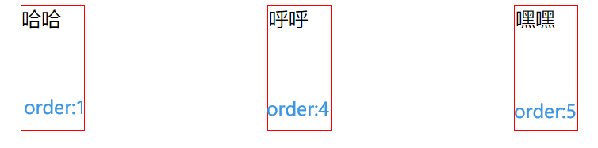
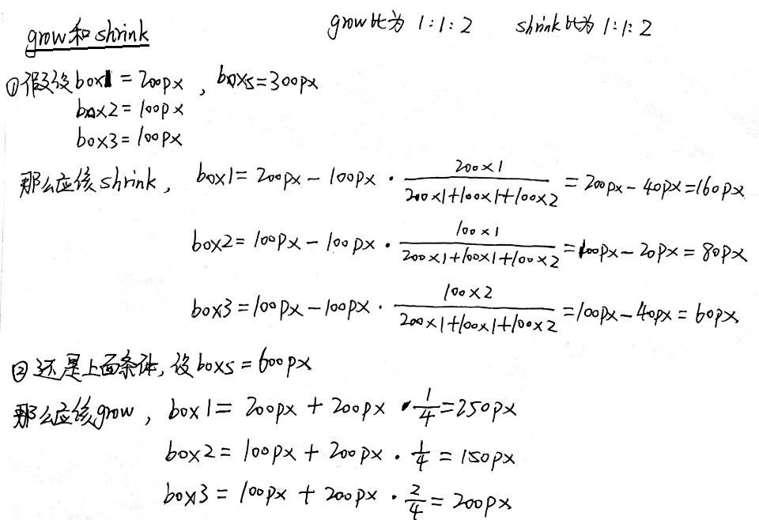

动态查看Flex布局：https://lhammer.cn/You-need-to-know-css/#/zh-cn/flexbox-layout

# Flex容器


容器默认存在两根轴：水平的主轴（main axis）和垂直的交叉轴（cross axis）。主轴的开始位置（与边框的交叉点）叫做`main start`，结束位置叫做`main end`；交叉轴的开始位置叫做`cross start`，结束位置叫做`cross end`。

项目默认沿主轴排列。单个项目占据的主轴空间叫做`main size`，占据的交叉轴空间叫做`cross size`。

# 属性列举

> 普通属性是写在盒子的CSS中，而项目属性是写在盒子内部节点的CSS中

- flex-direction：Flex的方向
  - `row`（默认）：主轴为水平方向，起点在左端。
  - `row-reverse`：主轴为水平方向，起点在右端。
  - `column`：主轴为垂直方向，起点在上沿。
  - `column-reverse`：主轴为垂直方向，起点在下沿。

- flex-wrap：一行挤不下时候，是否换行
  - `nowrap`（默认）：不换行
  - `wrap`：换行，第一行在上方
  - `wrap-reverse`：换行，第一行在下方

- justify-content：定义在主轴上的对齐方式
  - `flex-start`：左对齐
  - `flex-end`：右对齐
  - `center`：居中
  - `space-between`：两端对齐，项目之间的间隔都相等。
  - `space-around`：每个项目两侧的间隔相等。所以，项目之间的间隔比项目与边框的间隔大一倍。

- align-items：定义在交叉轴上的对齐方式
  - `flex-start`：交叉轴的起点对齐。
  - `flex-end`：交叉轴的终点对齐。
  - `center`：交叉轴的中点对齐。
  - `baseline`: 项目的第一行文字的基线对齐。
  - `stretch`（默认值）：如果项目未设置高度或设为auto，将占满整个容器的高度。

- align-content：定义了多根轴线的对齐方式。如果项目只有一根轴线，该属性不起作用。
  - `flex-start`：与交叉轴的起点对齐。
  - `flex-end`：与交叉轴的终点对齐。
  - `center`：与交叉轴的中点对齐。
  - `space-between`：与交叉轴两端对齐，轴线之间的间隔平均分布。
  - `space-around`：每根轴线两侧的间隔都相等。所以，轴线之间的间隔比轴线与边框的间隔大一倍。
  - `stretch`（默认值）：轴线占满整个交叉轴。

- 项目属性
  - `order`
  - `flex-grow`
  - `flex-shrink`
  - `flex-basis`
  - `flex`
  - `align-self`

# flex-direction

- flex-direction：Flex的方向
  - `row`（默认）：主轴为水平方向，起点在左端。
  - `row-reverse`：主轴为水平方向，起点在右端。
  - `column`：主轴为垂直方向，起点在上沿。
  - `column-reverse`：主轴为垂直方向，起点在下沿。


# flex-wrap

- flex-wrap：一行挤不下时候，是否换行
  - `nowrap`（默认）：不换行
  - `wrap`：换行，第一行在上方
  - `wrap-reverse`：换行，第一行在下方

nowrap：


wrap：


wrap-reverse：


# justify-content

- justify-content：定义在主轴上的对齐方式
  - `flex-start`：左对齐
  - `flex-end`：右对齐
  - `center`：居中
  - `space-between`：两端对齐，项目之间的间隔都相等。
  - `space-around`：每个项目两侧的间隔相等。所以，项目之间的间隔比项目与边框的间隔大一倍。


# align-items

- align-items：定义在交叉轴上的对齐方式
  - `flex-start`：交叉轴的起点对齐。
  - `flex-end`：交叉轴的终点对齐。
  - `center`：交叉轴的中点对齐。
  - `baseline`: 项目的第一行文字的基线对齐。
  - `stretch`（默认值）：如果项目未设置高度或设为auto，将占满整个容器的高度。


# align-content

- align-content：定义了多根轴线的对齐方式。如果项目只有一根轴线，该属性不起作用。
  - `flex-start`：与交叉轴的起点对齐。
  - `flex-end`：与交叉轴的终点对齐。
  - `center`：与交叉轴的中点对齐。
  - `space-between`：与交叉轴两端对齐，轴线之间的间隔平均分布。
  - `space-around`：每根轴线两侧的间隔都相等。所以，轴线之间的间隔比轴线与边框的间隔大一倍。
  - `stretch`（默认值）：轴线占满整个交叉轴。


# 项目属性

## flex

```css
flex：none | <' flex-grow '> <' flex-shrink >'? || <' flex-basis '>
```

## order

```html
<!DOCTYPE html>
<html lang="en">

<head>
    <meta charset="UTF-8">
    <meta http-equiv="X-UA-Compatible" content="IE=edge">
    <meta name="viewport" content="width=device-width, initial-scale=1.0">
    <title>Document</title>
    <style>
        #container{
            display: flex;
            flex-direction: row;
            justify-content: space-around;
        }
        div>div{
            width: 50px;
            height: 100px;
            border: 1px solid red;
        }
    </style>
</head>

<body>
    <div id="container">
        <div style="order: 5;">嘿嘿</div>
        <div style="order: 1;">哈哈</div>
        <div style="order: 4;">呼呼</div>
    </div>
</body>
</html>
```



## flex-grow和flex-shrink



## flex-basis

在伸长或者压缩时假冒主轴上的属性，一般设置为auto即可