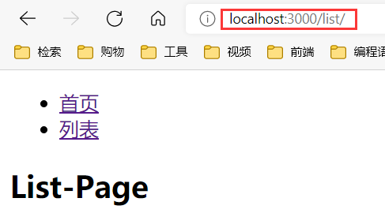

# React-router的基本使用

```jsx
import React from "react";
import { BrowserRouter, Route, Link } from "react-router-dom";

function Index() {
    return <h2>Lily.com</h2>;
}

function List() {
    return <h2>List-Page</h2>;
}

function AppRouter() {
    return (
        <BrowserRouter>
            <ul>
                <li><Link to="/">首页</Link></li>
                <li><Link to="/list/">列表</Link></li>
            </ul>
            <Route path="/" exact component={Index} />
            <Route path="/list/" component={List} />
        </BrowserRouter>
    );
}
export default AppRouter;
```



# 动态传值

四个步骤：

+ 设置规则

```jsx
<Route path="/list/:id" component={List} />
```

+ 传递值

```jsx
import React, { Component } from 'react';
import { Link } from "react-router-dom";

class Index extends Component {
    constructor(props) {
        super(props);
        this.state = { 
            list:[
                {uid:123,title:'Zhengyu的个人博客-1'},
                {uid:456,title:'Zhengyu的个人博客-2'},
                {uid:789,title:'Zhengyu的个人博客-3'},
            ]
         }
    }
    render() {
        return ( 
            <ul>
                {
                    this.state.list.map((item,index)=>{
                        return (
                            <li key={index}>
                               <Link to={'/list/'+item.uid}> {item.title}</Link> 
                            </li>
                        )
                    })
                }
            </ul>
        )
    }
}

export default Index;
```

+ 接受值
+ 显示内容

```jsx
import React, { Component } from 'react';

class List extends Component {
    constructor(props) {
        super(props);
        this.state = {}
    }
    render() {
        return (<h2>List Page---{this.state.id}</h2>);
    }
    componentDidMount() {
        console.log(this.props.match)
        let tempId = this.props.match.params.id
        this.setState({ id: tempId })
    }
}

export default List;
```

# Redirect

- 标签式重定向：就是利用`<Redirect>`标签来进行重定向，业务逻辑不复杂时建议使用这种。
- 编程式重定向：这种是利用编程的方式，一般用于业务逻辑当中，比如登录成功挑战到会员中心页面。

`Home.jsx`：

```jsx
import React, { Component } from 'react';

class Home extends Component {
    constructor(props) {
        super(props);
        this.state = {  }
    }
    render() { 
        return (  <h2>我是 Home 页面</h2> );
    }
}

export default Home;
```

路由组件`AppRouter.jsx`：
```jsx
import Home from './Pages/Home'
<Route path="/home/" component={Home} />
```

`index.js`：

1.标签式重定向：引入`Redirect`后，直接在`render`函数里使用就可以了。

```jsx
 <Redirect to="/home/" />
```

2.编程式重定向：直接在构造函数`constructor`中加入下面的重定向代码。

```js
 this.props.history.push("/home/");  
```


