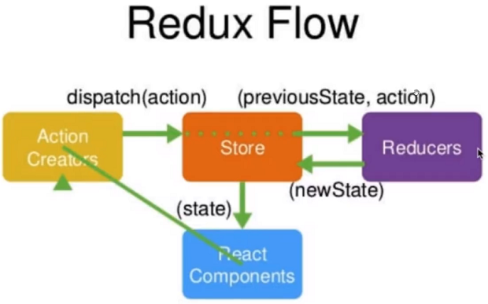

# Redux理论

简单图：



全图：


# TodoList例子

> 引入Antd和redux：`npm install antd --save`；`npm install redux --save`

`todoList.jsx`：

```jsx
import React from 'react';
import 'antd/dist/antd.css';
import { Button, Input, List } from 'antd';
import store from './store/index'

class todoList extends React.Component {
    constructor(props) {
        super(props);
        console.log(store.getState());
        this.state = store.getState();
        this.clickBtn=this.clickBtn.bind(this);
        this.storeChange = this.storeChange.bind(this);
        this.changeInputValue = this.changeInputValue.bind(this);
        store.subscribe(this.storeChange);
    }

    changeInputValue(e) {
        const action = {
            type: 'changeInput',
            value: e.target.value
        };
        store.dispatch(action);
    }

    storeChange() {
        this.setState(store.getState());
    }

    clickBtn(){
        const action = {type:'addItem'};
        store.dispatch(action);
    }

    deleteItem(index){
        console.log(index)
        const action = {
            type:'deleteItem',
            index: index
        };
        store.dispatch(action);
    }

    render() {
        return (
            <div style={{ margin: '10px' }}>
                <div>
                    <Input
                        placeholder={this.state.inputValue}
                        style={{ width: '250px', marginRight: '10px' }}
                        onChange={this.changeInputValue}
                    />
                    <Button 
                    type="primary"
                    onClick={this.clickBtn}
                    >增加</Button>
                </div>
                <div style={{ margin: '10px', width: '300px' }}>
                    <List
                        bordered
                        header={<h3>金陵十二钗</h3>}
                        dataSource={this.state.list}
                        renderItem={(item,index) => (
                            <List.Item onClick={this.deleteItem.bind(this,index)}>{item}</List.Item>
                        )}
                    />
                </div>
            </div>
        )
    }
}

export default todoList;
```

`index.jsx`：引入TodoList组件

```jsx
import React from 'react';
import ReactDOM from 'react-dom';
import TodoList from './todoList'

ReactDOM.render(
  <TodoList />,
  document.getElementById('root')
);
```

`/store/index.js`：

```js
import { createStore } from 'redux';
import reducer from './reducer'
// reducer注入
const store = createStore(
    reducer,
    window.__REDUX_DEVTOOLS_EXTENSION__ && window.__REDUX_DEVTOOLS_EXTENSION__()
);
export default store;
```

`/store/reducer.js`：

```js
const defaultState = {
    inputValue: '请输入',
    list: [
        '林黛玉',
        '史湘云',
        '薛宝钗'
    ]
};
export default (state = defaultState, action) => {
    // Reducer里只能接受state，不能改变state
    let newState;
    switch (action.type) {
        case 'changeInput':
            newState = JSON.parse(JSON.stringify(state));
            newState.inputValue = action.value;
            return newState;
        case 'addItem':
            newState = JSON.parse(JSON.stringify(state));
            newState.list.push(newState.inputValue);
            newState.inputValue = '';
            return newState;
        case 'deleteItem':
            newState = JSON.parse(JSON.stringify(state));
            newState.list.splice(action.index,1);
            return newState;
    }
    return state;
}
```

# 将type提出到文件

`actionTypes.js`：

```js
export const CHANGE_INPUT = 'changeInput';
export const ADD_ITEM = 'addItem';
export const DELETE_ITEM = 'deleteItem';
```

引入：

```js
import { CHANGE_INPUT, ADD_ITEM, DELETE_ITEM } from './store/actionTypes';
```

# Redux中的三个坑

- `store`必须是唯一的，多个`store`是坚决不允许，只能有一个`store`空间
- 只有`store`能改变自己的内容，`Reducer`不能改变
  - `Reudcer`只是返回了更改的数据，但是并没有更改`store`中的数据，`store`拿到了`Reducer`的数据，自己对自己进行了更新。
- `Reducer`必须是纯函数
  - 如果函数的调用参数相同，则永远返回相同的结果。

# UI和逻辑的分离

`TodoListUI.jsx`：

```jsx
import React, { Component } from 'react';
import 'antd/dist/antd.css'
import { Input, Button, List } from 'antd'
class TodoListUI extends Component {
    render() {
        return (
            <div style={{ margin: '10px' }}>
                <div>
                    <Input
                        style={{ width: '250px', marginRight: '10px' }}
                        onChange={this.props.changeInputValue}
                        value={this.props.inputValue}
                    />
                    <Button
                        type="primary"
                        onClick={this.props.clickBtn}
                    >增加</Button>
                </div>
                <div style={{ margin: '10px', width: '300px' }}>
                    <List
                        header={<h3>金陵十二钗</h3>}
                        bordered
                        dataSource={this.props.list}
                        renderItem={(item, index) => (<List.Item onClick={(index) => { this.props.deleteItem(index) }}>{item}</List.Item>)}
                    />
                </div>
            </div>
        );
    }
}

export default TodoListUI;
```

`TodoList.jsx`：

```jsx
import React from 'react';
import 'antd/dist/antd.css';
import store from './store/index';
import { CHANGE_INPUT, ADD_ITEM, DELETE_ITEM } from './store/actionTypes';
import TodoListUI from './TodoListUI';
class TodoList extends React.Component {
    constructor(props) {
        super(props);
        // 从store中获取状态，订阅
        this.state = store.getState();
        console.log(this.state);
        // 函数绑定
        this.clickBtn = this.clickBtn.bind(this);
        this.storeChange = this.storeChange.bind(this);
        this.changeInputValue = this.changeInputValue.bind(this);
        this.deleteItem=this.deleteItem.bind(this);
        store.subscribe(this.storeChange);
    }

    changeInputValue(e) {
        const action = {
            type: CHANGE_INPUT,
            value: e.target.value
        };
        store.dispatch(action);
    }

    storeChange() {
        this.setState(store.getState());
    }

    clickBtn() {
        const action = { type: ADD_ITEM };
        store.dispatch(action);
    }

    deleteItem(index) {
        const action = {
            type: DELETE_ITEM,
            index: index
        };
        store.dispatch(action);
    }

    render() {
        return (
            <TodoListUI
                inputValue={this.state.inputValue}
                list={this.state.list}
                changeInputValue={this.changeInputValue}
                clickBtn={this.clickBtn}
                deleteItem={this.deleteItem}
            />
        )
    }
}

export default TodoList;
```

# Redux-thunk

同时配置thunk和devtools，要使用增强函数：

```js
import { applyMiddleware, createStore, compose } from 'redux';
import reducer from './reducer'
import thunk from 'redux-thunk';

const composeEnhancers = window.__REDUX_DEVTOOLS_EXTENSION_COMPOSE__?
window.__REDUX_DEVTOOLS_EXTENSION_COMPOSE__({}):compose

const enhancer = composeEnhancers(applyMiddleware(thunk));
// reducer注入
const store = createStore(
    reducer,
    enhancer
);
export default store;
```


