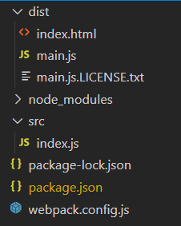
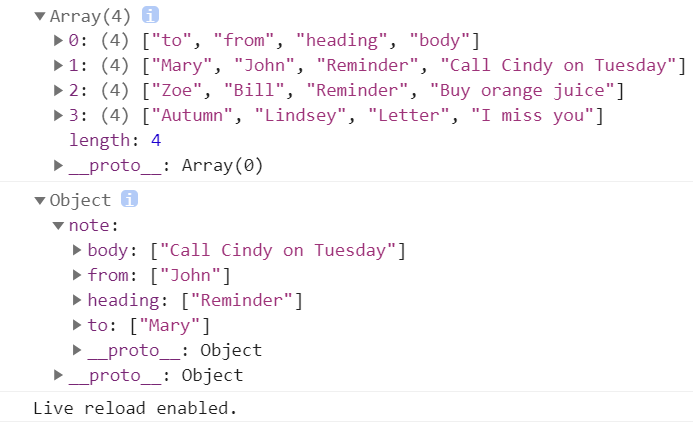

# 起步

1.初始化项目

```bash
mkdir webpack-demo
cd webpack-demo
npm init -y
npm install webpack webpack-cli --save-dev
npm install --save lodash
```

2.建立相关文件结构



`package.json`：

```json
{
  "name": "webpackStudy",
  "version": "1.0.0",
  "description": "",
  "private": true,
  "scripts": {
    "test": "echo \"Error: no test specified\" && exit 1",
    "build": "webpack"
  },
  "keywords": [],
  "author": "",
  "license": "ISC",
  "devDependencies": {
    "webpack": "^5.37.0",
    "webpack-cli": "^4.7.0"
  },
  "dependencies": {
    "lodash": "^4.17.21"
  }
}
```

`/src/index.js`

```js
import _ from 'lodash';

function component() {
    const element = document.createElement('div');

    // lodash 在当前 script 中使用 import 引入
    element.innerHTML = _.join(['Hello', 'webpack'], ' ');

    return element;
}

document.body.appendChild(component());
```

`/dist/index.html`：

```html
<!DOCTYPE html>
<html>

<head>
    <meta charset="utf-8" />
    <title>起步</title>
</head>

<body>
    <script src="main.js"></script>
</body>

</html>
```

`webpack.config.js`：

```js
const path = require('path');

module.exports = {
    entry: './src/index.js',
    output: {
        filename: 'main.js',
        path: path.resolve(__dirname, 'dist'),
    },
    mode: 'production'
};
```

3.`npm run build`

> 在JSON文件可以配置"bulid"，这样就能`npm run build`了

# 管理资源

## 加载CSS

1.`npm install --save-dev style-loader css-loader`，安装loader做测试

2.修改配置文件

```js
module: {
    rules: [
        {
            // 引入CSS
            test: /\.css$/i,
            use: ['style-loader', 'css-loader'],
        },
    ]
},
```

3.创建一段css代码

`/src/style.css`：

```css
.hello {
    color: red;
}
```

4.`index.js`中引入并使用

```js
import _ from 'lodash';
import './style.css'

function component() {
    const element = document.createElement('div');
    element.innerHTML = _.join(['Hello', 'webpack'], ' ');
    // 新引入的CSS
    element.classList.add('hello');

    return element;
}

document.body.appendChild(component());
```

5.build，查看结果，发现字体变红了

## 加载图片

1.配置文件引入

```js
{
    // 引入img
    test: /\.(png|svg|jpg|jpeg|gif)$/i,
    type: 'asset/resource',
},
```

2.index.js中引入图片

```js
import _ from 'lodash';
import './style.css';
import Icon from './icon.png';

function component() {
    const element = document.createElement('div');
    element.innerHTML = _.join(['Hello', 'webpack'], ' ');
    element.classList.add('hello');

    // 将图像添加到我们已经存在的 div 中。
    const myIcon = new Image();
    myIcon.src = Icon;
    element.appendChild(myIcon);

    return element;
}

document.body.appendChild(component());
```

3.style.css中使用图片

```js
.hello {
    color: red;
    background: url('./icon.png');
}
```

4.build

## 加载fonts字体

1.配置文件

```js
{
    test: /\.(woff|woff2|eot|ttf|otf)$/i,
    type: 'asset/resource',
},
```

2.style.css中引入字体

```css
@font-face {
    font-family: 'MyFont';
    src: url('./my-font.woff2') format('woff2'),
        url('./my-font.woff') format('woff');
    font-weight: 600;
    font-style: normal;
}

.hello {
    color: red;
    font-family: 'MyFont';
    background: url('./icon.png');
}
```

3.build

## 加载数据

1.`npm install --save-dev csv-loader xml-loader`

2.配置文件

```js
{
    test: /\.(csv|tsv)$/i,
    use: ['csv-loader'],
},
{
    test: /\.xml$/i,
    use: ['xml-loader'],
},
```

3.添加数据

```xml
<?xml version="1.0" encoding="UTF-8"?>
<note>
  <to>Mary</to>
  <from>John</from>
  <heading>Reminder</heading>
  <body>Call Cindy on Tuesday</body>
</note>
```

```csv
to,from,heading,body
Mary,John,Reminder,Call Cindy on Tuesday
Zoe,Bill,Reminder,Buy orange juice
Autumn,Lindsey,Letter,I miss you
```

4.在index.js中引入并打印

5.build



# 管理输出

1.安装插件：`npm install --save-dev html-webpack-plugin`

2.配置文件

```js
const path = require('path');
const HtmlWebpackPlugin = require('html-webpack-plugin');

module.exports = {
    entry: {
        index: './src/index.js',
        print: './src/print.js'
    },
    plugins: [
        new HtmlWebpackPlugin({
            title: '管理输出',
        }),
    ],
    output: {
        filename: '[name].bundle.js',
        path: path.resolve(__dirname, 'dist'),
    },
    mode: 'production'
};
```

3.两个入口

```js
export default function printMe() {
    console.log('I get called from print.js!');
}
```

```js
import _ from 'lodash';
import printMe from './print.js';

function component() {
    const element = document.createElement('div');
    const btn = document.createElement('button');

    element.innerHTML = _.join(['Hello', 'webpack'], ' ');

    btn.innerHTML = 'Click me and check the console!';
    btn.onclick = printMe;

    element.appendChild(btn);

    return element;
}

document.body.appendChild(component());
```

4.build，新生成的`index.html`会覆盖原先的

# 开发环境

source-map功能：可以将编译后的代码映射回原始源代码，方便追踪error和warning

使用 webpack-dev-server ：

```js
module.exports = {
    ……
    devtool: 'inline-source-map',
    devServer: {
        contentBase: './dist',
    },
    ……
};
```

以上配置告知 `webpack-dev-server`，将 `dist` 目录下的文件 serve 到 `localhost:8080` 下。

添加一个可以直接运行 dev server 的 script：

```json
"scripts": {
    "test": "echo \"Error: no test specified\" && exit 1",
    "watch": "webpack --watch",
    "start": "webpack serve --open",
    "build": "webpack"
},
```

# 代码分离

把代码分离到不同的 bundle 中，然后可以按需加载或并行加载这些文件。

## 入口起点

使用多个入口：

```js
const path = require('path');

module.exports = {
    mode: 'development',
    entry: {
        index: './src/index.js',
        another: './src/another-module.js',
    },
    output: {
        filename: '[name].bundle.js',
        path: path.resolve(__dirname, 'dist'),
    },
};
```

这种手动配置的方式容易引入重复模块，而且不够灵活

## 防止重复

### 入口依赖

配置dependOn选项，这样就可以在多个chunk之间共享模块

```js
const path = require('path');

module.exports = {
    mode: 'development',
    entry: {
        index: {
            import: './src/index.js',
            dependOn: 'shared',
        },
        another: {
            import: './src/another-module.js',
            dependOn: 'shared',
        },
        shared: 'lodash',
    },
    output: {
        filename: '[name].bundle.js',
        path: path.resolve(__dirname, 'dist'),
    },
    optimization: {
        runtimeChunk: 'single',
    },
};
```

如果我们要在一个 HTML 页面上使用多个入口时，还需设置 `optimization.runtimeChunk: 'single'`，否则还会遇到[这里](https://bundlers.tooling.report/code-splitting/multi-entry/)所述的麻烦。

由上可知，除了生成 `shared.bundle.js`，`index.bundle.js` 和 `another.bundle.js` 之外，还生成了一个 `runtime.bundle.js` 文件。

### SplitChunksPlugin

`SplitChunksPlugin`可以将公共的依赖模块提取出来，放入到chunk中

```js
const path = require('path');

module.exports = {
    mode: 'development',
    entry: {
        index: './src/index.js',
        another: './src/another-module.js',
    },
    output: {
        filename: '[name].bundle.js',
        path: path.resolve(__dirname, 'dist'),
    },
    optimization: {
        splitChunks: {
            chunks: 'all',
        },
    },
};
```

## 动态导入

webpack.config.js：

```js
const path = require('path');
module.exports = {
    mode: 'development',
    entry: {
        index: './src/index.js'
    },
    output: {
        filename: '[name].bundle.js',
        path: path.resolve(__dirname, 'dist'),
    },
};
```

index.js：

```js
function getComponent() {
    const element = document.createElement('div');
    return import('lodash')
        .then(({ default: _ }) => {
            const element = document.createElement('div');
            element.innerHTML = _.join(['Hello', 'webpack'], ' ');
            return element;
        })
        .catch((error) => 'An error occurred while loading the component');
}
getComponent().then((component) => {
    document.body.appendChild(component);
});
```

通过async简化代码：

```js
async function getComponent() {
    const element = document.createElement('div');
    const { default: _ } = await import('lodash');
    element.innerHTML = _.join(['Hello', 'webpack'], ' ');
    return element;
}
getComponent().then((component) => {
    document.body.appendChild(component);
});
```


