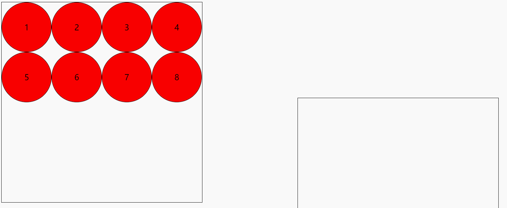
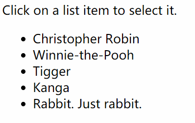

# 跨行/跨列表格

<!-- tabs:start -->

<!-- tab:代码 -->

```html
<!DOCTYPE html>
<html lang="en">

<head>
    <meta charset="UTF-8">
    <meta http-equiv="X-UA-Compatible" content="IE=edge">
    <meta name="viewport" content="width=device-width, initial-scale=1.0">
    <title>Document</title>
</head>

<body>
    <h4>跨行</h4>
    <table border="1">
        <tr>
            <th>Name</th>
            <th colspan="2">Telephone</th>
        </tr>
        <tr>
            <td>Bill Gates</td>
            <td>555 77 854</td>
            <td>555 77 855</td>
        </tr>
    </table>
    <h4>跨列</h4>
    <table border="1">
        <tr>
            <th>First Name:</th>
            <td>Bill Gates</td>
        </tr>
        <tr>
            <th rowspan="2">Telephone:</th>
            <td>555 77 854</td>
        </tr>
        <tr>
            <td>555 77 855</td>
        </tr>
    </table>
</body>

</html>
```

<!-- tab:效果 -->

<h4>跨行</h4>
<table border="1">
    <tr>
        <th>Name</th>
        <th colspan="2">Telephone</th>
    </tr>
    <tr>
        <td>Bill Gates</td>
        <td>555 77 854</td>
        <td>555 77 855</td>
    </tr>
</table>
<h4>跨列</h4>
<table border="1">
    <tr>
        <th>First Name:</th>
        <td>Bill Gates</td>
    </tr>
    <tr>
        <th rowspan="2">Telephone:</th>
        <td>555 77 854</td>
    </tr>
    <tr>
        <td>555 77 855</td>
    </tr>
</table>

<!-- tabs:end -->

# 传统表单

<!-- tabs:start -->

<!-- tab:代码 -->

```html
<!DOCTYPE html>
<html lang="en">
<head>
    <meta charset="UTF-8">
    <meta http-equiv="X-UA-Compatible" content="IE=edge">
    <meta name="viewport" content="width=device-width, initial-scale=1.0">
    <title>Document</title>
</head>
<body>
    <form>
        <!-- input系列 -->
        <h4>输入text：</h4>
        <span>FirstName:</span>
        <input type="text" name="firstName" value="Jonny">
        <span>LastName:</span>
        <input type="text" name="lastName" value="Long">
        <h4>radio：</h4>
        <input type="radio" name="course" value="高等数学">高等数学
        <input type="radio" name="course" value="操作系统" checked>操作系统
        <input type="radio" name="course" value="数据库">数据库
        <h4>email：</h4>
        <input type="email" name="email">
        <h4>url：</h4>
        <input type="url" name="url">
        <h4>滑块range：</h4>
        <input type="range" name="voice" min="0" max="100" step="2">
        <h4>搜索框：</h4>
        <input type="search" name="search">
        <h4>提交表单：</h4>
        <input type="submit" value="Submit">
        <!-- 下拉表 -->
        <h4>下拉表：</h4>
        <select name="country">
            <option value="China">中国</option>
            <option value="USA">美国</option>
            <option value="India">印度</option>
        </select>
        <!-- 文本域 -->
        <h4>文本域：</h4>
        <textarea name="textarea" cols="40" rows="1"></textarea>
    </form>
</body>
</html>
```

<!-- tab:效果 -->

<form>
    <!-- input系列 -->
    <h4>输入text：</h4>
    <span>FirstName:</span>
    <input type="text" name="firstName" value="Jonny">
    <span>LastName:</span>
    <input type="text" name="lastName" value="Long">
    <h4>radio：</h4>
    <input type="radio" name="course" value="高等数学">高等数学
    <input type="radio" name="course" value="操作系统" checked>操作系统
    <input type="radio" name="course" value="数据库">数据库
    <h4>email：</h4>
    <input type="email" name="email">
    <h4>url：</h4>
    <input type="url" name="url">
    <h4>滑块range：</h4>
    <input type="range" name="voice" min="0" max="100" step="2">
    <h4>搜索框：</h4>
    <input type="search" name="search">
    <h4>提交表单：</h4>
    <input type="submit" value="Submit">
    <!-- 下拉表 -->
    <h4>下拉表：</h4>
    <select name="country">
        <option value="China">中国</option>
        <option value="USA">美国</option>
        <option value="India">印度</option>
    </select>
    <!-- 文本域 -->
    <h4>文本域：</h4>
    <textarea name="textarea" cols="40" rows="1"></textarea>
</form>

<!-- tabs:end -->

# H5表单

<!-- tabs:start -->

<!-- tab:代码 -->

```html
<!DOCTYPE html>
<html lang="en">
<head>
    <meta charset="UTF-8">
    <meta name="viewport" content="width=device-width, initial-scale=1, user-scalable=no">
    <title>表单类型</title>
</head>

<body>
    <form action="">
        <fieldset>
            <legend>表单类型</legend>
            <label for="">
                email: <input type="email" name="email" required>
            </label>
            <label for="">
                color: <input type="color" name="color">
            </label>
            <label for="">
                url: <input type="url" name='url'>
            </label>
            <label for="">
                number: <input type="number" step="3" name="number">
            </label>
            <label for="">
                range: <input type="range" name="range" value="100">
            </label>
            <label for="">
                file: <input type="file" name="range" value="100">
            </label>
            <label for="">
                search: <input type="search" name="search">
            </label>
            <label for="">
                tel: <input type="tel" name="tel">
            </label>
            <label for="">
                time: <input type="time" name="time">
            </label>
            <label for="">
                date: <input type="date" name="date">
            </label>
            <label for="">
                datetime: <input type="datetime">
            </label>
            <label for="">
                week: <input type="week" name="month">
            </label>
            <label for="">
                month: <input type="month" name="month">
            </label>
            <label for="">
                datetime-local: <input type="datetime-local" name="datetime-local">
            </label>
            <!-- 数据列表 -->
            <input type="text" list="myData">
            <datalist id="myData">
                <option>本科</option>
                <option>研究生</option>
                <option>不明</option>
            </datalist>
            <input type="submit">
        </fieldset>
    </form>
    <!-- 度量器 -->
    <meter value="81" min="0" max="100" low="60" high="80"/>
</body>
</html>
```

<!-- tab:效果 -->

<form action="">
    <fieldset>
        <legend>表单类型</legend>
        <label for="">
            email: <input type="email" name="email" required>
        </label>
        <label for="">
            color: <input type="color" name="color">
        </label>
        <label for="">
            url: <input type="url" name='url'>
        </label>
        <label for="">
            number: <input type="number" step="3" name="number">
        </label>
        <label for="">
            range: <input type="range" name="range" value="100">
        </label>
        <label for="">
            file: <input type="file" name="range" value="100">
        </label>
        <label for="">
            search: <input type="search" name="search">
        </label>
        <label for="">
            tel: <input type="tel" name="tel">
        </label>
        <label for="">
            time: <input type="time" name="time">
        </label>
        <label for="">
            date: <input type="date" name="date">
        </label>
        <label for="">
            datetime: <input type="datetime">
        </label>
        <label for="">
            week: <input type="week" name="month">
        </label>
        <label for="">
            month: <input type="month" name="month">
        </label>
        <label for="">
            datetime-local: <input type="datetime-local" name="datetime-local">
        </label>
        <!-- 数据列表 -->
        <input type="text" list="myData">
        <datalist id="myData">
            <option>本科</option>
            <option>研究生</option>
            <option>不明</option>
        </datalist>
        <input type="submit">
    </fieldset>
    <!-- 度量器 -->
    <meter value="81" min="0" max="100" low="60" high="80"/>
</form>
<!-- tabs:end -->

# 拖拽

<!-- tabs:start -->

<!-- tab:代码 -->

```html
<!DOCTYPE html>
<html lang="en">

<head>
    <meta charset="UTF-8">
    <meta name="viewport" content="width=device-width, initial-scale=1, user-scalable=no">
    <title>表单类型</title>
</head>
<style>
    .one {
        width: 400px;
        height: 400px;
        border: 1px solid #000;
    }

    .one > div, .two > div {
        width: 98px;
        height: 98px;
        border: 1px solid #000;
        border-radius: 50%;
        background-color: red;
        float: left;
        text-align: center;
        line-height: 98px;
    }

    .two {
        width: 400px;
        height: 400px;
        border: 1px solid #000;
        position: absolute;
        left: 600px;
        top: 200px;
    }
</style>
<body>
    <div class="one">
        <div draggable="true">1</div>
        <div draggable="true">2</div>
        <div draggable="true">3</div>
        <div draggable="true">4</div>
        <div draggable="true">5</div>
        <div draggable="true">6</div>
        <div draggable="true">7</div>
        <div draggable="true">8</div>
    </div>
    <div class="two"></div>
</body>
<script>
    var boxs = document.querySelectorAll('.one div');
    var two = document.querySelector('.two');
    var temp = null;
    // 给8个小盒子分别绑定拖拽事件
    for (var i = 0; i < boxs.length; i++) {
        boxs[i].ondragstart = function () {
            // 保持当前拖拽的元素
            temp = this;
            console.log(temp);
        }
        boxs[i].ondragend = function () {
            // 当拖拽结束,清空temp
            temp = null;
            console.log(temp);
        }
    }
    // 目标元素的拖拽事件
    two.ondragover = function (e) {
        // 阻止拖拽的默认行为
        e.preventDefault();
    }
    // 当在目标元素上松开鼠标是触发
    two.ondrop = function () {
        // 将拖拽的元素追加到 two里面来
        this.appendChild(temp);
    }
</script>
</html>
```

<!-- tab:效果 -->



<!-- tabs:end -->

# 可选列表

<!-- tabs:start -->

<!-- tab:代码 -->

```html
<!DOCTYPE HTML>
<html>

<head>
  <meta charset="utf-8">
  <style>
    .selected {
      background: #0f0;
    }

    li {
      cursor: pointer;
    }
  </style>
</head>

<body>

  Click on a list item to select it.
  <br>

  <ul id="ul">
    <li>Christopher Robin</li>
    <li>Winnie-the-Pooh</li>
    <li>Tigger</li>
    <li>Kanga</li>
    <li>Rabbit. Just rabbit.</li>
  </ul>

  <script>
    ul.onclick = function(event) {
      if (event.target.tagName != "LI") return;

      if (event.ctrlKey || event.metaKey) {
        toggleSelect(event.target);
      } else {
        singleSelect(event.target);
      }

    }

    // prevent unneeded selection of list elements on clicks
    ul.onmousedown = function() {
      return false;
    };

    function toggleSelect(li) {
      li.classList.toggle('selected');
    }

    function singleSelect(li) {
      let selected = ul.querySelectorAll('.selected');
      for(let elem of selected) {
        elem.classList.remove('selected');
      }
      li.classList.add('selected');
    }

  </script>

</body>
</html>
```

<!-- tab:效果 -->




<!-- tabs:end -->

