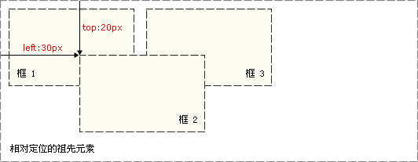

# 基本结构

CSS的简介：

1、CSS的定义：层叠样式表。属性和属性值用冒号分隔开，以分号结尾(这些符号都是英文的)。

2、CSS得引入方式：

- 行内引入：`<div style="这里写样式">我是一个块级的标签</div>`
- 嵌入式：将CSS样式表放到head中用`<style>`标签包裹起来

```html
<head>
    ...
    <style type="text/css">
        ...此处写CSS样式
    </style>
</head>
```

- 导入式：  将一个独立的`.css`文件引入HTML文件中，导入式使用@import 引入外部CSS文件，`<style>`标记也是写在`<head>`标记中。 导入式会在整个网页装载完后再装载CSS文件。

```html
<head>
    ...
    <style type="text/css">
        @import "My.css"; 此处注意.css文件的路径
    </style>
</head>
```

-  链接式引入：将一个独立的`.css`文件引入到HTML文件中，使用`<link>`标记写在`<head>`标记中。 链接式会以网页文件主体装载前装载CSS文件。

```html
<head>
    ...
    <link href="My.css" rel="stylesheet" type="text/css">
</head>
```

3、样式的应用顺序：

- 行内样式优先级最高
- 针对相同的样式属性，不同的样式属性将以合并的方式呈现
- 相同样式并且相同属性，呈现方式在<head>中的顺序决定，后面会覆盖前面属性
- `!important `指定样式规则应用最优先

```css
/*规范,<style>可以编写CSS代码，声明最好用分号结尾
语法：
     选择器{
          声明1;
          声明2;
          声明3;
     }
*/
h1{
    color: #ff76c2;
}
```

# 选择器

## 基本选择器

### 通用元素选择器

```css
*{
    margin:0;
    padding:0;
}
```

### 标签选择器

```css
h1{
    color: #ff76c2;
}
```

### 类选择器

形式：`.calss的名称{}`

好处：可以多个标签归类，是同一个class，可以复用

```html
<h1 class="kuang">首页标题</h1>
<h1 class="ag0">首页标题</h1>
<p class="kuang">这里是正文........</p>
```

```css
.kuang{
    color: #db7ee2;
}
.ag0{
    color: #ff1d51;
}
```

### ID选择器

形式：`#id名称{}`

与类不同，在一个 HTML 文档中，ID 选择器会使用一次，而且仅一次。

```html
<h1 id="kuang">一级标题</h1>
<h2 id="kuang">二级标题</h2>
```

```css
#kuang{
    color: #0cff00;
}
```

**id选择器 > 类选择器 > 标签选择器**

## 组合选择器

### 多元素组合选择器

```html
<p>段落</p>
<a>Link</a>
<div>div标签</div>
```

```css
p,a,div{
    color: yellow;
}
```

### 后代选择器

选中`<div>`标签里面所有的`<p>`标签

```html
<div>
    <p>11111111</p>
    <div>
        <b><p>22222222</p></b>
        <h1>33333333</h1>
    </div>
    <p>44444444</p>
</div>
<p>55555555</p>
```

```css
div p {
    color: blue;
}
```


### 子选择器

选择刚好嵌套在`<div>`下一级的子标签`<p>`

```css
div>p {
	color: blue;
}
```


### 相邻兄弟选择器

```html
<div>
    <p>11111111</p>
    <div>
        <b><p>22222222</p></b>
        <h1>33333333</h1>
    </div>
    <p>44444444</p>
</div>
<p>55555555</p>
<p>66666666</p>
<p>77777777</p>
```

 匹配所有紧随div标签之后的同级标签P，之间用+分隔（只能匹配一个）。

```css
div+p{
	color:blue;
}
```


### 通用选择器

选择当前元素向下的所有兄弟元素

```css
div~p{
	color:blue;
}
```


## 结构伪类选择器

| 选择器                | 功能描述                                                     |
| :-------------------- | :----------------------------------------------------------- |
| `E:last-child`        | 选择父元素的倒数第一个子元素E，相当于`E:nth-last-child(1)`   |
| `E:nth-child(n)`      | 选择父元素的第n个子元素，n从1开始计算                        |
| `E:nth-last-child(n)` | 选择父元素的倒数第n个子元素，n从1开始计算                    |
| `E:first-of-type`     | 选择父元素下同种标签的第一个元素，相当于`E:nth-of-type(1)`   |
| `E:last-of-type`      | 选择父元素下同种标签的倒数第一个元素，相当于`E:nth-last-of-type(1)` |
| `E:nth-of-type(n)`    | 与`:nth-child(n)`作用类似，用作选择使用同种标签的第n个元素   |
| `E:nth-last-of-type`  | 与`:nth-last-child`作用类似，用作选择同种标签的倒数第一个元素 |
| `E:only-child`        | 选择父元素下仅有的一个子元素，相当于`E:first-child:last-child`或`E:nth-child(1):nth-last-child(1)` |
| `E:only-of-type`      | 选择父元素下使用同种标签的唯一子元素，相当于`E:first-of-type:last-of-type`或`E:nth-of-type(1):nth-last-of-type(1)` |

```html
<div>
    <p>p1</p>
    <h1>A1</h1>
    <p>p2</p>
    <div>
        <p>p4</p>
        <a href="https://www.baidu.con">百度一下</a>
        <p>p5</p>
        <p>p6</p>
    </div>
</div>
<ul>
    <li>001</li>
    <li>002</li>
    <li>003</li>
</ul>
```

```css
/*ul下最后一个子标签，如果是li则选中*/
ul li:last-child{
    background: pink;
}
/*div下第三个子标签，如果是p标签则选中*/
div p:nth-child(3){
    color: red;
}
/*div下的div下的第三个子标签，如果是p标签则选中*/
div div p:nth-child(4){
    background: yellow;
}
```


## 属性选择器

> =   绝对等于
> *=   包含这个元素
> ^=   以这个开头
> $=   以这个结尾

```html
<p class="demo">
    <a href="https://www.baidu.com" class="link item first" id="first">001</a>
    <a href="" class="links item active" target="_blank" title="这是第二个">002</a>
    <a href="https://www.zhihu.com" class="links item">003</a>
    <a href="images/123.html" class="links item" id="second">004</a>
    <a href="images/a.pdf" class="link item firs">005</a>
    <a href="https://www.taobao.com" class="links item first">006</a>
    <a href="images/test.jpg" class="links item">007</a>
    <a href="images/1.word" class="links item">008</a>
</p>
```

选择id=first的元素：

```css
a[id=first]{
    background: yellow;
}
```

选择以jpg为结尾的元素：

```css
a[href$=jpg]{
            background: #ff1700;
        }
```

# 常用属性

## 颜色

 color

- HEX（十六进制色：`color: #FFFF00`，缩写：#FF0）
- RGB（红绿蓝，使用方式：`color:rgb(255,255,0)`或者`color: rgb(100%,100%,0%)）`
- RGBA（红绿蓝透明度，A是透明度在0~1之间取值。使用方式：`color:rgba(255,255,0,0.5)`）
- HSL（CSS3有效,H表示色调，S表示饱和度，L表示亮度，使用方式：`color:hsl(360,100%,50%)`）
- HSLA（和HSL相似，A表示Alpha透明度，取值0~1之间。）

transparent

- 全透明，使用方式：`color: transparent`

opacity

- 元素的**透明度**，语法：`opacity: 0.5`;
- 属性值在0.0到1.0范围内，0表示透明，1表示不透明。

## 字体

 font-style：用于规定斜体文本

- normal：文本正常显示
- italic：文本斜体显示
- oblique：文本倾斜显示

 font-weight：设置文本的粗细

- normal（默认）
- bold（加粗）
- lighter （常规）
- 100~900 整百（400=normal，700=bold）

 font-size：设置字体的大小

- 默认值：medium
- `<absolute-size>`可选参数值：xx-small、 x-small、 small、 medium、 large、 x-large、 xx-large
- `<relative-size>`相对于父标签中字体的尺寸进行调节。可选参数值：smaller、 larger
- `<percentage>`百分比指定文字大小。
- `<length>`用长度值指定文字大小，不允许负值。


font-family：字体名称

- 使用逗号隔开多种字体（优先级从前向后，如果系统中没有找到当前字体，则往后面寻找）

```css
.mytest{
    background: greenyellow;
    font-size: 200%;
    font-family: 楷体;
}
```

font：简写属性

- 语法：`font：字体粗细  字体大小  字体类型`

```css
.mytest{
    background: greenyellow;
    font:bold 45px "楷体";
}
```

## 文本

white-space：设置元素中空白的处理方式

- normal：默认处理方式。
- pre：保留空格，当文字超出边界时不换行
- `nowrap`：不保留空格，强制在同一行内显示所有文本，直到文本结束或者碰到`<br>`标签
- pre-wrap：保留空格，当文字碰到边界时换行
- pre-line：不保留空格，保留文字的换行，当文字碰到边界时换行

direction：规定文本的方向

- `ltr`：默认，文本方向从左到右。
- `rtl`：文本方向从右到左。

text-align：文本的水平对齐方式

- left
- center
- right

line-height：文本行高

- normal 默认

 text-indent：文本缩进

 letter-spacing：两个字母间距（英文是字母，中文是汉字）

 word-spacing：两个单词间距（只有英文才生效）

 text-transform：单词大小写

- capitalize：所有单词首字母大写
- uppercase：所有单词的字母大写
- lowercase：所有单词的字母小写

text-shadow：文本阴影

- 第一个参数是左右位置
- 第二个参数是上下位置
- 第三个参数是虚化效果
- 第四个参数是颜色
- `text-shadow: 5px 5px 5px #888;`

 text-decoration：文本的装饰

- none 默认。
- underline 下划线。
- overline 上划线。
- line-through 中线。

```css
.mytest{
    background: greenyellow;
    font-family: 楷体;
    font-size: xx-large;
    text-align: center;
}
#myp{
    background: pink;
    font-size: xx-large;
    direction: rtl;
    line-height: normal;
    text-decoration: underline;
}
.p1{
    /* 段落缩进 */
    text-indent:5%;
    letter-spacing: 5px;
}
.p2{
    word-spacing: 5px;
    text-transform: capitalize;
    text-shadow: 5px 5px 5px #888888;
}
```


 text-overflow： 文本溢出样式

- clip：修剪文本。
- ellipsis：显示省略符号...来代表被修剪的文本。
- string：使用给定的字符串来代表被修剪的文本

word-wrap：自动换行

- word-wrap: break-word;

vertical-align：文本所在行高的垂直对齐方式

- baseline：默认
- sub：垂直对齐文本的下标，和`<sub>`标签一样的效果
- super：垂直对齐文本的上标，和`<sup>`标签一样的效果
- top：对象的顶端与所在容器的顶端对齐
- text-top：对象的顶端与所在行文字顶端对齐
- middle：元素对象基于基线垂直对齐
- bottom：对象的底端与所在行的文字底部对齐
- text-bottom：对象的底端与所在行文字的底端对齐

## 背景

background-image：设置图像为背景

- `url("http://images.cnblogs.com/cnblogs_com/suoning/845162/o_ns.png"); ` 图片地址

- `background-image:linear-gradient(green,blue,yellow,red,black); `颜色渐变效果

```css
body{
    /* background-image:url(./214.jpg); */
    background-image: linear-gradient(yellow,red,orange,yellow);
}
```

background-position：设置背景图像的位置坐标

- `background-position: 0px 0px;` 图片在x、y轴上不发生移动
- 1px -195px  截取图片某部分，分别代表坐标x，y轴

background-repeat：设置背景图像不重复平铺

- no-repeat：设置图像不重复，常用
- round：自动缩放直到适应并填充满整个容器
- space：以相同的间距平铺且填充满整个容器

```css
body{
    background-image:url(./214.jpg);
    /* 上下移动背景图片
    background-position: 0px 0px; 表示不发生移动
    负数表示向坐标轴负方向移动
    */
    background-position: 0px 0px;
    /* background-repeat: no-repeat; */
}
```

background-attachment：背景图像是否固定或者随着页面的其余部分滚动。一般默认就行。

background：

- `background: url("o_ns.png") no-repeat 0 -196px;`
- `background: url("o_ns.png") no-repeat center bottom 15px;`
- `background: url("o_ns.png") no-repeat left 30px bottom 15px;`

## 列表属性

list-style-type：列表项标志的类型

- none 去除标志
- decimal-leading-zero：
- square：方框
- circle：空心圆
- disc：实心圆
- `upper-alph`：字母；`upper-roman`：罗马字母

```html
<ul class="p1">
    <li>1</li>
    <li>2</li>
    <li>3</li>
</ul>
<li class="p2">4</li>
<ol class="p3">
    <li>5</li>
    <li>6</li>
    <li>7</li>
</ol>
```

```css
.p1{
    list-style: decimal-leading-zero;
}
.p2{
    list-style: square;
}
.p3{
    /* list-style: decimal-leading-zero; */
    list-style: upper-roman;
}
```


list-style-image：将图象设置为列表项标志。例：`list-style-image: url(./214.jpg)`

list-style-position：列表项标志的位置

- inside
- outside


# 页面布局

## 边框

border-style：边框样式

- solid 默认，实线
- double 双线
- dotted 点状线条
- dashed 虚线

border-color：边框颜色

border-width：边框线的宽度

border-radius：圆角

- 1个参数：四个角都应用
- 2个参数：第一个参数应用于左上、右下；第二个参数应用于左下、右上
- 3个参数：第一个参数应用于左上；第二个参数应用于 左下、右上；第三个参数应用于右下
- 4个参数：左上、右上、右下、左下（顺时针）

border简写：`border: 2px yellow solid;`

box-shadow：边框阴影

- 第一个参数是左右位置
- 第二个参数是上下位置
- 第三个参数是虚化效果
- 第四个参数是颜色
- `box-shadow: 5px 5px 2px #888888;`

## 盒子模型


padding：用于控制内容与边框之间的距离;

margin：用于控制元素与元素之间的距离; 

| padding、margin               | 表示上右下左都应用 |
| ----------------------------- | ------------------ |
| padding-top、margin-top       | 上                 |
| padding-right、margin-right   | 右                 |
| padding-bottom、margin-bottom | 下                 |
| padding-left、margin-left     | 左                 |

一个参数，应用于四边。

两个参数，第一个用于上、下，第二个用于左、右。

三个参数，第一个用于上，第二个用于左、右，第三个用于下。

当我们写html的时候，在我们写body与浏览器之间还存在一块的空白区域

```css
body{
	margin: 0;
}
```

## 显示

display：

- none：不显示。
- block：显示为块级元素，元素前后含换行符。
- inline：显示为内联元素，元素前后没有换行符。
- inline-block：行内块元素（会保持块元素的高宽）。
- list-item：显示为列表元素。

visibility：

- visible：元素可见
- hidden：元素不可见
- collapse：当在表格元素中使用时，此值可删除一行或一列，不会影响表格的布局。

```html
<!DOCTYPE html>
<html lang="en">
<head>
    <meta charset="UTF-8">
    <meta name="viewport" content="width=device-width, initial-scale=1.0">
    <title>Document</title>
    <style>
        .inputname{
            border-style: dashed;
            border-color: red;
            border-width: 5px;
            border-radius: 0px 100px 50px;
            box-shadow: 5px 5px 2px #888888;
        }
        .country{
            border-style: double;
            border-color: blue;
            border-width: 5px;
            display: inline-block;
            visibility: visible;
        }
    </style>
</head>
<body>
    <div>
        <a href="https://www.baidu.com/">百度一下</a>
        <div class="inputname">
            First Name:<input type="text" name="firstname"><br>
            Last Name:<input type="text" name="lastname"><br>
        </div>
        <p>请选择您的国籍：</p>
        <div class="country">
            <select name="列表名称">
                <option value="China">中国</option>
                <option value="USA">美国</option>
                <option value="India">印度</option>
            <select/>
        </div>
        <input type="submit" value="提交">
    </div>
</body>
</html>
```


> `display: none;`和`visibility: hidden;`的共同点是都会屏蔽块，但前者展示出来时候那一块消失被其他块占用，后者虽然不显示但没被占用。

## 浮动

让一行显示两个或多个块级标签，会脱离文档流；如果浮动起来的标签的父级标签没有内容；那么父标签将消失；

- none
- left：左浮动
- right：右浮动

clear 清除浮动：

- none：默认值。允许两边都可以有浮动对象
- left：不允许左边有浮动对象
- right：不允许右边有浮动对象
- both：不允许两边有浮动对象

```css
.country{
    border-style: double;
    border-color: blue;
    border-width: 5px;
    float: left;
}
```


# 定位

## position属性

| 属性     | 作用                                                     |
| -------- | -------------------------------------------------------- |
| static   | 默认值，没有定位，遵从正常的文档流                       |
| relative | 相对定位元素，相对于其正常位置进行定位，遵从正常的文档流 |
| absolute | 绝对定位元素，**脱离**正常文档流                         |
| fixed    | 绝对定位元素，固定在浏览器某处                           |

通过以下四种属性进行定位：

- left
- top
- right
- bottom
- z-index

## 相对定位(relative)

注意：在使用相对定位时，无论是否进行移动，元素仍然占据原来的空间。因此，移动元素会导致它覆盖其它框。


```html
<div class="box">
    <a class="a1" href="#">链接a</a>
    <a class="a2" href="#">链接b</a>
    <a class="a3" href="#">链接c</a>
    <a class="a4" href="#">链接d</a>
    <a class="a5" href="#">链接e</a>
</div>
```

```css
.box{
    width: 300px;
    height: 300px;
    padding: 10px;
    border: 2px solid red;
}
a{
    width: 100px;
    height: 100px;
    text-decoration: none;
    background: #db7ee2;
    line-height: 100px;
    text-align: center;
    color: white;
    display: block;
}
a:hover{
    background: blue;
}
.a2,.a4{
    position: relative;
    left:200px;
    top:-100px;
}
.a5{
    position: relative;
    left:100px;
    top:-300px;
}
```

如果没有相对定位的CSS代码，图案如下：


如果有相关定位的CSS代码，结果如下：


## 绝对定位(absolute)

绝对定位的元素的位置相对于**最近的已定位祖先元素**，如果元素没有已定位的祖先元素，那么它的位置相对于**最初的包含块。**



对于定位的主要问题是要记住每种定位的意义。所以，现在让我们复习一下学过的知识吧：**相对定位是“相对于”元素在文档中的初始位置，而绝对定位是“相对于”最近的已定位祖先元素，如果不存在已定位的祖先元素，那么“相对于”最初的包含块。**

添加a6，并注释一些CSS代码：

```css
.box{
    width: 300px;
    height: 300px;
    padding: 10px;
    border: 2px solid red;
}
a{
    width: 100px;
    height: 100px;
    text-decoration: none;
    background: #db7ee2;
    /* 让文本行高为100px */
    line-height: 100px;
    text-align: center;
    color: white;
    display: block;
}
/* 鼠标浮动到上面时候触发，变蓝 */
a:hover{
    background: blue;
}
.a6{
    position: absolute;
    left:100px;
    top:300px;
}
```


## z-index

z-index 属性指定一个元素的堆叠顺序。

拥有更高堆叠顺序的元素总是会处于堆叠顺序较低的元素的前面

```html
<!DOCTYPE html>
<html>
<head>
	<meta charset="utf-8"> 
	<title>菜鸟教程(runoob.com)</title> 
	<style>
    img{
        position:absolute;
        left:0px;
        top:0px;
        z-index:-1;
    }
	</style>
</head>
<body>
	<h1>This is a heading</h1>
	
	<p>因为图像元素设置了 z-index 属性值为 -1, 所以它会显示在文字之后。</p>
</body>
</html>
```

