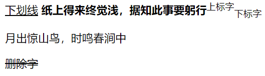
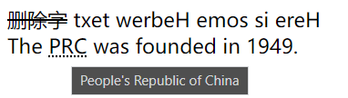
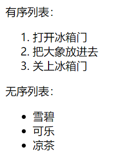
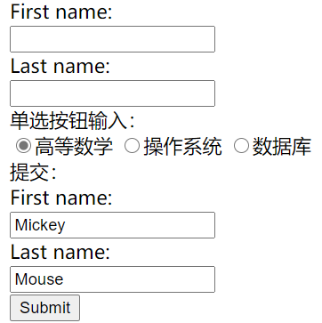
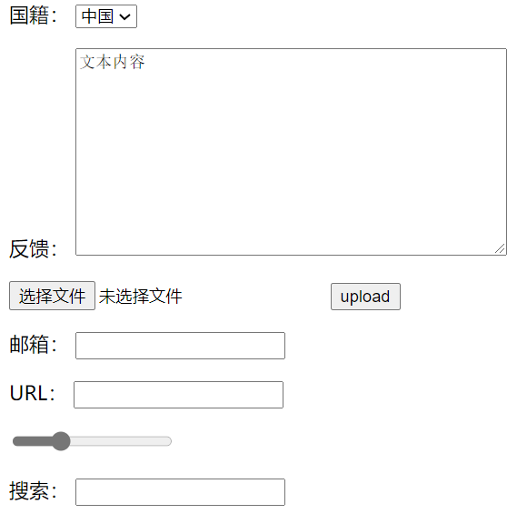
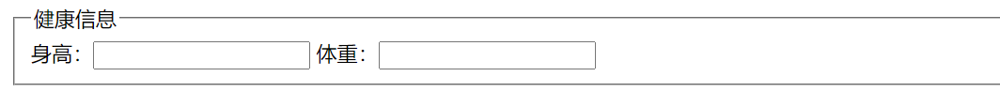

**HTML是以标签为主的超文本标记语言，标签是这门语言的灵魂。希望这篇笔记能帮助到同为初学的你！**

> PS：`<>`为标签，`()`为属性

# 结构

`<!DOCTYPE html>` ：声明为 HTML5 文档

`<html>` ：元素是 HTML 页面的根元素

`<head>` ：元素包含了文档的元（meta）数据，如 `<meta charset="utf-8">` 定义网页编码格式为`utf-8`。

`<title>` ：元素描述了文档的标题

`<body>` ：元素包含了可见的页面内容

```html
<!DOCTYPE html>
<html lang="en">
<head>
    <meta charset="UTF-8">
    <meta http-equiv="X-UA-Compatible" content="IE=edge">
    <meta name="viewport" content="width=device-width, initial-scale=1.0">
    <title>Document</title>
</head>
<body>
    
</body>
</html>
```

`<meta>`：基本的配置项目

+ `charset`：字符集
+ `viewport`：视口
  + `width=device-width` ：表示视口宽度等于屏幕宽度。
  + 这个理解不了就过
+ `Keywords`：关键词
+ `Description`：描述

# 基础

`<h1>-<h6>` ：元素定义一个标题

`<p>` ：元素定义一个段落

`<a href="https://www.runoob.com/">访问菜鸟教程</a>`：定义链接

- `target` ：（属性），你可以定义被链接的文档在何处显示
- `id`：（属性）可用于创建在一个HTML文档书签标记

```html
<!-- target="_blank"表示通过新窗口形式打开 -->
<a href="https://www.runoob.com/" target="_blank">访问菜鸟教程</a>
```

`<br>` ：标签定义换行

`<hr>` ：标签在 HTML 页面中创建水平线

`<b>` 或者`<strong>`：定义粗体文本

`<u>`：下划线

`<i>`：定义斜体字

`<small>` ：定义小号字

`<sub>`：定义下标字

`<sup>`：定义上标字

`<ins>`：定义插入字

`<del>`：定义删除字

```html
<br>
<u>下划线</u>
<b>纸上得来终觉浅，据知此事要躬行</b><sup>上标字</sup><sub>下标字</sub>
<p>月出惊山鸟，时鸣春涧中</p>
<del>删除字</del>
```



`<bdo>` ：定义文字方向

+ `dir`属性：`ltr`正序，`rtl`逆序

`<abbr>` ：定义缩写

`<address>` ：定义文档或文章的作者/拥有者的联系信息。

```html
<bdo dir="rtl">Here is some Hebrew text</bdo>
<br>
The <abbr title="People's Republic of China">PRC</abbr> was founded in 1949.
```



`<link>` ：外部样式表`<link rel="stylesheet" type="text/css" href="mystyle.css">`标签定义了文档与外部资源之间的关系

`<style>` ：标签定义了HTML文档的样式文件引用地址

`<script>`：定义了客户端的脚本文件，里面用`javascript`编写

# 图像

``：图像

- `src`：源属性的值是图像的 URL 地址
- `alt`：属性用来为图像定义一串预备的可替换的文本
- `height`（高度）与`width`（宽度）

```html
<!-- 如果无法显示图形，则会显示文本：“空之境界” -->

```

# 表格

`<table>`表格

`<tr>`行

`<td>`列

+ `border`(边框)

`<th>`表头

`<caption>`表格标题

+ `colspan`（跨行）
+ `rowspan`（跨列）
+ `cellspacing`（格间距）
+ `cellpadding`（格边距）

HTML表格可以用这个工具生成：https://www.osgeo.cn/app/sc909

# 列表

`<ul>`无序列表

`<ol>`有序列表，type（属性）可定义排序标志；start（开始位置属性）

`<li>`有序和无序列表项

```html
<p>有序列表：</p>
<ol>
    <li>打开冰箱门</li>
    <li>把大象放进去</li>
    <li>关上冰箱门</li>
</ol>

<p>无序列表：</p>
<ul>
    <li>雪碧</li>
    <li>可乐</li>
    <li>凉茶</li>
</ul>
```



`<dl>`自定义列表

`<dt>`自定义列表项

`<dd>`自定义列表项的定义

# 区块
`<div>`定义了文档的区域，块级 (block-level)

`<span>`用来组合文档中的行内元素， 内联元素(inline)

# 表单

`<form>`：表单标签

- `action`：（表单数据将被发送到服务器上的位置）
- `method`：规定在提交表单时所用的 HTTP 方法（*GET* 或 *POST*）

```html
<form action="action_page.php" method="GET">
```

`<input>`：输入表单

- `type="text"`：（属性 表单输入文本域）
- `type="password"：`（属性 表单输入密码字段）
- `type="radio"`：例`<input type="radio" name="sex" value="male">Male<br>`（单选框）
- `type="checkbox"` ：例 `<input type="checkbox" name="vehicle" value="Bike">I have a bike<br>`（复选框）
- `checked="checked"`：复选框的默认选项
- `type="button”`：（按钮)
- `type="submit"`：（提交）

```html
文本输入：
<form>
    First name:<br>
    <input type="text" name="firstname">
    <br>
    Last name:<br>
    <input type="text" name="lastname">
</form>
单选按钮输入：
<form>
    <input type="radio" name="course" value="高等数学" checked>高等数学
    <input type="radio" name="course" value="操作系统">操作系统
    <input type="radio" name="course" value="数据库">数据库
</form>
提交：
<!-- 表单条件程序写在solve.js中 -->
<form action="solve.js">
    First name:<br>
    <input type="text" name="firstname" value="Mickey">
    <br>
    Last name:<br>
    <input type="text" name="lastname" value="Mouse">
    <br>
    <input type="submit" value="Submit">
</form> 
```



`<select>`： 定义了下拉选项列表

`<option>：`下拉列表选项，`selected`（预选值）

`<textarea>`：定义文本域 (一个多行的输入控件)

```html
<!-- 下拉表 -->
<p>国籍：
    <select name="列表名称"/>
    	<option value="China">中国</option>
    	<option value="USA">美国</option>
    	<option value="India">印度</option>
    <select/>
</p>

<!-- 文本域 -->
<p>反馈：
    <textarea name="textarea" cols="50" rows="10">文本内容</textarea>
</p>

<!-- 文件域，文件上传 -->
<p>
    <input type="file" name="files">
    <input type="button" value="upload" name="upload">
</p>

<!-- 邮箱 -->
<p>邮箱：
    <input type="email" name="email">
</p>

<!--URL-->
<p>URL：
    <input type="url" name="url">
</p>

<!--滑块:input type="range"-->
<p>
    <input type="range" name="voice" min="0" max="100" step="2">
</p>

<!--搜索框-->
<p>搜索：
    <input type="search" name="search"/>
</p>
```



`<fieldset>` ：定义了一组相关的表单元素，并使用外框包含起来

`<legend>`：定义了 `<fieldset>` 元素的标题

```html
<form>
    <fieldset>
        <legend>健康信息</legend>
        身高：<input type="text" />
        体重：<input type="text" />
    </fieldset>
</form>
```



# iframe
`<iframe>：`定义一个内联的`iframe`

- `height`和 `width` ：属性用来定义`iframe`标签的高度与宽度
- `frameborder`：属性用于定义`iframe`表示是否显示边框

```html
<!--
src:引用页面地址
name:框架标示名
frameborder:1为有边框，0为无边框
-->
<iframe src="https://www.baidu.com" name="hello" width="1000" height="800">哈哈</iframe>
```

