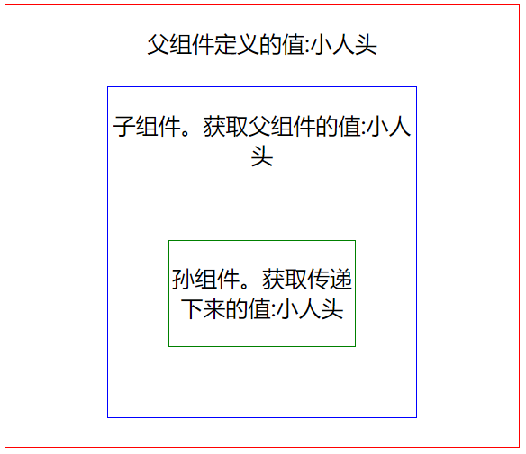

# 一、核心概念

## HelloWorld

新建脚手架：

```bash
npm install -g create-react-app
```

创建项目：

```bash
# 用脚手架创建React项目
create-react-app demo01
# 等创建完成后，进入项目目录
cd demo01
# 预览项目，如果能正常打开，说明项目创建成功
npm start
```

加载时间很长，加载成功后，清空src目录下的文件，添加：

`index.jsx`

```jsx
import React from 'react';
import ReactDOM from 'react-dom';
import App from './App';

ReactDOM.render(<App />,document.getElementById('root'));
```
`App.jsx`：

```jsx
import React from 'react';
const Component = React.Component;
class App extends Component{
    render(){
        return (
            <div>
                Hello World
            </div>
        )
    }
}
export default App;
```

## 一个小Demo

> JSX遇到`<`解析成HTML，遇到`{`解析成JS代码

`index.jsx`：

```jsx
import React from 'react';
import ReactDOM from 'react-dom';
import Game from './Game';

ReactDOM.render(<Game />,document.getElementById('root'));
```

`Game.jsx`：

```jsx
import React, { Component, Fragment } from 'react';
class Game extends Component {
    constructor(props) {
        super(props);
        this.state={
            inputValue:'volleyball',
            list:['basketball','tennis']
        }
    }

    render() {
        return (
            // Fragment相当于Vue里面的template，用于包裹
            <Fragment>
                <input value={this.state.inputValue} onChange={this.inputChange.bind(this)}></input>
                {/* 点击按钮触发addList函数，函数必须要用.bind(this)，否则函数运行时this是undefined */}
                <button onClick={this.addList.bind(this)}>添加</button>
                <ul>
                    {
                        // 遍历list并显示打印，用<li>标签包裹
                        this.state.list.map((item,index)=>{
                            return (
                                // 注意这里设置key的键，否则会报错
                                // 点击每个项目触发删除函数
                                <li key={index+item} onClick={this.deleteItem.bind(this,index)}>{item}</li>
                            )
                        })
                    }
                </ul>
            </Fragment>
        )
    }

    inputChange(e){
        this.setState({
            inputValue:e.target.value
        });
    }

    // 添加
    addList(){
        this.setState({
            list:[...this.state.list,this.state.inputValue]
        });
    }

    // 删除
    deleteItem(index){
        let list = this.state.list;
        list.splice(index,1);
        this.setState({
            list:list
        });
    }
}

export default Game;
```

说下上面代码需要注意的坑：

+ 要用`<Fragment>`包裹，用div的话有内、外边距
+ `onChange={this.inputChange.bind(this)`：一定要bind(this)，否则函数中调用this时候是undefined
+ 遍历后用`<li>`包裹时，一定要用key进行索引，这个类似于数据库中的主键
+ 操作state时使用setter函数，`this.setState({inputValue:e.target.value});`，不能直接用"="赋值

## 组件的两种写法

1.函数式

```jsx
function Welcome(props) {
    return <h1>Hello, {props.name}</h1>;
}
```

2.类式

```jsx
class Welcome extends React.Component {
    render() {
        return <h1>Hello, {this.props.name}</h1>;
    }
}
```

!> **注意：组件名称必须以大写字母开头。**另外props只可读，不可写。

组件化开发：

```jsx
import React from 'react';
import ReactDOM from 'react-dom';
function Welcome(props) {
    return <h1>Hello, {props.name}</h1>;
}

function App() {
    return (
        <div>
            <Welcome name="Sara" />
            <Welcome name="Cahal" />
            <Welcome name="Edite" />
        </div>
    );
}

ReactDOM.render(
    <App />,
    document.getElementById('root')
);
```

## state和生命周期

```jsx
import React from 'react';
import ReactDOM from 'react-dom';
class Clock extends React.Component {
    constructor(props) {
        super(props);
        // React中组件用state对象保存组件内的各种属性值
        this.state = { date: new Date() };
    }

    // 组件渲染到DOM时运行
    componentDidMount() {
        // 组件挂载时候调用tick方法，让它每秒调用一次
        this.timerID = setInterval(
            () => this.tick(),
            1000
        );
    }

    // 组件从DOM移除时运行
    componentWillUnmount() {
        clearInterval(this.timerID);
    }

    tick() {
        this.setState({
            date: new Date()
        });
    }

    render() {
        return (
            <div>
                <h1>Hello, world!</h1>
                {/* 从构造器中的state可以看到date属性，这里调用的就是那个 */}
                <h2>It is {this.state.date.toLocaleTimeString()}.</h2>
            </div>
        );
    }
}

ReactDOM.render(
    <Clock />,
    document.getElementById('root')
);
```

使用state的一些注意点：

+ 不能用“=”直接赋值给state，必须要用setter函数，即`setState()`
+ state更新可能是异步的

```js
// Wrong
this.setState({
    counter: this.state.counter + this.props.increment,
});
// Correct
this.setState((state, props) => ({
    counter: state.counter + props.increment
}));
```

## 事件处理

传统的 HTML：

```html
<button onclick="activateLasers()">
    Activate Lasers
</button>
```

在 React 中略微不同：

```jsx
<button onClick={activateLasers}>
    Activate Lasers
</button>
```

在JS中，`let f = func`和`let f = func()`是两个不同的东西，前者的`f`是一个函数对象，后者的`f`是调用`func()`函数返回的结果

另一点就是事件处理过程需要对其进行绑定，`this.handleClick.bind(this);`，当然从ES6+中知道，可以有另外的写法：[React中事件绑定的几种写法](https://juejin.cn/post/6963151026148868109)

+ 使用箭头函数包裹：`<button onClick={() => this.handleClick()}>Click me</button>`
+ 类上使用箭头函数

## 条件渲染

1.使用if语句，分支判断的变量存储在state中

2.&&运算符

```jsx
function Mailbox(props) {
    const unreadMessages = props.unreadMessages;
    return (
        <div>
            <h1>Hello!</h1>
            {unreadMessages.length > 0 &&
                <h2>
                    You have {unreadMessages.length} unread messages.
                </h2>
            }
        </div>
    );
}

const messages = ['React', 'Re: React', 'Re:Re: React'];
ReactDOM.render(
    <Mailbox unreadMessages={messages} />,
    document.getElementById('root')
);
```

3.三目运算符

```jsx
render() {
    const isLoggedIn = this.state.isLoggedIn;
    return (
        <div>
            The user is <b>{isLoggedIn ? 'currently' : 'not'}</b> logged in.
        </div>
    );
}
```

## 列表

```jsx
function NumberList(props) {
    const numbers = props.numbers;
    // 给每个列表元素分配一个 key 属性来解决 a key should be provided for list警告
    const listItems = numbers.map((number) =>
    	<li key={number.toString()}>
    		{number}
    	</li>
    );
	return (
		<ul>{listItems}</ul>
	);
}

const numbers = [1, 2, 3, 4, 5];
ReactDOM.render(
    <NumberList numbers={numbers} />,
    document.getElementById('root')
);
```

## 受控组件

受控组件：在React中，不像在HTML那样直接在便签内部存储状态，React 的 state 成为“唯一数据源”，主要有`<input>、<textarea>、<select>`

input标签：

```jsx
class NameForm extends React.Component {
    constructor(props) {
        super(props);
        this.state = {value: ''};

        this.handleChange = this.handleChange.bind(this);
        this.handleSubmit = this.handleSubmit.bind(this);
    }

    handleChange(event) {
        this.setState({value: event.target.value});
    }

    handleSubmit(event) {
        alert('提交的名字: ' + this.state.value);
        event.preventDefault();
    }

    render() {
        return (
            <form onSubmit={this.handleSubmit}>
                <label>
                    名字:
                    <input type="text" value={this.state.value} onChange={this.handleChange} />
                </label>
                <input type="submit" value="提交" />
            </form>
        );
    }
}
```

多个输入：

```jsx
class Reservation extends React.Component {
    constructor(props) {
        super(props);
        this.state = {
            isGoing: true,
            numberOfGuests: 2
        };
        this.handleInputChange = this.handleInputChange.bind(this);
    }

    handleInputChange(event) {
        const target = event.target;
        const value = target.name === 'isGoing' ? target.checked : target.value;
        const name = target.name;

        this.setState({
            [name]: value
        });
    }

    render() {
        return (
            <form>
                <label>
                    参与:
                    <input
                        name="isGoing"
                        type="checkbox"
                        checked={this.state.isGoing}
                        onChange={this.handleInputChange} />
                </label>
                <br />
                <label>
                    来宾人数:
                    <input
                        name="numberOfGuests"
                        type="number"
                        value={this.state.numberOfGuests}
                        onChange={this.handleInputChange} />
                </label>
            </form>
        );
    }
}
```

## 状态提升

在 React 中，将多个组件中需要共享的 state 向上移动到它们的最近共同父组件中，便可实现共享 state。这就是所谓的“状态提升”。

自顶向下的数据流：父组件向子组件传入参数，子组件用props接受，每个组件内部的状态用state表示。

下面是官网提供的例子：

+ 父组件是`Calculator`
+ 子组件是两个`TemperatureInput`和一个`BoilingVerdict`

```jsx
const scaleNames = {
    c: 'Celsius',
    f: 'Fahrenheit'
};
/**
 * 转换函数
 * @param {*} fahrenheit 华氏度
 * @returns 摄氏度
 */
function toCelsius(fahrenheit) {
    return (fahrenheit - 32) * 5 / 9;
}
/**
 * 转换函数
 * @param {*} celsius 摄氏度
 * @returns 华氏度
 */
function toFahrenheit(celsius) {
    return (celsius * 9 / 5) + 32;
}
/**
 * 选择调用那个转换函数
 * @param {*} temperature 温度
 * @param {*} convert toCelsius还是toFahrenheit
 * @returns 转换结果
 */
function tryConvert(temperature, convert) {
    const input = parseFloat(temperature);
    if (Number.isNaN(input)) {
        return '';
    }
    const output = convert(input);
    const rounded = Math.round(output * 1000) / 1000;
    return rounded.toString();
}
/**
 * 是否沸腾，组件
 * @param {*} props 
 * @returns 
 */
function BoilingVerdict(props) {
    if (props.celsius >= 100) {
        return <p>The water would boil.</p>;
    }
    return <p>The water would not boil.</p>;
}
// 温度输入
class TemperatureInput extends React.Component {
    constructor(props) {
        super(props);
        this.handleChange = this.handleChange.bind(this);
    }

    handleChange(e) {
        this.props.onTemperatureChange(e.target.value);
    }

    render() {
        // 从上级传入的 temperature
        const temperature = this.props.temperature;
        const scale = this.props.scale;
        return (
            <fieldset>
                <legend>Enter temperature in {scaleNames[scale]}:</legend>
                <input value={temperature}
                    onChange={this.handleChange} />
            </fieldset>
        );
    }
}
// 计算和组装
class Calculator extends React.Component {
    constructor(props) {
        super(props);
        this.handleCelsiusChange = this.handleCelsiusChange.bind(this);
        this.handleFahrenheitChange = this.handleFahrenheitChange.bind(this);
        this.state = {
            temperature: '',
            // 默认是摄氏度
            scale: 'c'
        };
    }

    /**
     * 选择温度模式
     * @param {*} temperature 
     */
    handleCelsiusChange(temperature) {
        this.setState({ scale: 'c', temperature });
    }
    handleFahrenheitChange(temperature) {
        this.setState({ scale: 'f', temperature });
    }

    render() {
        // 获取模式和温度
        const scale = this.state.scale;
        const temperature = this.state.temperature;
        const celsius = scale === 'f' ? tryConvert(temperature, toCelsius) : temperature;
        const fahrenheit = scale === 'c' ? tryConvert(temperature, toFahrenheit) : temperature;
        return (
            <div>
                <TemperatureInput
                    scale="c"
                    temperature={celsius}
                    onTemperatureChange={this.handleCelsiusChange} />
                <TemperatureInput
                    scale="f"
                    temperature={fahrenheit}
                    onTemperatureChange={this.handleFahrenheitChange} />
                <BoilingVerdict celsius={parseFloat(celsius)} />
            </div>
        );
    }
}
```

## 包含关系和特例关系

包含关系：

```jsx
function FancyBorder(props) {
    return (
        <div className={'FancyBorder FancyBorder-' + props.color}>
            {props.children}
        </div>
    );
}
function WelcomeDialog() {
    return (
        <FancyBorder color="blue">
            <h1 className="Dialog-title">Welcome</h1>
            <p className="Dialog-message">Thank you!</p>
        </FancyBorder>
    );
}
```

特例关系：

```jsx
function Dialog(props) {
    return (
        <div>
            <p>{props.title}</p>
            <p>{props.message}</p>
        </div>
    );
}
function WelcomeDialog() {
    return (
        <Dialog
            title="Welcome"
            message="Thank you!" />
    );
}
```

## 一些概念

单向数据流：传递过去的props只能读取不能修改

在React中使用jQuery：

```html
<div id="root"></div>
<div id="jq"></div>
```

函数式编程：每个函数代表功能，容易实现自动化测试

#  二、高级索引

## 代码分割

打包是一个将文件引入并合并到一个单独文件的过程，最终形成一个 “bundle”。 接着在页面上引入该 bundle，整个应用即可一次性加载。例如Webpack。

1.动态`import()`

使用之前：

```js
import { add } from './math';
console.log(add(16, 26));
```

使用之后：

```js
import("./math").then(math => {
    console.log(math.add(16, 26));
});
```

2.`React.lazy`+ `Suspense` 

应在 `Suspense` 组件中渲染 lazy 组件，如此使得我们可以使用在等待加载 lazy 组件时做优雅降级（如 loading 指示器等）。

`fallback` 属性接受任何在组件加载过程中你想展示的 React 元素（懒加载）。

```jsx
import React, { Suspense } from 'react';

const OtherComponent = React.lazy(() => import('./OtherComponent'));
const AnotherComponent = React.lazy(() => import('./AnotherComponent'));

function MyComponent() {
  return (
    <div>
      <Suspense fallback={<div>Loading...</div>}>
        <section>
          <OtherComponent />
          <AnotherComponent />
        </section>
      </Suspense>
    </div>
  );
}
```

## 错误边界

错误边界是一种 React 组件，这种组件**可以捕获并打印发生在其子组件树任何位置的 JavaScript 错误，并且，它会渲染出备用 UI**，而不是渲染那些崩溃了的子组件树。

如果一个 class 组件中定义了 `static getDerivedStateFromError()`或 `componentDidCatch()`这两个生命周期方法中的任意一个（或两个）时，那么它就变成一个错误边界。当抛出错误后，请使用 `static getDerivedStateFromError()` 渲染备用 UI ，使用 `componentDidCatch()` 打印错误信息。

```jsx
class ErrorBoundary extends React.Component {
    constructor(props) {
        super(props);
        this.state = { hasError: false };
    }

    static getDerivedStateFromError(error) {
        // 更新 state 使下一次渲染能够显示降级后的 UI
        return { hasError: true };
    }

    componentDidCatch(error, errorInfo) {
        // 你同样可以将错误日志上报给服务器
        logErrorToMyService(error, errorInfo);
    }

    render() {
        if (this.state.hasError) {
            // 你可以自定义降级后的 UI 并渲染
            return <h1>Something went wrong.</h1>;
        }
        return this.props.children; 
    }
}
```

```jsx
<ErrorBoundary>
    <MyWidget />
</ErrorBoundary>
```

当`<ErrorBoundary>`包裹的组件出现error时候，会自动降级渲染出`<h1>Something went wrong.</h1>`。

## Context

### API

Context 提供了一种在组件之间共享此类值的方式，而不必显式地通过组件树的逐层传递 props。

+ `React.createContext`：创建一个上下文的容器(组件)，`defaultValue`可以设置共享的默认数据

```jsx
const MyContext = React.createContext(defaultValue);
```

+ `Context.Provider`：生产者，用于生产共享数据的地方。value：放置共享的数据。

```jsx
<MyContext.Provider value={/* 某个值 */}>
```

+ `Context.Consumer`：消费者，他是专门消费供应商产生数据。Consumer需要嵌套在生产者里面，才能通过回调的方式拿到共享的数据源。当然也可以单独使用，那就只能消费到上文提到的`defaultValue`

```jsx
<MyContext.Consumer>
    {value => /* 基于 context 值进行渲染*/}
</MyContext.Consumer>
```

+ `Class.contextType`：挂载在 class 上的 `contextType` 属性会被重赋值为一个由 `React.createContext()`创建的 Context 对象。这能让你使用 `this.context` 来消费最近 Context 上的那个值。你可以在任何生命周期中访问到它，包括 render 函数中。

```jsx
class MyClass extends React.Component {
	static contextType = MyContext;
    render() {
        let value = this.context;
        /* 基于这个值进行渲染工作 */
    }
}
```

### 例子

```jsx
import React from 'react';
import ReactDOM from 'react-dom';
const MyContext = React.createContext("默认名称");
class App extends React.Component {
    render() {
        let name ="小人头"
        return (
            <MyContext.Provider value={name}>
                <div style={{border:'1px solid red',width:'30%',margin:'50px auto',textAlign:'center'}}>
                    <p>父组件定义的值:{name}</p>
                    <Son />
                </div>
            </MyContext.Provider>
        );
    }
}

function Son() {
    return (
        <MyContext.Consumer>
            {( name ) =>
                <div style={{ border: '1px solid blue', width: '60%', margin: '20px auto', textAlign: 'center' }}>
                    <p>子组件。获取父组件的值:{name}</p>
                    <Grandson />
               </div>
            }
        </MyContext.Consumer>
    );
}

function Grandson() {
    return (
        <MyContext.Consumer>
            {(name) =>
                <div style={{ border: '1px solid green', width: '60%', margin: '50px auto', textAlign: 'center' }}>
                    <p>孙组件。获取传递下来的值:{name}</p>
                </div>
            }
        </MyContext.Consumer>
    );
}

ReactDOM.render(
    <App/>,
    document.getElementById('root')
);
```



使用步骤：

1. 创建context对象`const MyContext = React.createContext("默认名称");`
2. 使用生产者`<MyContext.Provider>`，这一步也可以不使用，不使用的话消费者获取的值就是`defaultValue`
3. 在生产者组件内部使用消费者`<MyContext.Consumer>`

## 高阶组件

> 高阶组件部分有点难，部分无法理解，这里只能看一个例子，之后再回过来看

**高阶组件是参数为组件，返回值为新组件的函数。**

类似于装饰器模式，原先组件不进行修改，通过高阶组件的方式进行添加和组合

```jsx
import React, { Fragment } from 'react';
import ReactDOM from 'react-dom';
class HelloWorld extends React.Component {
    render() {
        return <h3>组件1：{this.props.text}</h3>;
    }
}
class HelloChina extends React.Component {
    render() {
        return <p>组件2：{this.props.text}</p>;
    }
}
// 包装器模式，函数参数是组件，函数返回值也是组件
function toUpperCaseHoc(WrappedComponent) {
    return class Hoc extends React.Component {
        render() {
            const { text } = this.props;
            const text2Upper = text.toUpperCase();
            return <WrappedComponent text={text2Upper} />;
        }
    };
};
const HelloWorld2Upper = toUpperCaseHoc(HelloWorld);
const HelloChina2Upper = toUpperCaseHoc(HelloChina);
// 组装HelloWorld2Upper和HelloChina2Upper
class App extends React.Component {
    render() {
        return (
            <Fragment>
                <HelloWorld2Upper text="Hello World!"/>
                <HelloChina2Upper text="Hello China!"/>
            </Fragment>
        );
    }
}
ReactDOM.render(
    <App />,
    document.getElementById('root')
);
```

## Refs

### 正常创建使用

ref 的值根据节点的类型而有所不同：

- 当 `ref` 属性用于 HTML 元素时，构造函数中使用 `React.createRef()` 创建的 `ref` 接收底层 DOM 元素作为其 `current` 属性。
- 当 `ref` 属性用于自定义 class 组件时，`ref` 对象接收组件的挂载实例作为其 `current` 属性。
- **你对函数组件上使用 `ref` 属性**，因为他们没有实例。

可以将Refs看作锚点，先创建，在调用时候找到这个锚点的位置，作用于锚点的必须是存在的一个对象

```jsx
class CustomTextInput extends React.Component {
    constructor(props) {
        super(props);
        this.textInput = React.createRef();
        this.focusTextInput = this.focusTextInput.bind(this);
    }

    focusTextInput() {
        this.textInput.current.focus();
    }

    render() {
        return (
            <div>
                <input
                    type="text"
                    ref={this.textInput} />
                <input
                    type="button"
                    value="Focus the text input"
                    onClick={this.focusTextInput}
                />
            </div>
        );
    }
}
```

### 回调Refs

```jsx
class CustomTextInput extends React.Component {
    constructor(props) {
        super(props);
        this.textInput = null;
        this.focusTextInput = () => {
            // 聚焦
            if (this.textInput){
                this.textInput.focus();
            }
        };
    }

    render() {
        // e就是input标签
        return (
            <div>
                <input
                    type="text"
                    ref={(e)=>{this.textInput=e}}
                />
                <input
                    type="button"
                    value="Focus the text input"
                    onClick={this.focusTextInput}
                />
            </div>
        );
    }
}
```

### Ref转发

Ref 转发是一项将ref自动地通过组件传递到其一个子组件的技巧。

```jsx
const FancyButton = React.forwardRef((props, ref) => (
    <button ref={ref} className="FancyButton">
    	{props.children}
    </button>
));
// 你可以直接获取 DOM button 的 ref：
const ref = React.createRef();
<FancyButton ref={ref}>Click me!</FancyButton>;
```

> 第二个参数 `ref` 只在使用 `React.forwardRef` 定义组件时存在。常规函数和 class 组件不接收 `ref` 参数，且 props 中也不存在 `ref`。

## 深入JSX

下面两种写法是通用的：

```jsx
const ele = <h2>Hello React!</h2>
```

```js
const ele = React.createElement('h2',null,'Hello React')
```

**JSX的本质是React.createElement()函数**

react通过babel把JSX转成`createElement`函数，生成`ReactElement`对象，然后通过`ReactDOM.render函`数把`ReactElement`渲染成真实的`DOM`元素

## 非受控组件

受控组件：表单数据是由 React 组件来管理的

非受控组件：表单数据将交由 DOM 节点来处理

```jsx
class NameForm extends React.Component {
    constructor(props) {
        super(props);
        this.handleSubmit = this.handleSubmit.bind(this);
        this.input = React.createRef();
    }

    handleSubmit(event) {
        alert('A name was submitted: ' + this.input.current.value);
        event.preventDefault();
    }

    render() {
        return (
            <form onSubmit={this.handleSubmit}>
                <label>
                    Name:
                    <input type="text" ref={this.input} />
                </label>
                <input type="submit" value="Submit" />
            </form>
        );
    }
}
```

## PropTypes检查

验证器有如下类型：

```js
MyComponent.propTypes = {
    // 你可以将属性声明为 JS 原生类型，默认情况下
    // 这些属性都是可选的。
    optionalArray: PropTypes.array,
    optionalBool: PropTypes.bool,
    optionalFunc: PropTypes.func,
    optionalNumber: PropTypes.number,
    optionalObject: PropTypes.object,
    optionalString: PropTypes.string,
    optionalSymbol: PropTypes.symbol,

    // 任何可被渲染的元素（包括数字、字符串、元素或数组）
    // (或 Fragment) 也包含这些类型。
    optionalNode: PropTypes.node,

    // 一个 React 元素。
    optionalElement: PropTypes.element,

    // 一个 React 元素类型（即，MyComponent）。
    optionalElementType: PropTypes.elementType,

    // 你也可以声明 prop 为类的实例，这里使用
    // JS 的 instanceof 操作符。
    optionalMessage: PropTypes.instanceOf(Message),

    // 你可以让你的 prop 只能是特定的值，指定它为
    // 枚举类型。
    optionalEnum: PropTypes.oneOf(['News', 'Photos']),

    // 一个对象可以是几种类型中的任意一个类型
    optionalUnion: PropTypes.oneOfType([
        PropTypes.string,
        PropTypes.number,
        PropTypes.instanceOf(Message)
    ]),

    // 可以指定一个数组由某一类型的元素组成
    optionalArrayOf: PropTypes.arrayOf(PropTypes.number),

    // 可以指定一个对象由某一类型的值组成
    optionalObjectOf: PropTypes.objectOf(PropTypes.number),

    // 可以指定一个对象由特定的类型值组成
    optionalObjectWithShape: PropTypes.shape({
        color: PropTypes.string,
        fontSize: PropTypes.number
    }),

    // An object with warnings on extra properties
    optionalObjectWithStrictShape: PropTypes.exact({
        name: PropTypes.string,
        quantity: PropTypes.number
    }),   

    // 你可以在任何 PropTypes 属性后面加上 `isRequired` ，确保
    // 这个 prop 没有被提供时，会打印警告信息。
    requiredFunc: PropTypes.func.isRequired,

    // 任意类型的数据
    requiredAny: PropTypes.any.isRequired,

    // 你可以指定一个自定义验证器。它在验证失败时应返回一个 Error 对象。
    // 请不要使用 `console.warn` 或抛出异常，因为这在 `onOfType` 中不会起作用。
    customProp: function(props, propName, componentName) {
        if (!/matchme/.test(props[propName])) {
            return new Error(
                'Invalid prop `' + propName + '` supplied to' +
                ' `' + componentName + '`. Validation failed.'
            );
        }
    },

    // 你也可以提供一个自定义的 `arrayOf` 或 `objectOf` 验证器。
    // 它应该在验证失败时返回一个 Error 对象。
    // 验证器将验证数组或对象中的每个值。验证器的前两个参数
    // 第一个是数组或对象本身
    // 第二个是他们当前的键。
    customArrayProp: PropTypes.arrayOf(function(propValue, key, componentName, location, propFullName) {
        if (!/matchme/.test(propValue[key])) {
            return new Error(
                'Invalid prop `' + propFullName + '` supplied to' +
                ' `' + componentName + '`. Validation failed.'
            );
        }
    })
};
```


