# 一、JSON
## 1.1 什么是Json？
JSON(JavaScript Object Notation, JS 对象标记) 是一种轻量级的数据交换格式，目前使用特别广泛。
采用完全独立于编程语言的文本格式来存储和表示数据。简洁和清晰的层次结构使得 JSON 成为理想的数据交换语言。 易于人阅读和编写，同时也易于机器解析和生成，并有效地提升网络传输效率。
**在 JS 语言中，一切都是对象。因此，任何JS支持的类型都可以通过 JSON 来表示**，例如字符串、数字、对象、数组等。看看他的要求和语法格式：
+ **对象表示为键值对**
+ **数据由逗号分隔**
+ **花括号保存对象**
+ **方括号保存数组**

JSON 键值对是用来保存 JS 对象的一种方式，和 JS 对象的写法也大同小异，键/值对组合中的键名写在前面并用双引号 "" 包裹，使用冒号 : 分隔，然后紧接着值：
```json
{"name": "QinJiang"}
{"age": "3"}
{"sex": "男"}
```
JSON 是 JS 对象的字符串表示法，它使用文本表示一个 JS 对象的信息，本质是一个字符串。
```javascript
var obj = {a: 'Hello', b: 'World'};     //这是一个对象，注意键名也是可以使用引号包裹的
var json = '{"a": "Hello", "b": "World"}';      //这是一个 JSON 字符串，本质是一个字符串
```
## 1.2 JSON对象
### 访问
```js
var myObj, x;
myObj = { "name":"runoob", "alexa":10000, "site":null };
x = myObj.name;
x = myObj["name"];
```
### 遍历
```js
var myObj = { "name":"runoob", "alexa":10000, "site":null }; 
for (x in myObj) { 
    document.getElementById("demo").innerHTML += x + "<br>"; 
}
```
### 修改和删除
```js
myObj.sites.site1 = "www.google.com";
delete myObj.sites.site1;
```
## 1.3 JSON 和 JS 对象互转
要实现从JSON字符串转换为JS对象，使用`JSON.parse()`方法：
```javascript
var obj = JSON.parse('{"a": "Hello", "b": "World"}'); //结果是 {a: 'Hello', b: 'World'}
```
要实现从JS对象转换为JSON字符串，使用`JSON.stringify()`方法：
```javascript
var json = JSON.stringify({a: 'Hello', b: 'World'}); //结果是 '{"a": "Hello", "b": "World"}'
```
在代码中测试
```javascript
<script type="text/javascript">
    //编写一个js的对象
    var user = {
        name:"Long",
        age:3,
        sex:"男"
    };
    //将js对象转换成json字符串
    var str = JSON.stringify(user);
    console.log(str);
    //将json字符串转换为js对象
    var user2 = JSON.parse(str);
    console.log(user2.age,user2.name,user2.sex);
</script>
```
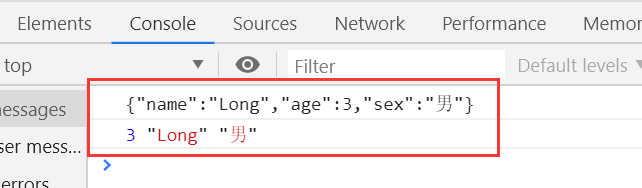

# 二、Ajax

## 2.1 XMLHttpRequest 对象
```js
var xmlhttp;
if (window.XMLHttpRequest)
{
    //  IE7+, Firefox, Chrome, Opera, Safari 浏览器执行代码
    xmlhttp=new XMLHttpRequest();
}
else
{
    // IE6, IE5 浏览器执行代码
    xmlhttp=new ActiveXObject("Microsoft.XMLHTTP");
}
```

| 属性                 | 描述                                                         |
| -------------------- | ------------------------------------------------------------ |
| `onreadystatechange` | 存储函数（或函数名），每当 readyState 属性改变时，就会调用该函数 |
| `readyState`         | 0: 请求未初始化  1: 服务器连接已建立  2: 请求已接收   3: 请求处理中   4: 请求已完成，且响应已就绪 |
| `status`             | 200: "OK"404: 未找到页面                                     |
## 2.2 请求
### GET和POST
```js
/* 分别为：
        method：请求的类型；GET 或 POST
        url：文件在服务器上的位置
        async：true（异步）或 false（同步）
*/
xmlhttp.open("GET","/try/ajax/demo_get2.php?fname=Henry&lname=Ford",true);
xmlhttp.send();
```
如果需要像 HTML 表单那样 POST 数据，请使用 `setRequestHeader()`来添加 HTTP 头。然后在 send() 方法中规定您希望发送的数据：
```js
xmlhttp.open("POST","/try/ajax/demo_post2.php",true);
/* 分别为：
        header: 规定头的名称
        value: 规定头的值
*/
xmlhttp.setRequestHeader("Content-type","application/x-www-form-urlencoded");
xmlhttp.send("fname=Henry&lname=Ford");
```
### 异步
`XMLHttpRequest`对象如果要用于 AJAX 的话，其`open()`方法的`async`参数必须设置为`true`：

```js
xmlhttp.open("GET","ajax_test.html",true);
```
**不推荐使用`async=false`**

## 2.3 响应

| 属性           | 描述                     |
| -------------- | ------------------------ |
| `responseText` | 获得字符串形式的响应数据 |
| `responseXML`  | 获得 XML 形式的响应数据  |
```js
document.getElementById("myDiv").innerHTML=xmlhttp.responseText;
```
```js
// responseXML需要作为XML对象进行解析
xmlDoc=xmlhttp.responseXML; txt=""; x=xmlDoc.getElementsByTagName("ARTIST"); for (i=0;i<x.length;i++) { txt=txt + x[i].childNodes[0].nodeValue + "<br>"; } document.getElementById("myDiv").innerHTML=txt;
```
# 三、Promise
## 3.1 什么是Promise？
Promise 是异步编程的一种解决方案，其实是一个构造函数，自己身上有all、reject、resolve这几个方法，原型上有then、catch等方法。
Promise对象有以下两个特点：

1.对象的状态不受外界影响。Promise对象代表一个异步操作，有三种状态：pending（进行中）、fulfilled（已成功）和rejected（已失败）。只有异步操作的结果，可以决定当前是哪一种状态，任何其他操作都无法改变这个状态。这也是Promise这个名字的由来，它的英语意思就是“承诺”，表示其他手段无法改变。

2.一旦状态改变，就不会再变，任何时候都可以得到这个结果。Promise对象的状态改变，只有两种可能：从pending变为fulfilled和从pending变为rejected。只要这两种情况发生，状态就凝固了，不会再变了，会一直保持这个结果，这时就称为 resolved（已定型）。如果改变已经发生了，你再对Promise对象添加回调函数，也会立即得到这个结果。这与事件（Event）完全不同，事件的特点是，如果你错过了它，再去监听，是得不到结果的。

## 3.2 Promise的API
+ 实例化Promise对象，构造函数中传递参数
+ resolve和reject两个参数用于处理成功和失败两种情况，并通过`p.then`获取处理效果
### 实例方法
`.then()`：得到异步任务正确的结果
> then 方法接收两个函数作为参数，第一个参数是 Promise 执行成功时的回调，第二个参数是 Promise 执行失败时的回调，两个函数只会有一个被调用。

`.catch()`：获取异常信息

`.finally()`：成功与否都会执行（不是正式标准） 
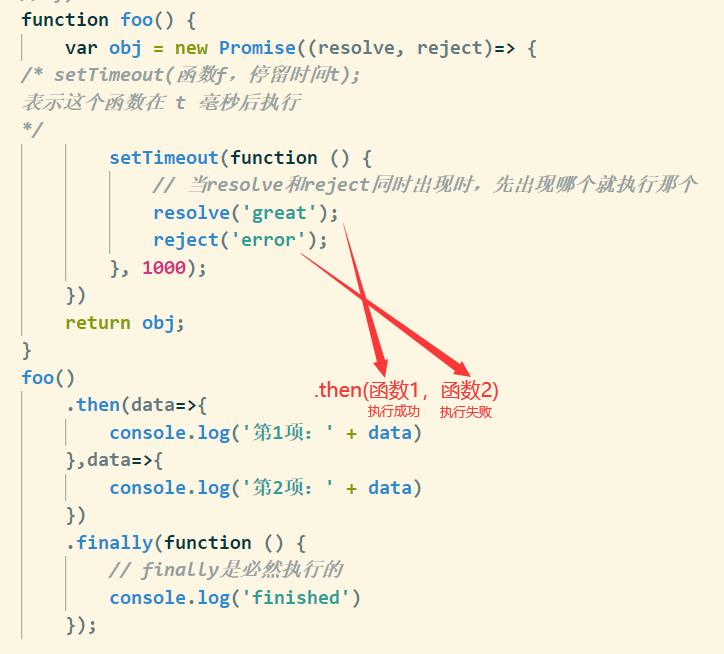

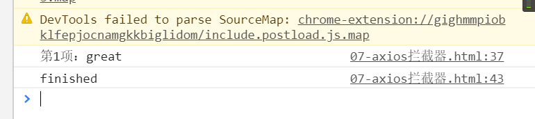

```js
function foo() {
var obj = new Promise((resolve, reject)=> {
/* setTimeout(函数f，停留时间t); 
表示这个函数在 t 毫秒后执行
*/
    setTimeout(function () {
        // 当resolve和reject同时出现时，先出现哪个就执行那个
        resolve('great');
        reject('error');
    }, 1000);
})
return obj;
}
foo()
.then(data=>{
    console.log('第1项：' + data)
},data=>{
    console.log('第2项：' + data)
})
.finally(function () {
    // finally是必然执行的
    console.log('finished')
});
```
### 静态方法
`.all()`：`Promise.all`方法接受一个数组作参数，数组中的对象（p1、p2、p3）均为promise实例（如果不是一个promise，该项会被用`Promise.resolve`转换为一个promise)。它的状态由这三个promise实例决定
`.race()`：`Promise.race`方法同样接受一个数组作参数。当p1, p2, p3中有一个实例的状态发生改变（变为fulfilled或rejected），p的状态就跟着改变。并把第一个改变状态的promise的返回值，传给p的回调函数

```html
  <script type="text/javascript">
    /*
      Promise常用API-对象方法
    */
    // console.dir(Promise)
    function queryData(url) {
      return new Promise(function(resolve, reject){
        var xhr = new XMLHttpRequest();
        xhr.onreadystatechange = function(){
          if(xhr.readyState != 4) return;
          if(xhr.readyState == 4 && xhr.status == 200) {
            // 处理正常的情况
            resolve(xhr.responseText);
          }else{
            // 处理异常情况
            reject('服务器错误');
          }
        };
        xhr.open('get', url);
        xhr.send(null);
      });
    }
    var p1 = queryData('http://localhost:3000/a1');
    var p2 = queryData('http://localhost:3000/a2');
    var p3 = queryData('http://localhost:3000/a3');
     Promise.all([p1,p2,p3]).then(function(result){
       //   all 中的参数  [p1,p2,p3]   和 返回的结果一 一对应["HELLO TOM", "HELLO JERRY", "HELLO SPIKE"]
       console.log(result) //["HELLO TOM", "HELLO JERRY", "HELLO SPIKE"]
     })
    Promise.race([p1,p2,p3]).then(function(result){
      // 由于p1执行较快，Promise的then()将获得结果'P1'。p2,p3仍在继续执行，但执行结果将被丢弃。
      console.log(result) // "HELLO TOM"
    })
  </script>
```
# 四、接口调用
## 4.1 fetch
### GET
```js
fetch('http://localhost:3000/books?id=123',{
    // Request Method
    method:'get'
}).then(function (data) {
    // text()方法属于fetch API的一部分，返回一个Promise实例对象，用于获取后台返回的数据
    return data.text();
}).then(function (data) {
    console.log(data);
})
```
对应的API：
```js
app.get('/books', (req, res) => {
  res.send('传统的URL传递参数!' + req.query.id)
})
```

### POST/PUT
这里POST与PUT类似，即可在代码中更换
```js
fetch('http://localhost:3000/books',{
    method:'post',
    body:'uname=admin&pwd=123456',
    headers:{
        'Content-Type':'application/x-www-form-urlencoded'
    }
}).then(function (data) {
    return data.text();
}).then(function (data) {
    console.log(data);
})
```
对应的API：
```js
app.post('/books', (req, res) => {
  res.send('POST请求传递参数!' + req.body.uname + '---' + req.body.pwd)
})
```
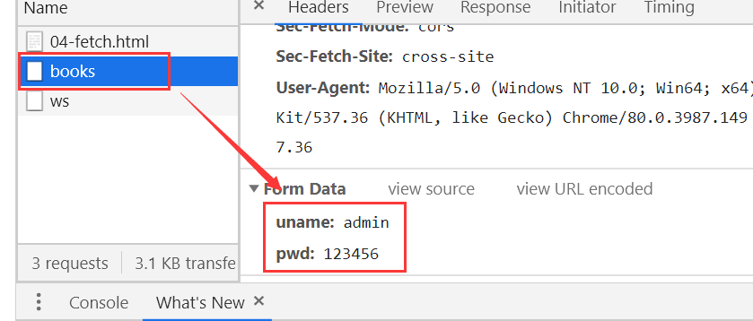

### 响应结果
`text()`：返回处理成字符串类型
`json()`：返回结果是`json`对象，跟`JSON.parse(responseText)`一样

```js
fetch('http://localhost:3000/json').then(function(data){
    return data.json();
}).then(function(data){
    console.log(data)
})
```
对应的API：
```js
app.get('/json', (req, res) => {
  res.json({
    uname: 'lisi',
    age: 13,
    gender: 'male'
  });
})
```
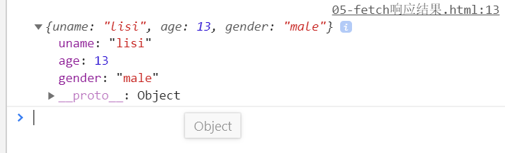

## 4.2 axios
### 基本用法
```js
axios.get('http://localhost:3000/adata').then(function(ret){
    // 注意data属性是固定用法，用于获取后台的实际数据
    console.log(ret.data)
    console.log(ret)
})
```
对应的API：
```js
app.get('/adata', (req, res) => {
  res.send('Hello axios!')
})
```
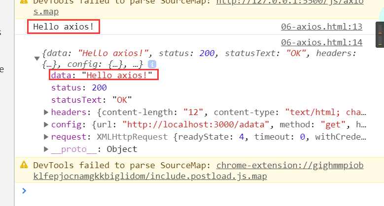
### GET/PUT参数传递
put请求于get请求类似

1.URL

```js
axios.get('/adata?id=123')
    .then(ret=>{
        console.log(ret.data)
    })
// 或者下面这种
axios.get('/adata/123')
    .then(ret=>{
        console.log(ret.data)
    })
```
2.params

```js
axios.get('/adata',{
        params: {
            id: 123
        }
    })
    .then(ret=>{
        console.log(ret.data)
    })
```
### POST参数传递
```js
axios.post('http://localhost:3000/axios',{
    uname:'Lisa',
    pwd:88888888
}).then(function(ret){
    console.log(ret.data)
    console.log(ret)
})
```
对应的API：
```js
app.post('/axios', (req, res) => {
  res.send('axios post 传递参数' + req.body.uname + '---' + req.body.pwd)
})
```
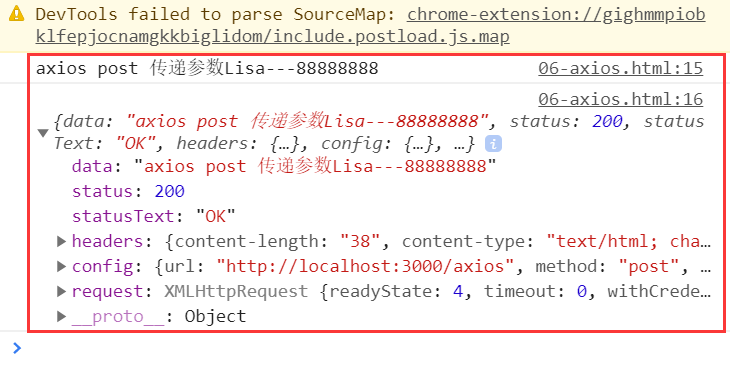
### axios全局配置
```js
axios.defaults.timeout=3000;  //超时时间
axios.defaults.baseURL='http://localhost:3000/app';  //默认地址
axios.defaults.headers[ 'mytoken' ] = 'hello';  //设置请求头
```
### 请求拦截器
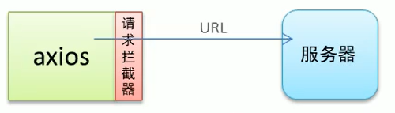

```js
axios.interceptors.request.use(function(config){
    console.log(config);
    config.headers.mytoken = 'nihao';
    return config;
},function(err){
    console.log(err)
})
axios.get('http://localhost:3000/adata').then(function(data){
    console.log(data)
})
```
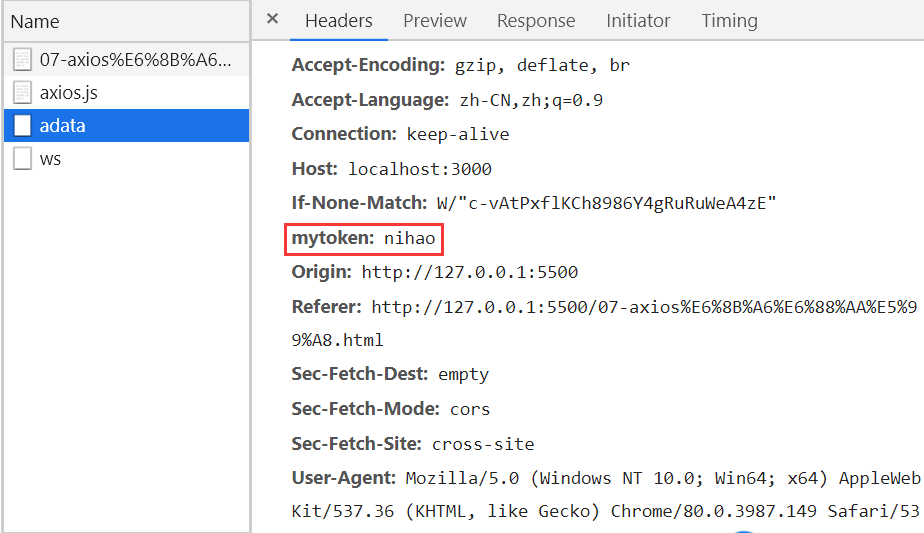

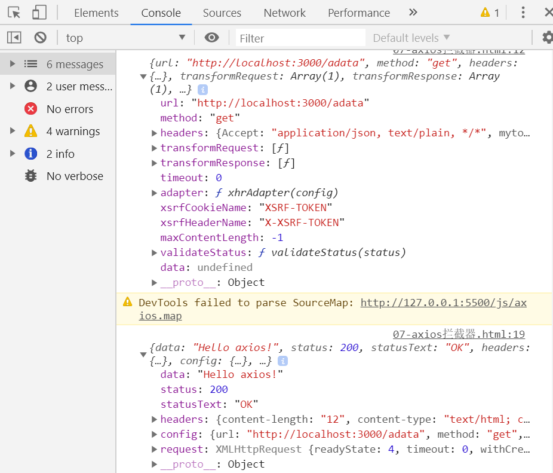

### 响应拦截器

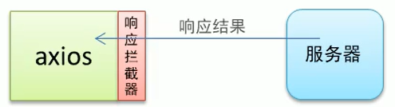

```js
axios.interceptors.response.use(function(res){
    console.log(res);
    return res;
},function(err){
    console.log(err)
})
axios.get('http://localhost:3000/adata').then(function(data){
    console.log(data)
})
```
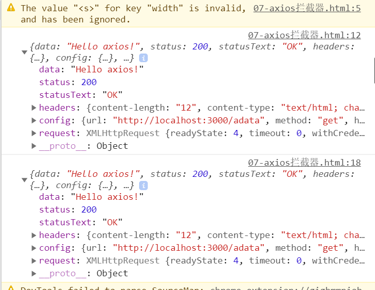


```js
fetch('http://localhost:3000/books?id=123456',{
    method:'get'
})
.then(function(value1){
    console.log(value1);
    return 'hello';
})
.then(function(value2){
    console.log(value2);
    return 'HelloWorld';
})
// .then(function(data){
//     console.log(data);
//     return data.text();
// })
.then(data=>{
    console.log(data);
})
```
## 4.3 async/await
```js
async function queryData(){
    var ret =await new Promise(function(resolve,reject){
        setTimeout(function(){
            resolve('Hello')
        },1000);
    })
    return ret;
}
queryData().then(function(data){
    console.log(data)
})
```