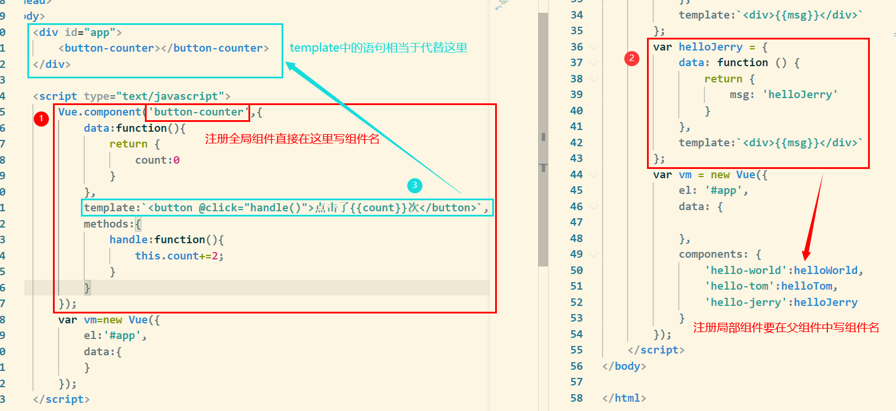
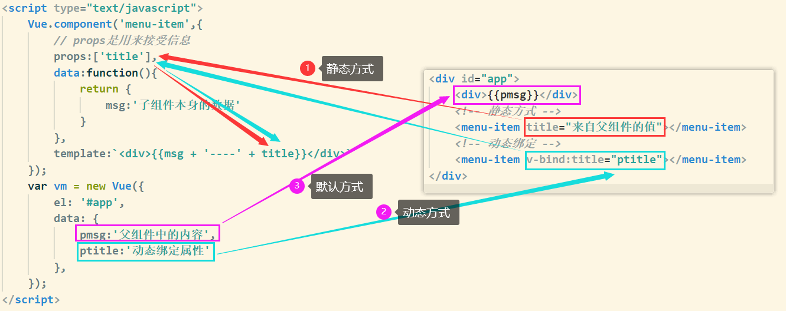
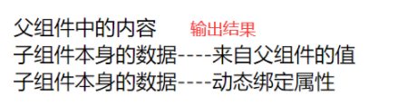
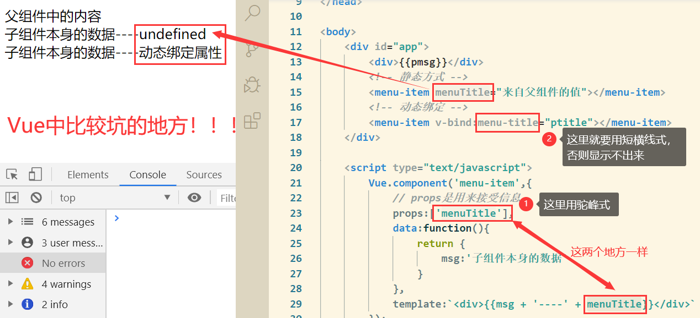
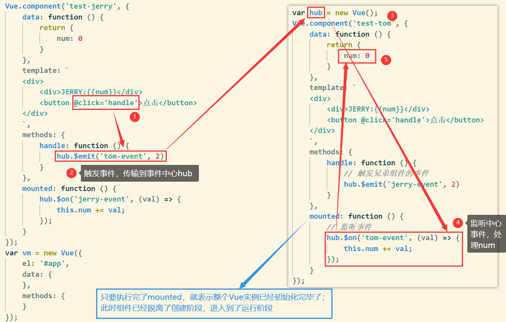
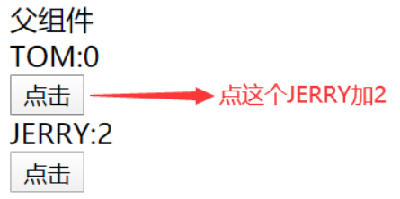
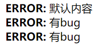
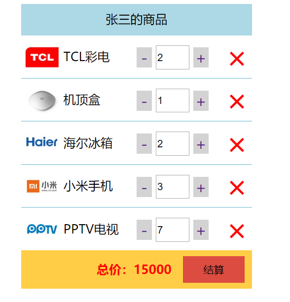

# 2.1 组件注册（template）

## 全局组件注册

1.**data必须是一个函数**

2.组件模板内容必须是单个跟元素

3.组件模板内容可以是模板字符串，模板字符串需要浏览器提供支持（ES6语法）

```html
<div id="app">
    <button-counter></button-counter>
</div>
<script type="text/javascript">
    Vue.component('button-counter',{
        data:function(){
            return {
                count:0
            }
        },
        template:'<button @click="handle()">点击了{{count}}次</button>',
        methods:{
            handle:function(){
                this.count+=2;
            }
        }
    });
    var vm=new Vue({
        el:'#app',
        data:{
        }
    });
</script>
```

## 局部组件注册

```html
<div id="app">
    <hello-world></hello-world>
    <hello-tom></hello-tom>
    <hello-jerry></hello-jerry>
</div>
<script type="text/javascript">
// 局部组件只能在他的父组件中使用
    var helloWorld = {
        data: function () {
            return {
                msg: 'helloWorld'
            }
        },
        template:`<div>{{msg}}</div>`
    };
    var helloTom = {
        data: function () {
            return {
                msg: 'helloTom'
            }
        },
        template:`<div>{{msg}}</div>`
    };
    var helloJerry = {
        data: function () {
            return {
                msg: 'helloJerry'
            }
        },
        template:`<div>{{msg}}</div>`
    };
    var vm = new Vue({
        el: '#app',
        data: {
        },
        components: {
            'hello-world':helloWorld,
            'hello-tom':helloTom,
            'hello-jerry':helloJerry
        }
    });
</script>
```

## 全局组件和局部组件的区别



# 2.2 传值

## 父组件向子组件传值

> **props传递数据原则：单向数据流**，只允许父组件向子组件传递信息，不允许子组件向父组件传递

+ 父组件发送的形式是以属性的形式绑定值到子组件身上
+ 然后子组件用属性props接收





+ **在props中使用驼峰形式，模板中需要使用短横线的形式，字符串形式的模板中没有这个限制**



## 子组件向父组件传值

这个例子中实现的字体每次以10px变大，同时实现了父组件向子组件传值形式的数组改变，跟上述例子正好方向相反

```html
<div id="app">
    <!-- 这里的 {fontSize:fontSize + "px"} 
        冒号前表示键key，冒号后表示值value
        这个有点类似Java中的赋值语句，只不过中间是等号
    -->
    <div :style='{fontSize:fontSize + "px"}'>{{pmsg}}</div>
    <menu-item v-bind:parr='fruit' @enlarge-text='handle($event)'></menu-item>
</div>
<script type="text/javascript">
    Vue.component('menu-item',{
        props:['parr'],
        template:`
        <div>
            <ul>
                <li :key='index' v-for='(items,index) in parr'>{{items}}</li>
            </ul>
            <button @click='parr.push("lemon")'>点击添加</button>
            <button @click='$emit("enlarge-text",10)'>扩大父组件</button>
        </div>
        `
    });
    var vm = new Vue({
        el: '#app',
        data: {
            pmsg: '父组件中内容',
            fruit: ['apple', 'orange', 'banana'],
            fontSize: 10
        },
        methods:{
            handle:function(val){
                this.fontSize+=val;
            },
        }
    });
</script>
```

## 兄弟组件间的传值



`vm.$emit( eventName, […args] )`：**触发当前实例上的事件**。附加参数都会传给监听器回调。
`vm.$on( event, callback )`：**监听当前实例上的自定义事件**。事件可以由`vm.$emit`触发。回调函数会接收所有传入事件触发函数的额外参数。

代码如下：

```html
<div id="app">
    <div>父组件</div>
    <test-tom></test-tom>
    <test-jerry></test-jerry>
</div>
<script type="text/javascript">
    // 提供事件中心
    var hub = new Vue();
    Vue.component('test-tom', {
        data: function () {
            return {
                num: 0
            }
        },
        template: `
        <div>
            <div>JERRY:{{num}}</div>
            <button @click='handle'>点击</button>
        </div>
        `,
        methods: {
            handle: function () {
                // 触发兄弟组件的事件
                hub.$emit('jerry-event', 2)
            }
        },
        mounted: function () {
            // 监听事件
            hub.$on('tom-event', (val) => {
                this.num += val;
            });
        }
    });
    Vue.component('test-jerry', {
        data: function () {
            return {
                num: 0
            }
        },
        template: `
        <div>
            <div>JERRY:{{num}}</div>
            <button @click='handle'>点击</button>
        </div>
        `,
        methods: {
            handle: function () {
                hub.$emit('tom-event', 2)
            }
        },
        mounted: function () {
            hub.$on('jerry-event', (val) => {
                this.num += val;
            });
        }
    });
    var vm = new Vue({
        el: '#app',
        data: {
        },
        methods: {
        }
    });
</script>
```



# 2.3 插槽

```html
<div id="app">
    <alert-box></alert-box>
    <alert-box>有bug</alert-box>
    <alert-box name="test">有bug</alert-box>
</div>
<script>
    Vue.component('alert-box',{
        template: `
        <div>
            <strong>ERROR:</strong>
            <slot>默认内容</slot>
        </div>
        `
    })
    new Vue({
        el:"#app",
        data:{
        }
    });
</script>
```



# 2.4 案例：购物车

```html
<!DOCTYPE html>
<html lang="en">
<head>
  <meta charset="UTF-8">
  <title>Document</title>
  <script type="text/javascript" src="../vue.js"></script>
  <style type="text/css">
    .container {
    }
    .container .cart {
      width: 300px;
      margin: auto;
    }
    .container .title {
      background-color: lightblue;
      height: 40px;
      line-height: 40px;
      text-align: center;
      /*color: #fff;*/  
    }
    .container .total {
      background-color: #FFCE46;
      height: 50px;
      line-height: 50px;
      text-align: right;
    }
    .container .total button {
      margin: 0 10px;
      background-color: #DC4C40;
      height: 35px;
      width: 80px;
      border: 0;
    }
    .container .total span {
      color: red;
      font-weight: bold;
    }
    .container .item {
      height: 55px;
      line-height: 55px;
      position: relative;
      border-top: 1px solid #ADD8E6;
    }
    .container .item img {
      width: 45px;
      height: 45px;
      margin: 5px;
    }
    .container .item .name {
      position: absolute;
      width: 90px;
      top: 0;left: 55px;
      font-size: 16px;
    }

    .container .item .change {
      width: 100px;
      position: absolute;
      top: 0;
      right: 50px;
    }
    .container .item .change a {
      font-size: 20px;
      width: 30px;
      text-decoration:none;
      background-color: lightgray;
      vertical-align: middle;
    }
    .container .item .change .num {
      width: 40px;
      height: 25px;
    }
    .container .item .del {
      position: absolute;
      top: 0;
      right: 0px;
      width: 40px;
      text-align: center;
      font-size: 40px;
      cursor: pointer;
      color: red;
    }
    .container .item .del:hover {
      background-color: orange;
    }
  </style>
</head>
<body>
  <div id="app">
    <div class="container">
      <my-cart></my-cart>
    </div>
  </div>
  <script type="text/javascript">
    
    var CartTitle = {
      props: ['uname'],
      template: `
        <div class="title">{{uname}}的商品</div>
      `
    }
    var CartList = {
      props: ['list'],
      template: `
        <div>
          <div :key='item.id' v-for='item in list' class="item">
            
            <div class="name">{{item.name}}</div>
            <div class="change">
              <a href="" @click.prevent='sub(item.id)'>－</a>
              <input type="text" class="num" :value='item.num' @blur='changeNum(item.id, $event)'/>
              <a href="" @click.prevent='add(item.id)'>＋</a>
            </div>
            <div class="del" @click='del(item.id)'>×</div>
          </div>
        </div>
      `,
      methods: {
        changeNum: function(id, event){
          this.$emit('change-num', {
            id: id,
            type: 'change',
            num: event.target.value
          });
        },
        sub: function(id){
          this.$emit('change-num', {
            id: id,
            type: 'sub'
          });
        },
        add: function(id){
          this.$emit('change-num', {
            id: id,
            type: 'add'
          });
        },
        del: function(id){
          // 把id传递给父组件
          this.$emit('cart-del', id);
        }
      }
    }
    var CartTotal = {
      props: ['list'],
      template: `
        <div class="total">
          <span>总价：{{total}}</span>
          <button>结算</button>
        </div>
      `,
      computed: {
        total: function() {
          // 计算商品的总价
          var t = 0;
          this.list.forEach(item => {
            t += item.price * item.num;
          });
          return t;
        }
      }
    }
    Vue.component('my-cart',{
      data: function() {
        return {
            username: "Long",
            list: [{
                id: 1,
                name: 'TCL彩电',
                price: 1000,
                num: 1,
                img: '../image/a.jpg'
            }, {
                id: 2,
                name: '机顶盒',
                price: 1000,
                num: 1,
                img: '../image/b.jpg'
            }, {
                id: 3,
                name: '海尔冰箱',
                price: 1000,
                num: 1,
                img: '../image/c.jpg'
            }, {
                id: 4,
                name: '小米手机',
                price: 1000,
                num: 1,
                img: '../image/d.jpg'
            }, {
                id: 5,
                name: 'PPTV电视',
                price: 1000,
                num: 2,
                img: '../image/e.jpg'
            }]
        }
      },
      template: `
        <div class='cart'>
          <cart-title :uname='uname'></cart-title>
          <cart-list :list='list' @change-num='changeNum($event)' @cart-del='delCart($event)'></cart-list>
          <cart-total :list='list'></cart-total>
        </div>
      `,
      components: {
        'cart-title': CartTitle,
        'cart-list': CartList,
        'cart-total': CartTotal
      },
      methods: {
        changeNum: function(val) {
          // 分为三种情况：输入域变更、加号变更、减号变更
          if(val.type=='change') {
            // 根据子组件传递过来的数据，跟新list中对应的数据
            this.list.some(item=>{
              if(item.id == val.id) {
                item.num = val.num;
                // 终止遍历
                return true;
              }
            });
          }else if(val.type=='sub'){
            // 减一操作
            this.list.some(item=>{
              if(item.id == val.id) {
                item.num -= 1;
                // 终止遍历
                return true;
              }
            });
          }else if(val.type=='add'){
            // 加一操作
            this.list.some(item=>{
              if(item.id == val.id) {
                item.num += 1;
                // 终止遍历
                return true;
              }
            });
          }
        },
        delCart: function(id) {
          // 根据id删除list中对应的数据
          // 1、找到id所对应数据的索引
          var index = this.list.findIndex(item=>{
            return item.id == id;
          });
          // 2、根据索引删除对应数据
          this.list.splice(index, 1);
        }
      }
    });
    var vm = new Vue({
      el: '#app',
      data: {

      }
    });
  </script>
</body>
</html>
```



