# 一、NodeJS基础

## 第一个应用

```javascript
// 引入包
var http = require('http')

http.createServer(function(request,response){
  // 发送HTTP头部
  // 状态值：200 OK
  // 内容类型：text/plain
  response.writeHead(200,{'Content0Type':'text/plain'})
  // 发送响应数据
  response.end('Hello World\n')
}).listen(8888)

console.log('Server running at http://localhost:8888')
```

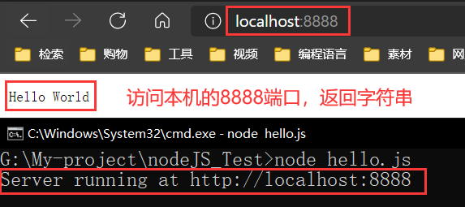

- 第一行请求（require）Node.js 自带的 http 模块，并且把它赋值给 http 变量。
- 接下来我们调用 http 模块提供的函数： createServer 。这个函数会返回 一个对象，这个对象有一个叫做 listen 的方法，这个方法有一个数值参数， 指定这个 HTTP 服务器监听的端口号。

## NPM

### 常用命令

打开解释器（类似于Python）：`node`

安装模块：`npm install <Moudle Name>`

+ 加上`-g`就变成全局安装，如`npm install express  -g`

引入包：`var express = require('express');`

查看模块版本号：`npm list grunt`

卸载：`npm uninstall express`

更新包：`npm update express`

使用淘宝npm镜像：`npm install -g cnpm --registry=https://registry.npm.taobao.org`

清空NPM本地缓存：`npm cache clear`

### Package.json

- **name** - 包名。
- **version** - 包的版本号。
- **description** - 包的描述。
- **homepage** - 包的官网 url 。
- **author** - 包的作者姓名。
- **contributors** - 包的其他贡献者姓名。
- **dependencies** - 依赖包列表。如果依赖包没有安装，npm 会自动将依赖包安装在 node_module 目录下。
- **repository** - 包代码存放的地方的类型，可以是 git 或 svn，git 可在 Github 上。
- **main** - main 字段指定了程序的主入口文件，require('moduleName') 就会加载这个文件。这个字段的默认值是模块根目录下面的 index.js。
- **keywords** - 关键字

## 回调函数

Node.js 异步编程的直接体现就是回调。

异步编程依托于回调来实现，但不能说使用了回调后程序就异步化了。

回调函数在完成任务后就会被调用，Node 使用了大量的回调函数，Node 所有 API 都支持回调函数。

例如，我们可以一边读取文件，一边执行其他命令，在文件读取完成后，我们将文件内容作为回调函数的参数返回。这样在执行代码时就没有阻塞或等待文件 I/O 操作。这就大大提高了 Node.js 的性能，可以处理大量的并发请求。

回调函数一般作为函数的最后一个参数出现：

```javascript
function foo1(name, age, callback) { }
function foo2(value, callback1, callback2) { }
```

比如对下面这段代码：

```javascript
var fs = require("fs");

fs.readFile('input.txt', function (err, data) {
    if (err) return console.error(err);
    console.log(data.toString());
});

console.log("Running End");
```

执行结果如下，由于IO调用缓慢，先执行后面的打印，在反过来执行读取函数

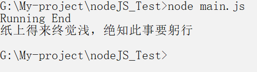

## 事件EventEmitter

操作分下面三步：

1.引入模块，创建eventEmitter对象

```javascript
var events = require('events');
var eventEmitter = new events.EventEmitter();
```

2.绑定事件

```javascript
eventEmitter.on('eventName', eventHandler);
```

3.触发事件

```javascript
eventEmitter.emit('eventName');
```

实例：

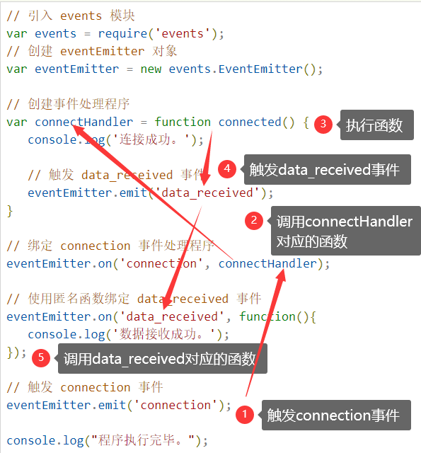

`EventEmitter`事件使用：

```javascript
var events = require('events'); 
var emitter = new events.EventEmitter();
emitter.on('someEvent', function(arg1, arg2) { 
    console.log('listener1', arg1, arg2); 
}); 
emitter.on('someEvent', function(arg1, arg2, arg3) { 
    console.log('listener2', arg1, arg2, arg3); 
}); 
emitter.on('someEvent', function(arg2) { 
    console.log('listener3', arg2); 
}); 
emitter.emit('someEvent', '呵呵', '嘿嘿'); 
```

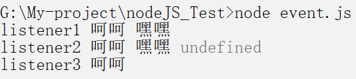

listener1中：传入两个参数刚好对应上arg1和arg2

listener2中：arg3没有对应的参数，所以是undefined

listener3中：传入一个参数，自动按照顺序匹配事件的第一个参数，arg2="呵呵"

方法：

`on`：注册监听器

`once`：注册一次性监听器

`emit`：触发监听器

`removeListener`：移除监听器

`removeAllListeners`：移除所有监听器

类方法：

`listenerCount`：返回监听器数量

```javascript
var eventEmitter = new events.EventEmitter();
var eventListeners = eventEmitter.listenerCount('connection');
```

# 二、模块系统

## 模式系统

### module.exports

`hello.js`：

```javascript
var Hello = function f() { 
    var name; 
    this.setName = function(thyName) { 
        name = thyName; 
    }; 
    this.sayHello = function() { 
        console.log('Hello ' + name); 
    }; 
}; 
module.exports = Hello;
```

`main.js`：

```javascript
var Hello = require('./hello'); 
hello = new Hello(); 
hello.setName('BYVoid'); 
hello.sayHello(); 
```

### ES6模块规范

```javascript
// 写法一
export var m = 1;

// 写法二
var m = 1;
export {m};

// export-default.js
export default function () {
  console.log('foo');
}
```

## 函数做参数传递

```javascript
function say(word) {
  console.log("say函数"+word+"O(∩_∩)O哈哈~");
}

function execute(someFunction, value) {
  someFunction(value+"world");
}

execute(say, "Hello");
```

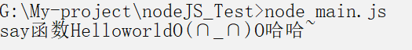

## 全局对象

```javascript
console.log( __filename );
console.log( __dirname );
```

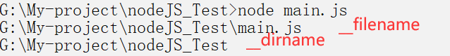

```javascript
function printHello(){
   console.log( "Hello, World!");
}
// 两秒后执行以上函数
var t = setTimeout(printHello, 2000);
// 每过两秒执行以上函数
setInterval(printHello, 2000);

// 清除定时器，让setTimeout失效
clearTimeout(t);
```

## 工具util

```javascript
// 引入工具包
const util = require('util');
```

+ `util.callbackify(original)`：将 `async` 异步函数转换成遵循异常优先的回调风格的函数

+ `util.inherits(constructor, superConstructor)`：是一个实现对象间原型继承的函数。

+ `util.inspect(object,[showHidden],[depth],[colors])`：是一个将任意对象转换 为字符串的方法，通常用于调试和错误输出。它至少接受一个参数 object，即要转换的对象。

+ `util.isArray(object)`：如果给定的参数 "object" 是一个数组返回 true，否则返回 false。
+ `util.isRegExp(object)`：如果给定的参数 "object" 是一个正则表达式返回true，否则返回false。
+ `util.isDate(object)`：如果给定的参数 "object" 是一个日期返回true，否则返回false。

# 三、Web

## GET/POST请求

### GET

```javascript
var http = require('http');
var url = require('url');
var util = require('util');
 
http.createServer(function(req, res){
    res.writeHead(200, {'Content-Type': 'text/plain'});
 
    // 解析 url 参数
    var params = url.parse(req.url, true).query;
    res.write("网站名：" + params.name);
    res.write("\n");
    res.write("网站 URL：" + params.url);
    res.end();
 
}).listen(3000);
```

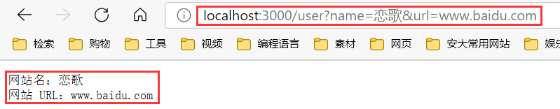

### POST

```javascript
var http = require('http');
var querystring = require('querystring');
 
var postHTML = 
  '<html><head><meta charset="utf-8"><title>菜鸟教程 Node.js 实例</title></head>' +
  '<body>' +
  '<form method="post">' +
  '网站名： <input name="name"><br>' +
  '网站 URL： <input name="url"><br>' +
  '<input type="submit">' +
  '</form>' +
  '</body></html>';
 
http.createServer(function (req, res) {
  var body = "";
  req.on('data', function (chunk) {
    body += chunk;
  });
  req.on('end', function () {
    // 解析参数
    body = querystring.parse(body);
    // 设置响应头部信息及编码
    res.writeHead(200, {'Content-Type': 'text/html; charset=utf8'});
 
    if(body.name && body.url) { // 输出提交的数据
        res.write("网站名：" + body.name);
        res.write("<br>");
        res.write("网站 URL：" + body.url);
    } else {  // 输出表单
        res.write(postHTML);
    }
    res.end();
  });
}).listen(3000);
```

提交前的输入：

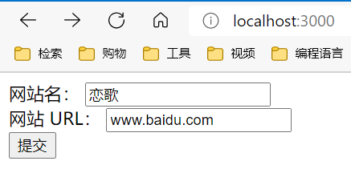

提交后：

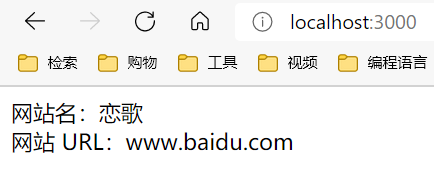

## Web模块


- **Client** - 客户端，一般指浏览器，浏览器可以通过 HTTP 协议向服务器请求数据。
- **Server** - 服务端，一般指 Web 服务器，可以接收客户端请求，并向客户端发送响应数据。
- **Business** - 业务层， 通过 Web 服务器处理应用程序，如与数据库交互，逻辑运算，调用外部程序等。
- **Data** - 数据层，一般由数据库组成。

### Node 创建 Web 服务器

以下是演示一个最基本的HTTP服务器架构(使用 8080 端口)，创建`server.js`文件

```javascript
var http = require('http');
var fs = require('fs');
var url = require('url');
 
// 创建服务器
http.createServer( function (request, response) {  
   // 解析请求，包括文件名
   var pathname = url.parse(request.url).pathname;
   // 从文件系统中读取请求的文件内容
   fs.readFile(pathname.substr(1), function (err, data) {
      if (err) {
         console.log(err);
         // HTTP 状态码: 404 : NOT FOUND
         // Content Type: text/html
         response.writeHead(404, {'Content-Type': 'text/html'});
      }else{             
         response.writeHead(200, {'Content-Type': 'text/html'});    
         // 响应文件内容
         response.write(data.toString());        
      }
      //  发送响应数据
      response.end();
   });   
}).listen(8080);
```

另外新建一个`index.html`文件，随便写点东西，让其可被访问

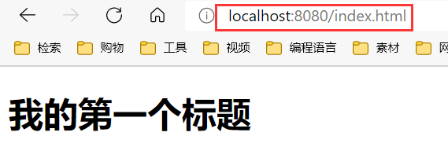

### Node 创建 Web 客户端

```javascript
var http = require('http');
 
// 用于请求的选项
var options = {
   host: 'localhost',
   port: '8080',
   path: '/index.html'  
};
 
// 处理响应的回调函数
var callback = function(response){
   // 不断更新数据
   var body = '';
   response.on('data', function(data) {
      body += data;
   });
   
   response.on('end', function() {
      // 数据接收完成
      console.log(body);
   });
}
// 向服务端发送请求
var req = http.request(options, callback);
req.end();
```

先启动`server.js`，再启动`client.js`服务：

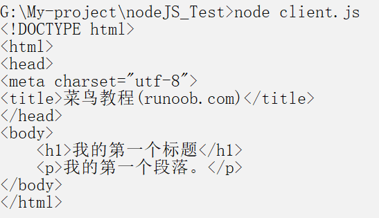

## Express框架

安装：`cnpm install express --save`

查看下 express 使用的版本号：`cnpm list express`

### Hello,Express

```javascript
//express_demo.js 文件
var express = require('express');
var app = express();
 
app.get('/', function (req, res) {
   res.send('Hello,Express');
})
 
var server = app.listen(8081, 'localhost', function () {
 
  var host = server.address().address
  var port = server.address().port
 
  console.log("应用实例，访问地址为 http://%s:%s", host, port)
 
})
```

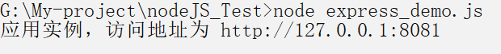

## 请求和响应

Express 应用使用回调函数的参数： **request** 和 **response** 对象来处理请求和响应的数据。

```javascript
app.get('/', function (req, res) {
   // --
})
```

**request** 和 **response** 对象的具体介绍：

**Request 对象** - request 对象表示 HTTP 请求，包含了请求查询字符串，参数，内容，HTTP 头部等属性。常见属性有：

1. req.app：当callback为外部文件时，用req.app访问express的实例
2. req.baseUrl：获取路由当前安装的URL路径
3. req.body / req.cookies：获得「请求主体」/ Cookies
4. req.fresh / req.stale：判断请求是否还「新鲜」
5. req.hostname / req.ip：获取主机名和IP地址
6. req.originalUrl：获取原始请求URL
7. req.params：获取路由的parameters
8. req.path：获取请求路径
9. req.protocol：获取协议类型
10. req.query：获取URL的查询参数串
11. req.route：获取当前匹配的路由
12. req.subdomains：获取子域名
13. req.accepts()：检查可接受的请求的文档类型
14. req.acceptsCharsets / req.acceptsEncodings / req.acceptsLanguages：返回指定字符集的第一个可接受字符编码
15. req.get()：获取指定的HTTP请求头
16. req.is()：判断请求头Content-Type的MIME类型

**Response 对象** - response 对象表示 HTTP 响应，即在接收到请求时向客户端发送的 HTTP 响应数据。常见属性有：

1. res.app：同req.app一样
2. res.append()：追加指定HTTP头
3. res.set()在res.append()后将重置之前设置的头
4. res.cookie(name，value [，option])：设置Cookie
5. opition: domain / expires / httpOnly / maxAge / path / secure / signed
6. res.clearCookie()：清除Cookie
7. res.download()：传送指定路径的文件
8. res.get()：返回指定的HTTP头
9. res.json()：传送JSON响应
10. res.jsonp()：传送JSONP响应
11. res.location()：只设置响应的Location HTTP头，不设置状态码或者close response
12. res.redirect()：设置响应的Location HTTP头，并且设置状态码302
13. res.render(view,[locals],callback)：渲染一个view，同时向callback传递渲染后的字符串，如果在渲染过程中有错误发生next(err)将会被自动调用。callback将会被传入一个可能发生的错误以及渲染后的页面，这样就不会自动输出了。
14. res.send()：传送HTTP响应
15. res.sendFile(path [，options] [，fn])：传送指定路径的文件 -会自动根据文件extension设定Content-Type
16. res.set()：设置HTTP头，传入object可以一次设置多个头
17. res.status()：设置HTTP状态码
18. res.type()：设置Content-Type的MIME类型

## 路由

```javascript
var express = require('express');
var app = express();
 
//  主页输出 "Hello World"
app.get('/', function (req, res) {
   console.log("主页 GET 请求");
   res.send('Hello GET');
})
 
 
//  POST 请求
app.post('/', function (req, res) {
   console.log("主页 POST 请求");
   res.send('Hello POST');
})
 
//  /del_user 页面响应
app.get('/del_user', function (req, res) {
   console.log("/del_user 响应 DELETE 请求");
   res.send('删除页面');
})
 
//  /list_user 页面 GET 请求
app.get('/list_user', function (req, res) {
   console.log("/list_user GET 请求");
   res.send('用户列表页面');
})
 
// 对页面 abcd, abxcd, ab123cd, 等响应 GET 请求
app.get('/ab*cd', function(req, res) {   
   console.log("/ab*cd GET 请求");
   res.send('正则匹配');
})
 
 
var server = app.listen(8081, function () {
 
  var host = server.address().address
  var port = server.address().port
 
  console.log("应用实例，访问地址为 http://%s:%s", host, port)
 
})
```


