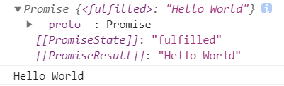

# 为何会有Promise？

根据这篇文章： [深入理解JS事件循环机制](深入理解JS事件循环机制.md)知道，Promise、Generator、async/await都是为了实现异步编程

传统方式是通过回调函数、事件监听、发布订阅模式实现的，Promise的出现大大丰富了异步编程的实现。

# Promise的三种状态


Promise译作承诺，**这个承诺一旦从等待状态变成为其他状态就永远不能更改状态了**，比如说一旦状态变为 resolved 后，就不能再次改变为Fulfilled。

# Promise的常规使用

## 承诺-兑现承诺结构

承诺：

`resolve(value)`：如果任务成功完成并带有结果 value。

`reject(error)`：如果出现了 error，error 即为 error 对象。

```js
let promise = new Promise(function(resolve, reject) {
    // executor（生产者代码）
});
```

`new Promise(arg)`里面的参数arg是生成者执行的函数

兑现承诺：

`.then()`：

- `.then`的第一个参数是一个函数，该函数将在`promise resolved`后运行并接收结果。
- `.then`的第二个参数也是一个函数，该函数将在`promise rejected`后运行并接收error。

`.catch()`：捕捉错误

`.finally()`：最后执行

## 例子

如下面这个加载脚本的函数，加载过程较慢，因此需要将它封装成异步函数

使用回调函数的形式：

```js
function loadScript(src, callback) {
    // 创建DOM结点
    let script = document.createElement('script');
    script.src = src;
    // onload事件在资源被加载完成后会被触发
    script.onload = () => {
        callback(script);
    }
    // 插入DOM结点
    document.head.append(script);
}

loadScript('https://cdnjs.cloudflare.com/ajax/libs/lodash.js/3.2.0/lodash.js', script => {
    console.log(`Cool, the script ${script.src} is loaded`);
});
```

调用loadScript函数，传入src和一个回调函数callback，在loadScript内部调用箭头函数，打印`script.src`信息

---

使用Promise形式：

```js
function loadScript(src) {
    return new Promise(function (resolve, reject) {
        let script = document.createElement('script');
        script.src = src;

        script.onload = () => resolve(script);
        script.onerror = () => reject(new Error(`Script load error for ${src}`));

        document.head.append(script);
    });
}
let promise = loadScript("https://cdnjs.cloudflare.com/ajax/libs/lodash.js/4.17.11/lodash.js");
promise.then(
    script => alert(`${script.src} is loaded!`),
    error => alert(`Error: ${error.message}`)
);
promise.then(script => alert('Another handler...'));
```

调用loadScript函数，传入src，返回一个Promise对象，资源加载完成后触发onload函数，`resolve(script)`加载失败，然后执行到`reject()`，兑现承诺结构中获取错误信息，执行`error => {}`

# Promise链条


# Promise API

## Promise.all(与逻辑)

```js
let getInfoA = new Promise((resolve, reject) => {
    console.log('小A开始执行了')
    resolve()
})
let getInfoB = new Promise((resolve, reject) => {
    console.log('小B开始执行了')
    resolve()
})
let getInfoC = new Promise((resolve, reject) => {
    console.log('小C开始执行了')
    resolve()
})
// 数组的每一项都是Promise对象
Promise.all([getInfoA, getInfoB, getInfoC]).then(res => {
   console.log('全都执行完了！')
})
```

请注意，结果数组中元素的顺序与其在源 promise 中的顺序相同。即使第一个 promise 花费了最长的时间才 resolve，但它仍是结果数组中的第一个。

如果任意一个promise被reject，由`Promise.all`返回的promise就会立即reject，并且带有的就是这个 error。

## Promise.race(或逻辑)

```js
let getInfoA = new Promise((resolve, reject) => {
    console.log('小A开始执行了')
    setTimeout((err => {
        resolve('小A最快')
    }),1000)
})
let getInfoB = new Promise((resolve, reject) => {
    console.log('小B开始执行了')
    setTimeout((err => {
        resolve('小B最快')
    }),1001)
})
let getInfoC = new Promise((resolve, reject) => {
    console.log('小C开始执行了')
    setTimeout((err => {
        resolve('小C最快')
    }),1002)
})
// 数组的每一项都是Promise对象，有一项执行完成后就调用
Promise.race([getInfoA, getInfoB, getInfoC]).then(res => {
    console.log(res)
})

/*
小A开始执行了
小B开始执行了
小C开始执行了
小A最快
*/
```

与Promise.all相似的是，Promise.race都是**以一个Promise对象组成的数组**作为参数，不同的是，只要当数组中的其中一个Promsie状态变成resolved或者rejected时，就可以调用.then方法了。

## Promise.allSettled(都结束)

```js
let urls = [
    'https://api.github.com/users/iliakan',
    'https://api.github.com/users/remy',
    'https://no-such-url'
];
Promise.allSettled(urls.map(url => fetch(url)))
    .then(results => {
    results.forEach((result, num) => {
        if (result.status == "fulfilled") {
            alert(`${urls[num]}: ${result.value.status}`);
        }
        if (result.status == "rejected") {
            alert(`${urls[num]}: ${result.reason}`);
        }
    });
});
```

`Promise.allSettled(args,callback)`是等到所有Promise都结束后才使用其回调函数

# async/await

## async

- 让这个函数总是返回一个promise
- 运行在该函数内使用await

```js
async function f() {
    return 'Hello World';
}
const promise = f();
console.log(promise);
promise.then(console.log);
```



## await

关键字 `await` 让 JavaScript 引擎等待直到 promise 完成（settle）并返回结果。

```js
async function f() {
    let promise = new Promise((resolve, reject) => {
        setTimeout(() => resolve("done!"), 1000)
    });
    let result = await promise; // 等待，直到promise resolve(*)
    alert(result); // "done!"
}
f();
```

