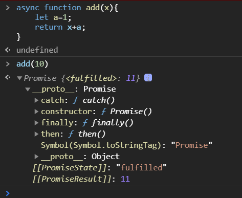

# async/await

## async function

- 自动将常规函数转换成Promise，返回值也是一个Promise对象
- 只有`async`函数内部的异步操作执行完，才会执行then方法指定的回调函数
- 异步函数内部可以使用`await`



```js
async function name([param[, param[, ... param]]]) { statements }
```

name：函数名称。
param：要传递给函数的参数的名称
statements：函数体语句。
返回值：返回的Promise对象会以`async function`的返回值进行解析，或者以该函数抛出的异常进行回绝。

## await

await 放置在Promise调用之前，await 强制后面点代码等待，直到Promise对象resolve，得到resolve的值作为await表达式的运算结果

await只能在`async`函数内部使用，用在普通函数里就会报错。

```js
[return_value] = await expression;
```

expression： 一个 Promise  对象或者任何要等待的值。
返回值：返回 Promise 对象的处理结果。如果等待的不是 Promise 对象，则返回该值本身。

## 使用场景

多个await命令的异步操作，如果不存在依赖关系（后面的await不依赖前一个await返回的结果），用`Promise.all()`让它们同时触发

```js
function test1 () {
    return new Promise((resolve, reject) => {
        setTimeout(() => {
            resolve(1)
        }, 1000)
    })
}

function test2 () {
    return new Promise((resolve, reject) => {
        setTimeout(() => {
            resolve(2)
        }, 2000)
    })
}

async function exc1 () {
    console.log('exc1 start:',Date.now())
    let res1 = await test1();
    let res2 = await test2(); // 不依赖 res1 的值
    console.log('exc1 end:', Date.now())
}

async function exc2 () {
    console.log('exc2 start:',Date.now())
    let [res1, res2] = await Promise.all([test1(), test2()])
    console.log('exc2 end:', Date.now())
}

exc1();
exc2();
```

exc1 的两个并列await的写法，比较耗时，只有test1执行完了才会执行test2

你可以在浏览器的Console里尝试一下，会发现exc2的用`Promise.all`执行更快一些

# property

设置 `Vue.prototype.$http` 为 `axios` 的别名：

```js
Vue.prototype.$http = axios
```

然后你就可以在任何 Vue 实例中使用类似 `this.$http.get` 的方法：

```js
new Vue({
  el: '#app',
  data: {
    users: []
  },
  created () {
    var vm = this
    this.$http
      .get('https://jsonplaceholder.typicode.com/users')
      .then(function (response) {
        vm.users = response.data
      })
  }
})
```

# slot-scope="scope"

这是作用域插槽，如下：

```vue
<el-table-column label="精品图片" width="180">
    <template slot-scope="scope">
		<el-image style="width: 100px; height: 100px" :src="scope.row.designDrawing" :preview-src-list="[scope.row.designDrawing]"></el-image>
    </template>
</el-table-column>
```

`<template></template>`内的代码插入到了表单的`designDrawing`字段下

用法见官网：https://element.eleme.cn/#/zh-CN/component/table

# 回调函数

回调函数：回调函数就是一个通过函数指针调用的函数。如果你把函数的指针（地址）作为参数传递给另一个函数，当这个指针被用为调用它所指向的函数时，我们就说这是回调函数。

在JavaScript中，回调函数具体的定义为：函数A作为参数(函数引用)传递到另一个函数B中，并且这个函数B执行函数A。我们就说函数A叫做回调函数。如果没有名称(函数表达式)，就叫做匿名回调函数。

```js
function a(callback) {
    callback(1,2)
}
a(function (a,b) { // 匿名回调函数
    console.log(a*b) // 2
})
```

```js
function fn(callback) {
  setTimeout(function () {
    var data = 'hello'
    callback(data)
  }, 1000)
}

// 如果需要获取一个函数中异步操作的结果，则必须通过回调函数来获取
fn(function (data) {
  console.log(data) // 一秒后打印 hello
})
```

# Attribute、Event、Method

Attribute最好区分，如下：

```vue
<el-table-column prop="houseId" label="houseId" width="180"></el-table-column>
```

prop、label、width都是属性

