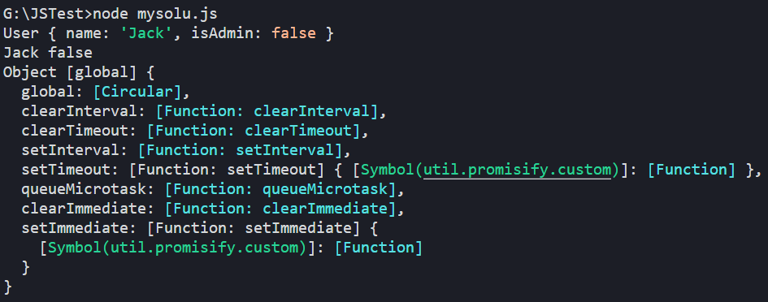
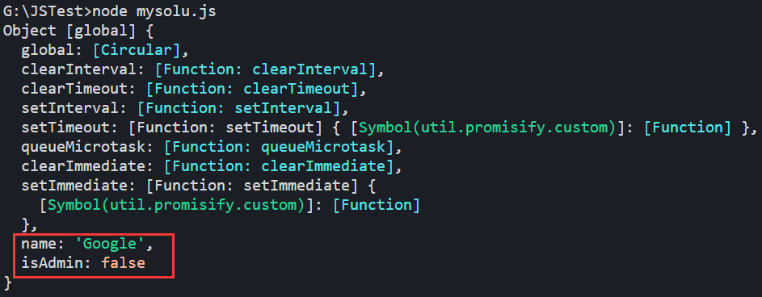
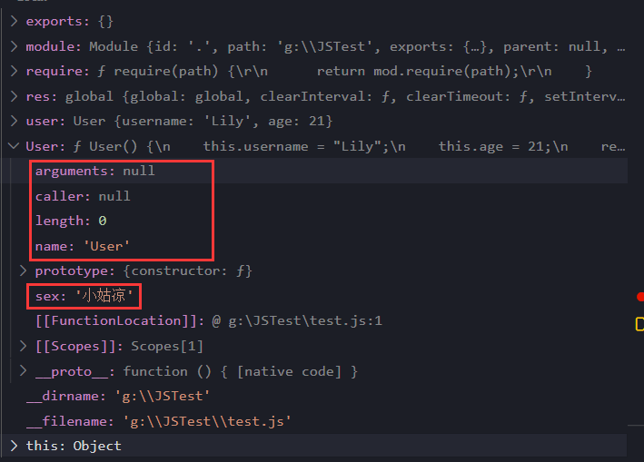
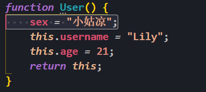
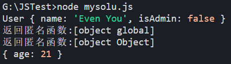
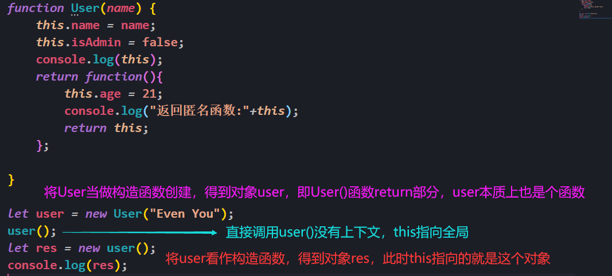

# 普通函数和构造函数的区别

```js
// 构造器的使用方法
function User(name) {
    // this = {};（隐式创建）
    // 给构造器添加属性
    this.name = name;
    this.isAdmin = false;
    console.log(this);
    // return this;（隐式返回）
}
// 给User本身附加sex属性
User.sex = "小姑凉";
function Admin() {
    console.log(this);
}
let user = new User("Jack");
console.log(user.name + " "+user.isAdmin);
Admin();
```

输出：



在上面中User()构造函数，但Admin()是普通函数，**区别看它是直接调用还是new出来**

+ 直接调用，this指向全局
+ new，这时候当做构造函数，this指向new出来的对象

```js
// this指向全局，因此这里是给全局附加name和isAdmin
function User(name) {
    this.name = name;
    this.isAdmin = false;
    console.log(this);
}
User("Google");
```



# 函数属性与构造属性区别

```js
function User() {
    this.username = "Lily";
    this.age = 21;
    return this;
}

User.sex = "小姑凉";

let res = User();
console.log(res);

let user = new User();
console.log(user)
```

这段代码中：

- `User.sex = "小姑凉";`是函数属性
- `this.username = "Lily";`是构造属性

直接调用`User()`，this指向全局，这时给this指向的全局附加`    this.username = "Lily"; this.age = 21;`，返回this

`new User()`调用，this指向User，附加属性后返回this

整个过程中sex并没有参与，那到哪去了？



从图中可以看出，sex变成了和arguments、caller、name、prototype一类的属性，那么访问方式就相同了：

```js
console.log(User.name+" "+User.sex);
```

还有一种写法，如下：



这种写法啥反应都没有，也不是局部变量，是冗余代码

# 构造函数与闭包

```js
function User(name) {
    this.name = name;
    this.isAdmin = false;
    console.log(this);
    return function(){
        this.age = 21;
        console.log("返回匿名函数:"+this);
        return this;
    };

}

let user = new User("Even You");
user(); // 不new对象，直接调用函数
let res = new user(); // new对象方式调用函数
console.log(res);
```

上面这段代码运行结果如下：



代码执行：



# 函数绑定问题

```js
let user = {
    firstName: "John",
    sayHi() {
        console.log(`Hello,${this.firstName}`);
    }
}

user.sayHi(); 	// Hello,John
setTimeout(user.sayHi, 1000); 	// Hello,undefined
```

浏览器中的 `setTimeout` 方法有些特殊：它为函数调用设定了 `this=window`。因此无法获得`this.firstName`

**解决方案一：包装器**

```js
setTimeout(function () {
    user.sayHi();
}, 1000); 	// Hello,John
```

**解决方案二：bind**

使用bind手动绑定this的对象

```js
setTimeout(user.sayHi.bind(user), 1000); 	// Hello,John
```

# 数组、普通对象、类数组对象和可迭代对象

数组和普通对象就很熟悉了，下面给出另外两个的定义

类数组对象：

1. 拥有length属性，其他属性为非负整数字符串（因为对象使用[]来取值，会将数值隐式转换为字符串）
2. 不具有数组具有的方法，即原型链上没有`Array.prototype`

可迭代对象：这个对象的`Symbol.iterator`是个函数，并且有配套的`next()`函数

```js
// 数组
let arr = ['hello', 'world'];
// 对象
let obj = {
    0: 'hello',
    1: 'world',
    'exam': 'computer'
}
// 类数组对象
let arrLike = {
    length: 4,
    0: 'hello',
    1: 'world',
    'exam': 'computer',
    3: 'third'
}
// 可迭代对象
let set = new Set([1, 2, 2, 3, 3, 5, 'hh']);
// 查看是否可以迭代
const isIterable = function(obj) {
    return obj != null && typeof obj[Symbol.iterator] === 'function';
}
console.log(isIterable(arr));       // true
console.log(isIterable(obj));       // false
console.log(isIterable(arrLike));   // false
console.log(isIterable(set));       // true
// 判断是否有length属性
console.log(arr.length);        // 2
console.log(obj.length);        // undefined
console.log(arrLike.length);    // 4
console.log(set.length);        // undefined
// 判断是否有size属性
console.log(arr.size);        // undefined
console.log(obj.size);        // undefined
console.log(arrLike.size);    // undefined
console.log(set.size);        // 5
```

| 对象种类   | 是否可迭代 | 是否有length属性 | 是否有size属性 | 原型链             |
| ---------- | ---------- | ---------------- | -------------- | ------------------ |
| 数组       | √          | √                | ×              | Array、Object      |
| 普通对象   | ×          | ×                | ×              | Object             |
| 类数组对象 | ×          | √                | ×              | Object             |
| 可迭代对象 | √          | ×                | √              | Set（Map）、Object |

> 原型链上有Array，就说明可以用push、pop、shift、unshift等方法

---

可以用`Array.from()`将类数组对象和可迭代对象转换为数组

- 可迭代对象：调用迭代器将结果装入到一个数组中
- 类数组对象：取属性装入到数组

```js
let arrayLike = {
    0: "Hello",
    1: "World",
    length: 2
};

console.log(arrayLike); // { '0': 'Hello', '1': 'World', length: 2 }
let arr = Array.from(arrayLike);
console.log(arr); // [ 'Hello', 'World' ]
```

