# 一、CSS属性

## 单位

绝对单位：1 `in`=2.54`cm`=25.4`mm`=72`pt`=6`pc`。

+ in：英寸
+ pt：点Points
+ pc：皮卡

相对单位：

+ px：像素
+ em：印刷单位
+ %：百分比，相对周围的

## 字体属性

| CSS代码                      | 作用                                     |
| ---------------------------- | ---------------------------------------- |
| `font-size: 50px`            | 字号                                     |
| `font-family: 楷体,黑体`     | 字体：如果没有楷体就黑体，没有黑体就默认 |
| `font-style: italic`         | italic表示斜体，normal表示不倾斜         |
| `font-weight: bold;`         | 粗体                                     |
| `font-variant: small-caps;`  | 小写变大写                               |
| `font: 加粗 字号/行高/ 字体` | 字体组合                                 |
| `line-height: 30px`          | 行高                                     |
| `vertical-align: middle`     | 对齐，top、middle、bottom                |

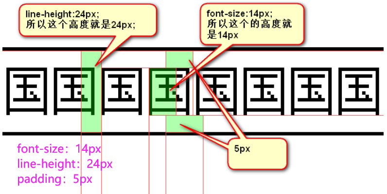

## 文本属性

| CSS代码                      | 作用                                                         |
| ---------------------------- | ------------------------------------------------------------ |
| `letter-spacing: 0.5cm ;`    | 单个字母之间的间距                                           |
| `word-spacing: 1cm;`         | 单词之间的间距                                               |
| `text-decoration: none;`     | 字体修饰：none 去掉下划线、**underline 下划线**、line-through 中划线、overline 上划线 |
| `text-transform: lowercase;` | 单词字体大小写。uppercase大写、lowercase小写                 |
| `color:red;`                 | 字体颜色                                                     |
| `text-align: center;`        | 在当前容器中的对齐方式。属性值可以是：left、right、center（**在当前容器的中间**）、justify |
| `text-transform: lowercase;` | 单词的字体大小写。属性值可以是：`uppercase`（单词大写）、`lowercase`（单词小写）、`capitalize`（每个单词的首字母大写） |

## 列表属性

| CSS代码                                | 作用                 |
| -------------------------------------- | -------------------- |
| `list-style-image:url(images/2.gif) ;` | 当前列表项设置为图片 |

## overflow属性

`overflow`属性的属性值可以是：

- `visible`：默认值。多余的内容不剪切也不添加滚动条，会全部显示出来。
- `hidden`：不显示超过对象尺寸的内容。
- `auto`：如果内容不超出，则不显示滚动条；如果内容超出，则显示滚动条。
- `scroll`：Windows 平台下，无论内容是否超出，总是显示滚动条。Mac 平台下，和 `auto` 属性相同。

```html
<div id="div1">其实很简单 其实很自然 两个人的爱由两人分担 其实并不难 是你太悲观 隔着一道墙不跟谁分享 不想让你为难 你不再需要给我个答案</div>
<div id="div2">其实很简单 其实很自然 两个人的爱由两人分担 其实并不难 是你太悲观 隔着一道墙不跟谁分享 不想让你为难 你不再需要给我个答案</div>
<div id="div3">其实很简单 其实很自然 两个人的爱由两人分担 其实并不难 是你太悲观 隔着一道墙不跟谁分享 不想让你为难 你不再需要给我个答案</div>
```

```css
div{
    width: 100px;
    height: 100px;
    background-color: #00cc66;
    margin-right: 100px;
    float: left;
}
#div1{
    overflow: auto;/*超出的部分让浏览器自行解决*/
}
#div2{
    overflow: visible;/*超出的部分会显示出来*/
}
#div3{
    overflow: hidden;/*超出的部分将剪切掉*/
}
```

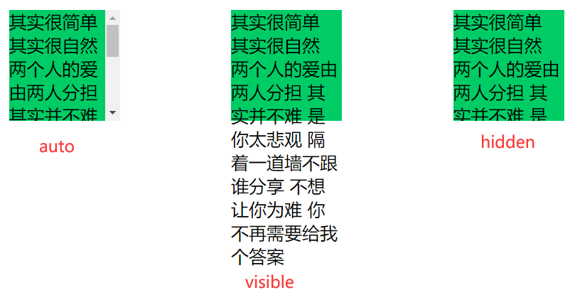

## 背景属性

### 性质提纲

CSS2.1：

- `background-color:#ff99ff;` 设置元素的背景颜色。
- `background-image:url(images/2.gif);` 将图像设置为背景。
- `background-repeat: no-repeat;` 设置背景图片是否重复及如何重复，默认平铺满。（重要）
  - `no-repeat`不要平铺；
  - `repeat-x`横向平铺；
  - `repeat-y`纵向平铺。
- `background-position:center top;` 设置背景图片在当前容器中的位置。
- `background-attachment:scroll;` 设置背景图片是否跟着滚动条一起移动。 属性值可以是：`scroll`（与fixed属性相反，默认属性）、`fixed`（背景就会被固定住，不会被滚动条滚走）。
- 另外还有一个综合属性叫做`background`，它的作用是：将上面的多个属性写在一个声明中。

CSS3：

- background-origin
- background-clip 背景裁切
- background-size 调整尺寸
- 多重背景

### background-color

1.英文单词

2.RGB和RGBA

```css
background-color: rgb(255,0,0);	/*红色*/
background-color: rgba(0,0,255,0.3); /*Red 红、Green 绿、Blue 蓝、Alpha透明度*/
```

3.十六进制

```css
background-color: #ff0000; /*等于rgb(255,0,0)*/
```

几种常见颜色可以记住：

```
#000   黑
#fff   白
#f00   红
#222   深灰
#333   灰
#ccc   浅灰
```

4.HSLA

```css
background-color: hsla(240,50%,50%,0.4);
```

- `H` 色调，取值范围 0~360。0或360表示红色、120表示绿色、240表示蓝色。
- `S` 饱和度，取值范围 0%~100%。值越大，越鲜艳。
- `L` 亮度，取值范围 0%~100%。亮度最大时为白色，最小时为黑色。
- `A` 透明度，取值范围 0~1。

### background-repeat

`background-repeat:no-repeat;`设置背景图片是否重复及如何重复，默认平铺满。属性值可以是：

- `no-repeat`（不要平铺）
- `repeat-x`（横向平铺）
- `repeat-y`（纵向平铺）

### background-position

1.用像素值描述属性值

```css
background-position:向右偏移量 向下偏移量; /*属性值可以是负数*/
```

2、用单词描述属性值

```css
background-position: 描述左右的词 描述上下的词;
```

- 描述左右的词：left、center、right
- 描述上下的词：top 、center、bottom

### background-attachment 

- `background-attachment:scroll;`：设置背景图片是否固定。属性值可以是：
  - `fixed`（背景就会被固定住，不会被滚动条滚走）。
  - `scroll`（与fixed属性相反，默认属性）

### 综合属性

```css
/*color  image  repeat  position  attachment*/
background:red url(1.jpg) no-repeat 100px 100px fixed;
```

### background-size

```css
/* 宽、高的具体数值 */
background-size: 500px 500px;
/* 宽高的百分比（相对于容器的大小） */
background-size: 50% 50%;   // 如果两个属性值相同，可以简写成：background-size: 50%;
background-size: 100% auto;  //这个属性可以自己试验一下。
/* cover：图片始终填充满容器，且保证长宽比不变。图片如果有超出部分，则超出部分会被隐藏。 */
background-size: cover;
/* contain：将图片完整地显示在容器中，且保证长宽比不变。可能会导致容器的部分区域为空白。  */
background-size: contain;
```

!> 这里注意cover和contain的区别

### background-origin

控制背景从什么地方开始显示。

```css
/* 从 padding-box 内边距开始显示背景图，默认值 */
background-origin: padding-box;
/* 从 border-box 边框开始显示背景图  */
background-origin: border-box;
/* 从 content-box 内容区域开始显示背景图  */
background-origin: content-box;
```

### background-clip

`background-clip: content-box;` 超出的部分，将裁剪掉。属性值可以是：

- `border-box` 超出 border-box 的部分，将裁剪掉
- `padding-box` 超出 padding-box 的部分，将裁剪掉
- `content-box` 超出 content-box 的部分，将裁剪掉

假设现在有这样的属性设置：

```css
background-origin: border-box;
background-clip: content-box;
```

上方代码的意思是，背景图片从**边框部分**开始加载，但是呢，超出**内容区域**的部分将被裁减掉。

### background-image 渐变

1.线性渐变

```css
background-image: linear-gradient(方向, 起始颜色, 终止颜色);
```

方向可以是：`to left`、`to right`、`to top`、`to bottom`、角度`30deg`（指的是顺时针方向30°）。

```html
<!DOCTYPE html>
<html>
<head lang="en">
    <meta charset="UTF-8">
    <title></title>
    <style>
        div {
            width: 500px;
            height: 100px;
            margin: 10px auto;
            border: 1px solid #000;
        }
        /* 0%的位置开始出现黄色，40%的位置开始出现红色的过度。70%的位置开始出现绿色的过度，100%的位置开始出现蓝色 */
        div:nth-child(1) {
            background-image: linear-gradient(to right,
                    yellow 0%,
                    red 40%,
                    green 70%,
                    blue 100%);

        }

        /* 颜色之间，出现突变 */
        div:nth-child(2) {
            background-image: linear-gradient(45deg,
                    yellow 0%,
                    yellow 25%,
                    blue 25%,
                    blue 50%,
                    red 50%,
                    red 75%,
                    green 75%,
                    green 100%);
        }

        div:nth-child(3) {
            background-image: linear-gradient(to right,
                    #000 0%,
                    #000 25%,
                    #fff 25%,
                    #fff 50%,
                    #000 50%,
                    #000 75%,
                    #fff 75%,
                    #fff 100%);

        }
    </style>
</head>

<body>
    <div></div>
    <div></div>
    <div></div>
</body>

</html>
```

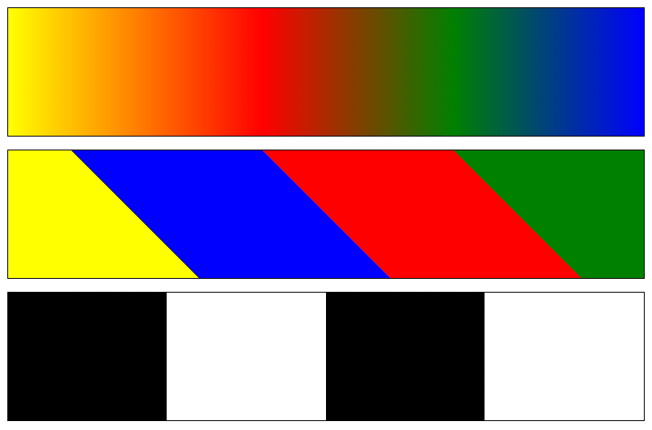

2.径向渐变

```css
background-image: radial-gradient(辐射的半径大小, 中心的位置, 起始颜色, 终止颜色);
```

解释：围绕中心点做渐变，半径是150px，从黄色到绿色做渐变。

中心点的位置可以是：at left right center bottom top。如果以像素为单位，则中心点参照的是盒子的左上角。

```html
<!DOCTYPE html>
<html>

<head lang="en">
    <meta charset="UTF-8">
    <title></title>
    <style>
        div {
            width: 250px;
            height: 250px;
            border: 1px solid #000;
            margin: 20px;
            float: left;
        }

        /*
            径向渐变：
            radial-gradient（辐射的半径大小, 中心的位置，起始颜色，终止颜色）;
            中心点位置：at  left  right  center bottom  top
        */

        /*辐射半径为100px，中心点在中间*/
        div:nth-child(1) {
            background-image: radial-gradient(100px at center, yellow, green);
        }

        /*中心点在左上角*/
        div:nth-child(3) {
            background-image: radial-gradient(at left top, yellow, green);
        }

        div:nth-child(2) {
            background-image: radial-gradient(at 50px 50px, yellow, green);
        }

        /*设置不同的颜色渐变*/
        div:nth-child(4) {
            background-image: radial-gradient(100px at center,
                    yellow 0%,
                    green 30%,
                    blue 60%,
                    red 100%);
        }

        /*如果辐射半径的宽高不同，那就是椭圆*/
        div:nth-child(5) {
            background-image: radial-gradient(100px 50px at center, yellow, green);
        }
    </style>
</head>

<body>
    <div class="box"></div>
    <div class="box"></div>
    <div class="box"></div>
    <div class="box"></div>
    <div class="box"></div>
</body>

</html>
```

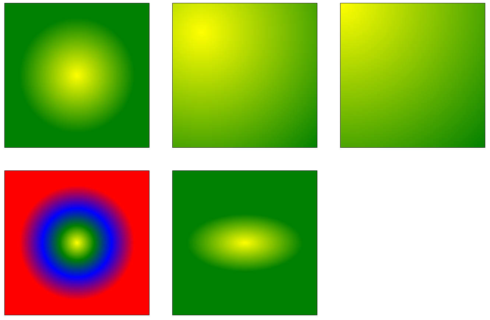

## 定位属性

### 相对定位

```html
<style type="text/css">
    body{
        margin: 0px;
    }
    .div1{
        width: 200px;
        height: 200px;
        border: 1px solid red;
    }
    .div2{
        /*相对定位*/
        position: relative;
        /*左边缘正向移动50px*/
        left: 50px;
        /*顶部边缘正向移动50px*/
        top: 50px;

        width: 200px;
        height: 200px;
        border: 1px solid red;
    }
</style>
<body>
	<div class="div1">有生之年</div>
	<div class="div2">狭路相逢</div>
 </body>
```

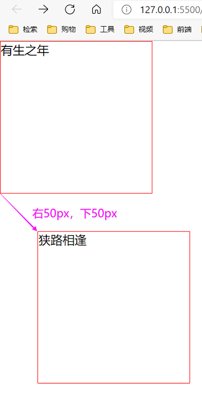

**相对定位**：不脱标，老家留坑，**别人不会把它的位置挤走**。

也就是说，相对定位的真实位置还在老家，只不过影子出去了，可以到处飘。

相对定位，就两个作用：

- 微调元素
- 做绝对定位的参考，子绝父相

相对定位的定位值：

- left：盒子左边缘移动
- right：盒子右边缘移动
- top：盒子顶部边缘移动
- bottom：盒子底部边缘移动

> 正：
>
> + 左边缘向右移，右边缘向左移
> + 上边缘向下移，下边缘向上移
>
> 负数时正好相反

### 绝对定位

**绝对定位的盒子脱离了标准文档流。**

所以，所有的标准文档流的性质，绝对定位之后都不遵守了。

绝对定位之后，标签就不区分所谓的行内元素、块级元素了，不需要`display:block`就可以设置宽、高了。

（1）如果用**top描述**，那么参考点就是**页面的左上角**，而不是浏览器的左上角：

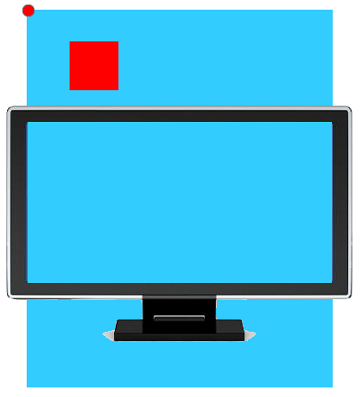

（2）如果用**bottom描述**，那么参考点就是**浏览器首屏窗口尺寸**（好好理解“首屏”二字），对应的页面的左下角：

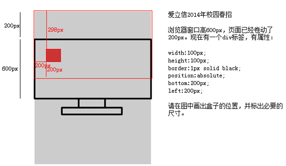

### 盒子套盒子

以下几点需要注意：

（1） 要听最近的已经定位的祖先元素的，不一定是父亲，可能是爷爷：

```html
<div class="box1">        相对定位
    <div class="box2">    没有定位
        <p></p>           绝对定位，将以box1为参考，因为box2没有定位，box1就是最近的父辈元素
    </div>
</div>
```

```html
<div class="box1">        相对定位
    <div class="box2">    相对定位
        <p></p>           绝对定位，将以box2为参考，因为box2是自己最近的父辈元素
    </div>
</div>

（2）“子绝父相”有意义：这样可以保证父亲没有脱标，儿子脱标在父亲的范围里面移动。于是，工程上经常这样做：父亲浮动，设置相对定位（零偏移），然后让儿子绝对定位一定的距离。

（3）绝对定位的儿子，无视参考的那个盒子的padding：

下图中，绿色部分是父亲div的padding，蓝色部分p是div的内容区域。此时，如果div相对定位，p绝对定位，那么， p将无视父亲的padding，在border内侧为参考点，进行定位：

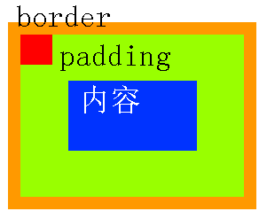

​```html
<style type="text/css">
    body{
        margin: 0px;
    }
    .div1{
        width: 300px;
        height: 300px;
        position: relative;
        left: 50px;
        top: 50px;
        border: 5px solid black;
    }
    .div2{
        width: 50px;
        height: 50px;
        position: relative;
        left: 50px;
        top: 50px;
        border: 5px solid red;
    }
    .div3{
        width: 50px;
        height: 50px;
        position: relative;
        left: 50px;
        top: 50px;
        border: 5px solid orchid;
    }
</style>
 <body>
	<div class="div1">
        <div class="div2"></div>
        <div class="div3"></div>
    </div>
 </body>
```

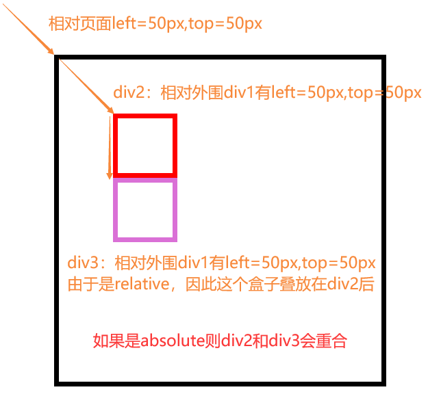

### 绝对定位的居中

`left:50%; margin-left:负的宽度的一半`

```css
div {
    width: 600px;
    height: 60px;
    position: absolute;  /*绝对定位的盒子*/
    left: 50%;           /*首先，让左边线居中*/
    top: 0;
    margin-left: -300px;  /*然后，向左移动宽度（600px）的一半8?
}
```

我们先让这个宽度为600px的盒子，左边线居中，然后向左移动宽度（600px）的一半，就达到效果了。

### 固定定位

**固定定位**：就是相对浏览器窗口进行定位。无论页面如何滚动，这个盒子显示的位置不变。

**用途1**：网页右下角的“返回到顶部”

**用途2：**顶部导航条

```css
.backtop{
    /*固定定位*/
    position: fixed;
    bottom: 100px;
    right: 30px;
    /*大小*/
    width: 60px;
    height: 60px;
    background-color: gray;
    text-align: center;
    line-height: 30px;
    color: white;
    text-decoration: none;   /*去掉超链接的下划线*/
}
```

### z-index

因为多个CSS效果可能覆盖，用z-index设置覆盖在上层还是下层，数字越大越在上层

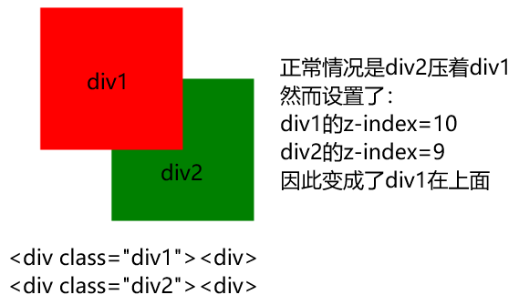

# 二、选择器

## 基本选择器

1.标签选择器

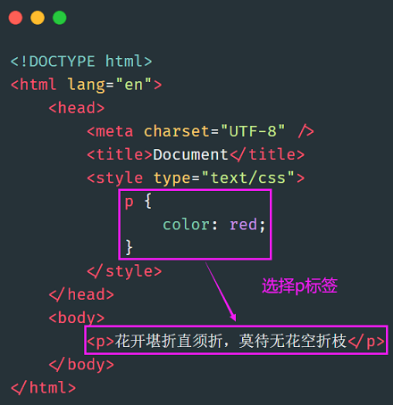

2.ID选择器


3.类选择器

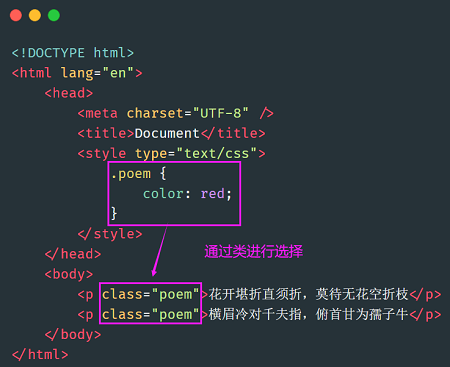

> id 是 js 用的。也就是说，js 要通过 id 属性得到标签，所以 css 层面尽量不用 id，要不然 js 就很别扭。

4.通配符`*`，匹配所有标签

## 高级选择器

1.后代选择器

**后代选择器，描述的是一种祖先结构**。


2.交集选择器

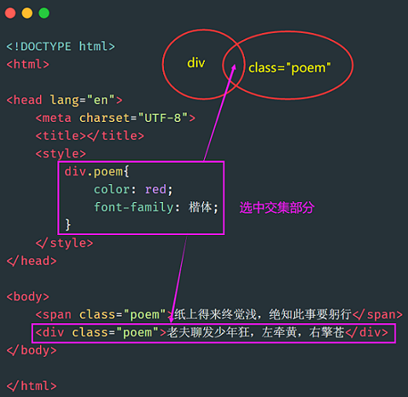

3.并集选择器


## 伪类选择器

伪类选择器分为两种。

（1）**静态伪类**：只能用于**超链接**的样式。如下：

- `:link` 超链接点击之前
- `:visited` 链接被访问过之后

PS：以上两种样式，只能用于超链接。

（2）**动态伪类**：针对**所有标签**都适用的样式。如下：

- `:hover` “悬停”：鼠标放到标签上的时候
- `:active` “激活”： 鼠标点击标签，但是不松手时。
- `:focus` 是某个标签获得焦点时的样式（比如某个输入框获得焦点）

!> 记住，在css中，这四种状态**必须按照固定的顺序写**，否则会失效

```html
<!DOCTYPE html>
<html>

<head lang="en">
    <meta content="text/html;charset=UTF-8">
    <title>Document</title>
    <style type="text/css">
        * {
            margin: 0;
            padding: 0;
        }

        .nav {
            width: 960px;
            height: 50px;
            border: 1px solid red;
            margin: 100px auto;
        }

        .nav ul {
            /*去掉小圆点*/
            list-style: none;
        }

        .nav ul li {
            float: left;
            width: 120px;
            height: 50px;
            /*让内容水平居中*/
            text-align: center;
            /*让行高等于nav的高度，就可以保证内容垂直居中*/
            line-height: 50px;
        }

        .nav ul li a {
            display: block;
            width: 120px;
            height: 50px;
        }

        /*两个伪类的属性，可以用逗号隔开*/
        .nav ul li a:link,
        .nav ul li a:visited {
            text-decoration: none;
            background-color: purple;
            color: white;
        }

        .nav ul li a:hover {
            background-color: orange;
        }
    </style>
</head>

<body>
    <div class="nav">
        <ul>
            <li><a href="#">网站栏目</a></li>
            <li><a href="#">网站栏目</a></li>
            <li><a href="#">网站栏目</a></li>
            <li><a href="#">网站栏目</a></li>
            <li><a href="#">网站栏目</a></li>
            <li><a href="#">网站栏目</a></li>
            <li><a href="#">网站栏目</a></li>
            <li><a href="#">网站栏目</a></li>
        </ul>
    </div>
</body>

</html>
```

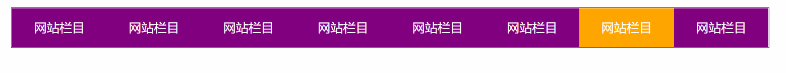

## CSS3选择器

### 子代选择器

1.子代选择器

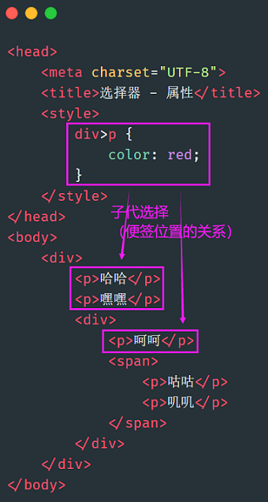

2.序选择器

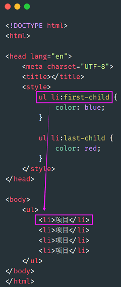

3.选择兄弟

`~`：

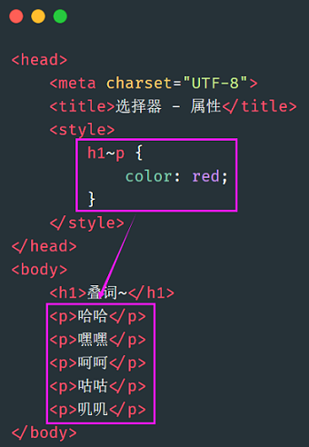

`+`：

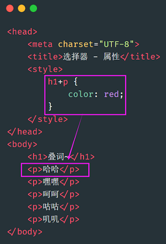

### 属性选择器

属性选择器的标志性符号是 `[]`。

匹配含义：

```
^：开头  $：结尾  *：包含
```

格式：

- `E[title]` 选中页面的E元素，并且E存在 title 属性即可。
- `E[title="abc"]`选中页面的E元素，并且E需要带有title属性，且属性值**完全等于**abc。
- `E[attr~=val]` 选择具有 att 属性且属性值为：用空格分隔的字词列表，其中一个等于 val 的E元素。
- `E[attr|=val]` 表示要么是一个单独的属性值，要么这个属性值是以“-”分隔的。
- `E[title^="abc"]` 选中页面的E元素，并且E需要带有 title 属性,属性值以 abc 开头。
- `E[title$="abc"]` 选中页面的E元素，并且E需要带有 title 属性,属性值以 abc 结尾。
- `E[title*="abc"]` 选中页面的E元素，并且E需要带有 title 属性,属性值任意位置包含abc。

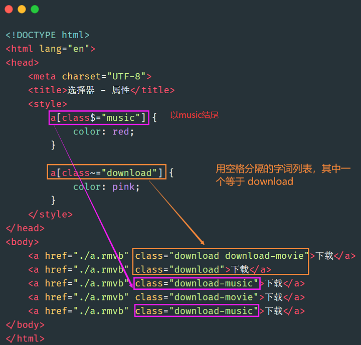

### 结构伪类选择器

CSS中有一些伪类选择器，比如`:link`、`:active`、`:visited`、`:hover`，这些是动态伪类选择器。

CSS3又新增了其它的伪类选择器。这一小段，我们来学习CSS3中的**结构伪类选择器**：即通过**结构**来进行筛选。

**1、格式：（第一部分）**

- `E:first-child` 匹配父元素的第一个子元素E。
- `E:last-child` 匹配父元素的最后一个子元素E。
- `E:nth-child(n)` 匹配父元素的第n个子元素E。**注意**，盒子的编号是从`1`开始算起，不是从`0`开始算起。
- `E:nth-child(odd)` 匹配奇数
- `E:nth-child(even)` 匹配偶数
- `E:nth-last-child(n)` 匹配父元素的倒数第n个子元素E。

**2、格式：（第二部分）**

- `E:first-of-type` 匹配同类型中的第一个同级兄弟元素E。
- `E:last-of-type` 匹配同类型中的最后一个同级兄弟元素E。
- `E:nth-of-type(n)` 匹配同类型中的第n个同级兄弟元素E。
- `E:nth-last-of-type(n)` 匹配同类型中的倒数第n个同级兄弟元素E。

既然上面这几个选择器带有`type`，我们可以这样理解：先在同级里找到所有的E类型，然后根据 n 进行匹配。

**3、格式：（第三部分）**

- `E:empty` 匹配没有任何子节点（包括空格等text节点）的元素E。
- `E:target` 匹配相关URL指向的E元素。要配合锚点使用。

### 伪元素选择器

**1、格式：（第一部分）**

- `E::before` 设置在元素E前面（依据对象树的逻辑结构）的内容，配合content属性一起使用。
- `E::after` 设置在元素E后面（依据对象树的逻辑结构）的内容，配合content属性一起使用。

**2、格式：（第二部分）**

- `E::first-letter` 设置元素 E 里面的**第一个字符**的样式。
- `E::first-line` 设置元素 E 里面的**第一行**的样式。
- `E::selection` 设置元素 E 里面被鼠标选中的区域的样式（一般设置颜色和背景色）。

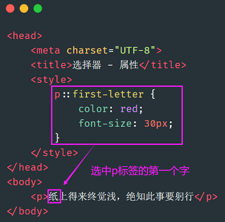

# 三、盒子模型

## 盒子中的区域

一个盒子中主要的属性就5个：width、height、padding、border、margin。如下：

- width和height：**内容**的宽度、高度（不是盒子的宽度、高度）。
- padding：内边距。
- border：边框。
- margin：外边距。

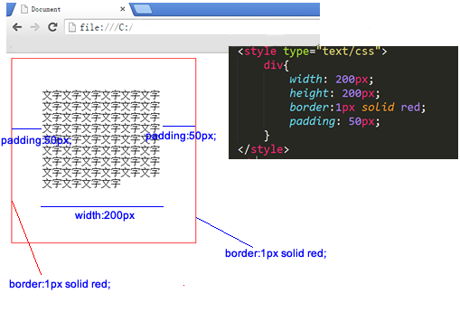

上面这个盒子，`width:200px; height:200px;`但是真实占有的宽高是302*302。 这是因为还要加上padding、border。

## 标准盒模型和IE盒模型

标准盒子模型：

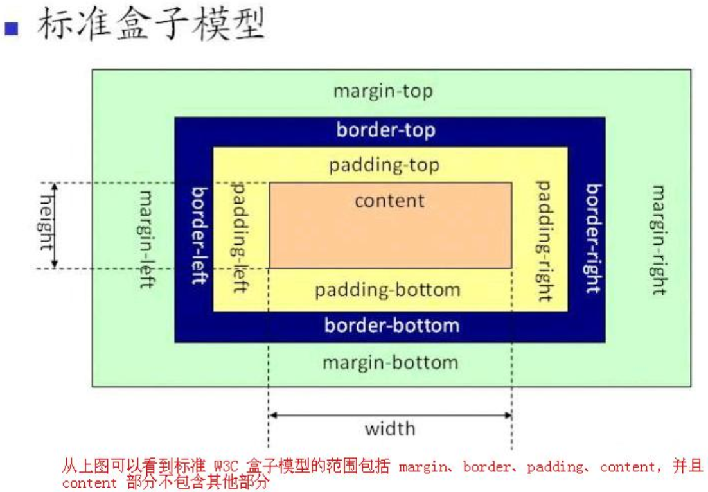

IE盒子模型：

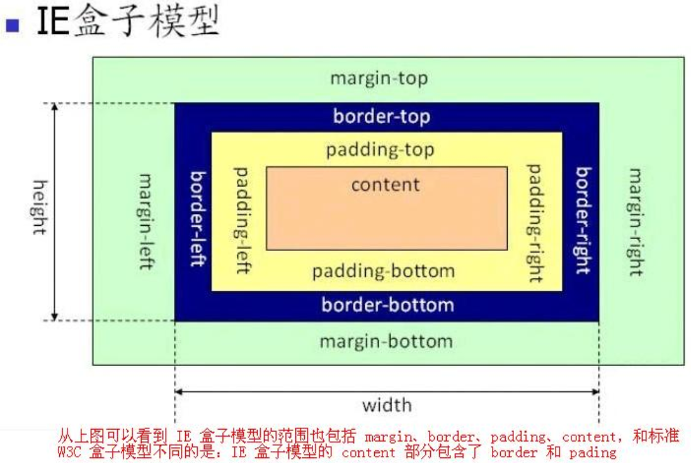

!> 现在浏览器大都采用标准的W3C盒子模型，IE盒子模型已经不用了

## width、height

真实占有宽度 = 左border + 左padding + width + 右padding + 右border

**如果想保持一个盒子的真实占有宽度不变，那么加width的时候就要减padding。加padding的时候就要减width**。因为盒子变胖了是灾难性的，这会把别的盒子挤下去。

## padding

1.padding区域也有颜色

background-color将填充**所有border以内的区域。**

2.padding有四个方向

```css
padding-top: 30px;
padding-right: 20px;
padding-bottom: 40px;
padding-left: 100px;
/*顺时针：上、右、下、左*/
padding: 30px 20px 40px 100px;
```

## border

```css
border:1px solid red;
```

属性拆分：

- 按三要素拆开：border-width、border-style、border-color。（一个border属性是由三个小属性综合而成的）
- 按方向拆开：border-top、border-right、border-bottom、border-left。

```css
border-width: 10px 20px;
border-style: solid dashed dotted;
border-color: red green blue yellow;
```

```css
border-top:10px solid red;
border-right:10px solid red;
border-bottom:10px solid red;
border-left:10px solid red;
```

利用border属性画一个三角形：

```html
<style>
    .div1 {
        width: 0;
        height: 0;
        border-top: 30px solid red;
        border-left: 20px solid transparent;
        border-right: 20px solid transparent;
    }
</style>

<body>
    <div class="div1"></div>
</body>
```

# 四、其他

## 继承性与层叠性

继承性：

- 关于文字样式的属性，都具有继承性。这些属性包括：color、 text-开头的、line-开头的、font-开头的。
- 关于盒子、定位、布局的属性，都不能继承。

层叠性：多个选择器会相互覆盖，有些就会失效

- id 选择器
- 类选择器、属性选择器、伪类选择器
- 标签选择器、伪元素选择器

判断层叠性优先：

+ 计算权重，得到层叠哪个优先
+ 权重相同时候，写在后面的优先，因为会覆盖前面的
+ 继承性的影响
  + 如果不能直接选中某个元素，通过继承性影响的话，那么权重是0。
  + **如果大家的权重相同，那么就采用就近原则：谁描述的近，听谁的**。

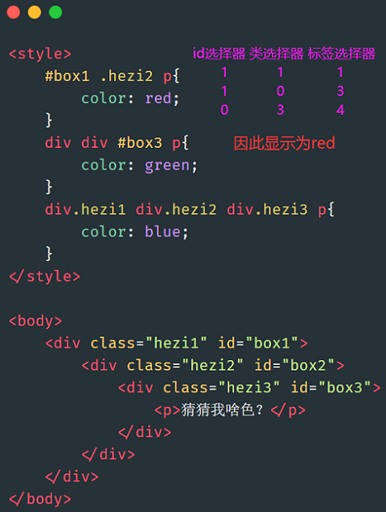

继承属性的就近原则：

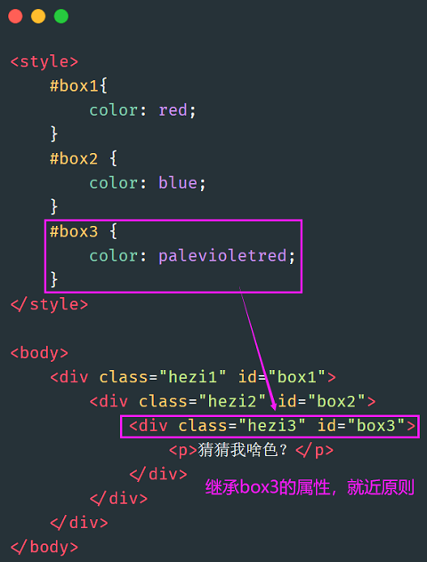

总结流程如下：


1. 对于相同的选择器（比如同样都是类选择器），其样式表排序：行级样式 > 内嵌样式表 > 外部样式表（就近原则）
2. 对于相同类型的样式表（比如同样都是内部样式表），其选择器排序：ID选择器 > 类选择器 > 标签选择器
3. 外部样式表的ID选择器 > 内嵌样式表的标签选择器

> 总结：就近原则。ID选择器优先级最大。

同一个便签，携带多个类名冲突：

1. 对同一个标签，如果用到了了多个相同的内嵌样式表，它的优先级：**定义**的样式表中，谁最近，就用谁。
2. 对于同一个标签，如果引用了多个相同的外部样式表，它的优先级：html文件中，引用样式表的位置越近，就用谁。

`!important`标记：优先级最高

```css
font-size:60px !important;
```

- !important提升的是一个属性，而不是一个选择器

- !important无法提升继承的权重，该是0还是0

- ```html
  <style>
      div{
          color:red !important;
      }
      p{
          color:blue;
      }
  </style>
  <div>
      <p>哈哈</p>
  </div>
  ```

- !important不影响就近原则

!> 做网站的时候，!important 尽量不要用。否则会让css写的很乱。

## 浮动

### 行内元素和块级元素

**行内元素和块级元素的区别：**（非常重要）

行内元素：

- 与其他行内元素并排；
- 不能设置宽、高。默认的宽度，就是文字的宽度。

块级元素：

- 霸占一行，不能与其他任何元素并列；
- 能接受宽、高。如果不设置宽度，那么宽度将默认变为父亲的100%。

**行内元素和块级元素的分类：**

在以前的HTML知识中，我们已经将标签分过类，当时分为了：文本级、容器级。

从HTML的角度来讲，标签分为：

- 文本级标签：`p、span、a、b、i、u、em`。
- 容器级标签：`div、h系列、li、dt、dd`。

现在，从CSS的角度讲，CSS的分类和上面的很像，就p不一样：

- 行内元素：除了p之外，所有的文本级标签，都是行内元素。p是个文本级，但是是个块级元素。
- 块级元素：所有的容器级标签都是块级元素，还有p标签。

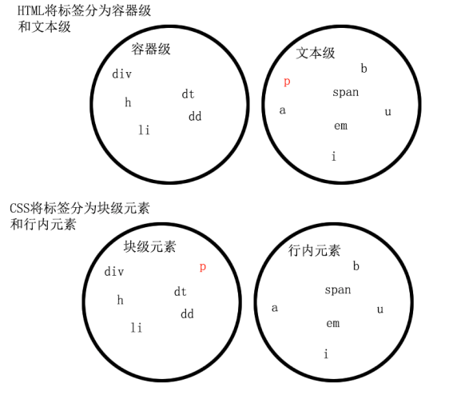

**块级元素可以转换为行内元素：**

```css
/*这个标签将立即变为行内元素，此时它和一个span无异。inline就是“行内”*/
display: inline;
```

**行内元素转换为块级元素：**

```css
/*这个标签将立即变为块级元素，此时它和一个div无异*/
display: block;
```

### 浮动的性质

#### 浮动的元素脱标

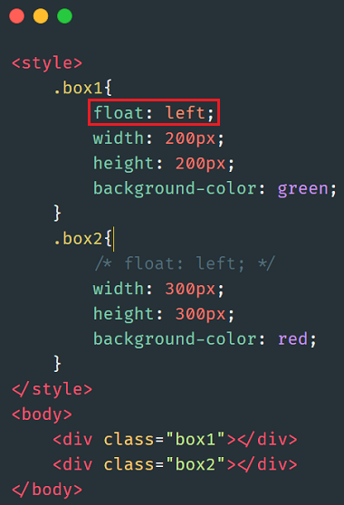

结果：

绿色浮动在红色上


#### 浮动的元素互相贴靠

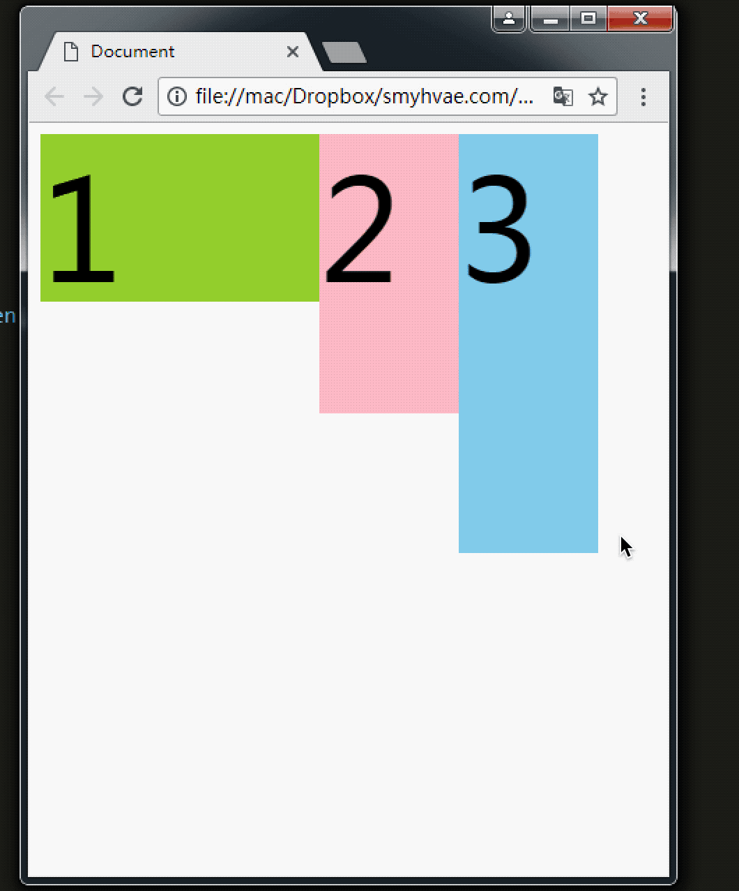

#### 浮动的元素有“字围”效果

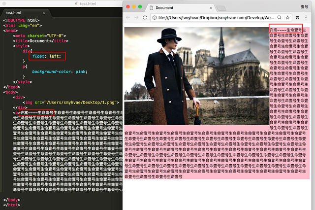

上图中，我们发现：**div挡住了p，但不会挡住p中的文字**，形成“字围”效果。

总结：**标准流中的文字不会被浮动的盒子遮挡住**。（文字就像水一样）

关于浮动我们要强调一点，浮动这个东西，为避免混乱，我们在初期一定要遵循一个原则：**永远不是一个东西单独浮动，浮动都是一起浮动，要浮动，大家都浮动。**

#### 收缩

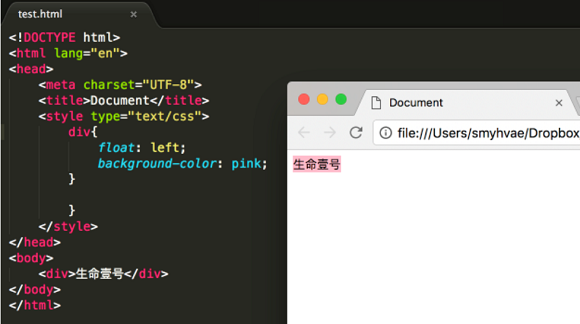

### 清除浮动

#### 加高法

工作上，我们绝对不会给所有的盒子加高度，这是因为麻烦，并且不能适应页面的快速变化。

```html
<div>     //设置height
	<p></p>
	<p></p>
	<p></p>
</div>

<div>    //设置height
	<p></p>
	<p></p>
	<p></p>
</div>
```

#### `clear:both;`法

最简单的清除浮动的方法，就是给盒子增加clear:both；表示自己的内部元素，不受其他盒子的影响。

```html
<div>
	<p></p>
	<p></p>
	<p></p>
</div>

<div>   //clear:both;
	<p></p>
	<p></p>
	<p></p>
</div>
```

浮动确实被清除了，不会互相影响了。但是有一个问题，就是margin失效。两个div之间，没有任何的间隙了。

#### 隔墙法

在两部分浮动元素中间，建一个墙。隔开两部分浮动，让后面的浮动元素，不去追前面的浮动元素。 墙用自己的身体当做了间隙。

```html
<div>
	<p></p>
	<p></p>
	<p></p>
</div>

<div class="cl h10"></div>

<div>
	<p></p>
	<p></p>
	<p></p>
</div>
```

我们发现，隔墙法好用，但是第一个div，还是没有高度。如果我们现在想让第一个div，自动根据自己的儿子撑出高度，我们就要想一些“小伎俩”。

内墙法：

```html
<div>
	<p></p>
	<p></p>
	<p></p>
	<div class="cl h10"></div>
</div>

<div>
	<p></p>
	<p></p>
	<p></p>
</div>
```

内墙法的优点就是，不仅仅能够让后部分的p不去追前部分的p了，并且能把第一个div撑出高度。这样，这个div的背景、边框就能够根据p的高度来撑开了。

#### `overflow:hidden;`

这个属性的本意，就是将所有溢出盒子的内容，隐藏掉。但是，我们发现这个东西能够用于浮动的清除。 我们知道，一个父亲，不能被自己浮动的儿子撑出高度，但是，如果这个父亲加上了overflow:hidden；那么这个父亲就能够被浮动的儿子撑出高度了。这个现象，不能解释，就是浏览器的偏方。 并且`overflow:hidden;`能够让margin生效。

# 五、布局

## 正常布局流

```html
<p>I love my cat.</p>

<ul>
  <li>Buy cat food</li>
  <li>Exercise</li>
  <li>Cheer up friend</li>
</ul>

<p>The end!</p>
```

## display属性

none：隐藏对象。与`visibility`属性的`hidden`值不同，其不为被隐藏的对象保留其物理空间

inline：内联元素。

block：块元素。

inline-block：内联块元素

flex：伸缩盒

inline-flex：内联伸缩盒

grid：网格

## Flexbox

主要看阮一峰的文章：[Flex 布局教程：语法篇 - 阮一峰的网络日志 (ruanyifeng.com)](https://www.ruanyifeng.com/blog/2015/07/flex-grammar.html)


相关属性：

- `flex-direction`：决定主轴方向
  - `row`（默认值）：主轴为水平方向，起点在左端。
  - `row-reverse`：主轴为水平方向，起点在右端。
  - `column`：主轴为垂直方向，起点在上沿。
  - `column-reverse`：主轴为垂直方向，起点在下沿。
- `flex-wrap`：轴线排不下，如何换行
  - `nowrap`：不换行
  - `wrap`：换行
  - `wrap-reverse`：换行
- `flex-flow`：上面两个属性的简写
- `justify-content`：主轴对齐方式
  - `flex-start`（默认值）：左对齐
  - `flex-end`：右对齐
  - `center`： 居中
  - `space-between`：两端对齐，项目之间的间隔都相等。
  - `space-around`：每个项目两侧的间隔相等。所以，项目之间的间隔比项目与边框的间隔大一倍。
- `align-items`：交叉轴对齐方式
  - `flex-start`：交叉轴的起点对齐。
  - `flex-end`：交叉轴的终点对齐。
  - `center`：交叉轴的中点对齐。
  - `baseline`: 项目的第一行文字的基线对齐。
  - `stretch`（默认值）：如果项目未设置高度或设为auto，将占满整个容器的高度。
- `align-content`：多条轴线对齐方式
  - `flex-start`：与交叉轴的起点对齐。
  - `flex-end`：与交叉轴的终点对齐。
  - `center`：与交叉轴的中点对齐。
  - `space-between`：与交叉轴两端对齐，轴线之间的间隔平均分布。
  - `space-around`：每根轴线两侧的间隔都相等。所以，轴线之间的间隔比轴线与边框的间隔大一倍。
  - `stretch`（默认值）：轴线占满整个交叉轴。

下面是一点补充：

+ `flex:flex-grow flex-shrink flex-basis`，分别对应`扩展比率、收缩比率、基准值`。

缩减：

```css
<ul class="flex">
    <li>a</li>
    <li>b</li>
    <li>c</li>
</ul>

.flex{display:flex;width:800px;margin:0;padding:0;list-style:none;}
.flex :nth-child(1){flex:1 1 300px;}
.flex :nth-child(2){flex:2 2 200px;}
.flex :nth-child(3){flex:3 3 400px;}

/*
本例定义了父容器宽（即主轴宽）为800px，由于子元素设置了伸缩基准值flex-basis，相加300+200+400=900，那么子元素将会溢出900-800=100px；
由于同时设置了收缩因子，所以加权综合可得300*1+200*2+400*3=1900px；
于是我们可以计算a,b,c将被移除的溢出量是多少：
a被移除溢出量：(300*1/1900)*100，即约等于16px
b被移除溢出量：(200*2/1900)*100，即约等于21px
c被移除溢出量：(400*3/1900)*100，即约等于63px
最后a,b,c的实际宽度分别为：300-16=284px, 200-21=179px, 400-63=337px
*/
```

扩展：

```css
<ul class="flex">
    <li>a</li>
    <li>b</li>
    <li>c</li>
</ul>

.flex{display:flex;width:1500px;margin:0;padding:0;list-style:none;}
.flex :nth-child(1){flex:1 1 300px;}
.flex :nth-child(2){flex:2 2 200px;}
.flex :nth-child(3){flex:3 3 400px;}

/*
本例定义了父容器宽（即主轴宽）为1500px，由于子元素设置了伸缩基准值flex-basis，相加300+200+400=900，那么容器将有1500-900=600px的剩余宽度；
于是我们可以计算a,b,c将被扩展量是多少：
a的扩展量：(1/(1+2+3))*600，即约等于100px
b的扩展量：(2/(1+2+3))*600，即约等于200px
c的扩展量：(3/(1+2+3))*600，即约等于300px
最后a,b,c的实际宽度分别为：300+100=400px, 200+200=400px, 400+300=700px
*/
```

## 网格

主要看阮一峰的文章：[CSS Grid 网格布局教程 - 阮一峰的网络日志 (ruanyifeng.com)](http://www.ruanyifeng.com/blog/2019/03/grid-layout-tutorial.html)


