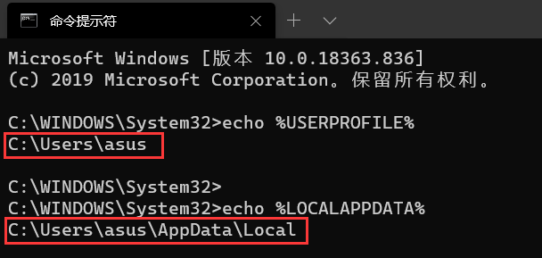
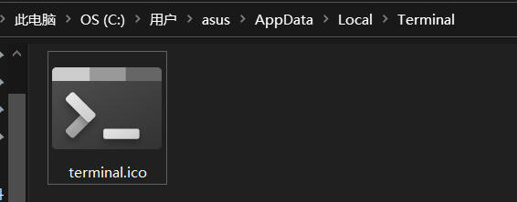
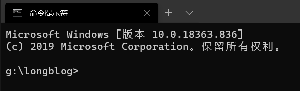
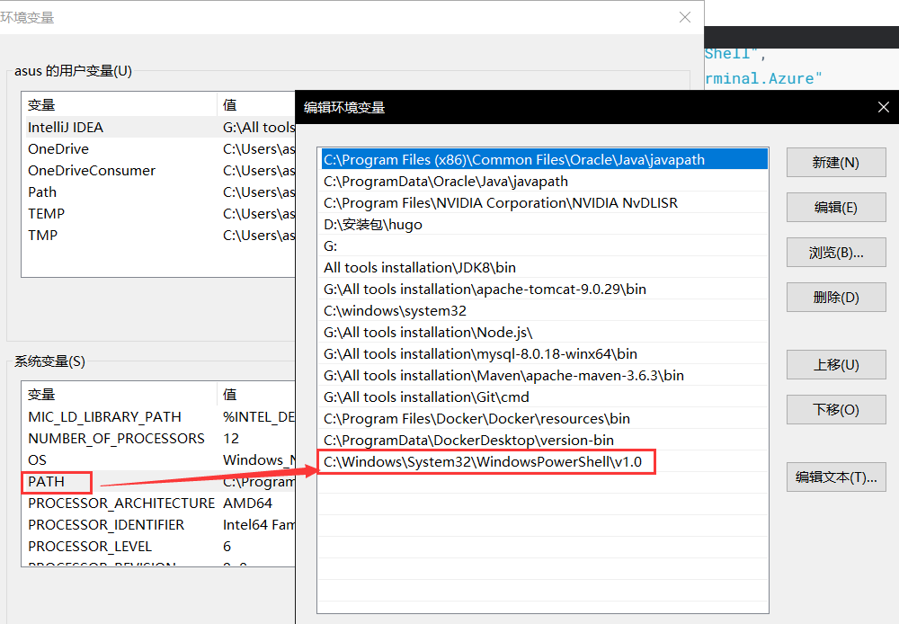

# 1.添加window terminal 到右键菜单

1.检查变量

```bash
echo %USERPROFILE%

echo %LOCALAPPDATA%
```



2.获取图标

在一下这个目录下创建文件夹，并复制获取的图标到里面



当然这个过程也可以用命令行实现：

```bash
mkdir "%USERPROFILE%\AppData\Local\Terminal"
```

图标地址为：https://raw.githubusercontent.com/microsoft/terminal/master/res/terminal.ico（可能需要翻墙）

3.创建一个`addwt.reg`的文件,编辑一下内容，并保存

```bash
Windows Registry Editor Version 5.00

[HKEY_CLASSES_ROOT\Directory\Background\shell\wt]
@="Windows Terminal here"
"Icon"="%USERPROFILE%\\AppData\\Local\\Terminal\\terminal.ico"

[HKEY_CLASSES_ROOT\Directory\Background\shell\wt\command]
@="C:\\Users\\asus\\AppData\\Local\\Microsoft\\WindowsApps\\wt.exe"
```

> 这个里面的asus是我的计算机名，不一样就需要改变

4.执行`addwt.reg`文件，单击右键发现选项出现了，但是不起作用

5.打开`windows terminal`的配置文件，添加`"startingDirectory": null`这个配置

```json
"profiles": {
    "defaults": {
      // Put settings here that you want to apply to all profiles.
    },
    "list": [
      {
        // Make changes here to the cmd.exe profile.
        "guid": "{0caa0dad-35be-5f56-a8ff-afceeeaa6101}",
        "name": "命令提示符",
        "commandline": "cmd.exe",
        "hidden": false,
        "startingDirectory": null
      },
      {
        "guid": "{b453ae62-4e3d-5e58-b989-0a998ec441b8}",
        "hidden": false,
        "name": "Azure Cloud Shell",
        "source": "Windows.Terminal.Azure"
      },
      {
        // Make changes here to the powershell.exe profile.
        "guid": "{61c54bbd-c2c6-5271-96e7-009a87ff44bf}",
        "name": "Windows PowerShell",
        "commandline": "powershell.exe",
        "hidden": false,
        "startingDirectory": null
      }
    ]
  },
```



# 2.解决PowerShell问题

解决Windows Terminal`[启动“powershell.exe”时出现错误 0x80070002]`

添加环境变量路径：

```bash
C:\Windows\System32\WindowsPowerShell\v1.0
```

