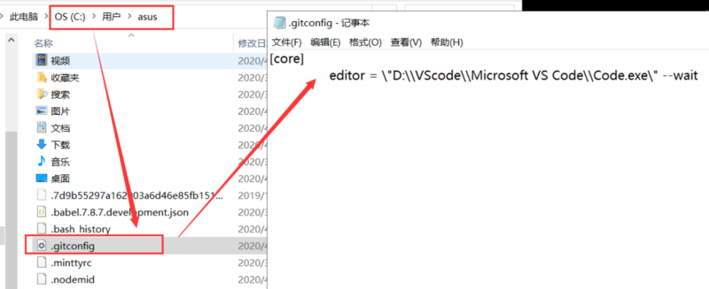
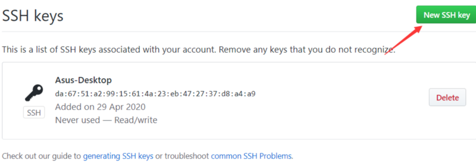

# 删除旧的全局设置

1.查看旧的全局设置

```
git config --global --list
```


2.如果有，执行：

```
git config --global --unset user.name "xxx"
git config --global --unset user.email "xxx@163.com"
```

本地的git设置可以在目录`.gitconfig`下查看



# 开始配置

1.在目录`C:\Users\asus\.ssh`下右键，git bash here

2.生成Key

```
ssh-keygen -t rsa -C "sylzy66sina@163.com" -f "github_id_rsa"
ssh-keygen -t rsa -C "sylzy66sina@163.com" -f "gitee_id_rsa"
```

3.打开目录下的文件，将Key分别复制到`gitee`和`github`上


Github上：



4.创建config 文件解决`ssh`冲突

```
# gitee
Host gitee.com
HostName gitee.com
PreferredAuthentications publickey
IdentityFile ~/.ssh/gitee_id_rsa

# github
Host github.com
HostName github.com
PreferredAuthentications publickey
IdentityFile ~/.ssh/github_id_rsa
```

# 测试连接

```
# 注意这里的 T 一定要大写
ssh -T git@github.com
ssh -T git@gitee.com
```

截图：


进入后，出现一堆英文，这时候输入yes


到了这里配置就成功了

# 分别提交到两个仓库

1.执行操作后，发现有问题


2.这时候执行以下代码：

> 注意这里不用全局

```
git config user.name "LongSir"
git config user.email "sylzy66sina@163.com"
```

然后再次提交：

```
git commit -m "first-commit"
```

3.连接远端仓库并提交

```
git remote add origin git@gitee.com:jonnylong/computer_learning_notes.git
git push -u origin master
```


4.在`.git`文件夹中加入`github`的SSH地址


5.再次`git push`时候就可以推送到两个仓库了

