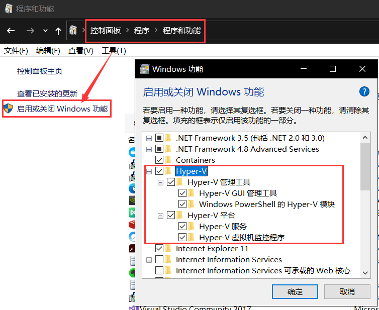

# 1.开启Hyper-V

由于Win10家庭版没有自带这个功能，所以要自己安装

1.在桌面上新建文件`Hyper-V.bat`，用右键用管理员权限打开，到最后选择Y，计算机重启

```bash
pushd "%~dp0"
dir /b %SystemRoot%\servicing\Packages\*Hyper-V*.mum >hyper-v.txt
for /f %%i in ('findstr /i . hyper-v.txt 2^>nul') do dism /online /norestart /add-package:"%SystemRoot%\servicing\Packages\%%i"
del hyper-v.txt
Dism /online /enable-feature /featurename:Microsoft-Hyper-V-All /LimitAccess /ALL
```

2.重启后开启Hyper-V



3.管理员权执行一下：

```bash
REG ADD "HKEY_LOCAL_MACHINE\software\Microsoft\Windows NT\CurrentVersion" /v EditionId /T REG_EXPAND_SZ /d Professional /F
```

# 2.下载和安装

1.打开网址：https://hub.docker.com/?overlay=onboarding，不过在这之前如果没有账号需要注册一个

2.下载成功后点击`Docker for Windows Installer`，进行脑残式安装