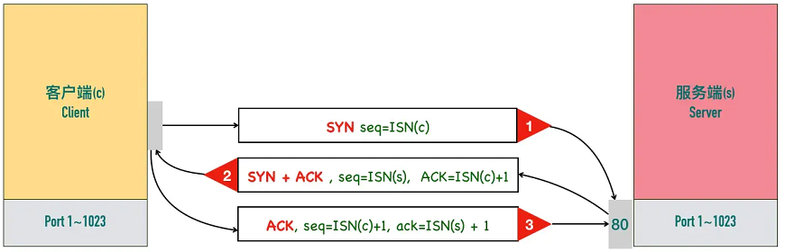
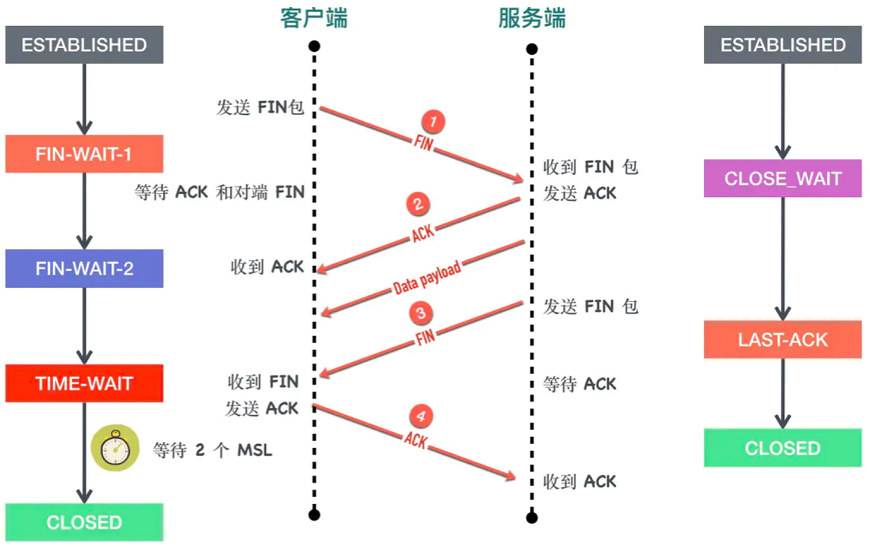

## 计算机网络

### Get和Post的区别

`GET`方法：发送一个请求来取得服务器上的某一资源

`POST`方法：向`URL`指定的资源提交数据或附加新的数据

|          | GET                                | POST     |
| -------- | ---------------------------------- | -------- |
| 缓存     | 能被浏览器主动缓存下来             | 不会     |
| 编码     | 只能进行URL编码，只能接受ASCII字符 | 没有现在 |
| 参数位置 | URL                                | 请求体内 |
| 幂等     | 是                                 | 不幂等   |

> 任意多次执行所产生的影响均与一次执行的影响相同。

### TCP和UDP协议的特点及应用场景

TCP：

+ 面向连接：要求正式发送数据之前需要通过「握手」建立一个**逻辑**连接，结束通信时也是通过有序的四次挥手来断开连接。
+ 可靠传输：保障信息在发送方和接收方准确、精确的传输
+ 基于字节流：将大块数据分割为以报文段为单位的数据包进行管理
+ 流控
+ 拥塞机制

UDP：

- 面向无连接

### 三次握手过程



第一次握手：客户端给服务端发一个 SYN 报文，并指明客户端的初始化序列号 ISN（c）。此时客户端处于`SYN_Send`状态。

第二次握手：服务器收到客户端的 SYN 报文之后，会以自己的 SYN 报文作为应答，并且也是指定了自己的初始化序列号 ISN(s)，同时会把客户端的 ISN + 1 作为 ACK 的值，表示自己已经收到了客户端的 SYN，此时服务器处于`SYN_REVD`的状态。

第三次握手：客户端收到 SYN 报文之后，会发送一个 ACK 报文，当然，也是一样把服务器的 ISN + 1 作为 ACK 的值，表示已经收到了服务端的 SYN 报文，此时客户端处于`establised`状态。

服务器收到 ACK 报文之后，也处于`establised`状态，此时，双方以建立起了链接。

### 三次握手的目的

保证双方同时具有接收数据和发送数据能力，三次握手可以在有限次数完成校验工作。

### 所以为什么要握手三次，一次握手不就行了？

第三次握手是为了防止已经失效的连接请求报文突然又传到了服务器，因而产生错误。

### 四次挥手过程



第一次挥手：客户端发送一个 FIN 报文，报文中会指定一个序列号。此时客户端处于FIN_WAIT1状态。

第二次握手：服务端收到 FIN 之后，会发送 ACK 报文，且把客户端的序列号值 + 1 作为 ACK 报文的序列号值，表明已经收到客户端的报文了，此时服务端处于 CLOSE_WAIT状态。

第三次挥手：如果服务端也想断开连接了，和客户端的第一次挥手一样，发给 FIN 报文，且指定一个序列号。此时服务端处于 LAST_ACK 的状态。

第四次挥手：客户端收到 FIN 之后，一样发送一个 ACK 报文作为应答，且把服务端的序列号值 + 1 作为自己 ACK 报文的序列号值，此时客户端处于 TIME_WAIT 状态。需要过一阵子以确保服务端收到自己的 ACK 报文之后才会进入 CLOSED 状态

服务端收到 ACK 报文之后，就处于关闭连接了，处于 CLOSED 状态。

## 算法

### 手写快速排序

```js
function QSort(arr, low, high) {
    if (low < high) {
        let pivot = Partition(arr, low, high);
        QSort(arr, low, pivot - 1);
        QSort(arr, pivot + 1, high);
    }

    function Partition(arr, low, high) {
        let temp = arr[low];
        while (low < high) {
            while (low < high && arr[high] >= temp) {
                high--;
            }
            arr[low] = arr[high];
            while (low < high && arr[low] <= temp) {
                low++;
            }
            arr[high] = arr[low];
        }
        arr[low] = temp;
        return low;
    }
}
```

## JavaScript

### 什么是闭包

闭包：指内部函数总是可以访问其所在的外部函数中声明的变量和参数，即使在其外部函数被返回了之后。

**JavaScript 中的所有函数都是闭包的。**JavaScript 的执行环境本身就是一个scope（浏览器的window/node的global），我们通常称之为全局作用域。每个函数，不论多深，都可以认为是全局scope的子作用域，可以理解为闭包。

---

词法环境的原理，闭包的实质


