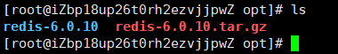
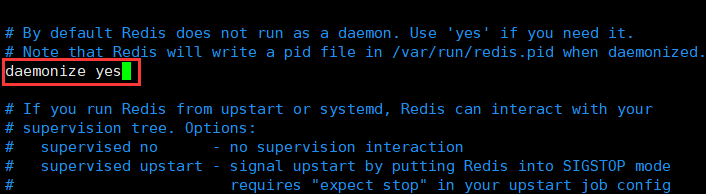
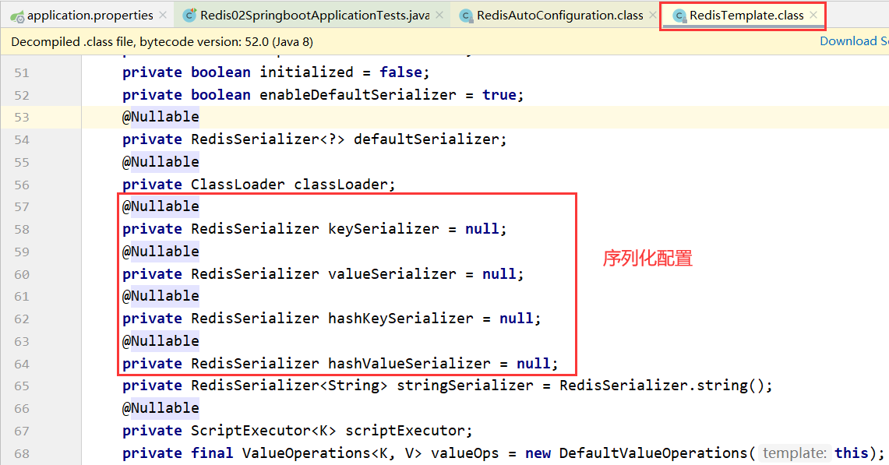

> redis官网：https://redis.io/

# 一、Nosql概述

## 什么是Nosql

NoSQL=Not Only SQL

泛指非关系型数据库的，随着web2.0互联网的诞生!传统的关系型数据库很难对付web2.0时代！尤其是超大规模的高并发的社区!暴露出来很多难以克服的问题，NoSQL在当今大数据环境下发展的十分迅速，Redis是发展最快的，而且是我们当下必须要掌握的一个技术！

很多的数据类型用户的个人信息，社交网络，地理位置。这些数据类型的存储不需要一个固定的格式！不需要多月的操作就可以横向扩展的！`Map<String,Object>`使用键值对来控制!

NoSQL特点：

1、方便扩展（数据之间没有关系，很好扩展！）

2、大数据量高性能（Redis 一秒写8万次，读取11万，NoSQL的缓存记录级，是一种细粒度的缓存，性能会比较高！）

3、数据类型是多样型的！（不需要事先设计数据库!随取随用!如果是数据量十分大的表，很多人就无法设计了！）

4、传统RDBMS和NoSQL

```
传统的RDBMS
- 结构化组织
- SQL
- 数据和关系都存在单独的表中
- 数据定义语言
- 严格的一致性
- 基础的事物
- ……
```

```
Nosql
- 不仅仅是数据
- 没有固定的查询语言
- 键值对存储，列存储，文档存储，图形数据库（社交关系）
- 最终一致性
- CAP定理和BASE
- 高性能，高可用，高可扩
- ……
```

## NoSQL的四大分类

- KV键值对
- 文档型数据库（bson格式，类似于Json）
  - MongoDB
    - MongoDB是一个基于分布式文件存储的数据库，C++编写，主要用来处理大量的文档！
    - MongoDB是一个介于关系型数据库和非关系型数据中中间的产品！MongoDB是非关系型数据库中功能最丰富，最像关系型数据库
  - ConthDB
- 列存储数据库
  - HBase
  - 分布式文件系统
- 图关系数据库
  - 存放关系
  - neo4j

# 二、Redis入门

## 概述

Redis（Remote Dictionary Server )，即远程字典服务，是一个开源的使用ANSI C语言编写、支持网络、可基于内存亦可持久化的日志型、Key-Value数据库，并提供多种语言的API。从2010年3月15日起，Redis的开发工作由VMware主持。从2013年5月开始，Redis的开发由Pivotal赞助。

Redis能干嘛？

1.内存存储、持久化，内存中是断电即失、所以说持久化很重要（rdb、aof）

2.效率高，用于高速缓存

3.发布订阅系统

4.地图信息分析

5.计数器、计时器

特性：

1.多样的数据类型

2.持久化

3.集群

4.事务

注意：Wdinow在Github上下载（停更很久了! )

Redis推荐都是在Linux服务器上搭建的，我们是基于Linux学习!

## Linux安装Redis

1.解压到`/opt`目录下



2.进入解压后的文件，可以看到我们redis的配置文件


3.基本环境安装

```bash
yum install gcc-c++
make
make install
```


4.redis默认安装路径：`/usr/local/bin`


5.复制一份`redis.conf`防止之后的修改失误

```bash
mkdir redisconfig
cp /opt/redis-6.0.10/redis.conf redisconfig/
```

6.修改`redis.conf`文件，让redis作为守护进程运行



7.启动Redis服务

```bash
redis-server
# 使用redis客户端进行连接
redis-cli -p 6379
```

```bash
127.0.0.1:6379> ping
PONG
127.0.0.1:6379> set name JonnyLong
OK
127.0.0.1:6379> get name
"JonnyLong"
```

8.查看redis进程是否开启

```bash
ps -ef|grep redis
```


9.关闭redis服务


## redis-benchmark

官方自带的性能测试工具


```bash
# 测试：100个并发连接，100000个请求
redis-benchmark -h localhost -p 6379 -c 100 -n 100000
```


## 基础知识

Redis默认有16个数据库，默认使用第0个

+ `select 3`：切换数据库
+ `dbsize`：数据库大小
+ `flushdb`：清空当前数据库
+ `flushdball`：清空所有数据库
+ `keys *`：获取所有的key
+ `del name`：删除当前的key
+ `expire name 10`：设置key的过期时间，单位是秒
+ `ttl name`：查看当前key的剩余时间
+ `type name`：查看当前key类型
+ `rename key newkey`：修改key名称

**Redis是单线程的！**

明白Redis是很快的，官方表示，Redis是基于内存操作，CPU不是Redis性能瓶颈，Redis的瓶颈是根据机器的内存和网络带宽，既然可以使用单线程来实现，就使用单线程了!所有就使用了单线程了!

Redis为什么单线程还这么快?

- 误区1∶高性能的服务器一定是多线程的?
- 误区2∶多线程（CPU上下文会切换！)一定比单线程效率高!先去CPU>内存>硬盘的速度要有所了解!

核心：redis是将所有的数据全部放在内存中的，所以说使用单线程去操作效率就是最高的，多线程(CPU上下文会切换：耗时的操作！)，对于内存系统来说，如果没有上下文切换效率就是最高的，多次读写都是在一个CPU上的，在内存情况下，这个就是最佳的方案！

# 三、五大数据类型

## String

`set key value`：设置key的值

`get key`：获取key的值

`strlen key`：返回key存储字符串长度

`incr key`：key++

`decr key`：key--

`decrby key decrement`：key=key-decrement

`setex key seconds value`：设置key多seconds秒后变成value

`setnx key value`：key不存在是设置为value，存在的话不进行修改

`mset key value [key value …]`：设置多个key-value

`msetnx key value [key value …]`：设置多个key-value，key不存在是设置为value，存在的话不进行修改

`getrange key start end`：获取截取字符串

`setrange key offset value`：截取字符串


## List

`lpush key value [value2]`：左插，插入到头部

`rpush key value [value2]`：右插，插入到尾部

`lpushx key value1`：左插，如果列表不为插入到头部，为空不插入

`rpushx key value1`：右插，如果列表不为插入到尾部，为空不插入

`lpop key`：获取头元素

`rpop key`：获取尾元素

`llen key`：获取列表长度

`lrange key start stop`：获取列表指定范围元素

`lindex key index`：索引获取列表元素

`lset key index value`：索引设置列表元素的值

`ltrim key start stop`：列表修剪，保留区间值

`linsert key before|after pivot value`：在列表元素前面或后面插入元素


`lrem key count value`：移除列表元素

- count > 0 : 从表头开始向表尾搜索，移除与 VALUE 相等的元素，数量为 COUNT 。
- count < 0 : 从表尾开始向表头搜索，移除与 VALUE 相等的元素，数量为 COUNT 的绝对值。
- count = 0 : 移除表中所有与 VALUE 相等的值。


## Set

`sadd key member1 [member2]`：向集合中添加一个或多个成员

`scard key`：获取集合元素数

`smembers key`：返回集合所有成员

`sdiff key1 [key2]`：集合差集，key1-key2

`sinter key1 key2`：返回交集

`sunion key1 key2`：返回并集

`sdiffstore destination key1 key2`：求差集并保存

`sinterstore destination key1 key2`：求差集并保存

`sunionstore destination key1 key2`：求差集并保存

`srem key member1 [member2]`：删除集合元素

`spop key`：移除并返回集合中的一个随机元素

`sismember key member`：判断member元素是否是集合key的成员

`smove source destination member`：将 member 元素从 source 集合移动到 destination 集合

## ZSet

`zadd key score1 member1[score2 member2]`：向集合中添加一个或多个成员

`zscore key member`：获取score

`zcard key`：获取集合元素数

`zcount key min max`：计算[min,max]区间内元素个数

`zrange key start stop`：索引区间[start,stop]

`zrangebyscore key min max [withscores]`：分数区间[min,max]，withscores选择是否带上分数

`zrank key member`：返回字段的索引

`zrevrank key member`：返回字段的倒数索引

`zrevrange key start stop[withscores]`：集合翻转，索引区间[start,stop]

`zrevrangebyscore key max min`：集合翻转，分数区间[max,min]

> 注意这里从大到小排序，因此分数区间是[max,min]


`zrem key member [member2]`：移除

`zremrangebyrank key start stop`：移除有序集合中给定的排名区间的所有成员

`zremrangebyscore key min max`：移除有序集合中给定的分数区间的所有成员

## Hash

Redis hash 是一个 string 类型的 field（字段） 和 value（值） 的映射表，hash 特别适合用于存储对象。

`hset key field value`：设置一个field-value

`hmset key field1 value1[field2 value2]`：设置多个field-value

`hmget key field1[field2]`：根据field获取value

`hkeys key`：获取所有的field

`hvals key`：获取所有的value

`hget key field`：根据field获取value

`hgetall key`：获取所有的field和value

`hlen key`：数量

`hdel key field1[field2]`：删除

`hexists key field`：是否存在

`hincrby key field increment`：为field对应的value加上整数增量increment

`hincrbyfloat key field increment`：为field对应的value加上浮点增量increment

## geospatial

- 有效的经度从-180度到180度。
- 有效的纬度从-85.05112878度到85.05112878度。

`geoadd key longitude latitude name`：添加（经度、纬度、城市名）

`geopos key name`：获取定位

`geodist key name1 name2`：两城市距离

`georadiusbymember key name 距离 单位`：找出位于指定元素周围的其他元素

`georadius key longitude latitude radius 单位`：寻找周围的点

- **m** 表示单位为米。
- **km** 表示单位为千米。
- **mi** 表示单位为英里。
- **ft** 表示单位为英尺。


GEO底层的实现原理其实就是Zset !我们可以使用Zset命令来操作geo


## Bitmap

位图存储，每个位图存储0或1

`setbit key num 0/1`：设置

`getbit key num`：获取

`bitcount key`：数量

# 四、事务

## 基本事务

事务：要么同时成功，要么同时失败，原子性！事务的本质是一组命令的集合，一组事务中的所有命令都会被序列化。

Redis事务没有隔离级别的概念

所有的命令在事务中，并没有直接被执行！只有发起执行命令时候才会执行。

**单个 Redis 命令的执行是原子性的，但 Redis 没有在事务上增加任何维持原子性的机制，所以 Redis 事务的执行并不是原子性的。**

Redis事务：

+ 开启事务（`multi`）
+ 命令入队（……）
+ 执行事务（`exec`）
+ 放弃事务（`discard`）：事务队列中的事务都不会执行


## 乐观锁

悲观锁：什么时候都会出问题，无论做什么都会加锁

乐观锁：认为什么时候都不会出问题，所以不会上锁！更新数据的时候去判断一下，在此期间是否有人修改过这个数据。

+ 获取version
+ 更新时候比较version

使用watch监视Redis乐观锁操作


如果修改失败就获取最新的值：


# 五、Jedis

## 连接服务器Redis

1.导入依赖

```xml
<!--导入Jedis-->
<dependency>
    <groupId>redis.clients</groupId>
    <artifactId>jedis</artifactId>
    <version>3.5.1</version>
</dependency>
<dependency>
    <groupId>com.alibaba</groupId>
    <artifactId>fastjson</artifactId>
    <version>1.2.75</version>
</dependency>
```

2.在阿里云服务器上打开**防火墙**，还有**安全组**

```bash
# 配置端口
firewall-cmd --zone=public --add-port=6379/tcp --permanent
# 重启防火墙服务
systemctl restart firewalld.service
# 列举防火墙开启的端口服务
firewall-cmd --list-ports
```

3.修改配置文件`redis.conf`

+ `daemonize yes`：以守护进程方式运行
+ `bind 127.0.0.1`：注释掉这个
+ `protected-mode no`：这里由原先的yes修改为no
+ `requirepass 123456`：可设可不设

4.Jedis测试

```java
public class TestPing {
    public static void main(String[] args) {
        Jedis jedis = new Jedis("115.29.208.129", 6379);
        System.out.println(jedis.ping());
    }
}
```


## Jedis事务

```java
public static void main(String[] args) {
    Jedis jedis = new Jedis("115.29.208.129", 6379);
    JSONObject jsonObject = new JSONObject();
    jsonObject.put("username","Alice");
    jsonObject.put("password","12345678");
    String result = jsonObject.toJSONString();
    jedis.flushDB();
    Transaction multi = jedis.multi();
    try {
        multi.set("user1","Hello,World");
        multi.set("user2",result);
        int i=1/0;
        multi.exec();
    }catch (Exception e){
        multi.discard();
        e.printStackTrace();
    }finally {
        System.out.println(jedis.get("user1"));
        System.out.println(jedis.get("user2"));
        jedis.close();
    }
}
```

由于执行事务过程中出现报错，所以事务回滚不执行，打印为空


# 六、SpringBoot整合

## 集成Redis

SpringData也是和SpringBoot齐名的项目!

说明：在SpringBoot2.x之后，原来使用的jedis被替换为了lettuce

jedis：采用的直连，多个线程操作的话，是不安全的，如果想要避免不安全的，使用jedis pool连接池！更像BIO模式

lettuce：采用netty，实例可以再多个线程中进行共享，不存在线程不安全的情况!可以减少线程数据了，更像NIO模式

源码分析：

```java
//我们可以自己定义一个redisTemp1ate来替换这个默认的!
@Bean
@ConditionalOnMissingBean(
    name = {"redisTemplate"}
)
@ConditionalOnSingleCandidate(RedisConnectionFactory.class)
public RedisTemplate<Object, Object> redisTemplate(RedisConnectionFactory redisConnectionFactory) {
    // 默认的 RedisTemplate 没有过多的设置，redis对象都是需要序列化!
    // 两个泛型都是 object，object的类型，我们后使用需要强制转换
    RedisTemplate<Object, Object> template = new RedisTemplate();
    template.setConnectionFactory(redisConnectionFactory);
    return template;
}

//由于string 是redis中最常使用的类型，所以说单独提出来了一个bean !
@Bean
@ConditionalOnMissingBean
@ConditionalOnSingleCandidate(RedisConnectionFactory.class)
public StringRedisTemplate stringRedisTemplate(RedisConnectionFactory redisConnectionFactory) {
    StringRedisTemplate template = new StringRedisTemplate();
    template.setConnectionFactory(redisConnectionFactory);
    return template;
}
```

1.项目依赖

```xml
<!--操作redis-->
<dependency>
    <groupId>org.springframework.boot</groupId>
    <artifactId>spring-boot-starter-data-redis</artifactId>
</dependency>
```

2.配置连接

```properties
# 配置redis
spring.redis.host=115.29.208.129
spring.redis.port=6379
```

3.测试


```java
@Test
void contextLoads() {
    redisTemplate.opsForValue().set("name","JonnyLong");
    redisTemplate.opsForValue().set("age","21");
    System.out.println(redisTemplate.opsForValue().get("name"));
}
```

## 序列化配置




```java
@Configuration
public class RedisConfig {
    /**
     * 写好的固定模版，一般拿去直接使用
     */
    @Bean
    @SuppressWarnings("all")
    public RedisTemplate<String,Object> redisTemplate(RedisConnectionFactory redisConnectionFactory) throws UnknownHostException{
        // 我们为了自己开发方便，一般直接使用<String, 0bject>
        RedisTemplate<String, Object> template = new RedisTemplate<String,Object>();
        template.setConnectionFactory(redisConnectionFactory);

        // Json序列化
        Jackson2JsonRedisSerializer jackson2JsonRedisSerializer = new Jackson2JsonRedisSerializer(Object.class);
        ObjectMapper om = new ObjectMapper();
        om.setVisibility(PropertyAccessor.ALL, JsonAutoDetect.Visibility.ANY);
        om.enableDefaultTyping(ObjectMapper.DefaultTyping.NON_FINAL);
        jackson2JsonRedisSerializer.setObjectMapper(om);
        // String的序列化
        StringRedisSerializer stringRedisSerializer = new StringRedisSerializer();

        // key采用String序列化方式
        template.setKeySerializer(stringRedisSerializer);
        // hash的key也采用String的序列化方式
        template.setHashKeySerializer(stringRedisSerializer);
        // value序列化方式采用jackson
        template.setValueSerializer(jackson2JsonRedisSerializer);
        // hash的value序列化方式采用jackson
        template.setHashValueSerializer(jackson2JsonRedisSerializer);
        template.afterPropertiesSet();
        return template;
    }
}
```

实例User要实现Serializable接口

```java
@Component
@AllArgsConstructor
@NoArgsConstructor
@Data
public class User implements Serializable {
    private String name;
    private int age;
}
```

然后测试：

```java
@Test
public void test(){
    User user = new User("贾探春", 18);
    redisTemplate.opsForValue().set("user",user);
    Object object = redisTemplate.opsForValue().get("user");
    System.out.println(object);
}
```


# 七、持久化

Redis是内存数据库，如果不将内存中的数据库状态保存到磁盘，那么一旦服务器进程退出，服务器中的数据库状态也会消失。所以Redis提供了持久化功能！

## RDB（Redis Database）


在指定的时间间隔内将内存中的数据集快照写入磁盘，也就是行话讲的Snapshot快照，它恢复时是将快照文件直接读到内存里。

Redis会单独创建（fork）一个子进程来进行持久化，会先将数据写入到一个临时文件中，待持久化过程都结束了，再用这个临时文件替换上次持久化好的文件。整个过程中，主进程是不进行任何I/O操作的。这就确保了极高的性能。如果需要进行大规模数据的恢复，且对于数据恢复的完整性不是非常敏感，那RDB方式要比AOF方式更加的高效。RDB的缺点是最后一次持久化后的数据可能丢失。我们默认的就是RDB，一般情况下不需要修改这个配置！

> rdb保存的文件是`dump.rdb`，都是在我们的配置文件中快照中配置的


1、save的规则满足的情况下，会自动触发rdb规则

2、执行flushall命令，也会触发我们的rdb规则！

3、退出redis，也会产生rdb 文件！

备份就自动生成一个dump.rdb

如果回复rdb文件：

1、只需要将rdb文件放在我们redis启动目录就可以，redis启动的时候会自动检查dump.rdb恢复其中的数据！

2、查看需要存在的位置


如果在这个目录下存在`dump.rdb`文件，启动就会自动恢复其中的数据

优点：

1、适合大规模的数据恢复！

2、对数据的完整性要不高！

缺点︰

1、需要一定的时间间隔进程操作，如果redis意外宕机了，这个最后一次修改数据就没有的了！

2、fork进程的时候，会占用一定的内容空间

## AOF（Append Only File）


以日志的形式来记录每个写操作，将Redis执行过的所有指令记录下来（读操作不记录），只许追加文件但不可以改写文件，redis启动之初会读取该文件重新构建数据，换言之，redis重启的话就根据日志文件的内容将写指令从前到后执行一次以完成数据的恢复工作。

> Aof保存的是`appendonly.aof`文件

| `appendonly no`                 | 指定是否在每次更新操作后进行日志记录，Redis 在默认情况下是异步的把数据写入磁盘，如果不开启，可能会在断电时导致一段时间内的数据丢失。因为 redis 本身同步数据文件是按上面 save 条件来同步的，所以有的数据会在一段时间内只存在于内存中。默认为 no |
| ------------------------------- | ------------------------------------------------------------ |
| `appendfilename appendonly.aof` | 指定更新日志文件名，默认为 appendonly.aof                    |
| `appendfsync everysec`          | 指定更新日志条件，共有 3 个可选值：**no**：表示等操作系统进行数据缓存同步到磁盘（快）**always**：表示每次更新操作后手动调用 fsync() 将数据写到磁盘（慢，安全）**everysec**：表示每秒同步一次（折中，默认值） |

默认是不开启的，我们需要手动进行配置，我们只需要**将appendonl改为yes就开启了aof。**重启，redis 就可以生效了！

如果这个aof文件有错位，这时候redis是启动不起来的吗，我们需要修复这个aof文件redis给我们提供了一个工具`redis-check-aof`

优点：

1、每一次修改都同步，文件的完整会更加好

2、每秒同步一次，可能会丢失一秒的数据

3、从不同步，效率最高的

缺点：

1、相对于数据文件来说，aof远远大于rdb，修复的速度也比 rdb慢

2、Aof运行效率也要比rdb慢，所以我们redis默认的配置就是rdb持久化

## 扩展

1、RDB持久化方式能够在指定的时间间隔内对你的数据进行快照存储

2、AOF持久化方式记录每次对服务器写的操作，当服务器重启的时候会重新执行这些命令来恢复原始的数据，AOF命令以Redis协议追加保存每次写的操作到文件末尾，Redis还能对AOF文件进行后台重写，使得AOF文件的体积不至于过大。

3、只做缓存，如果你只希望你的数据在服务器运行的时候存在，你也可以不使用任何持久化

4、同时开启两种持久化方式

+ 在这种情况下，当redis重启的时候会优先载入AOF文件来恢复原始的数据，因为在通常情况下AOF文件保存的数据集要比RDB文件保存的数据集要完整。

+ RDB的数据不实时，同时使用两者时服务器重启也只会找AOF文件，那要不要只使用AOF呢?作者建议不要，因为RDB更适合用于备份数据库(AOF在不断变化不好备份），快速重启，而且不会有AOF可能潜在的Bug，留着作为一个万一的手段。

5、性能建议

+ 因为RDB文件只用作后备用途，建议只在Slave上持久化RDB文件，而且只要15分钟备份一次就够了，只保留`save 900 1`这条规则。

+ 如果Enable AOF，好处是在最恶劣情况下也只会丢失不超过两秒数据，启动脚本较简单只load自己的AOF文件就可以了，代价一是带来了持续的I/O，二是AOF rewrite的最后将rewrite过程中产生的新数据写到新文件造成的阻塞几乎是不可避免的。只要硬盘许可，应该尽量减少AOF rewrite 的频率，AOF重写的基础大小默认值64M太小了，可以设到5G以上，默认超过原大小100%大小重写可以改到适当的数值。

+ 如果不Enable AOF，仅靠Master-Slave Repllcation实现高可用性也可以，能省掉一大笔I/O，也减少了rewrite时带来的系统波动。代价是如果Master/Slave同时倒掉，会丢失十几分钟的数据，启动脚本也要比较两个MasterlSlave 中的RDB文件，载入较新的那个，微博就是这种架构。

# 八、Redis发布和订阅

Redis 发布订阅(pub/sub)是一种**消息通信模式**︰发送者(pub)发送消息，订阅者(sub)接收消息。Redis客户端可以订阅任意数量的频道。

订阅/发布消息图：


下图展示了频道channel1，以及订阅这个频道的三个客户端——client2、client5和client1之间的关系：


当有新消息通过PUBLISH命令发送给频道channel1时，这个消息就会被发送给订阅它的三个客户端：


命令：

| 序号 | 命令及描述                                                   |
| :--- | :----------------------------------------------------------- |
| 1    | `PSUBSCRIBE pattern [pattern ...]`订阅一个或多个符合给定模式的频道。 |
| 2    | `PUBSUB subcommand [argument [argument ...]]`查看订阅与发布系统状态。 |
| 3    | `PUBLISH channel message`将信息发送到指定的频道。            |
| 4    | `PUNSUBSCRIBE [pattern [pattern ...]]`退订所有给定模式的频道。 |
| 5    | `SUBSCRIBE channel [channel ...]` 订阅给定的一个或多个频道的信息。 |
| 6    | `UNSUBSCRIBE [channel [channel ...]]`指退订给定的频道。      |

下面将进行测试，这个过程类似于订阅了微信公众号：

订阅端：

```bash
127.0.0.1:6379> SUBSCRIBE CCTV
Reading messages... (press Ctrl-C to quit)
1) "subscribe"
2) "CCTV"
3) (integer) 1
1) "message"
2) "CCTV"
3) "Hello,CCTV"
```

发布端：

```bash
127.0.0.1:6379> PUBLISH CCTV "Hello,CCTV"
(integer) 1
```

使用场景：

1、实时消息系统

2、实时聊天（频道当做聊天室，将信息回显给所有人即可）

3、订阅，关注系统都是可以的

# 九、Redis主从复制

## 主从复制

主从复制，是指将一台Redis服务器的数据，复制到其他的Redis服务器。前者称为主节点(master/leader)，后者称为从节点(slave/follower)；**数据的复制是单向的，只能由主节点到从节点。**Master以写为主，Slave以读为主。

默认情况下，每台Redis服务器都是主节点；且一个主节点可以有多个从节点(或没有从节点)，但一个从节点只能有一个主节点。

主从复制的作用主要包括：

1、数据冗余：主从复制实现了数据的热备份，是持久化之外的一种数据冗余方式。

2、故障恢复：当主节点出现问题时，可以由从节点提供服务，实现快速的故障恢复;实际上是一种服务的冗余。

3、负载均衡：在主从复制的基础上，配合读写分离，可以由主节点提供写服务，由从节点提供读服务（即写Redis数据时应用连接主节点，读Redis数据时应用连接从节点），分担服务器负载；尤其是在写少读多的场景下，通过多个从节点分担读负载，可以大大提高Redis服务器的并发量。

4、高可用（集群）基石：除了上述作用以外，主从复制还是哨兵和集群能够实施的基础，因此说主从复制是Redis高可用的基础。

一般来说，要将Redis运用于工程项目中，只使用一台Redis是万万不能的，原因如下：

1、从结构上，单个Redis服务器会发生单点故障，并且一台服务器需要处理所有的请求负载，压力较大;

2、从容量上，单个Redis服务器内存容量有限，就算一台Redis服务器内存容量为256G，也不能将所有内存用作Redis存储内存，一般来说，**单台Redis最大使用内存不应该超过20G。**

电商网站上的商品，一般都是一次上传，无数次浏览的，说专业点也就是"多读少写"。对于这种场景，我们可以使如下这种架构：


## 集群环境配置

```bash
# 查看当前库的信息
127.0.0.1:6379> info replication
# Replication
role:master
# 没有从机
connected_slaves:0
master_replid:05d8c039a31fa0c9995ef2d6d83a316001b20726
master_replid2:0000000000000000000000000000000000000000
master_repl_offset:0
second_repl_offset:-1
repl_backlog_active:0
repl_backlog_size:1048576
repl_backlog_first_byte_offset:0
repl_backlog_histlen:0
```

复制三份配置文件，然后修改对应信息

1.端口

2.pid名字

3.log文件名字

4.dump.rdb名字

修改完毕后，启动三个redis服务器


## 一主而从

默认情况下，每台Redis服务器都是主节点，我们一般情况下只用配置从机就好了

这里我们让79为主，80、81为从


真实的从主配置应该在配置文件中配置，这样的话是永久的，我们这里使用的是命令，暂时的！

主机写：


从机只能读不能写：


主机断开连接，从机依旧连接到主机的，但是没有写操作，这个时候，主机如果回来了，从机依旧可以直接获取到主机写的信息！

如果是使用命令行，来配置的主从，这个时候如果重启了，就会变回主机！只要变为从机，立马就会从主机中获取值

复制原理：

Slave启动成功连接到master后会发送一个sync同步命令，Master接到命令，启动后台的存盘进程，同时收集所有接收到的用于修改数据集命令，在后台进程执行完毕之后，master将传送整个数据文件到slave，并完成一次完全同步。

全量复制：而slave服务在接收到数据库文件数据后，将其存盘并加载到内存中。

增量复制：Master继续将新的所有收集到的修改命令依次传给slave，完成同步。

如果主机断开连接，可以使用`SLAVEOF no one `让自己变成主机

## 哨兵模式

主从切换技术的方法是︰当主服务器宕机后，需要手动把一台从服务器切换为主服务器，这就需要人工干预，费事费力，还会造成一段时间内服务不可用。这不是一种推荐的方式，更多时候，我们优先考虑哨兵模式。Redis从2.8开始正式提供了Sentinel（哨兵）架构来解决这个问题。

谋朝篡位的自动版，能够后台监控主机是否故障，如果故障了根据投票数**自动将从库转换为主库。**

哨兵模式是一种特殊的模式，首先Redis提供了哨兵的命令，哨兵是一个独立的进程，作为进程，它会独立运行。**其原理是哨兵通过发送命令，等待Redis服务器响应，从而监控运行的多个Redis实例。**


这里的哨兵有两个作用：

+ 通过发送命令，让Redis服务器返回监控其运行状态，包括主服务器和从服务器。
+ 当哨兵监测到master宕机，会自动将slave切换成master，然后通过发布订阅模式通知其他的从服务器，修改配置文件，让它们切换主机。

然而一个哨兵进程对Redis服务器进行监控，可能会出现问题，为此，我们可以使用多个哨兵进行监控。各个哨兵之间还会进行监控，这样就形成了多哨兵模式。


假设主服务器宕机，哨兵1先检测到这个结果，系统并不会马上进行failover过程，仅仅是哨兵1主观的认为主服务器不可用，这个现象成为**主观下线**。当后面的哨兵也检测到主服务器不可用，并且数量达到一定值时，那么哨兵之间就会进行一次投票，投票的结果由一个哨兵发起，进行failover[故障转移]操作。切换成功后，就会通过发布订阅模式，让各个哨兵把自己监控的从服务器实现切换主机，这个过程称为**客观下线**。

1.配置文件`sentinel.conf`

```bash
# sentinel monitor 被监控的名称 host port 1
sentinel monitor myredis 127.0.0.1 6379 1
```

后面这个1表示主机挂了，slave投票看让谁接替成为主机，票数最多就会成为主机

2.启动哨兵

```bash
redis-sentinel longconfig/sentinel.conf 
```

3.让6379宕机，哨兵开始工作


4.查看结果6381变成主机


> 如果主机此时回来了，只能归并到新的主机下，当做从机，这就是哨兵模式的规则！

Redis哨兵模式配置文件：

```bash
修改sentinel配置文件
vim /usr/local/redis/6379/26379.conf

修改内容：
# 添加守护进程模式
daemonize yes

# 添加指明日志文件名
logfile "/usr/local/redis/6379/sentinel26379.log"

# 修改工作目录
dir "/usr/local/redis/6379"

# 修改启动端口
port 26379

# 添加关闭保护模式
protected-mode no

# 修改sentinel monitor
sentinel monitor macrog-master 192.168.24.131 6379 2

# 将配置文件中mymaster全部替换macrog-master
# 在末行模式下 输入 :%s/mymaster/macrog-master/g

依次修改26380,26381配置

说明：
macrog-master:监控主数据的名称,自定义即可,可以使用大小写字母和“.-_”符号
192.168.24.131:监控的主数据库的IP
6379:监控的主数据库的端口
2:最低通过票数
```

# 十、缓存穿透与雪崩

## 缓存穿透（查不到）

缓存穿透的概念很简单，用户想要查询一个数据，发现redis内存数据库没有，也就是缓存没有命中，于是向持久层数据库查询。发现也没有，于是本次查询失败。当用户很多的时候，缓存都没有命中（秒杀!)，于是都去请求了持久层数据库。这会给持久层数据库造成很大的压力，这时候就相当于出现了缓存穿透。

布隆过滤器：

布隆过滤器是一种数据结构，对所有可能查询的参数以hash形式存储，在控制层先进行校验，不符合则丢弃，从而避免了对底层存储系统的查询压力


缓存空对象：

当存储层不命中后，即使返回的空对象也将其缓存起来，同时会设置一个过期时间，之后再访问这个数据将会从缓存中获取，保护了后端数据源


但是这种方法会存在两个问题：

1、如果空值能够被缓存起来，这就意味着缓存需要更多的空间存储更多的键，因为这当中可能会有很多的空值的键

2、即使对空值设置了过期时间，还是会存在缓存层和存储层的数据会有一段时间窗口的不一致，这对于需要保持一致性的业务会有影响。

## 缓存击穿（量太大，缓存过期）

这里需要注意和缓存击穿的区别，缓存击穿，是指一个key非常热点，在不停的扛着大并发，大并发集中对这一个点进行访问，当这个key在失效的瞬间，持续的大并发就穿破缓存，直接请求数据库，就像在一个屏障上凿开了一个洞。

当某个key在过期的瞬间，有大量的请求并发访问，这类数据一般是热点数据，由于缓存过期，会同时访问数据库来查询最新数据，并且回写缓存，会导使数据库瞬间压力过大。

**解决方案：**

1.设置热点数据永不过期：

从缓存层面来看，没有设置过期时间，所以不会出现热点key过期后产生的问题。

2.加互斥锁：

分布式锁：使用分布式锁，保证对于每个key同时只有一个线程去查询后端服务，其他线程没有获得分布式锁的权限，因此只需要等待即可。这种方式将高并发的压力转移到了分布式锁，因此对分布式锁的考验很大。

## 缓存雪崩

缓存雪崩，是指在某一个时间段，缓存集中过期失效。Redis宕机!

产生雪崩的原因之一，比如在写本文的时候，马上就要到双十二零点，很快就会迎来一波抢购，这波商品时间比较集中的放入了缓存，假设缓存一个小时。那么到了凌晨一点钟的时候，这批商品的缓存就都过期了。而对这批商品的访问查询，都落到了数据库上，对于数据库而言，就会产生周期性的压力波峰。于是所有的请求都会达到存储层，存储层的调用量会暴增，造成存储层也会挂掉的情况。


其实集中过期，倒不是非常致命，比较致命的缓存雪崩，是缓存服务器某个节点宕机或断网。因为自然形成的缓存雪崩，一定是在某个时间段集中创建缓存，这个时候，数据库也是可以顶住压力的。无非就是对数据库产生周期性的压力而已。而缓存服务节点的宕机，对数据库服务器造成的压力是不可预知的，很有可能瞬间就把数据库压垮。

**解决方案：**

1.redis高可用：

这个思想的含义是，既然redis有可能挂掉，那我多增设几台redis，这样一台挂掉之后其他的还可以继续工作，其实就是搭建的集群。

2.限流降级：

这个解决方案的思想是，在缓存失效后，通过加锁或者队列来控制读数据库写缓存的线程数量。比如对某个key只允许一个线程查询数据和写缓存，其他线程等待。

3.数据预热：

数据加热的含义就是在正式部署之前，我先把可能的数据先预先访问一遍，这样部分可能大量访问的数据就会加载到缓存中。在即将发生大并发访问前手动触发加载缓存不同的key，设置不同的过期时间，让缓存失效的时间点尽量均匀。


