# 一、MySQL基础

## 1.初识MySQL

环境变量：`/usr/local/mysql/bin`

执行：`mysqld`；就是在执行上述目录下的mysqld文件

启动服务端程序：

Unix：`mysql`、`mysql_safe`（启动脚本，间接调用mysqld）

Windows：`mysqld install`，注册为Windows服务

启动MySQL服务器：`net start MySQL`

关闭MySQL服务器：`net stop MySQL`

启动客户端程序：`mysql -h主机名 -u用户名 -p密码 -P端口`

?> -h是--host的短参数形式

服务器处理客户端请求：


连接管理：

+ 客户端进程<----->线程<----->服务器进程
+ 断开连接时，交互线程不会立即销毁，而是缓存起来，以备之后把缓存的线程分配给新的客户端

常用存储引擎：InnoDB（支持事务、行级锁、外键）、MyISAM（主要的非事务处理存储引擎）

引擎操作：

+ 查看引擎：`SHOW ENGINES`
+ 创建引擎：

```sql
CERATE TABLE 表名(
    建表语句;
)ENGINE=引擎名;
```

+ 修改表引擎：

```sql
ALTER TABLE 表名 ENGINE=引擎名;
```

## 2.启动项和系统变量

配置文件路径：

> Windows

| 路径名                               | 备注                         |
| ------------------------------------ | ---------------------------- |
| `%WINDIR%\my.ini`，`%WINDIR%\my.cnf` |                              |
| `C:\my.int`，`C:\my.cnf`             |                              |
| `BASEDIR\my.ini`，`BASEDIR\my.cnf`   |                              |
| `defaults-extra-file`                | 命令行指定的额外配置文件路径 |
| `%APPDATA%\MySQL\.mylogin.cnf`       | 登录路径选项                 |

+ `%WINDIR%`：机器上的Windows目录位置
+ `BASEDIR`：MySQL安装目录路径

> UNIX

| 路径名                | 备注                             |
| --------------------- | -------------------------------- |
| `/etc/my.cnf`         |                                  |
| `/ect/mysql/my.cnf`   |                                  |
| `SYSCONFDIR/my.cnf`   |                                  |
| `$MYSQL_HOME$/my.cnf` | 特定于服务器的选项（仅限服务器） |
| `defaults-extra-file` | 命令行指定的额外配置文件路径     |
| `~/.my.cnf`           | 特定于用户的选项                 |
| `~/.mylogin.cnf`      | 特定于用户的登录路径选项         |

+ `SYSCONFDIR`：使用CMake构建MySQL时使用`SYSCONFDIR`选项指定的目录
+ `MYSQL_HOME`：环境变量

MySQL配置文件内容：

```bash
[client]
# 设置mysql客户端默认字符集
default-character-set=UTF8MB4

[mysqld]
# 设置3306端口
port=3306
# 设置mysql的安装目录
basedir=G:\\All tools installation\\mysql-8.0.18-winx64
# 设置mysql数据库的数据的存放目录
datadir=G:\\DataBase\\MySQL
# 允许最大连接数
max_connections=200
# 服务端使用的字符集默认为UTF8
character-set-server=UTF8MB4
# 创建新表时将使用的默认存储引擎
default-storage-engine=INNODB
#设定默认时区
default-time-zone='+8:00'
```

+ [server] skip-networking和命令行使用`mysqld --skip-networking`效果相同
+ 多个重复的启动项以最后面那个为准（后面覆盖前面的）
  + 多文件（路径表格靠后的反而生效）和一个文件多个组都适用

系统变量：

+ 查看：`SHOW VARIAVLES LIKE "default%";`
+ 设置
  + 启动选项
    + `mysqld --default_storage_engine=MyISAM`
    + 配置文件
  + 运行时设置
    + `SET [GLOBAL|SESSION] 系统变量名=值;`

注意：

+ 并非所有系统变量都具有GLOBAL和SESSION范围，可能只有其中一个
+ 有些系统变量是只读的

状态变量：用来显示服务器程序运行状态的，只读

```sql
SHOW [GLOBAL|SESSION] STATUS [LIKE 匹配模式];
```

## 3.字符集和比较规则

字符集：ASCII、GBK、UTF-8、latin2

在MySQL中：

+ utf8（utf8mab3）：阉割过的UTF-8，1~3个字节
+ utf8mab4：正宗UTF-8，1~4个字节，某些表情符要用这个

查看字符集：`show charset`

比较规则

+ 默认`utf8_general_ci`
+ 查看：`show collation`
+ 后缀
  + _ci：不区分大小写
  + _cs：区分大小写

级别：

+ 服务器级别：`character_set_server`，`collation_server`
+ 数据库级别：`character_set_database`，`collation_database`
+ 表级别
+ 列级别

除了服务器级别，其他三种在创建、修改时可指定

```sql
-- 创建
CREATE DATABASE 数据库名 [[DEFAULT]CHARSET SET 字符集名称] [[DEFAULT]COLLATE 比较规则名称];
-- 修改
ALTER DATABASE 数据库名 [[DEFAULT]CHARSET SET 字符集名称] [[DEFAULT]COLLATE 比较规则名称];
```

?> 本级不指定，就默认继承上级的字符集和比较规则设置

MySQL中字符转换过程：


比较规则会影响排序操作，比如大小写问题

# 二、InnoDB

## 1.行格式

首先创建一张表：

```sql
CREATE TABLE record_format_demo(
	c1 VARCHAR(10),
	c2 VARCHAR(10) NOT NULL,
	c3 CHAR(10),
	c4 VARCHAR(10)
)CHARSET=ascii ROW_FORMAT=COMPACT;
```

插入一些字段，结果如下：

```sql
+------+-----+------+------+
| c1   | c2  | c3   | c4   |
+------+-----+------+------+
| aaaa | bbb | cc   | d    |
| eeee | fff | NULL | NULL |
+------+-----+------+------+
```

COMPACT：


（1）变长字段长度列表

+ 变长的数据类型：VARCHAR(M)、CARBINARY(M)、各种TEXT、各种BLOB
+ 变长字符集：utf8mb4、GBK

!> 本例子使用的是ascii，暂时不考虑第二种情况

有如下特点：

- 各字段真实数据占用的字节数按照列的顺序逆序排放，**逆序！**
- 该模块只存放非NULL列的长度
- 设变量
  - M：对VARCHAR来说，最多存M个字符
  - W：某个字符集最多需W个字节表示一个字符。例如：utfmb4中W=4
  - L：变长字段实际存储字符串占用字节数L
    - M × W <= 255，1字节
    - M × W > 255
      - L <= 127，1字节
      - L > 127，2字节

!> InnoDB在读取记录的变长字段长度列表时先查看表结构

（2）NULL值列表

+ 统计允许存在NULL的列，NOT NULL列不统计
+ 每个数据对应一个比特位，逆序排列
+ 大于8个数据就延拓，变成16位（2字节）

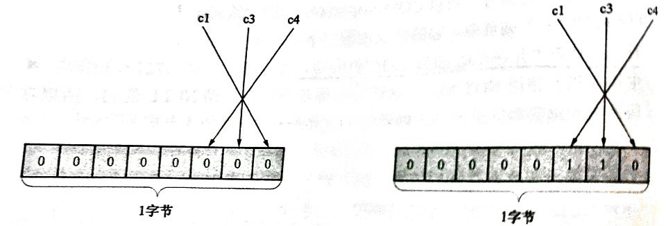

（3）记录头信息，由固定5个字节组成，这里暂且不提，后面看

（4）记录的真实数据

添加的隐藏列：

| 列名          | 是否必需 | 占用空间 | 描述                   |
| ------------- | -------- | -------- | ---------------------- |
| `DB_ROW_ID`   | 否       | 6字节    | 行ID，唯一标识一条记录 |
| `DB_TRX_ID`   | 是       | 6字节    | 事务ID                 |
| `DB_ROLL_PTR` | 是       | 7字节    | 回滚指针               |

主键生成策略：


综上，这两条记录如下：


（5）CHAR(M)

定长，少了就要补到M个字符，一般是补空格

如果CHAR(M)是utf8mb4编码，则变长字段长度列表需要修改：

.jpg)

## 2.数据页结构

### 数据页结构

InnoDB数据页结构示意图：


记录在页中的存储：一开始生成页时没有User Records部分，每插入一条记录时都会从Free Space部分申请一个记录大小的空间，并划分到User Records中


记录头信息：

①deleted_flag：记录删除为1，未删为0

!> MySQL总记录被删除只打一个标记，可它还在真实磁盘上，所有被删记录会组成一个垃圾链表，占用空间称为可重用空间

②heap_no：记录亲密无间排列的结构称为堆（heap），每插入一条记录heap_no加1

特别：

+ heap_no==0：Infimum记录
+ heap_no==1：Supremum记录

任何用户记录都比Infimum大，比Supremum小，单独放在一个称为

`Infimum+Supremum`的部分

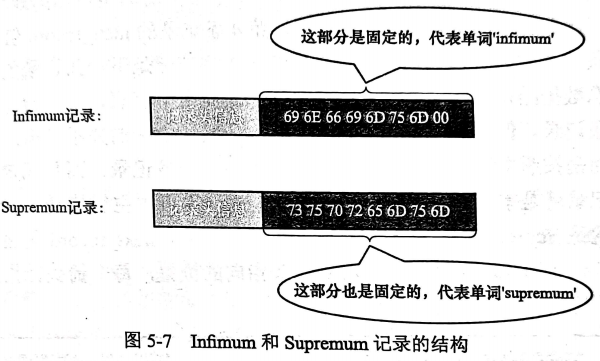

③record_type

+ 0表示普通记录，
+ 1表示B+树非叶节点的目录项记录
+ 2表示Infimum记录
+ 3表示Supremum记录

④next_record：从当前记录真空数据到下条记录的真实距离

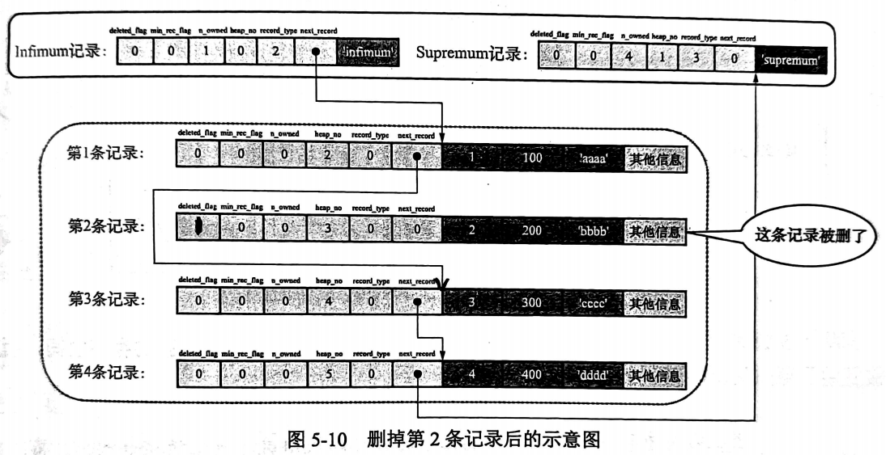

### Page Directory

n_owned属性：表示该组内共有几条记录

每个槽中存放每个组中最大那条记录在页面中的地址偏移量，每个槽占2字节

?> 可使用二分查找表中的某项

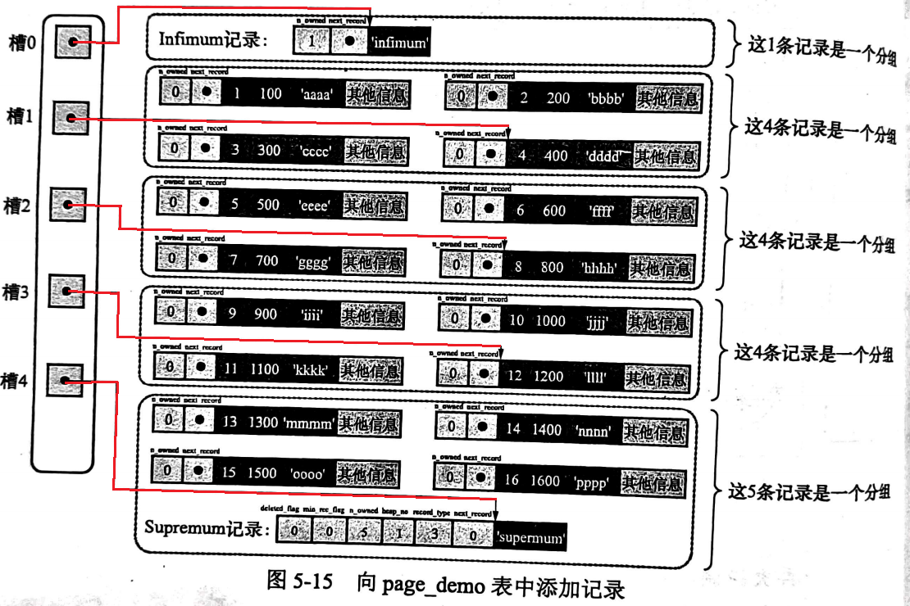

### Page Header


### File Header

通过FIL_PAGE_PREV和FIL_PAGE_NEXT指针索引上一页和下一页：


## 3.B+树索引

### 索引的建立和底层原理

先建一张表：

```sql
CREATE TABLE index_demo(
    c1 INT,
    c2 INT,
    c3 CHAR(1),
    PRIMARY KEY(c1)
);
```

索引：

+ 下一张数据页中用户记录的主键值必须大于上一页中用户记录的主键值。新插入的页不满足这个条件会自动调整到这样的结构
+ 给所有页建立一个目录页
  + 页的用户记录中的最小的主键值，用key表示
  + 页号，用page_no表示


目录项记录和用户记录的不同点：

+ 目录项记录的record_type值为1，普通用户的record_type值为0
+ **目录项记录只有主键值和页的编号两个列，而普通用户记录的列是用户自己定义的**
+ 只有目录项记录的min_rec_flag属性才可能为1，普通用户记录的min_rec_flag属性都是1

?> min_rec_flag：B+树每层非叶子节点中最小的目录项记录都会添加该标记

更高层目录项记录的数据页的生成：


自顶向下查询，页内使用二分查找，查找到某个区间[a.b)，向下层索引a，直到叶子节点精确匹配到查询值

聚簇索引：

+ 使用记录的**主键值**的大小进行记录和页的排序
+ B+树的叶子节点存储的是**完整的用户记录**

> InnoDB存储引擎会自动为我们创建聚簇索引，另外，InnoDB中聚簇索引就是数据的存储方式，也就是所谓的“索引即数据，数据即索引”

二级索引：

如果以其他列作为搜索条件，可以多建几棵B+树，并不同的B+树种的数据采用不同的排序规则

+ 使用记录**c2列**的大小进行记录和页的排序
+ B+树的叶子节点存储的并不是完整的用户记录，而是**c2列+主键**这两个列的值
+ 目录项记录不再是主键+页号的搭配，而变成列c2列+页号的搭配


回表操作：通过二级索引查询到的主键信息再次返回到聚簇索引中查找完整的用户记录

联合索引：

+ 先把各记录和页按照c2列进行排序
+ 在记录的c2列相同的情况下，再采用c3列进行排序

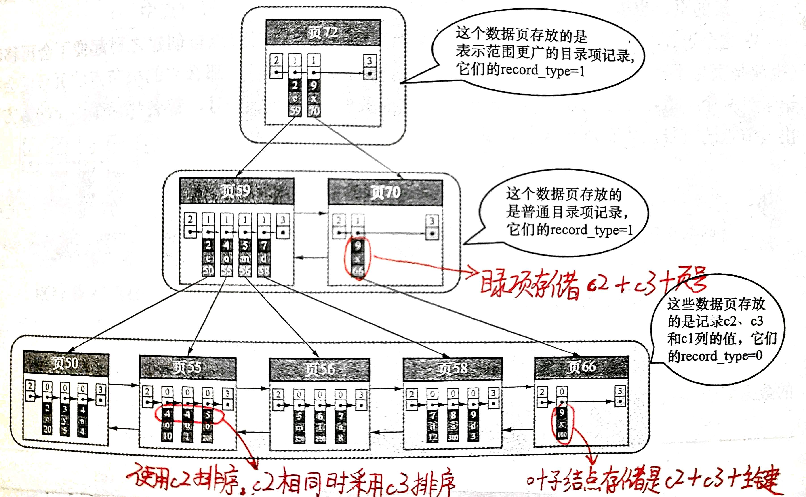

!> “以c2和c3列大小为排序规则建立联合索引”和“分别为c2和c3列建立索引”的表述是不同的，前者建立的如图所示，后者是以c2和c3列为排序规则建立两棵B+树

### 一些注意事项

1.一个页面最少容纳2条记录，就是Infimum+Supremum

2.内节点中目录项记录的唯一性：

如果记录出现重复，二级索引的内节点会加上主键这条

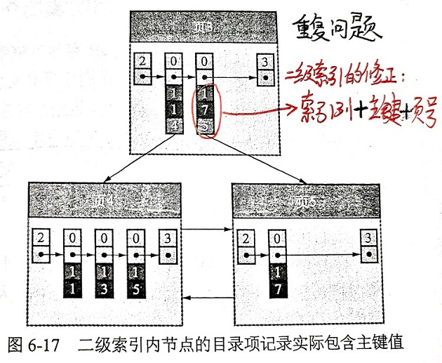

## 4.索引的应用

### 初始化数据

先建一张表：

```sql
CREATE TABLE single_table(
    -- 主键，为id列建立聚簇索引
	id INT NOT NULL AUTO_INCREMENT,
    key1 VARCHAR(100),
    key2 INT,
    key3 VARCHAR(100),
    key_part1 VARCHAR(100),
    key_part2 VARCHAR(100),
    key_part3 VARCHAR(100),
    common_field VARCHAR(100),
    PRIMARY KEY (id),
    -- 二级索引idx_key1
    KEY idx_key1 (key1),
    -- 唯一二级索引idx_key2
    UNIQUE KEY uk_key2 (key2),
    -- 二级索引idx_key3
    KEY idx_key3 (key3),
    -- 联合索引idx_key_part，由key_part1,key_part2,key_part3建立
    KEY idx_key_part(key_part1,key_part2,key_part3),
)Engine=InnoDB CHARSET=utf8;
```

索引是有代价的，主要如下：

+ 空间
  + 每建立一个索引，都要为它建立一颗B+树
+ 时间
  + 每当对表中的数据进行增删改操作时，都需要修改各个B+树
  + 增删改操作可能会对节点和记录的排序造成破坏，所以存储引擎需要额外的时间进行页面分裂、页面回收等操作，以维护节点和记录的排序

回表是有代价的：

+ 如果需要执行回表操作的记录数越多，就越倾向于使用全表扫描，反之倾向于使用二级索引+回表的方式

```sql
-- 扫描key1索引全表，之后还要回表，查询效率低下
SELECT * FROM single_table ORDER BY key1;
```

### 扫描区间和边界条件

```sql
SELECT * FROM single_table WHERE key2 IN (1438,6328) OR (key2>=38 AND key<=79);
```

扫描区间如下，表示在数轴上：

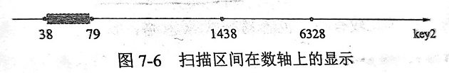

!> 使用不同的索引得到的扫描区间就不同

对于B+树索引来说，只要索引列和常数使用`=、<=>、IN、NOT IN、IS NULL、IS NOT NULL、>、<、>=、<=、BETWEEN、!=（也可以写作<>）、LIKE连接符`，就可以产生扫描区间

+ IN操作符与若干个等值匹配操作符（=）之间用OR连接起来的语义是一样的，都会产生多个单点扫描区间

```sql
SELECT * FROM single_table WHERE key2 IN (1438,6328);
SELECT * FROM single_table WHERE key2 = 1438 OR key2 = 6328);
```

+ !=产生的区间是挖掉这点
+ LIKE：只有在匹配完整的字符串或者匹配字符串前缀时才会产生合适的扫描区间

比如匹配"a%"：

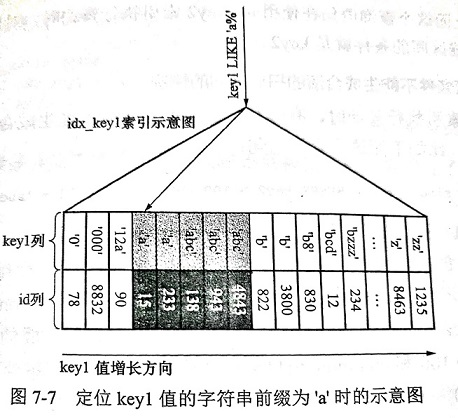

关于扫描空间的计算，有四种情况：

1.所有条件都能生成扫描区间

```sql
-- 取交集
SELECT * FROM single_table WHERE key2 > 100 AND key2 > 200;
-- 取并集
SELECT * FROM single_table WHERE key2 > 100 OR key2 > 200;
```

2.部分条件不能生成扫描区间

```sql
SELECT * FROM single_table WHERE key2 > 100 AND common_field = 'abc';
```

在使用uk_key2执行查询时，在寻找对应的扫描区间过程中，搜索条件`common_field = 'abc'`没有起到任何作用

3.从复杂搜索条件中找出扫描区间，需要进行化简

4.联合索引执行查询时对应的扫描区间

```sql
SELECT * FROM single_table WHERE key_part1 = 'a' AND key_part2 = 'b';
```


```sql
SELECT * FROM single_table WHERE key_part1 < 'b' AND key_part2 = 'a';
```

这个查询不能根据搜索条件`key_part2 = 'a';`来进一步缩小扫描区间

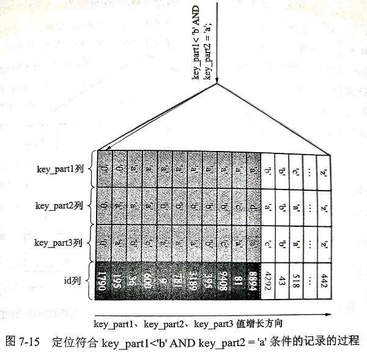

```sql
SELECT * FROM single_table WHERE key_part1 = 'a' AND key_part2 > 'a' AND key_part2 < 'd';
```


### 索引用于排序、分组

文件排序：在内存或磁盘中通过排序算法进行排序的方式。但如果`ORDER BY`子句中使用来索引列，就有可能省去在内存或磁盘中排序的步骤。

```sql
SELECT * FROM single_table ORDER BY key_part1, key_part2, key_part3 LIMIT 10;
```

1.使用联合索引进行排序时的注意事项

`ORDER BY`子句后面的列的顺序也必须按照索引树的顺序给出，若给出`key_part3, key_part2, key_part1`的顺序，则无法使用B+树

2.不可以使用索引进行排序的情况

（1）要求各个排序列的排序顺序一致（ASC、DESC）

```sql
ORDER BY key_part1,key_part2 LIMIT 10;
ORDER BY key_part1 DESC,key_part2 DESC LIMIT 10;
```

（2）排列列包含非同一个索引列

```sql
SELECT * FROM single_table ORDER BY key1,key2 LIMIT 10;
```

对idx_key1的二级索引记录来说，只按照key1列的值进行排序。在key1值相同的情况下是不按照key2列的值进行排序的，所以不能使用idx_key1索引执行上述查询。

（3）排序列是某个索引的索引列，但是这些排序列在联合索引中并不连续

```sql
SELECT * FROM single_table ORDER BY key_part1,key_part3 LIMIT 10;
```

（4）用来形成扫描区间的索引列和排序列不同

```sql
SELECT * FROM single_table WHERE key1 = 'a' ORDER BY key2 LIMIT 10;
```

`key1='a'`用来形成扫描区间，使用`idx_key1`执行该查询时，仅需要扫描key1值为'a'的二级索引记录即可。此时无法使用uk_key2执行上述查询。

（5）排序列不是以单独列名形式出现在`ORDER BY`子句中

```sql
SELECT * FROM single_table ORDER BY UPPER(key1) LIMIT 10;
```

`UPPER(key1)`就是修饰过的，不能作为索引

用于分组：

```sql
SELECT key_part1,key_part2,key_part3,count(*) FROM single_table GROUP BY key_part1,key_part2,key_part3;
```

与使用B+树索引进行排序相同，分组列的顺序也需要和索引列的顺序一致

### 索引的优化

（1）只为用于搜索、排序或分组的列创建索引

```sql
SELECT common_field,key_part3 FROM single_table WHERE key1 = 'a';
```

common_field、key_part3就没有必要创建索引，只要给key1创建索引就行

（2）考虑索引列中不重复值的个数

（3）索引列的类型尽量小

BIGINT---->INT---->MEDIUMINT

数据类型越小，索引占用的空间就越少，一个数据页内就可以存放更多的记录

（4）为列前缀建立索引

```sql
ALTER TABLE single_table DROP INDEX idx_key1;
ALTER TABLE single_table AND INDEX idx_key1(key1(10));
-- 索引前10位，只能定位到'abcdefghij'
SELECT * FROM single_table WHERE key1 = 'abcdefghijklmn';
```

（5）覆盖索引

!> 最好在查询列表中只包含索引列

```sql
SELECT key1,id FROM single_table WHERE key1>'a' AND key1<'c';
```

使用`key1,id`就能省去回表操作的性能损耗，当然有时候以业务为重，不得不查询索引列外的列

（6）索引列单独以列名方式出现

```sql
-- 索引列名不是单独出现
SELECT * FROM s1 single_table WHERE key2 * 2 < 4;
-- 单独出现，效率更高
SELECT * FROM s1 single_table WHERE key2 < 4/2;
```

（7）新插入记录

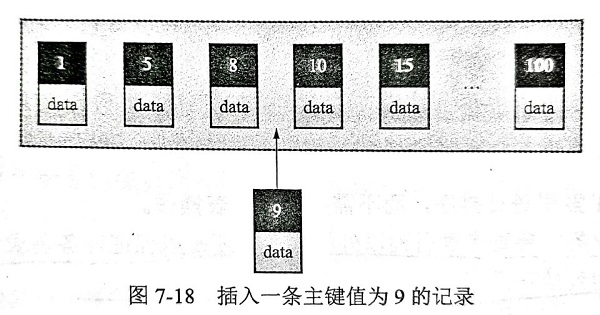

原先满页的话插入新记录就不得不页面分裂，解决办法就是一开始就设置主键递增，这样只能在链表末尾插入

（8）冗余和重复索引

+ 对主键另外建立索引是多余的
+ 建立的一个索引对另一个是包含关系

## 5.MySQL数据目录

查看数据目录位置：

```sql
mysql> show variables like 'datadir';
+---------------+--------------------+
| Variable_name | Value              |
+---------------+--------------------+
| datadir       | G:\DataBase\MySQL\ |
+---------------+--------------------+
1 row in set, 1 warning (0.00 sec)
```

描述表结构的文件：`.frm`

描述表空间的文件：`.ibd`，默认大小为12MB，自控展

在MySQL5.6.6后的版本，InnoDB默认把表数据存放到独立表空间中，之前是放在系统表空间

```bash
[server]
innodb_data_file_path=datal:512M;data2:512M:autoextend
```

文件系统对数据库的影响：

+ 数据库名称和表名称不得超过文件系统所允许的最大长度
+ 特殊字符的问题
  + 除数字和拉丁字母以外的任何字符在文件名中都映射成`@+编码值`的形式，并将其作为文件名
  + 比如表名`test?`映射后变成了`test@003f.frm`
+ 文件长度受到问下系统最大长度的限制

系统数据库：存储MySQL服务器允许过程中所需的信息以及运行的状态信息

+ mysql
+ information_schema
+ performance_schema
+ sys

## 6.InnoDB表空间

这章讲的是表空间的字段和存储，用下面这张图表示：

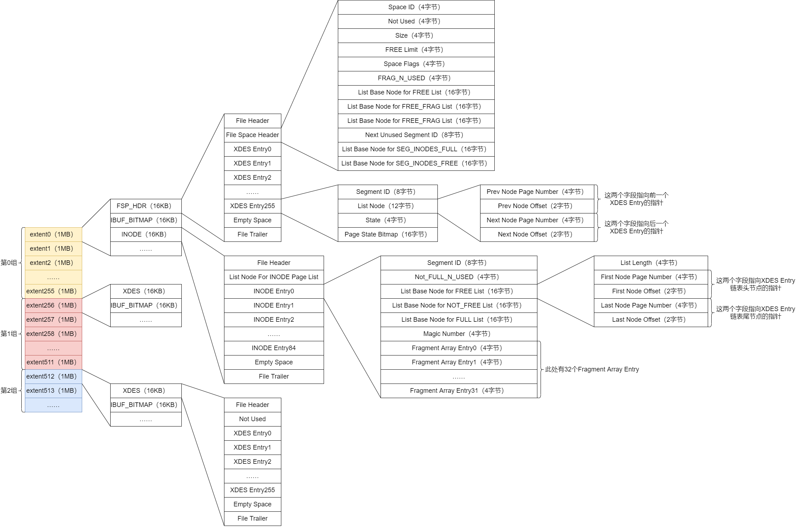

### 页面通用类型

File Header各个组成部分：

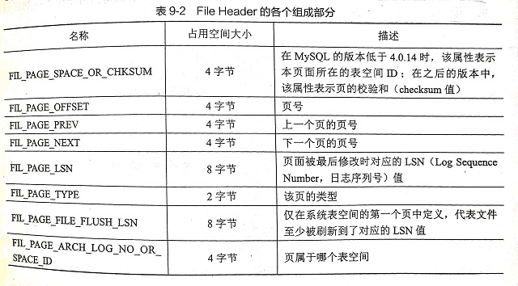

常用的页面类型，即上述字段`FIL_PAGE_TYPE`处存放的值：

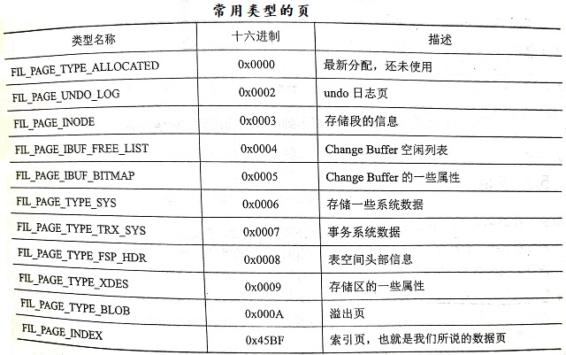


