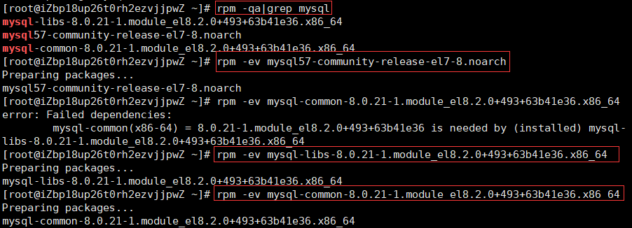
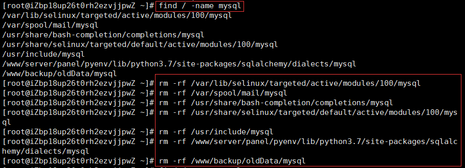

# 卸载

## 卸载已安装的程序

mysql卸载主要分为三步：

1. 卸载已安装的mysql程序；
2. 删除相关的文件夹；
3. 删除my.cnf文件。

```bash
# 查看已经安装的mysql程序
rpm -qa|grep mysql
# 按照查询结果一一删除
rpm -ev mysql57-community-release-el7-8.noarch
```



## 删除相关的文件夹

```bash
# 查询mysql目录
find / -name mysql
# 按照查询结果一一删除
rm -rf /var/lib/selinux/targeted/active/modules/100/mysql
```



## 删除配置文件

```bash
# 删除配置文件
rm -rf /etc/my.cnf
```

# 下载

## 下载


```bash
# 下载mysql80-community-release-el8-1.noarch.rpm包
wget http://repo.mysql.com/mysql80-community-release-el8-1.noarch.rpm
```