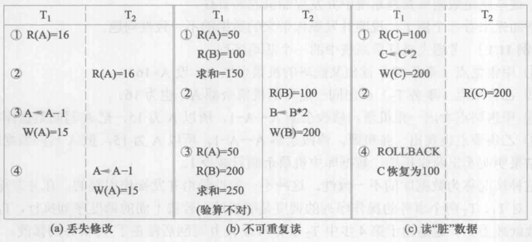
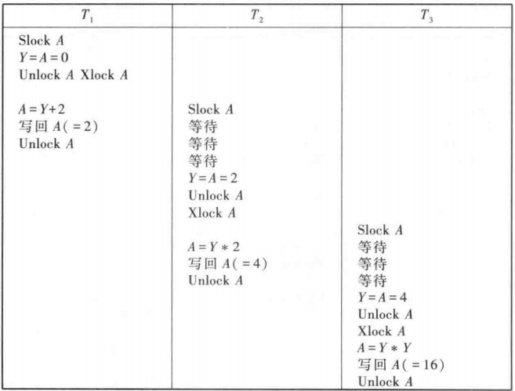

# 范式

> 1NF：关系中的每个属性都是原子，不可再分的
>
> 2NF：满足1NF且这张表中**不存在属性对主键的部分函数依赖**
>
> 3NF：满足2NF且**不存在属性对主键的传递依赖**
>
> BCNF：要求关系模式中，**属性之间的函数依赖关系里面的决定值都必须为主键**

根据上一步，找到各个模式的传递依赖：

# E-R图

## 例题1

> 注意：**实体与实体之间必须要有联系（菱形）**

## 例题2

# 日志

日志记录如下：

> **事件结束点在检测点前：不用重做**
>
> **事件结束点在检测点后，在故障点前：重做**
>
> **事件正在完成：回滚**
>
> **事件结束点在故障点后：撤销**
>
> 

> 回滚之前的数据不算了，重写就是重新写入一次

# 并发控制

## 知识点

丢失修改：两个事务T1和T2读入同一数据并修改，T2提交的结果破坏了T1提交的结果，导致T1的修改被丢失。

不可重复读：T1读取数据后，T2执行更新操作，使得T1无法再现前一次读取结果。

读“脏”数据：T1数据更新，T2读取的是过期的数据

排他锁——X锁——写锁：只有T能修改A

共享锁——S锁——读锁：T可读不能写

一级封锁协议：T在修改数据R前必须加上X锁，事务结束后释放。

二级封锁协议：在一级封锁协议基础上，T在读取数据R前必须先加上S锁，**读取完了释放。**

三级封锁协议：在一级封锁协议基础上，T在读取数据R前必须先加上S锁，**事务结束后释放。**

定义多个事务的并发执行是正确的，当且仅当**其结果与按某一次序串行地执行这些事务时的结果相同**，称这种调度策略为**可串行化（serializable）调度**。

冲突操作：冲突操作是指**不同的事务对同一个数据的读写操作和写写操作**

**两段锁协议：** 是指所有的事务必须分两个阶段对数据项加锁和解锁。即`事务分两个阶段`，第一个阶段是`获得封锁`。事务可以获得任何数据项上的任何类型的锁，但是不能释放；第二阶段是`释放封锁`，事务可以释放任何数据项上的任何类型的锁，但不能申请。

第一阶段是获得封锁的阶段，称为`扩展阶段`：其实也就是该阶段可以进入加锁操作，`在对任何数据进行读操作之前要申请获得S锁`，`在进行写操作之前要申请并获得X锁`，`加锁不成功，则事务进入等待状态`，直到加锁成功才继续执行。就是`加锁后就不能解锁`了。

第二阶段是释放封锁的阶段，称为`收缩阶段`：当事务释放一个封锁后，事务进入封锁阶段，在该阶段`只能进行解锁而不能再进行加锁操作`。

死锁：T1和T2互相等待

## 例题1

> 非串行化调度得到的结果不是正常排列出的结果，比如下面结果为0，而根据①问知正常结果为2、4、8、16
>
> 但③问中是违反两段锁协议的

> 上锁后执行其他事务可以避免死锁

## 例题2

## 例题3

