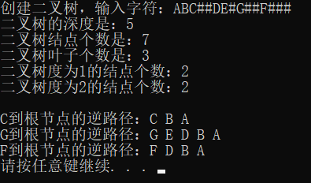

二叉树的基本操作，C语言实现
```c
#include <iostream>
#include <stdlib.h>
using namespace std;
typedef struct node
{
	char sh;
	struct node *lchild, *rchild;
}TreeNode, *pTreeNode;

//这里注意，必须要使用&，不然后面求二叉树深度时有误
void Creat_Tree(pTreeNode & T)
{
	char ch;
	cin >> ch;
	if (ch == '#')
		T = NULL;
	else
	{
		T = new TreeNode;
		T->sh = ch;
		Creat_Tree(T->lchild);
		Creat_Tree(T->rchild);
	}
}
void Before_Search(pTreeNode T)
{
	//二叉树先序遍历
	if (T)
	{
		cout << T->sh;
		Before_Search(T->lchild);
		Before_Search(T->rchild);
	}
}
void Medium_Search(pTreeNode T)
{
	//二叉树中序遍历
	if (T)
	{
		Medium_Search(T->lchild);
		cout << T->sh;
		Medium_Search(T->rchild);
	}
}
void Last_Search(pTreeNode T)
{
	//二叉树后序遍历
	if (T)
	{
		Last_Search(T->lchild);
		Last_Search(T->rchild);
		cout << T->sh;
	}
}
int Depth_Tree(pTreeNode T)
{
	int m, n;
	if (T == NULL)
		return 0;
	{
		m = Depth_Tree(T->lchild);
		n = Depth_Tree(T->rchild);
		if (m > n)
			return m + 1;
		else
			return n + 1;
	}
}
int NumNode_Tree(pTreeNode T)
{
	if (T == NULL)
		return 0;
	else
		return NumNode_Tree(T->lchild) + NumNode_Tree(T->rchild) + 1;
}
int Leaves_Num_Tree(pTreeNode T)
{
	//定义静态变量使之在函数返回前一直存在
	static int LeavesNum = 0;
	if (T == NULL)
		return 0;
	//如果左和右孩子同时为空，则返回叶子树目
	//否则继续访问该结点的左孩子和右孩子

	if (T->lchild == NULL && T->rchild == NULL)
		LeavesNum++;
	else
	{
		Leaves_Num_Tree(T->lchild);
		Leaves_Num_Tree(T->rchild);
	}
	return LeavesNum;
}
int Branch_1_Tree(pTreeNode T)
{
	static int Branch_1_Num = 0;
	if (T == NULL)   //都空
		return 0;
	//如果左孩子为空或者右孩子为空，则返回度为1的结点个数
	//否则继续访问该结点的左孩子和右孩子
	if ((T->lchild == NULL && T->rchild != NULL) || (T->lchild != NULL && T->rchild == NULL))   //一个为空
	{
		Branch_1_Num++;
	}
	if (T->lchild != NULL || T->rchild != NULL) 
	{
		//10、11、01
		//左孩子不空右孩子空、左右都空、左孩子空右孩子不空
		//因此递归调用的条件是左孩子和右孩子不都为空
		Branch_1_Tree(T->lchild);
		Branch_1_Tree(T->rchild);
	}
	return Branch_1_Num;
}
int Branch_2_Tree(pTreeNode T)
{
	static int Branch_2_Num = 0;
	if (T == NULL)   //都空
		return 0;
	if (T->lchild != NULL && T->rchild != NULL)   //一个为空
		Branch_2_Num++;
	//有一个为空时候进行递归调用
	if (T->lchild != NULL || T->rchild != NULL)
	{
		Branch_2_Tree(T->lchild);
		Branch_2_Tree(T->rchild);
	}
	return Branch_2_Num;
}
void AllPath(pTreeNode T)
{
	int i;
	//定义静态变量，使得其一直保存到函数调用结束为止
	static int pathlen = 0;
	static char path[100];
	if (T != NULL)
	{
		if (T->lchild == NULL&&T->rchild == NULL)
		{
			printf("%c到根节点的逆路径：%c ", T->sh, T->sh);
			for (i = pathlen - 1; i >= 0; i--)
				printf("%c ", path[i]);
			printf("\n");
		}
		else
		{
			path[pathlen] = T->sh;//将当前节点放入路径中
			pathlen++;//路径长度增1
			AllPath(T->lchild);
			AllPath(T->rchild);
			pathlen--;
		}
	}
}
void main()
{
	pTreeNode T = NULL;
	cout << "创建二叉树，输入字符：" ;
	Creat_Tree(T);
	int depth = Depth_Tree(T);
	cout << "二叉树的深度是：";
	cout << depth << endl;

	int num = NumNode_Tree(T);
	cout << "二叉树结点个数是：";
	cout << num << endl;

	int Leaves_Num = Leaves_Num_Tree(T);
	cout << "二叉树叶子个数是：";
	cout << Leaves_Num << endl;
	
	int Branch_1_Num = Branch_1_Tree(T);
	cout << "二叉树度为1的结点个数：";
	cout << Branch_1_Num << endl;

	int Branch_2_Num = Branch_2_Tree(T);
	cout << "二叉树度为2的结点个数：";
	cout << Branch_2_Num << endl;

	cout << endl;
	AllPath(T);
	system("pause");
}
```

