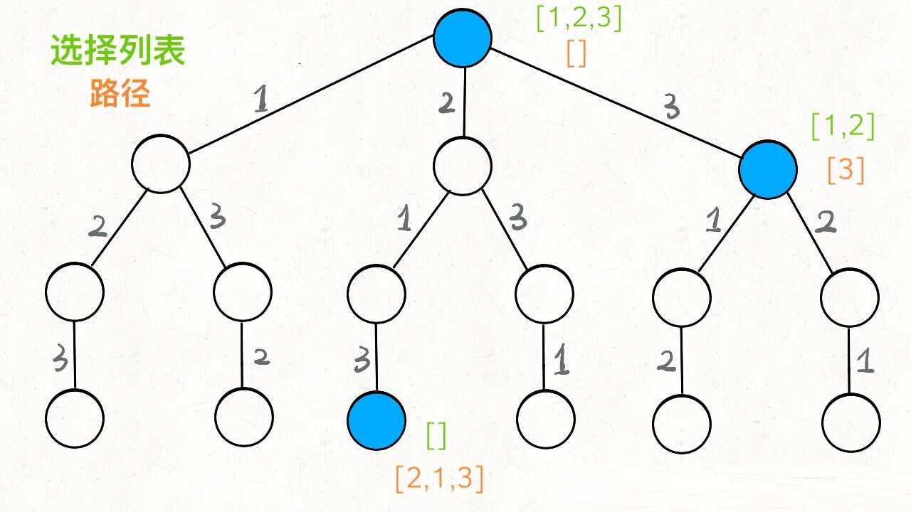
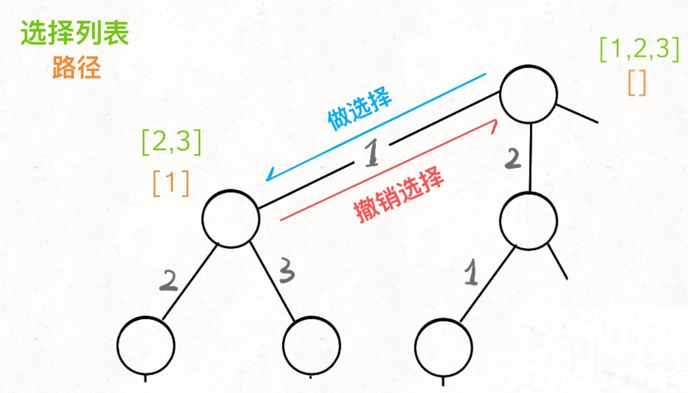
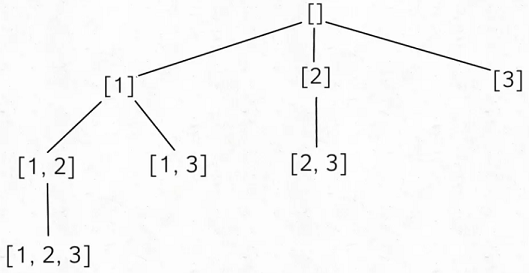
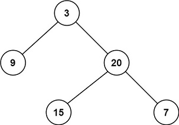

# DFS

## 套路框架

**解决一个回溯问题，实际上就是一个决策树的遍历过程**。你只需要思考 3 个问题：

1、路径：也就是已经做出的选择。

2、选择列表：也就是你当前可以做的选择。

3、结束条件：也就是到达决策树底层，无法再做选择的条件。

```python
result = []
def backtrack(路径, 选择列表):
    if 满足结束条件:
        result.add(路径)
        return

    for 选择 in 选择列表:
        做选择
        backtrack(路径, 选择列表)
        撤销选择
```

**其核心就是 for 循环里面的递归，在递归调用之前「做选择」，在递归调用之后「撤销选择」**，特别简单。

## 求全排列（permutation）

[leetcode-46](https://leetcode-cn.com/problems/permutations/)

对`[1,2,3]`进行全排列，可以绘制一个决策树

**`[2]` 就是「路径」，记录你已经做过的选择；`[1,3]` 就是「选择列表」，表示你当前可以做出的选择；「结束条件」就是遍历到树的底层，在这里就是选择列表为空的时候**。

可以把「路径」和「选择」列表作为决策树上每个节点的属性，比如下图：



我们定义的 `backtrack` 函数其实就像一个指针，在这棵树上游走，同时要正确维护每个节点的属性，每当走到树的底层，其「路径」就是一个全排列。

「路径」和「选择」是每个节点的属性，函数在树上游走要正确维护节点的属性，那么就要在这两个特殊时间点搞点动作：



**我们只要在递归之前做出选择，在递归之后撤销刚才的选择**，就能正确得到每个节点的选择列表和路径。

```java
class Solution {
    // 结果保存在res中，列表每项也是列表
    private List<List<Integer>> res = new LinkedList<>();
    public List<List<Integer>> permute(int[] nums) {
        LinkedList<Integer> track = new LinkedList<>();
        backtrack(nums,track);
        return res;
    }

    private void backtrack(int[] nums,LinkedList<Integer> track){
        // 到达决策树底部时返回，进行回溯
        if(track.size()==nums.length){
            res.add(new LinkedList(track));
            return;
        }
        for(int num:nums){
            // 不能让路径track中节点重复
            if(track.contains(num)){
                continue;
            }
            // 增加访问的节点到路径中
            track.add(num);
            backtrack(nums,track);
            // 回溯后，将尾部节点移除
            track.removeLast();
        }
    }
}
```

## N 皇后问题

[leetcode-51](https://leetcode-cn.com/problems/n-queens/)

`n`皇后问题 研究的是如何将`n`个皇后放置在`n×n`的棋盘上，并且使皇后彼此之间不能相互攻击。

给你一个整数`n`，返回所有不同的`n`皇后问题 的解决方案。

每一种解法包含一个不同的`n`皇后问题 的棋子放置方案，该方案中`'Q'`和`'.'`分别代表了皇后和空位。


```
输入：n = 4
输出：[[".Q..","...Q","Q...","..Q."],["..Q.","Q...","...Q",".Q.."]]
解释：如上图所示，4 皇后问题存在两个不同的解法。
```

思路相同，DFS遍历：

```java
class Solution {
    List<List<String>> result = new ArrayList<>();
    public List<List<String>> solveNQueens(int n) {
        List<String> track = new ArrayList<>();
        backtrack(track, 0, n);
        return result;
    }

    public void backtrack(List<String> list, int row, int n) {
        // 满足条件，加入到结果列表中，然后返回。
        if(row == n) {
            result.add(new ArrayList<>(list));
            return;
        }
        for(int i = 0; i < n; i++) {
            // 如果放置在该位置合法，则进行递归
            if(isValid(i, list, row, n)) {
                // 生成该行的字符串
                list.add(generateString(i, n));
                backtrack(list, row+1, n);
                list.remove(list.size()-1);
            }
        }
    }

    // 判断pos这个位置是否合法
    public boolean isValid(int pos, List<String> list, int row, int n) {
        // 判断竖着有没有重合的
        for(int i = 0; i < row; i++) {
            if(list.get(i).charAt(pos) == 'Q') {
                return false;
            }
        }
        // 判断斜向有没有重合的
        for(int i = row-1, j = pos-1; i >= 0 && j >= 0; i--, j--) {
            if(list.get(i).charAt(j) == 'Q') {
                return false;
            }
        }
        for(int i = row-1, j = pos+1; i >= 0 && j < n; i--, j++) {
            if(list.get(i).charAt(j) == 'Q') {
                return false;
            }
        }
        return true;
    }

    // 对pos这行这个位置前标记为".",这个位置标记为"Q",后面的也标记为"."
    public String generateString(int pos, int n) {
        StringBuilder sb = new StringBuilder();
        for(int i = 0; i < pos; i++) {
            sb.append(".");
        }
        sb.append("Q");
        for(int i = pos+1; i < n; i++) {
            sb.append(".");
        }
        return sb.toString();
    }
}
```

## 求子集（subset）

[leetcode-78](https://leetcode-cn.com/problems/subsets/)

给你一个整数数组 `nums` ，数组中的元素 **互不相同** 。返回该数组所有可能的子集（幂集）。

解集 **不能** 包含重复的子集。你可以按 **任意顺序** 返回解集。

**示例 1：**

```
输入：nums = [1,2,3]
输出：[[],[1],[2],[1,2],[3],[1,3],[2,3],[1,2,3]]
```



```java
class Solution {
    List<List<Integer>> res = new LinkedList<>();
    public List<List<Integer>> subsets(int[] nums) {
        LinkedList<Integer> track = new LinkedList<>();
        backtrack(nums,track,0);
        return res;
    }

    private void backtrack(int[] nums,LinkedList<Integer> track,int start){
        res.add(new LinkedList<>(track));
        for(int i=start;i<nums.length;i++){
            track.add(nums[i]);
            backtrack(nums,track,i+1);
            // 回溯
            track.removeLast();
        }
    }
}
```

## 求组合（combination）

[leetcode-77](https://leetcode-cn.com/problems/combinations/)

给定两个整数 *n* 和 *k*，返回 1 ... *n* 中所有可能的 *k* 个数的组合。

**示例：**

```
输入: n = 4, k = 2
输出:
[
  [2,4],
  [3,4],
  [2,3],
  [1,2],
  [1,3],
  [1,4],
]
```


```java
class Solution {
    List<List<Integer>> res = new LinkedList<>();
    public List<List<Integer>> combine(int n, int k) {
        LinkedList<Integer> track = new LinkedList<>();
        backtrack(n,k,track,1);
        return res;
    }

    private void backtrack(int n,int k,LinkedList<Integer> track,int start){
        if(track.size()==k){
            res.add(new LinkedList(track));
            return;
        }
        for(int i=start;i<=n;i++){
            if(track.contains(i)){
                continue;
            }
            track.add(i);
            backtrack(n,k,track,i+1);
            track.removeLast();
        }
    }
}
```

## 组合总和

[leetcode-39](https://leetcode-cn.com/problems/combination-sum/)

给定一个无重复元素的数组 candidates 和一个目标数 target ，找出 candidates 中所有可以使数字和为 target 的组合。

candidates 中的数字可以无限制重复被选取。

**说明：**

+ 所有数字（包括 target）都是正整数。
+ 解集不能包含重复的组合。 

**示例 1：**

```
输入：candidates = [2,3,6,7], target = 7,
所求解集为：
[
  [7],
  [2,2,3]
]
```

**示例 2：**

```
输入：candidates = [2,3,5], target = 8,
所求解集为：
[
  [2,2,2,2],
  [2,3,3],
  [3,5]
]
```

有两点需要注意：

+ 剪枝：sum>target要剪掉，否则会超时
+ 下一轮的start和这轮的可以相同，`backtrack(candidates,target,track,i);`中最后一个参数是`i`，而不是`i+1`

```java
class Solution {
    private List<List<Integer>> res = new LinkedList<>();
    public List<List<Integer>> combinationSum(int[] candidates, int target) {
        LinkedList<Integer> track = new LinkedList<>();
        backtrack(candidates,target,track,0);
        return res;
    }

    private void backtrack(int[] candidates, int target,LinkedList<Integer> track,int start){
        int sum = sumList(track);
        if(sum==target){
            res.add(new LinkedList(track));
            return;
        }else if(sum>target){
            return;
        }
        for(int i=start;i<candidates.length;i++){
            track.add(candidates[i]);
            backtrack(candidates,target,track,i);
            track.removeLast();
        }
    }

    private int sumList(LinkedList<Integer> track){
        int sum = 0;
        for(Integer i:track){
            sum+=i;
        }
        return sum;
    }
}
```

# BFS

## 套路框架

要说框架的话，我们先举例一下 BFS 出现的常见场景好吧，**问题的本质就是让你在一幅「图」中找到从起点 `start` 到终点 `target` 的最近距离，这个例子听起来很枯燥，但是 BFS 算法问题其实都是在干这个事儿**

记住下面这个框架就 OK 了：

```java
// 计算从起点 start 到终点 target 的最近距离
int BFS(Node start, Node target) {
    Queue<Node> q; // 核心数据结构
    Set<Node> visited; // 避免走回头路

    q.offer(start); // 将起点加入队列
    visited.add(start);
    int step = 0; // 记录扩散的步数

    while (q not empty) {
        int sz = q.size();
        /* 将当前队列中的所有节点向四周扩散 */
        for (int i = 0; i < sz; i++) {
            Node cur = q.poll();
            /* 划重点：这里判断是否到达终点 */
            if (cur is target)
                return step;
            /* 将 cur 的相邻节点加入队列 */
            for (Node x : cur.adj())
                if (x not in visited) {
                    q.offer(x);
                    visited.add(x);
                }
        }
        /* 划重点：更新步数在这里 */
        step++;
    }
}
```

队列 `q` 就不说了，BFS 的核心数据结构；`cur.adj()` 泛指 `cur` 相邻的节点，比如说二维数组中，`cur` 上下左右四面的位置就是相邻节点；`visited` 的主要作用是防止走回头路，大部分时候都是必须的，但是像一般的二叉树结构，没有子节点到父节点的指针，不会走回头路就不需要 `visited`。

## 二叉树的最小高度

[leetcode-111](https://leetcode-cn.com/problems/minimum-depth-of-binary-tree/)



```
输入：root = [3,9,20,null,null,15,7]
输出：2
```

怎么套到 BFS 的框架里呢？首先明确一下起点 `start` 和终点 `target` 是什么，怎么判断到达了终点？

**显然起点就是 `root` 根节点，终点就是最靠近根节点的那个「叶子节点」嘛**，叶子节点就是两个子节点都是 `null` 的节点：

```java
if (cur.left == null && cur.right == null) 
    // 到达叶子节点
```

那么，按照我们上述的框架稍加改造来写解法即可：

```java
public int minDepth(TreeNode root) {
    if (root == null) return 0;
    Queue<TreeNode> q = new LinkedList<>();
    q.offer(root);
    // root 本身就是一层，depth 初始化为 1
    int depth = 1;

    while (!q.isEmpty()) {
        int sz = q.size();
        /* 将当前队列中的所有节点向四周扩散 */
        for (int i = 0; i < sz; i++) {
            TreeNode cur = q.poll();
            /* 判断是否到达终点 */
            if (cur.left == null && cur.right == null) 
                return depth;
            /* 将 cur 的相邻节点加入队列 */
            if (cur.left != null)
                q.offer(cur.left);
            if (cur.right != null) 
                q.offer(cur.right);
        }
        /* 这里增加步数 */
        depth++;
    }
    return depth;
}
```

