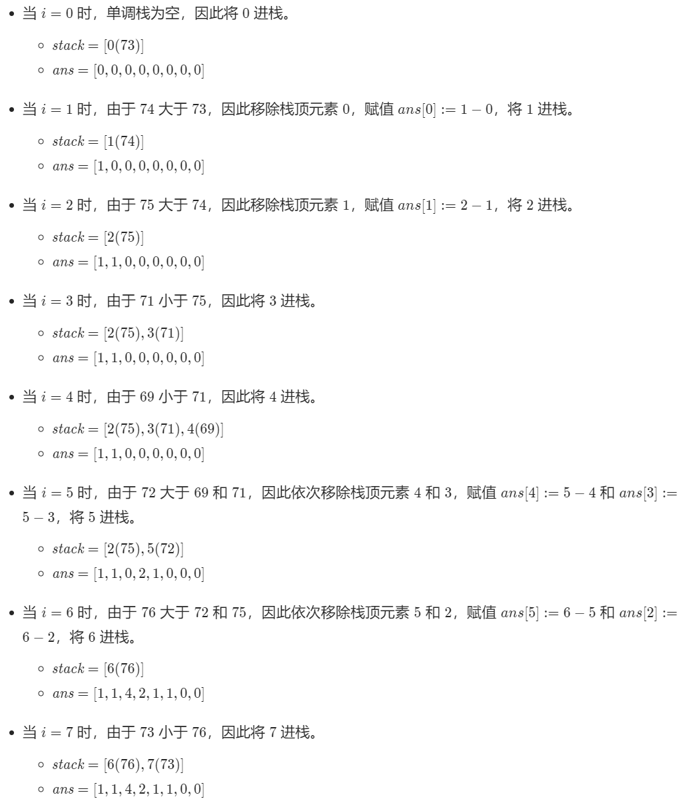

# 链表

## 141.环形链表

给定一个链表，判断链表中是否有环。

如果链表中有某个节点，可以通过连续跟踪 next 指针再次到达，则链表中存在环。 为了表示给定链表中的环，我们使用整数 pos 来表示链表尾连接到链表中的位置（索引从 0 开始）。 如果 pos 是 -1，则在该链表中没有环。注意：pos 不作为参数进行传递，仅仅是为了标识链表的实际情况。

如果链表中存在环，则返回 true 。 否则，返回 false 。

### 解法一：快慢指针

本方法需要读者对「Floyd 判圈算法」（又称龟兔赛跑算法）有所了解。

假想「乌龟」和「兔子」在链表上移动，「兔子」跑得快，「乌龟」跑得慢。当「乌龟」和「兔子」从链表上的同一个节点开始移动时，如果该链表中没有环，那么「兔子」将一直处于「乌龟」的前方；如果该链表中有环，那么「兔子」会先于「乌龟」进入环，并且一直在环内移动。等到「乌龟」进入环时，由于「兔子」的速度快，它一定会在某个时刻与乌龟相遇，即套了「乌龟」若干圈。

我们可以根据上述思路来解决本题。具体地，我们定义两个指针，一快一满。慢指针每次只移动一步，而快指针每次移动两步。初始时，慢指针在位置 head，而快指针在位置 head.next。这样一来，如果在移动的过程中，快指针反过来追上慢指针，就说明该链表为环形链表。否则快指针将到达链表尾部，该链表不为环形链表。

```java
public class Solution {
    public boolean hasCycle(ListNode head) {
        if (head==null || head.next==null){
            return false;
        }
        ListNode slow=head;
        ListNode fast=head.next;
        while (slow!=fast){
            if (fast==null || fast.next==null){
                return false;
            }else {
                slow=slow.next;
                fast=fast.next.next;
            }
        }
        return true;
    }
}
```

### 解法二、哈希表

最容易想到的方法是遍历所有节点，每次遍历到一个节点时，判断该节点此前是否被访问过。

具体地，我们可以使用哈希表来存储所有已经访问过的节点。每次我们到达一个节点，如果该节点已经存在于哈希表中，则说明该链表是环形链表，否则就将该节点加入哈希表中。重复这一过程，直到我们遍历完整个链表即可。

```java
public class Solution {
    public boolean hasCycle(ListNode head) {
        Set<ListNode> seen = new HashSet<ListNode>();
        while (head != null) {
            if (!seen.add(head)) {
                return true;
            }
            head = head.next;
        }
        return false;
    }
}
```

# 栈

## 20. 有效的括号

给定一个只包括 '('，')'，'{'，'}'，'['，']' 的字符串 s ，判断字符串是否有效。

有效字符串需满足：

左括号必须用相同类型的右括号闭合。
左括号必须以正确的顺序闭合。

**示例 1：**

```
输入：s = "()"
输出：true
```

**示例 2：**

```
输入：s = "([)]"
输出：false
```

### 解法一

```java
class Solution {
    public boolean isValid(String s) {
        int n = s.length();
        if (n % 2 == 1) {
            return false;
        }

        Map<Character, Character> pairs = new HashMap<Character, Character>();
        pairs.put(')','(');
        pairs.put(']','[');
        pairs.put('}','{');
        System.out.println(pairs);
        Stack<Character> stack = new Stack<Character>();
        for (int i = 0; i < n; i++) {
            char ch = s.charAt(i);
            if (pairs.containsKey(ch)) {
                if (stack.isEmpty() || !stack.peek().equals(pairs.get(ch))) {
                    return false;
                }
                stack.pop();
            } else {
                stack.push(ch);
            }
        }
        return stack.isEmpty();
    }
}
```

这题的思路很简单，但我写的代码一直会报空栈的错误，就是在栈为空的时候强行取出，代码的结构不对，代码如下，同样的思路我的代码是上述的两倍长度

```java
class Solution {
    public boolean isValid(String s) {
       char[] chs = s.toCharArray();
        Stack<Character> stack = new Stack<Character>();
        if (chs.length==1){
            return false;
        }
        if (chs[0]==')' || chs[0]==']' || chs[0]=='}'){
            return false;
        }
        for (int i = 0; i < chs.length; i++) {
            if (chs[i]=='(' || chs[i]=='[' || chs[i]=='{'){
                stack.push(chs[i]);
            }else {
                switch (chs[i]){
                    case ')':
                        if (stack.peek()=='('){
                            stack.pop();
                        }else {
                            return false;
                        }
                        break;
                    case ']':
                        if (stack.peek()=='['){
                            stack.pop();
                        }else {
                            return false;
                        }
                        break;
                    case '}':
                        if (stack.peek()=='{'){
                            stack.pop();
                        }else {
                            return false;
                        }
                        break;
                }
            }
        }
        if (stack.empty()){
            return true;
        }else {
            return false;
        }
    }
}
```

## 1544. 整理字符串

给你一个由大小写英文字母组成的字符串 s 。

一个整理好的字符串中，两个相邻字符 s[i] 和 s[i+1]，其中 0<= i <= s.length-2 ，要满足如下条件:

+ 若 s[i] 是小写字符，则 s[i+1] 不可以是相同的大写字符。

+ 若 s[i] 是大写字符，则 s[i+1] 不可以是相同的小写字符。

请你将字符串整理好，每次你都可以从字符串中选出满足上述条件的 两个相邻 字符并删除，直到字符串整理好为止。

请返回整理好的 字符串 。题目保证在给出的约束条件下，测试样例对应的答案是唯一的。

注意：空字符串也属于整理好的字符串，尽管其中没有任何字符。 

示例 1：

```
输入：s = "leEeetcode"
输出："leetcode"
解释：无论你第一次选的是 i = 1 还是 i = 2，都会使 "leEeetcode" 缩减为 "leetcode" 。
```

示例 2：

```
输入：s = "abBAcC"
输出：""
解释：存在多种不同情况，但所有的情况都会导致相同的结果。例如：
"abBAcC" --> "aAcC" --> "cC" --> ""
"abBAcC" --> "abBA" --> "aA" --> ""
```

### 解法一

让相邻两个字母满足以下两个条件：

+ 变成小写后相等
+ 为未变小写时候不同

即得到一大写一小写的结果，不合格的通通删除

```java
public class Solution {
    public String makeGood(String s) {
        StringBuffer ret = new StringBuffer();
        int retIndex = -1;
        int len = s.length();
        for (int i = 0; i < len; i++) {
            char ch = s.charAt(i);
            if (ret.length() > 0 && 
                    Character.toLowerCase(ret.charAt(retIndex)) == Character.toLowerCase(ch) && 
                    ret.charAt(retIndex) != ch) {
                ret.deleteCharAt(retIndex);
                retIndex--;
            } else {
                ret.append(ch);
                retIndex++;
            }
        }
        return ret.toString();
    }
}
```

自己安装官方的做法写了个用常规栈Stack的，只不过最后stack中为正序不好处理，思路都是一样的

```java
public class Solution {
    public String makeGood(String s) {        
		Stack<Character> stack = new Stack<Character>();
        for (int i = 0; i < s.length(); i++) {
            char ch = s.charAt(i);
            if (!stack.empty() &&
                    Character.toLowerCase(stack.peek()) == Character.toLowerCase(ch) &&
                    stack.peek()!=ch
            ) {
                stack.pop();
            }else {
                stack.push(ch);
            }
        }
        Stack<Character> stack2 = new Stack<Character>();
        while (!stack.empty()){
            stack2.push(stack.pop());
        }
        StringBuffer stringBuffer = new StringBuffer();
        while (!stack2.empty()){
            stringBuffer.append(stack2.pop());
        }
        return stringBuffer.toString();
    }
}
```

## 739.每日温度

请根据每日气温列表，重新生成一个列表。对应位置的输出为：要想观测到更高的气温，至少需要等待的天数。如果气温在这之后都不会升高，请在该位置用 0 来代替。

例如，给定一个列表`temperatures = [73, 74, 75, 71, 69, 72, 76, 73]`，你的输出应该是 `[1, 1, 4, 2, 1, 1, 0, 0]`。

### 解法一：暴力求解

```java
public class Solution {
    public int[] dailyTemperatures(int[] T) {
        int len=T.length;
        int[] result=new int[len];
        for (int i = 0; i < len; i++) {
            int nowT=T[i];
            for (int j = i; j < len; j++) {
                if (nowT<T[j]){
                    result[i]=j-i;
                    break;
                }else {
                    result[i]=0;
                }
            }
        }
        return result;
    }
}
```

### 方法二：单调栈

根据官网解释，该题目的单调栈变化如下：



> 在单调栈中，对于任何一个元素，位置`i`，下一个最近的比它大的元素的距离保存在`ans[i]`中，位置为`i+ans[i]`。
>
> 如：2+ans[2]=6，即在序列{73,74,75,71,69,72,76,73}中，75(pos=2)下一个最近的比它大的元素为76(pos=6)

```java
class Solution {
    public int[] dailyTemperatures(int[] T) {
        int length = T.length;
        int[] ans = new int[length];
        Deque<Integer> stack = new LinkedList<Integer>();
        for (int i = 0; i < length; i++) {
            int temperature = T[i];
            while (!stack.isEmpty() && temperature > T[stack.peek()]) {
                int prevIndex = stack.pop();
                ans[prevIndex] = i - prevIndex;
            }
            stack.push(i);
        }
        return ans;
    }
}
```


