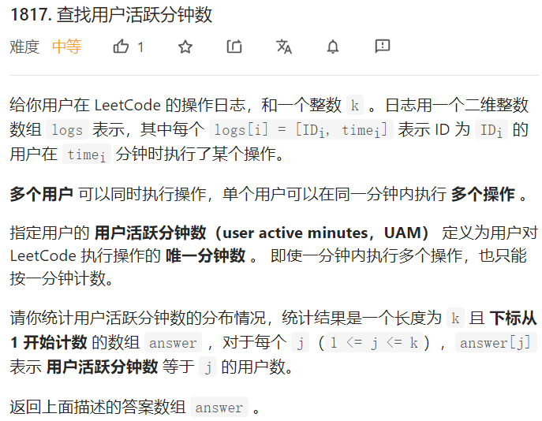
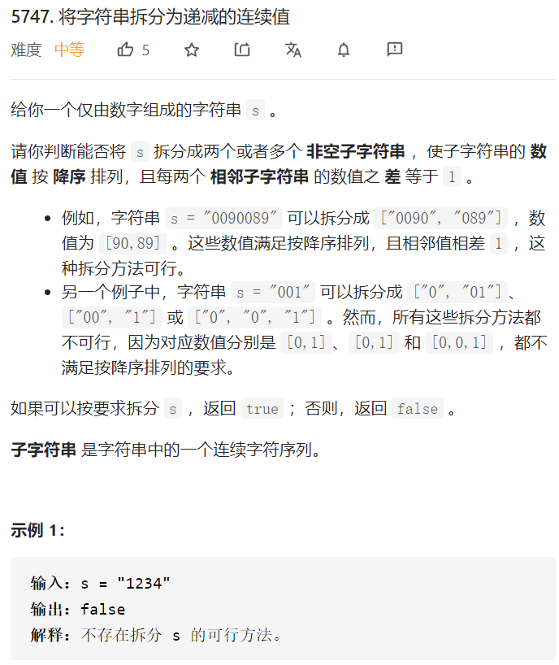

# 查找用户活跃分钟数



**示例 1：**

```
输入：logs = [[0,5],[1,2],[0,2],[0,5],[1,3]], k = 5
输出：[0,2,0,0,0]
解释：
ID=0 的用户执行操作的分钟分别是：5 、2 和 5 。因此，该用户的用户活跃分钟数为 2（分钟 5 只计数一次）
ID=1 的用户执行操作的分钟分别是：2 和 3 。因此，该用户的用户活跃分钟数为 2
2 个用户的用户活跃分钟数都是 2 ，answer[2] 为 2 ，其余 answer[j] 的值都是 0
```

**示例 2：**

```
输入：logs = [[1,1],[2,2],[2,3]], k = 4
输出：[1,1,0,0]
解释：
ID=1 的用户仅在分钟 1 执行单个操作。因此，该用户的用户活跃分钟数为 1
ID=2 的用户执行操作的分钟分别是：2 和 3 。因此，该用户的用户活跃分钟数为 2
1 个用户的用户活跃分钟数是 1 ，1 个用户的用户活跃分钟数是 2 
因此，answer[1] = 1 ，answer[2] = 1 ，其余的值都是 0
```

解法：

```java
class Solution {
    public int[] findingUsersActiveMinutes(int[][] logs, int k) {
        Map<Integer, Set<Integer>> map = new HashMap<>();
        // 将数组logs放入到哈希表中，并将重复的元素删除
        for(int[] x:logs){
            if(!map.containsKey(x[0])){
                Set<Integer> set = new TreeSet<>();
                set.add(x[1]);
                map.put(x[0],set);
            }else{
                map.get(x[0]).add(x[1]);
            }
        }
        int[] ans = new int[k];
        // 遍历哈希表
        for(Map.Entry<Integer, Set<Integer>> entry:map.entrySet()){
            // 数组下标表示活跃度为0,1,2,3,4……的位置
            ans[entry.getValue().size()-1]++;
        }
        return ans;
    }
}
```

# 绝对差值和


**示例 1：**

```
输入：nums1 = [1,7,5], nums2 = [2,3,5]
输出：3
解释：有两种可能的最优方案：
- 将第二个元素替换为第一个元素：[1,7,5] => [1,1,5] ，或者
- 将第二个元素替换为第三个元素：[1,7,5] => [1,5,5]
两种方案的绝对差值和都是 |1-2| + (|1-3| 或者 |5-3|) + |5-5| = 3
```

**示例 2：**

```
输入：nums1 = [2,4,6,8,10], nums2 = [2,4,6,8,10]
输出：0
解释：nums1 和 nums2 相等，所以不用替换元素。绝对差值和为 0
```

**示例 3：**

```
输入：nums1 = [1,10,4,4,2,7], nums2 = [9,3,5,1,7,4]
输出：20
解释：将第一个元素替换为第二个元素：[1,10,4,4,2,7] => [10,10,4,4,2,7]
绝对差值和为 |10-9| + |10-3| + |4-5| + |4-1| + |2-7| + |7-4| = 20
```

# 将字符串拆分为递减的连续值



