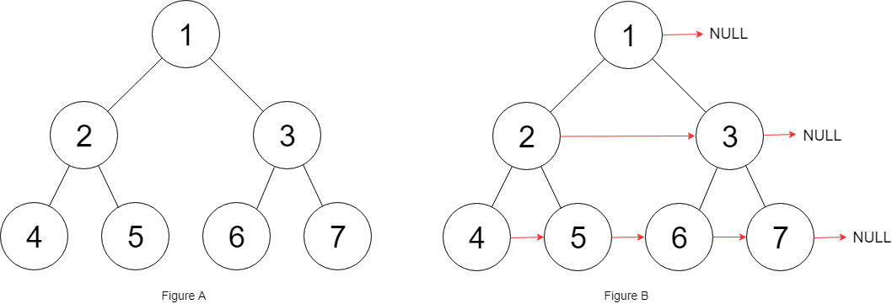

# 二叉树的遍历框架

```java
/* 二叉树遍历框架 */
public void traverse(TreeNode root) {
    // 前序遍历
    traverse(root.left)
    // 中序遍历
    traverse(root.right)
    // 后序遍历
}
```

快速排序：

快速排序的逻辑是，若要对 `nums[lo..hi]` 进行排序，我们先找一个分界点 `p`，通过交换元素使得 `nums[lo..p-1]` 都小于等于 `nums[p]`，且 `nums[p+1..hi]` 都大于 `nums[p]`，然后递归地去 `nums[lo..p-1]` 和 `nums[p+1..hi]` 中寻找新的分界点，最后整个数组就被排序了。

```java
void sort(int[] nums, int lo, int hi) {
    // 通过交换元素构建分界点 p
    int p = partition(nums, lo, hi);

    sort(nums, lo, p - 1);
    sort(nums, p + 1, hi);
}
```

归并排序：

归并排序的逻辑，若要对 `nums[lo..hi]` 进行排序，我们先对 `nums[lo..mid]` 排序，再对 `nums[mid+1..hi]` 排序，最后把这两个有序的子数组合并，整个数组就排好序了。

```java
void sort(int[] nums, int lo, int hi) {
    int mid = (lo + hi) / 2;
    sort(nums, lo, mid);
    sort(nums, mid + 1, hi);

    /****** 后序遍历位置 ******/
    // 合并两个排好序的子数组
    merge(nums, lo, mid, hi);
    /************************/
}
```

递归思路：

+ 看中间态、结束态
  + 结束态，`if(…){return ;}`
  + 中间态，递归左子树和右子树
  + 起始态，一般和中间态是重合的，即中间态的特例
+ 看操作位置
  + 如果操作在左子树递归前，就放在先序遍历的位置
  + 如果操作在所有递归后，或者回溯，就放在后序遍历的位置

# 二叉树的序列化

## 什么是序列化与反序列化

**二叉树的序列化与反序列化**就是给你输入一棵二叉树的根节点 `root`，要求你实现如下一个类：

```java
public class Codec {

    // 把一棵二叉树序列化成字符串
    public String serialize(TreeNode root) {}

    // 把字符串反序列化成二叉树
    public TreeNode deserialize(String data) {}
}
```

比如说输入如下这样一棵二叉树：


`serialize` 方法也许会把它序列化成字符串 `2,1,#,6,3,#,#`，其中 `#` 表示 `null` 指针，那么把这个字符串再输入 `deserialize` 方法，依然可以还原出这棵二叉树。也就是说，这两个方法会成对儿使用，你只要保证他俩能够自洽就行了。

## 前序遍历解法

```java
LinkedList<Integer> res;
void traverse(TreeNode root) {
    if (root == null) {
        // 暂且用数字 -1 代表空指针 null
        res.addLast(-1);
        return;
    }

    /****** 前序遍历位置 ******/
    res.addLast(root.val);
    /***********************/

    traverse(root.left);
    traverse(root.right);
}
```

调用 `traverse` 函数之后，你是否可以立即想出这个 `res` 列表中元素的顺序是怎样的？比如如下二叉树（`#` 代表空指针 null），可以直观看出前序遍历做的事情：


那么 `res = [1,2,-1,4,-1,-1,3,-1,-1]`，这就是将二叉树「打平」到了一个列表中，其中 -1 代表 null。

`StringBuilder` 可以用于高效拼接字符串，所以也可以认为是一个列表，下面将二叉树序列打入到字符串中：

```java
String SEP = ",";
String NULL = "#";

/* 主函数，将二叉树序列化为字符串 */
String serialize(TreeNode root) {
    StringBuilder sb = new StringBuilder();
    serialize(root, sb);
    return sb.toString();
}

/* 辅助函数，将二叉树存入 StringBuilder */
void serialize(TreeNode root, StringBuilder sb) {
    if (root == null) {
        sb.append(NULL).append(SEP);
        return;
    }

    /****** 前序遍历位置 ******/
    sb.append(root.val).append(SEP);
    /***********************/

    serialize(root.left, sb);
    serialize(root.right, sb);
}
```

现在，思考一下如何写 `deserialize` 函数，将字符串反过来构造二叉树。

首先我们可以把字符串转化成列表：

```java
String data = "1,2,#,4,#,#,3,#,#,";
String[] nodes = data.split(",");
```

根据我们刚才的分析，`nodes` 列表就是一棵打平的二叉树：


反序列化过程也是一样，**先确定根节点 `root`，然后遵循前序遍历的规则，递归生成左右子树即可**：

```java
/* 主函数，将字符串反序列化为二叉树结构 */
TreeNode deserialize(String data) {
    // 将字符串转化成列表
    LinkedList<String> nodes = new LinkedList<>();
    for (String s : data.split(SEP)) {
        nodes.addLast(s);
    }
    return deserialize(nodes);
}

/* 辅助函数，通过 nodes 列表构造二叉树 */
TreeNode deserialize(LinkedList<String> nodes) {
    if (nodes.isEmpty()) return null;
    // 列表最左侧就是根节点
    String first = nodes.removeFirst();
    if (first.equals(NULL)) return null;
    TreeNode root = new TreeNode(Integer.parseInt(first));
    root.left = deserialize(nodes);
    root.right = deserialize(nodes);
    return root;
}
```

我们发现，根据树的递归性质，`nodes` 列表的第一个元素就是一棵树的根节点，所以只要将列表的第一个元素取出作为根节点，剩下的交给递归函数去解决即可。

## 后序遍历解法

```java
/* 辅助函数，将二叉树存入 StringBuilder */
void serialize(TreeNode root, StringBuilder sb) {
    if (root == null) {
        sb.append(NULL).append(SEP);
        return;
    }

    serialize(root.left, sb);
    serialize(root.right, sb);

    /****** 后序遍历位置 ******/
    sb.append(root.val).append(SEP);
    /***********************/
}
```

**`deserialize` 方法首先寻找 `root` 节点的值，然后递归计算左右子节点**。那么我们这里也应该顺着这个基本思路走，后续遍历中，`root` 节点的值能不能找到？再看一眼刚才的图：


可见，`root` 的值是列表的最后一个元素。我们应该从后往前取出列表元素，先用最后一个元素构造 `root`，然后递归调用生成 `root` 的左右子树。**注意，根据上图，从后往前在 `nodes` 列表中取元素，一定要先构造 `root.right` 子树，后构造 `root.left` 子树**。

看完整代码：

```java
/* 主函数，将字符串反序列化为二叉树结构 */
TreeNode deserialize(String data) {
    LinkedList<String> nodes = new LinkedList<>();
    for (String s : data.split(SEP)) {
        nodes.addLast(s);
    }
    return deserialize(nodes);
}

/* 辅助函数，通过 nodes 列表构造二叉树 */
TreeNode deserialize(LinkedList<String> nodes) {
    if (nodes.isEmpty()) return null;
    // 从后往前取出元素
    String last = nodes.removeLast();
    if (last.equals(NULL)) return null;
    TreeNode root = new TreeNode(Integer.parseInt(last));
    // 限构造右子树，后构造左子树
    root.right = deserialize(nodes);
    root.left = deserialize(nodes);

    return root;
}
```

## 层级遍历解法

首先，先写出层级遍历二叉树的代码框架：

```java
void traverse(TreeNode root) {
    if (root == null) return;
    // 初始化队列，将 root 加入队列
    Queue<TreeNode> q = new LinkedList<>();
    q.offer(root);

    while (!q.isEmpty()) {
        TreeNode cur = q.poll();

        /* 层级遍历代码位置 */
        System.out.println(root.val);
        /*****************/

        if (cur.left != null) {
            q.offer(cur.left);
        }

        if (cur.right != null) {
            q.offer(cur.right);
        }
    }
}
```

**上述代码是标准的二叉树层级遍历框架**，从上到下，从左到右打印每一层二叉树节点的值，可以看到，队列 `q` 中不会存在 null 指针。

不过我们在反序列化的过程中是需要记录空指针 null 的，所以可以把标准的层级遍历框架略作修改：

```java
void traverse(TreeNode root) {
    if (root == null) return;
    // 初始化队列，将 root 加入队列
    Queue<TreeNode> q = new LinkedList<>();
    q.offer(root);

    while (!q.isEmpty()) {
        TreeNode cur = q.poll();

        /* 层级遍历代码位置 */
        if (cur == null) continue;
        System.out.println(root.val);
        /*****************/

        q.offer(cur.left);
        q.offer(cur.right);
    }
}
```

这样也可以完成层级遍历，只不过我们把对空指针的检验从「将元素加入队列」的时候改成了「从队列取出元素」的时候。

那么我们完全仿照这个框架即可写出序列化方法：

```java
String SEP = ",";
String NULL = "#";

/* 将二叉树序列化为字符串 */
String serialize(TreeNode root) {
    if (root == null) return "";
    StringBuilder sb = new StringBuilder();
    // 初始化队列，将 root 加入队列
    Queue<TreeNode> q = new LinkedList<>();
    q.offer(root);

    while (!q.isEmpty()) {
        TreeNode cur = q.poll();

        /* 层级遍历代码位置 */
        if (cur == null) {
            sb.append(NULL).append(SEP);
            continue;
        }
        sb.append(cur.val).append(SEP);
        /*****************/

        q.offer(cur.left);
        q.offer(cur.right);
    }

    return sb.toString();
}
```

层级遍历序列化得出的结果如下图：


可以看到，每一个非空节点都会对应两个子节点，**那么反序列化的思路也是用队列进行层级遍历，同时用索引 `i` 记录对应子节点的位置**：

```java
/* 将字符串反序列化为二叉树结构 */
TreeNode deserialize(String data) {
    if (data.isEmpty()) return null;
    String[] nodes = data.split(SEP);
    // 第一个元素就是 root 的值
    TreeNode root = new TreeNode(Integer.parseInt(nodes[0]));

    // 队列 q 记录父节点，将 root 加入队列
    Queue<TreeNode> q = new LinkedList<>();
    q.offer(root);

    for (int i = 1; i < nodes.length; ) {
        // 队列中存的都是父节点
        TreeNode parent = q.poll();
        // 父节点对应的左侧子节点的值
        String left = nodes[i++];
        if (!left.equals(NULL)) {
            parent.left = new TreeNode(Integer.parseInt(left));
            q.offer(parent.left);
        } else {
            parent.left = null;
        }
        // 父节点对应的右侧子节点的值
        String right = nodes[i++];
        if (!right.equals(NULL)) {
            parent.right = new TreeNode(Integer.parseInt(right));
            q.offer(parent.right);
        } else {
            parent.right = null;
        }
    }
    return root;
}
```

这段代码可以考验一下你的框架思维。仔细看一看 for 循环部分的代码，发现这不就是标准层级遍历的代码衍生出来的嘛：

```java
while (!q.isEmpty()) {
    TreeNode cur = q.poll();

    if (cur.left != null) {
        q.offer(cur.left);
    }

    if (cur.right != null) {
        q.offer(cur.right);
    }
}
```

只不过，标准的层级遍历在操作二叉树节点 `TreeNode`，而我们的函数在操作 `nodes[i]`，这也恰恰是反序列化的目的嘛。

# 算法实践

## 计算二叉树节点个数

```java
// 定义：count(root) 返回以 root 为根的树有多少节点
public int count(TreeNode root) {
    // base case
    if (root == null) return 0;
    // 自己加上子树的节点数就是整棵树的节点数
    return 1 + count(root.left) + count(root.right);
}
```

这个问题非常简单，大家应该都会写这段代码，`root` 本身就是一个节点，加上左右子树的节点数就是以 `root` 为根的树的节点总数。

左右子树的节点数怎么算？其实就是计算根为 `root.left` 和 `root.right` 两棵树的节点数呗，按照定义，递归调用 `count` 函数即可算出来。

## 翻转二叉树

我们先从简单的题开始，看看力扣第 226 题「翻转二叉树」，输入一个二叉树根节点 `root`，让你把整棵树镜像翻转，比如输入的二叉树如下：

```bash
     4
   /   \
  2     7
 / \   / \
1   3 6   9
```

算法原地翻转二叉树，使得以 `root` 为根的树变成：

```bash
     4
   /   \
  7     2
 / \   / \
9   6 3   1
```

通过观察，**我们发现只要把二叉树上的每一个节点的左右子节点进行交换，最后的结果就是完全翻转之后的二叉树**。

```java
// 将整棵树的节点翻转
public TreeNode invertTree(TreeNode root) {
    if (root == null) {
        return null;
    }
    // root 节点需要交换它的左右子节点
    TreeNode tmp = root.left;
    root.left = root.right;
    root.right = tmp;

    // 让左右子节点继续翻转它们的子节点
    invertTree(root.left);
    invertTree(root.right);

    return root;
}
```

## 填充二叉树节点的右侧指针


题目的意思就是把二叉树的每一层节点都用 `next` 指针连接起来：



而且题目说了，输入是一棵「完美二叉树」，形象地说整棵二叉树是一个正三角形，除了最右侧的节点 `next` 指针会指向 `null`，其他节点的右侧一定有相邻的节点。

但是节点 5 和节点 6 不属于同一个父节点，那么按照这段代码的逻辑，它俩就没办法被穿起来，这是不符合题意的。

**二叉树的问题难点在于，如何把题目的要求细化成每个节点需要做的事情**，但是如果只依赖一个节点的话，肯定是没办法连接「跨父节点」的两个相邻节点的。那么，我们的做法就是增加函数参数，一个节点做不到，我们就给他安排两个节点，「将每一层二叉树节点连接起来」可以细化成「将每两个相邻节点都连接起来」：

```java
// 主函数
private Node connect(Node root) {
    if (root == null) return null;
    connectTwoNode(root.left, root.right);
    return root;
}

// 辅助函数
public void connectTwoNode(Node node1, Node node2) {
    if (node1 == null || node2 == null) {
        return;
    }
    // 将传入的两个节点连接
    node1.next = node2;

    // 连接相同父节点的两个子节点
    connectTwoNode(node1.left, node1.right);
    connectTwoNode(node2.left, node2.right);
    // 连接跨越父节点的两个子节点
    connectTwoNode(node1.right, node2.left);
}
```

## 将二叉树展开为链表


我们尝试给出这个函数的定义：

**给 `flatten` 函数输入一个节点 `root`，那么以 `root` 为根的二叉树就会被拉平为一条链表**。

我们再梳理一下，如何按题目要求把一棵树拉平成一条链表？很简单，以下流程：

1、将 `root` 的左子树和右子树拉平。

2、将 `root` 的右子树接到左子树下方，然后将整个左子树作为右子树。


!> 递归结束状态就是`if(…)…`内的限定条件，而递归函数`flatten(root.left);flatten(root.right);`则是截取某个中间状态得到的结果

```java
class Solution {
    public void flatten(TreeNode root) {
        if(root==null){
            return;
        }
        flatten(root.left);
        flatten(root.right);
        // 获取左右节点
        TreeNode left = root.left;
        TreeNode right = root.right;
        // 将左子树移动到右子树
        root.left = null;
        root.right = left;
        // 将rigth接到left
        TreeNode p = root;
        while(p.right!=null){
            p = p.right;
        }
        p.right = right;
    }
}
```

## 最大二叉树

给定一个不含重复元素的整数数组 nums 。一个以此数组直接递归构建的 最大二叉树 定义如下：

- 二叉树的根是数组 nums 中的最大元素。
- 左子树是通过数组中 最大值左边部分 递归构造出的最大二叉树。
- 右子树是通过数组中 最大值右边部分 递归构造出的最大二叉树。

返回有给定数组 nums 构建的 最大二叉树 。

**示例 1：**


```
输入：nums = [3,2,1,6,0,5]
输出：[6,3,5,null,2,0,null,null,1]
解释：递归调用如下所示：
- [3,2,1,6,0,5] 中的最大值是 6 ，左边部分是 [3,2,1] ，右边部分是 [0,5] 。
    - [3,2,1] 中的最大值是 3 ，左边部分是 [] ，右边部分是 [2,1] 。
        - 空数组，无子节点。
        - [2,1] 中的最大值是 2 ，左边部分是 [] ，右边部分是 [1] 。
            - 空数组，无子节点。
            - 只有一个元素，所以子节点是一个值为 1 的节点。
    - [0,5] 中的最大值是 5 ，左边部分是 [0] ，右边部分是 [] 。
        - 只有一个元素，所以子节点是一个值为 0 的节点。
        - 空数组，无子节点。
```

**对于每个根节点，只需要找到当前`nums`中的最大值和对应的索引，然后递归调用左右数组构造左右子树即可**。

```java
class Solution {
    private TreeNode build(int[] nums,int low,int high){
        if(low>high){
            return null;
        }
        int maxNum = Integer.MIN_VALUE;
        int index = -1;
        for(int i=low;i<=high;i++){
            if(nums[i]>maxNum){
                index=i;
                maxNum=nums[i];
            }
        }
        TreeNode root = new TreeNode(maxNum);
        root.left = build(nums,low,index-1);
        root.right = build(nums,index+1,high);
        return root;
    }

    public TreeNode constructMaximumBinaryTree(int[] nums) {
        return build(nums,0,nums.length-1);
    }
}
```

## 通过前序和中序遍历结果构造二叉树

输入某二叉树的前序遍历和中序遍历的结果，请重建该二叉树。假设输入的前序遍历和中序遍历的结果中都不含重复的数字。

例如，给出

```
前序遍历 preorder = [3,9,20,15,7]
中序遍历 inorder = [9,3,15,20,7]
```

返回如下的二叉树：

        3
       / \
      9  20
        /  \
       15   7
其他的不难，很容易想到，不好确定的是左子树和右子树递归时的下标


```java
class Solution {
    private HashMap<Integer,Integer> hashMap;
    public TreeNode buildTree(int[] preorder, int[] inorder) {
        int n = preorder.length;
        hashMap = new HashMap();
        for(int i=0;i<inorder.length;i++){
            hashMap.put(inorder[i],i);
        }
        return build(preorder,inorder,0,n-1,0,n-1);
    }

    private TreeNode build(int[] preorder,int[] inorder,int preLeft,int preRight,int inLeft,int inRight){
        if(preLeft>preRight){
            return null;
        }
        int rootValue = preorder[preLeft];
        int orRootPos = hashMap.get(rootValue);
        TreeNode root = new TreeNode(rootValue);
        int subLeftTreeSize = orRootPos - inLeft;
        root.left = build(preorder,inorder,preLeft+1,preLeft+subLeftTreeSize,inLeft,orRootPos-1);
        root.right = build(preorder,inorder,preLeft+subLeftTreeSize+1,preRight,orRootPos+1,inRight);
        return root;
    }
}
```

## 寻找重复子树

给定一棵二叉树，返回所有重复的子树。对于同一类的重复子树，你只需要返回其中任意**一棵**的根结点即可。

两棵树重复是指它们具有相同的结构以及相同的结点值。

**示例 1：**

```
        1
       / \
      2   3
     /   / \
    4   2   4
       /
      4
```

下面是两个重复的子树：

```
      2
     /
    4
```

和

```
    4
```

因此，你需要以列表的形式返回上述重复子树的根结点。

对某个节点，**你需要知道以下两点**：

**1、以我为根的这棵二叉树（子树）长啥样**？

**2、以其他节点为根的子树都长啥样**？


其实看到这个问题，就可以判断本题要使用「后序遍历」框架来解决：

```java
void traverse(TreeNode root) {
    traverse(root.left);
    traverse(root.right);
    /* 解法代码的位置 */
}
```

为什么？很简单呀，我要知道以自己为根的子树长啥样，是不是得先知道我的左右子树长啥样，再加上自己，就构成了整棵子树的样子？

所以，我们可以通过拼接字符串的方式把二叉树序列化，看下代码：

```java
String traverse(TreeNode root) {
    // 对于空节点，可以用一个特殊字符表示
    if (root == null) {
        return "#";
    }
    // 将左右子树序列化成字符串
    String left = traverse(root.left);
    String right = traverse(root.right);
    /* 后序遍历代码位置 */
    // 左右子树加上自己，就是以自己为根的二叉树序列化结果
    String subTree = left + "," + right + "," + root.val;
    return subTree;
}
```

**这样，我们第一个问题就解决了，对于每个节点，递归函数中的`subTree`变量就可以描述以该节点为根的二叉树**。

**现在我们解决第二个问题，我知道了自己长啥样，怎么知道别人长啥样**？这样我才能知道有没有其他子树跟我重复对吧。

可以用`HashMap`记录子树，代码如下：

```java
class Solution{
    // 记录所有子树以及出现的次数
    HashMap<String, Integer> memo = new HashMap<>();
    // 记录重复的子树根节点
    LinkedList<TreeNode> res = new LinkedList<>();

    /* 主函数 */
    List<TreeNode> findDuplicateSubtrees(TreeNode root) {
        traverse(root);
        return res;
    }

    /* 辅助函数 */
    String traverse(TreeNode root) {
        if (root == null) {
            return "#";
        }

        String left = traverse(root.left);
        String right = traverse(root.right);

        String subTree = left + "," + right+ "," + root.val;

        int freq = memo.getOrDefault(subTree, 0);
        // 多次重复也只会被加入结果集一次
        if (freq == 1) {
            res.add(root);
        }
        // 给子树对应的出现次数加一
        memo.put(subTree, freq + 1);
        return subTree;
    }
}
```