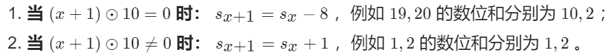
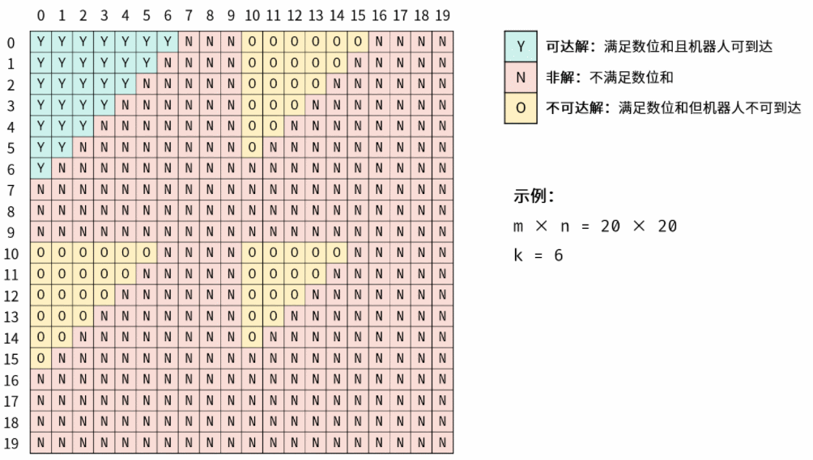

# 目录

- [ ] 03.数组中重复的数字
  - [ ] 索引法
    - [ ] 建立新索引
    - [ ] 原地交换
  - [x] 排序法（自己写的）
  - [x] 集合去重
- [x] 04.二维数组中的查找
  - [x] 线性查找（注意if判断的边界值条件）
- [x] 05.替换空格
  - [x] 调用系统函数
- [ ] 06.从尾到头打印链表
  - [x] 递归
  - [ ] 栈
  - [x] 映射法
- [ ] 07.重建二叉树
- [x] 09.栈实现队列
- [x] 10-I.斐波那契数列
  - [x] 迭代法（注意细节）
- [x] 10-II.跳台阶
  - [x] 动态规划（注意%1e7的处理）
  - [x] 迭代法
- [ ] 11.旋转数组的最小元素
  - [x] 排序法
  - [x] 变量数组，找到第一个刚好最小的
  - [ ] 二分法（特殊的二分，注意细节）
- [x] 12.矩阵中的路径（值得复习）
  - [x] DFS+剪枝
- [ ] 13.机器人的运动范围
  - [ ] DFS
  - [ ] BFS
- [ ] 14-II.剪绳子
  - [ ] 动态规划+大数取余
  - [ ] 循环取余
  - [ ] 快速幂
- [x] 15.二进制中1的个数
  - [x] 转字符串
  - [x] 位运算
- [x] 16.数值的整数次方
  - [x] 快速幂
- [ ] 

# 03

## 索引法

```js
var findRepeatNumber = function(nums) {
    let m = [];
    for(let num of nums){
        if(m[num]){
            return num;
        }
        m[num]=1;
    }
    return -1;
};
```

第二种方法的关键点：`num === nums[num]`，让数字回归到它原来的下标位置处

```js
// 原地交换
var findRepeatNumber = function(nums) {
    for (let i = 0; i < nums.length; i++) {
        let num = nums[i];
        while(num !== i) {
            if (num === nums[num]) return num;
            [nums[i], nums[num]] = [nums[num], nums[i]];
        }
    }
    return -1;
};
```

## 集合去重

```js
var findRepeatNumber = function(nums) {
    let set = new Set();
    for(let num of nums){
        if(set.has(num)){
            return num;
        }
        set.add(num);
    }
    return -1;
};
```

## 排序法

```js
/**
 * @param {number[]} nums
 * @return {number}
 */
var findRepeatNumber = function(nums){
    nums.sort((a,b)=>(a-b));
    for(let i=0;i<nums.length;i++){
        if(nums[i]===nums[i+1]){
            return nums[i];
        }
    }
    return -1;
};
```

# 04

## 线性查找

!> 注意开始if的判定条件

```js
var findNumberIn2DArray = function(matrix, target) {
    if(matrix===null || matrix.length===0){
        return false;
    }
    let row = matrix.length;
    let col = matrix[0].length;
    let i=0,j=col-1;
    while(i<row && j>=0){
        if(matrix[i][j]<target){
            i++;
        }else if(matrix[i][j]>target){
            j--;
        }else{
            return true;
        }
    }
    return false;
};
```

# 05

## 调用系统函数

最推荐第二种，比较熟悉

```js
var replaceSpace = function(s) {
    // return s.replace(/\s/g,"%20");
    return s.split(" ").join("%20");
    // return s.replaceAll(" ","%20");
};
```

# 06

## 递归法

```js
var reversePrint = function(head) {
    let res = [];
    calc(head);
    return res;
    
    function calc(head){
        if(head===null){
            return;
        }
        calc(head.next);
        res.push(head.val);
    }
};
```

## 使用栈

## 映射法

```js
var reversePrint = function(head) {
    let p = head;
    let n = 0;
    while(p!==null){
        n++;
        p=p.next;
    }
    let res = [];
    p = head;
    while(p!=null){
        res[n-1]=p.val;
        n--;
        p=p.next;
    }
    return res;
};
```

# 07

# 09

```js
var CQueue = function() {
    this.data = [];
    this.helper = [];
};

/** 
 * @param {number} value
 * @return {void}
 */
CQueue.prototype.appendTail = function(value) {
    this.data.push(value);
};

/**
 * @return {number}
 */
CQueue.prototype.deleteHead = function() {
    if (this.data.length!==0) {
        while (this.data.length > 1) {
            this.helper.push(this.data.pop());
        }
        let res = this.data.pop();
        while (this.helper.length) {
            this.data.push(this.helper.pop());
        }
        return res;
    } else {
        return -1;
    }
};

/**
 * Your CQueue object will be instantiated and called as such:
 * var obj = new CQueue()
 * obj.appendTail(value)
 * var param_2 = obj.deleteHead()
 */
```

# 10-I

## 迭代法

```js
var fib = function (n) {
    let a = 0,
        b = 1;
    for (let i = 0; i < n; ++i) {
        const c = (a + b) % (1e9 + 7);
        a = b;
        b = c;
    }
    return a;
};
```

# 10-II

## 动态规划

```js
var numWays = function(n) {
    if(n==0){
        return 1;
    }
    let arr= new Array(n+1);
    arr[0] = 0;
    arr[1] = 1;
    arr[2] = 2;
    for(let i=3; i<=n; i++){
        arr[i] = arr[i-1]%1000000007 + arr[i-2]%1000000007;
    }
    return arr[n]%1000000007;
};
```

## 迭代法

```js
var numWays = function(n) {
    let a = 1, b = 1, sum;
    for(let i = 0; i < n; i++){
        sum = (a + b) % 1000000007;
            a = b;
            b = sum;
    }
    return a;
};
```

# 11

## 遍历数组

```java
class Solution {
    public int minArray(int[] numbers) {
        for(int i=0;i<numbers.length-1;i++){
            if(numbers[i]>numbers[i+1]){
                return numbers[i+1];
            }
        }
        return numbers[0];
    }
}
```

## 二分

```js
var minArray = function(numbers) {
    let left=0,right=numbers.length-1;
    while(left<right){
        let mid = Math.floor(left + (right-left)/2);
        if(numbers[mid]<numbers[right]){
            right=mid;
        }else if(numbers[mid]>numbers[right]){
            left=mid+1;
        }else{
            right--;
        }
    }
    return numbers[left];
};
```

# 12

```js
/**
 * @param {character[][]} board
 * @param {string} word
 * @return {boolean}
 */
 var exist = function (board, word) {
    let words = word.split('');
    for (let i = 0; i < board.length; i++) {
        for (let j = 0; j < board[0].length; j++) {
            if (dfs(board, words, i, j, 0) === true) {
                return true;
            }
        }
    }
    return false;

    // 1.边界外返回false
    // 2.board[i][j]!==words[k],返回false
    // 3.已经访问过的坐标
    function dfs(board, words, i, j, k) {
        if (i < 0 || j < 0 || i >= board.length || j >= board[0].length) {
            return false;
        }
        if(board[i][j]!==words[k]){
            return false;
        }
        if (k === words.length-1) {
            return true;
        }
        board[i][j] = '';
        let res = dfs(board, words, i - 1, j, k + 1) || dfs(board, words, i, j - 1, k + 1) || dfs(board, words, i + 1, j, k + 1) || dfs(board, words, i, j + 1, k + 1);
        board[i][j] = words[k];
        return res;
    }
}
```

# 13

数位和增量：



图例展示了 n,m = 20*n*,*m*=20 ， k \in [6, 19]*k*∈[6,19] 的可达解、不可达解、非解，以及连通性的变化。



根据可达解的结构和连通性，易推出机器人可 仅通过向右和向下移动，访问所有可达解 。

- 三角形内部： 全部连通，易证；
- 两三角形连通处： 若某三角形内的解为可达解，则必与其左边或上边的三角形连通（即相交），即机器人必可从左边或上边走进此三角形。


DFS：

```js
/**
 * @param {number} m
 * @param {number} n
 * @param {number} k
 * @return {number}
 */
var movingCount = function (m, n, k) {
    let visited = new Array(m).fill('').map((item, index) => { return new Array(n).fill(false) });
    return dfs(0, 0, 0, 0);

    function dfs(i, j, si, sj) {
        if (i >= m || j >= n || k < si + sj || visited[i][j]) {
            return 0;
        }
        visited[i][j] = true;
        return 1 + dfs(i + 1, j, (i + 1) % 10 !== 0 ? si + 1 : si - 8, sj) + dfs(i, j + 1, si, (j + 1) % 10 !== 0 ? sj + 1 : sj - 8);
    }
};
```

BFS：

```js
/**
 * @param {number} m
 * @param {number} n
 * @param {number} k
 * @return {number}
 */
var movingCount = function (m, n, k) {
    let visited = new Array(m).fill('').map((item, index) => { return new Array(n).fill(false) });
    let res = 0;
    let queue = [];
    queue.push([0, 0, 0, 0]);
    while (queue.length > 0) {
        let x = queue.shift();
        let i = x[0], j = x[1], si = x[2], sj = x[3];
        if (i >= m || j >= n || k < si + sj || visited[i][j]) {
            continue;
        }
        visited[i][j] = true;
        res++;
        queue.push([i + 1, j, (i + 1) % 10 !== 0 ? si + 1 : si - 8, sj]);
        queue.push([i, j + 1, si, (j + 1) % 10 !== 0 ? sj + 1 : sj - 8]);
    }
    return res;
};
```

> 通过leetcode题解有另外一位答主的回答，也是DSF和BFS，另一种写法可以参考

DFS：

```js
/**
 * @param {number} m
 * @param {number} n
 * @param {number} k
 * @return {number}
 */
var movingCount = function (m, n, k) {
    // 位数和
    function getSum(num) {
        let answer = 0;

        while (num) {
            answer += num % 10;
            num = Math.floor(num / 10);
        }

        return answer;
    }
    // 方向数组
    const directionAry = [
        [-1, 0], // 上
        [0, 1], // 右
        [1, 0], // 下
        [0, -1] // 左
    ];
    let set = new Set(['0,0']);
    dfs(0, 0, k);

    function dfs(x, y, k) {
        for (let i = 0; i < 4; i++) {
            let offsetX = x + directionAry[i][0];
            let offsetY = y + directionAry[i][1];
            if (offsetX < 0 || offsetY < 0 || offsetX > m - 1 || offsetY > n - 1 || getSum(offsetY) + getSum(offsetX) > k || set.has(`${offsetX},${offsetY}`)) {
                continue;
            }
            set.add(`${offsetX},${offsetY}`);
            dfs(offsetX, offsetY, k);
        }
    }
    return set.size;
};
```

BFS：

```js
/**
 * @param {number} m
 * @param {number} n
 * @param {number} k
 * @return {number}
 */
var movingCount = function (m, n, k) {
    // 位数和
    function getSum(num) {
        let answer = 0;
        while (num) {
            answer += num % 10;
            num = Math.floor(num / 10);
        }
        return answer;
    }
    // 方向数组
    const directionAry = [
        [-1, 0], // 上
        [0, 1], // 右
        [1, 0], // 下
        [0, -1] // 左
    ];
    // 已经走过的坐标
    let set = new Set(['0,0']);
    // 将遍历的坐标队列，题意要求从[0,0]开始走
    let queue = [[0, 0]];
    // 遍历队列中的坐标
    while (queue.length) {
        // 移除队首坐标
        let [x, y] = queue.shift();
        // 遍历方向
        for (let i = 0; i < 4; i++) {
            let offsetX = x + directionAry[i][0];
            let offsetY = y + directionAry[i][1];
            // 临界值判断
            if (offsetX < 0 || offsetX >= m || offsetY < 0 || offsetY >= n || getSum(offsetX) + getSum(offsetY) > k || set.has(`${offsetX},${offsetY}`)) {
                continue;
            }
            // 走过的格子就不再纳入统计
            set.add(`${offsetX},${offsetY}`);
            // 将该坐标加入队列（因为这个坐标的四周没有走过，需要纳入下次的遍历）
            queue.push([offsetX, offsetY]);
        }
    }
    // 走过坐标的个数就是可以到达的格子数
    return set.size;
};
```

# 14-II

## 动态规划+大数取余

```java
import java.math.BigInteger;
class Solution {
    public int cuttingRope(int n) {
        BigInteger[] dp = new BigInteger[n + 1];
        Arrays.fill(dp, BigInteger.valueOf(1));
        // dp[1] = BigInteger.valueOf(1);
        for(int i = 3; i < n + 1; i++){
            for(int j = 1; j < i; j++){
                dp[i] = dp[i].max(BigInteger.valueOf(j * (i - j))).max(dp[i - j].multiply(BigInteger.valueOf(j)));
            }
        }
        return dp[n].mod(BigInteger.valueOf(1000000007)).intValue();
    }
}
```

这种方式效率太低，而且在JS代码中运行结果为NaN

## 循环取余

```js
/**
 * @param {number} n
 * @return {number}
 */
var cuttingRope = function (n) {
    if (n < 4) {
        return n - 1;
    } else if (n == 4) {
        return n;
    }
    let res = 1;
    while (n > 4) {
        res *= 3;
        res %= 1000000007;
        n -= 3;
    }
    // 最终剩下来的肯定是2,3,4
    return res * n % 1000000007;
};
```

## 快速幂

JS中对大数转换支持不好，在JS代码中运行失败

> 这个大数处理之后再弄，这里标记上

```js
class Solution {
    int mod = 1000000007;
    public int cuttingRope(int n) {
        if(n < 4) return n - 1;
        int a = n / 3;
        int b = n % 3;
        if(b == 0) return (int) (myPow(3, a) % mod);
        else if(b == 1) return (int) (myPow(3, a - 1) * 4 % mod);
        else return (int) (myPow(3, a) * 2 % mod);
    }

    public long myPow(long base, int num){
        long res = 1;
        while(num > 0){
            if((num & 1) == 1){
                res *= base;
                res %= mod;
            }
            base *= base;
            base %= mod;
            num >>= 1;
        }
        return res;
    }
}
```

# 15

## 转成字符串

```js
/**
 * @param {number} n - a positive integer
 * @return {number}
 */
var hammingWeight = function(n) {
    let str = n.toString(2);
    let len = str.length;
    let count = 0;
    for(let i=0;i<len;i++){
        if(str[i]==='1'){
            count++;
        }
    }
    return count;
};
```

## 位运算

```js
var hammingWeight = function(n) {
    let cnt = 0;
    while (n) {
        cnt += n & 1;
        n >>>= 1;
    }
    return cnt;
};
```

# 16

快速幂

```js
/**
 * @param {number} x
 * @param {number} n
 * @return {number}
 */
var myPow = function(x, n) {
    let r = 1;
    let tmp = x;
    let tag = 0;
    if (n < 0) {
        tag = 1;
        n = -n;
    }
    while (n) {
        if (n & 1) {
            r *= tmp;
        }
        tmp *= tmp;
        n >>>= 1;
    }
    return tag ? 1 / r : r;
};
```


