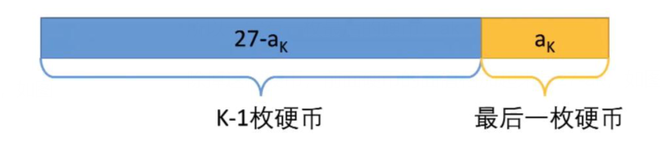
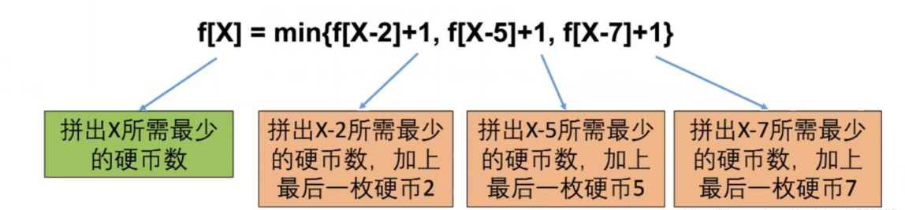
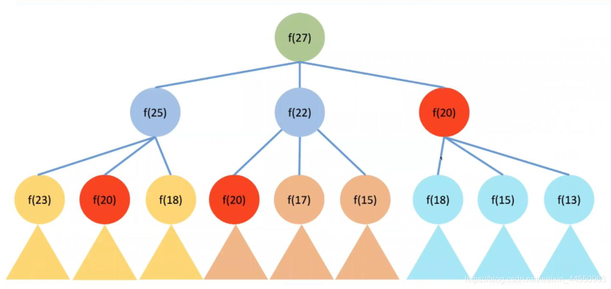
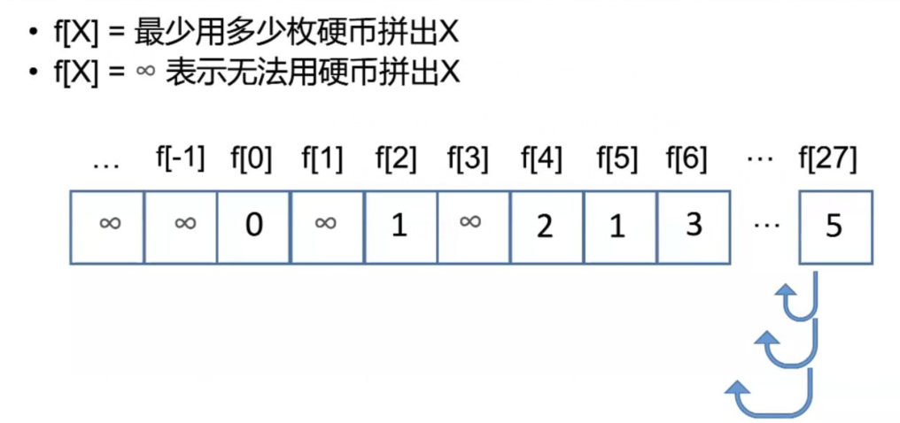
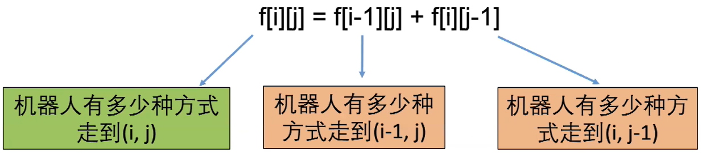
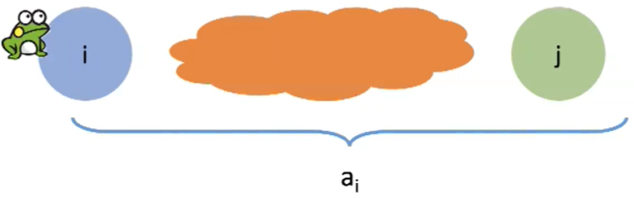
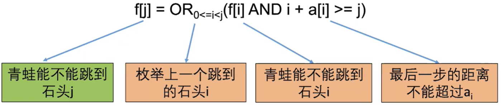

# 动态规划题目类型

1、计数：

有多少种方式走到右下角

有多少种方法选出k个数使得和为Sum

2、求最大最小值（最值）：

从左上角走到右下角路径的最大数字和

最长上升子序列长度

3、求存在性：

取石子游戏，先手是否必胜

能不能选出k个数使得和是Sum

# 动态规划解题步骤
1、确定状态

简单的说，就是解动态规划时需要开一个数组，数组的每个元素f[i]或者f[i][j]代表什么，类似解数学题中，xyz代表什么一样，具体分为下面两个步骤：

+ 研究最优策略的最后一步
+ 化为子问题

2、转移方程

根据子问题定义直接得到

3、初始条件和边界情况

初始条件一般都是a[0]、a[1]这种，多看看。边界条件主要是看数组的边界，数组越不越界

4、计算顺序

利用之前的计算结果

# 实例讲解

## 凑零钱问题

题目：有三种硬币，面值2.5.7，买一本书需要27元，如何用最少的硬币整好付清。

首先经过分析，这是一个求最大最小值问题，可用动态规划来求解。

### 确定状态

（1）最后一步

虽然我们不知道最优策略是什么，但是最优策略一定是k枚硬币a1,a2…ak加起来等于27

所以一定有一枚最后的硬币：`ak`

除掉这枚硬币，前面硬币的面值相加起来是`27-ak`，如图：



（2）化为子问题

所以就将原问题转化为了子问题：

原问题是最少用多少枚硬币拼出27（k枚）

子问题是最少用多少枚硬币拼出27-ak（k-1枚）

**经过这两歩，得出状态：f[X]=最少用多少枚硬币拼出X**

### 转移方程

设状态f[X]=最少用多少枚硬币拼出X，转移方程如下：



这时，可以用递归进行解题，大致如下：

```c
int f(int x){
    if(x==0) return 0;
    int res = MAX_VALUE;
    if(x>=7){
        res = Math.min(f(x-2)+1,res);
    } 
    if(x>=5){
        res = Math.min(f(x-2)+1,res);
    } 
    if(x>=2){
        res = Math.min(f(x-2)+1,res);
    } 
}
```

递归求解的问题，就是会产生大量的重复运算：



所以说，这不是一个好的解法，解决方法就是将计算结果保存下来，改变计算顺序，我们接着来看。

### 初始条件和边界情况

`f[X]=min{f[X-2]+1,f[X-5]+1,f[X-7]+1}`

边界条件X-2，X-5，X-7小于0时，应该进行处理，这种情况其实就是拼不出来的情况，定义为正无穷

**初始条件一般就是根据转移方程计算不出来的值，从转移方程变量为0或1来选**，根据题目进行分析，这个题目的初始条件就是f[0]=1，代入公式的话应该f[0]为正无穷，显然错误，所以自己定义`f[0]=0`

### 计算顺序



### 实现代码

```java
/**
* 动态规划，硬币问题
* f[X]=min{f[X-2]+1,f[X-5]+1,f[X-7]+1}
* @param A 硬币金额种类
* @param M 要凑够的总金额
* @return 最少硬币
*/
public static int coinChange(int[] A,int M){
    // 因为这里需要0~M，因此创建数组大小为M+1
    int[] f = new int[M + 1];
    f[0] = 0;
    for (int i = 1; i <= M; i++) {
        f[i] = Integer.MAX_VALUE;
        for (int value : A) {
            //第一个条件是防止数组越界；第二个条件是防止MAX_VALUE+1溢出
            if (i >= value && f[i - value] != Integer.MAX_VALUE) {
                f[i] = Math.min(f[i], f[i - value] + 1);
            }
        }
    }
    if (f[M] == Integer.MAX_VALUE) {
        f[M] = -1;
    }
    return f[M];
}
```

## 机器人路径问题

题目：给定m行n列的网格，有一个机器人从左上角（0,0）出发，每一步可以向下或者向右走一步，问有多少种不同的方式走到右下角。

可用计数型动态规划来求解。

### 确定状态

（1）最后一步

聚焦机器人最后挪动的一歩，右下角坐标为（m-1，n-1），那么前一步机器人一定在（m-2，n-1）或者（m-1，n-2）

（2）子问题

轻易可得，机器人走到（m-1，n-1）的方式等于机器人走到（m-2，n-1）加上机器人走到（m-1，n-2）

原问题是有多少种方式从左上角走到（m-1，n-1）

子问题是有多少种方式从左上角走到（m-2，n-1）和（m-1，n-2）

### 转移方程



### 初始条件和边界情况

边界条件：i=0或者j=0时前一步只能从一个方向过来，所以`f[i][j]=1`

初始条件：`f[0][0]=1`，机器人只有一种方式到左上角

### 计算顺序

计算第0行

计算第1行

…

计算第m-1行

### 实现代码

```java
/**
* 动态规划，机器人宫格问题
*
* @param m 行
* @param n 列
* @return 多少种走法
*/
public static int uniquePaths(int m, int n) {
    int[][] f = new int[m][n];
    for (int i = 0; i < m; i++) {
        for (int j = 0; j < n; j++) {
            if (i == 0 || j == 0) {
                f[i][j] = 1;
            } else {
                f[i][j] = f[i - 1][j] + f[i][j - 1];
            }
        }
    }
    return f[m - 1][n - 1];
}
```

## 跳石头问题

题目：给出一个非负整数数组，你最初定位在数组的第一个位置。数组中的每个元素代表你在那个位置可以跳跃的最大长度。判断你是否能到达数组的最后一个位置。

例子：

```
输入：a=[2,3,1,1,4]
输出：True
输入：a=[3,2,1,0,4]
输出：False
```

### 确定状态

（1）最后一步

最后一步是从i跳过来的，i<n-1

需要满足两个条件：青蛙可以跳到石头i；最后一步不能超过跳跃的最大距离，即`n-1-i<=ai`



（2）化为子问题

所以就将原问题转化为了子问题：原问题是青蛙能不能跳到石头n-1，子问题是青蛙能不能跳到石头i

**经过这两歩，得出状态：f[j]表示青蛙能不能跳到石头j**

### 转移方程



### 初始条件和边界情况

边界条件：枚举的i和j都不会越界，所以没有边界条件

初始条件：f[0]=true，因为青蛙一开始就在石头0上

### 计算顺序

设f[j]表示青蛙能不能跳到石头j

初始化f[0]=True

计算f[1],f[2]，.... f[n-1]

答案是f[n-1]

时间复杂度：O(N^2)，空间复杂度（数组大小）：O(N)

### 实现代码

```java
/**
* 跳石头问题
* @param A 每个位置能跳的距离
* @return 是否能跳成功
*/
public static boolean canJump(int[] A){
    boolean[] f = new boolean[A.length];
    f[0]=true;
    for (int i = 1; i < A.length; i++) {
        f[i]=false;
        for (int j = 0; j < i; j++) {
            if (f[j] && j + A[j] >= i) {
                f[i] = true;
                break;
            }
        }
    }
    return f[A.length - 1];
}
```

## 剪绳子

题目：给你一根长度为n的绳子，请把绳子剪成整数长的m段（m、n都是整数，n>1并且m>1，m<=n），每段绳子的长度记为`k[1],…,k[m]`。请问`k[1]*…*k[m]`可能的最大乘积是多少？例如，当绳子的长度是8时，我们把它剪成长度分别为2、3、3的三段，此时得到的最大乘积是18。（2 <= n <= 60）

可用最值型动态规划来求解。

### 确定状态

（1）最后一步

假设绳子剪得最后一下的长度为j，只需要满足`j<i`即可

（2）子问题

相当于从1开始遍历j，找出` j*（i-j部分的乘积最大值）`的最大值

原问题是长度为i的乘积最大值

子问题是长度为i-j的乘积最大值

经过这两歩，得出状态：f[i]表示长度为i的绳子的乘积最大值

### 转移方程

`f[i] = max( f[i] , j * f[i-j] )`
f[i]初始值可以不动，设置为0
（其中要注意一个问题，这个式子`f[i-j]`会把绳子至少分为两段，但是当i-j < 4时, 不分割的情况下是最大的，（大于4就很明显不是了，比如5分为2和3，乘积大于5）显然back_track(n) = n，所以说这个i要从4开始，做子运算时`i-j < 4`时就按照`i - j`来计算）

### 初始条件和边界情况

边界条件：遍历自己控制不会越界，没有边界情况

初始条件：由于f[2],f[3]都要至少分为两段，结果不是2和3，而是1和2，所以要单独计算

### 计算顺序

从f[4]开始往后计算

### 实现代码

```java
public int cutRope(int target) {
    if(target == 2){
        return 1;
    }else if(target == 3){
        return 2;
    }

    int[] f = new int[target+1];
    for(int i=1;i<=3;i++){
        f[i] = i;
    }
    for(int i=4;i<=target;i++){
        for(int j=1;j<i;j++){
            f[i] = Math.max(f[i],j*f[i-j]);
        }
    }
    return f[target];
}
```

?> 此题还可以贪心，就是每个乘数为3，也是剑指offer官方题解，具体数学证明这里不写了

```java
class Solution {
    public int cuttingRope(int n) {
        if(n < 4){
            return n - 1;
        }
        long res = 1;
        while(n > 4){
            res  = res * 3 % 1000000007;
            n -= 3;
        }
        return (int) (res * n % 1000000007);
    }
}
```

## 连续子数组的最大和

题目：HZ偶尔会拿些专业问题来忽悠那些非计算机专业的同学。今天测试组开完会后，他又发话了：在古老的一维模式识别中，常常需要计算连续子向量的最大和，当向量全为正数的时候，问题很好解决。但是，如果向量中包含负数，是否应该包含某个负数，并期望旁边的正数会弥补它呢？例如：`{6,-3,-2,7,-15,1,2,2}`，连续子向量的最大和为8（从第0个开始，到第3个为止）。给一个数组，返回它的最大连续子序列的和，你会不会被他忽悠住？（子向量的长度至少是1）

可用最值型动态规划来求解。

### 确定状态
（1）最后一步
假设当前要判断的是数组第i个，最后一步就是i，数组下标是i-1

（2）子问题
找出到第i-1个为止的连续子数组最大和，看其是否为正或为负，再判断
原问题是到数组第i个的连续子数组的最大和
子问题是到数组第i-1个的连续子数组的最大和

经过这两歩，得出状态：f[i]表示前i个元素的连续子数组的最大和，结尾元素为array[i-1]

### 转移方程

`f[i] = max(array[i-1] , array[i-1] + f[i-1])`
如果当前元素为整数，并且f[i-1]为负数，那么当然结果就是只选当前元素，从当前元素开始计算子数组。这里有一个问题是这个方程算出来的连续子数组必须包含array[i-1]，所以说我们要用一个变量ret保存每一个f[i]，取一个最大的就是结果。

### 初始条件和边界情况

边界条件：遍历自己控制不会越界，没有边界情况

初始条件：f[0] = 0

### 计算顺序

从f[1]开始往后计算

### 实现代码

```java
public class Solution {
    public int FindGreatestSumOfSubArray(int[] array) {
        int[] f = new int[array.length + 1];
        f[0] = 0;
        int ret = array[0];
        for(int i=1;i<=array.length;i++){
            f[i] = Math.max(array[i-1],f[i-1] + array[i-1]);
            ret = Math.max(ret,f[i]);
        }
        return ret;
    }
}
```

## 最长不含重复字符的子字符串
题目：请从字符串中找出一个最长的不包含重复字符的子字符串，计算该最长子字符串的长度。

可用最值型动态规划来求解。

### 确定状态

（1）最后一步
假设当前要判断s[j]是否和前面的重复，最后一步就是s[j]

（2）子问题

原问题是最后一个字符为s[j]的不含重复字符的子字符串

原问题是最后一个字符为s[j-1]的不含重复字符的子字符串

经过这两歩，得出状态：f[j] 代表以字符 s[j] 为结尾的 “最长不重复子字符串” 的长度

### 转移方程

固定右边界 j ，设字符 s[j] 左边距离最近的相同字符为 s[i]，即 s[i] = s[j]

(1)当 i < 0，即 s[j]左边无相同字符，则 f[j] = f[j-1] + 1

(2)当 f[j - 1] < j - i，说明字符 s[i]在子字符串 f[j−1] 区间之外 ，则 f[j] = f[j - 1] + 1

(3)当 f[j−1] >= j−i ，说明字符 s[i] 在子字符串 f[j−1] 区间之中 ，则 f[j]的左边界由 s[i] 决定，即 f[j] = j − i

当 i < 0 时，由于 f[j−1] <= j 恒成立，因而 f[j−1] < j−i 恒成立，因此(1)/(2)可被合并

得到转移方程：

当f[j - 1] < j - i时，f[j] = f[j-1] + 1

当f[j - 1] >= j - i时，f[j] = j − i

### 初始条件和边界情况

边界条件：遍历自己控制不会越界，没有边界情况

初始条件：f[0] = 1

### 计算顺序

从f[1]开始往后计算

### 关键问题

观察转移方程，可知问题为：每轮遍历字符 s[j] 时，如何计算索引 i ？

可以用哈希表来解决

(1)哈希表统计： 遍历字符串 s 时，使用哈希表（记为 dic ）统计 各字符最后一次出现的索引位置

(2)左边界 i 获取方式： 遍历到 s[j] 时，可通过访问哈希表 ，dic[s[j]]获取最近的相同字符的索引 i，如果没有就默认为-1

### 实现代码

```java
class Solution {
    public int lengthOfLongestSubstring(String s) {
        if(s.length() == 0){
            return 0;
        }
        Map<Character, Integer> dic = new HashMap<>();
        int[] f = new int[s.length()];
        f[0] = 1;
        dic.put(s.charAt(0),0);
        int res = 1;

        for(int j=1;j<s.length();j++){
            int i = dic.getOrDefault(s.charAt(j),-1);
            dic.put(s.charAt(j),j);
            if(j - i > f[j-1]){
                f[j] = f[j-1] + 1;
            }else{
                f[j] = j - i;
            }
            res = Math.max(f[j],res);
        }

        return res;
    }
}
```

### 空间优化
由于返回值是取 f 列表最大值，因此可借助变量 tmp 存储 f[j] ，变量 res 每轮更新最大值即可

此优化可节省 f 列表使用的 O(N) 大小的额外空间

```java
class Solution {
    public int lengthOfLongestSubstring(String s) {
        Map<Character, Integer> dic = new HashMap<>();
        int res = 0, tmp = 0;
        for(int j = 0; j < s.length(); j++) {
            int i = dic.getOrDefault(s.charAt(j), -1); // 获取索引 i
            dic.put(s.charAt(j), j); // 更新哈希表
            tmp = tmp < j - i ? tmp + 1 : j - i; // dp[j - 1] -> dp[j]
            res = Math.max(res, tmp); // max(dp[j - 1], dp[j])
        }
        return res;
    }
}
```

## 编辑距离

给你两个单词 word1 和 word2，请你计算出将 word1 转换成 word2 所使用的最少操作数 。

你可以对一个单词进行如下三种操作：

- 插入一个字符
- 删除一个字符
- 替换一个字符

**示例 1：**

```
输入：word1 = "horse", word2 = "ros"
输出：3
解释：
horse -> rorse (将 'h' 替换为 'r')
rorse -> rose (删除 'r')
rose -> ros (删除 'e')
```

**示例 2：**

```
输入：word1 = "intention", word2 = "execution"
输出：5
解释：
intention -> inention (删除 't')
inention -> enention (将 'i' 替换为 'e')
enention -> exention (将 'n' 替换为 'x')
exention -> exection (将 'n' 替换为 'c')
exection -> execution (插入 'u')
```


