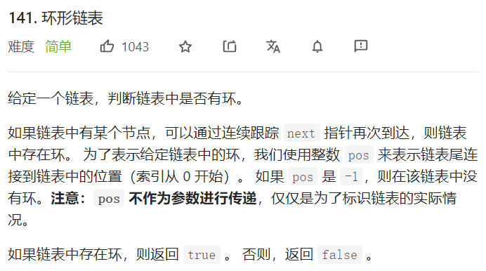
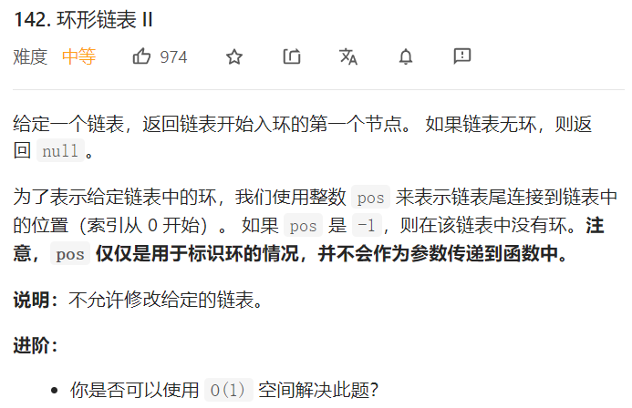
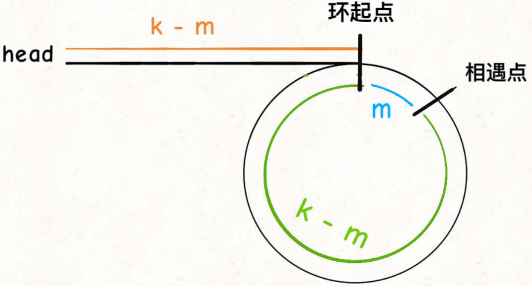
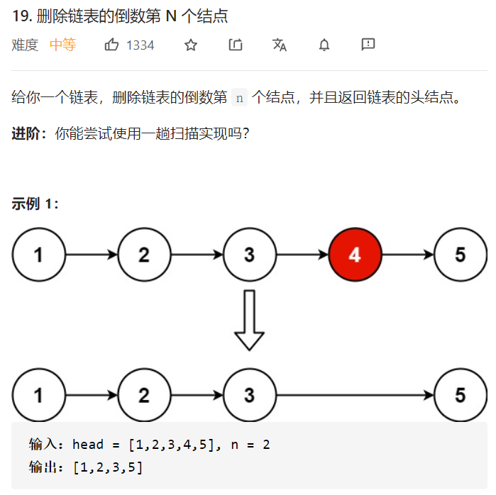
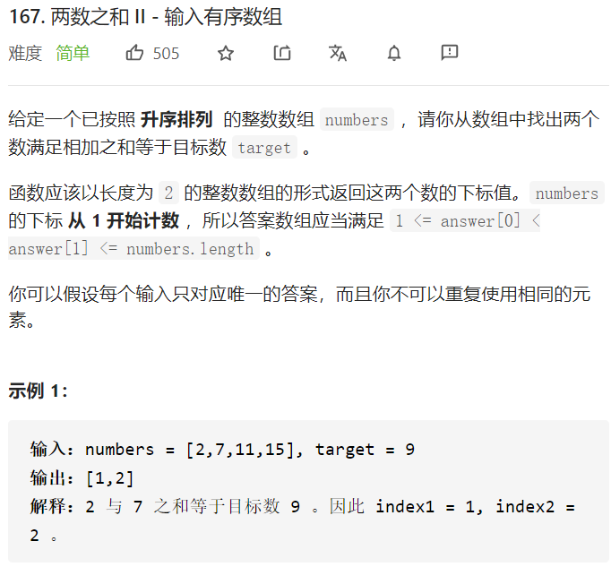
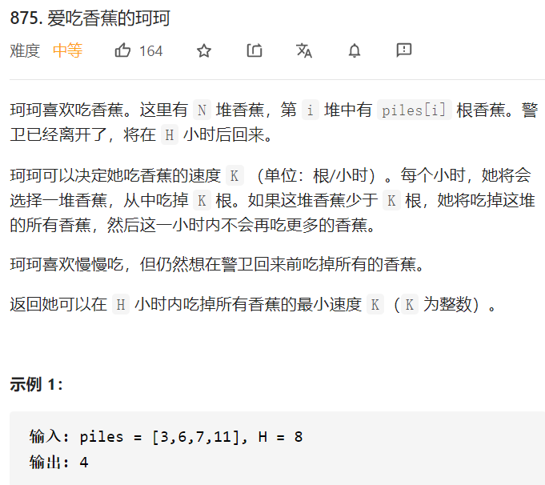
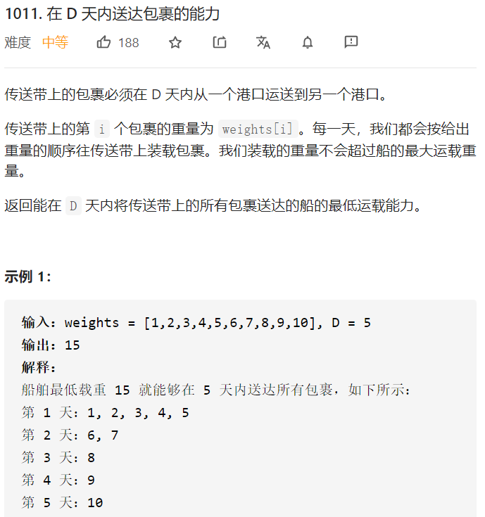
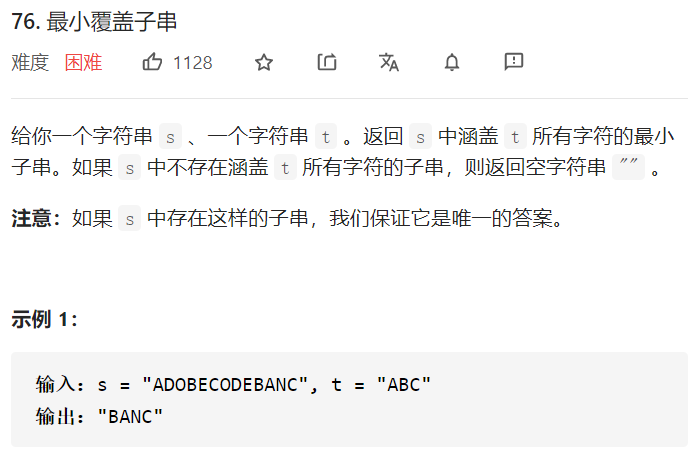

# 快慢指针

## 判定链表中是否含有环



```js
/**
 * Definition for singly-linked list.
 * function ListNode(val) {
 *     this.val = val;
 *     this.next = null;
 * }
 */

/**
 * @param {ListNode} head
 * @return {boolean}
 */
var hasCycle = function(head) {
    if(head===null || head.next===null){
        return false;
    }
    let slow = head,fast = head;
    while(fast!=null){
        slow = slow?.next;
        fast = fast?.next?.next;
        if(slow === fast){
            return true;
        }
    }
    return false;
};
```

## 环形链表位置



算法思路：



```js
var detectCycle = function(head) {
    if (head === null) {
        return null;
    }
    let slow = head, fast = head;
    while (fast !== null) {
        slow = slow.next;
        if (fast.next !== null) {
            fast = fast.next.next;
        } else {
            return null;
        }
        if (fast === slow) {
            let ptr = head;
            while (ptr !== slow) {
                ptr = ptr.next;
                slow = slow.next;
            }
            return ptr;
        }
    }
    return null;
};
```

## 寻找链表的倒数第 `n` 个元素



```js
var removeNthFromEnd = function(head, n) {
    let fast, slow;
    fast = slow = head;
    while(n !== 0){
        fast = fast?.next;
        n--;
    }
    if(fast === null){
        return head.next;
    }
    while(fast!==null && fast.next !== null){
        fast = fast?.next;
        slow = slow?.next;
    }
    slow.next = slow.next.next;
    return head;
};
```

# 左右指针

## 两数之和



```js
var twoSum = function(numbers, target) {
    numbers.sort((a,b)=>{
        return a<b?-1:1;
    });
    let len = numbers.length;
    let left = 0;
    let right = len-1;
    while(left<right){
        let sum = numbers[left] + numbers[right];
        if(sum<target){
            left++;
        }else if(sum==target){
            return [left+1,right+1];
        }else{
            right--;
        }
    }
    return [-1,-1];
};
```

## 翻转字符串


```js
var reverseString = function(s) {
    let len = s.length;
    let left = 0;
    let right = len - 1;
    while(left<right){
        swap(s,left,right);
        left++,right--;
    }
    return s;
};
let swap = function (s,left,right){
    // 另一种写法,JS特有的
    // [s[right],s[left]]=[s[left],s[right]];
    let temp = s[left];
    s[left] = s[right];
    s[right] = temp;
}
```

# 二分查找

## 二分查找

```js
/**
 * @description : 二分查找，正常查找
 * @return  {*} 找到返回该位置，找不到返回-1
 * @param {*} arr 传入的数组
 * @param {*} val 要查找的值
 */
let binarySearch = function (arr, val) {
    if (arr.length === 0) {
        return -1;
    }
    let left = 0;
    let right = arr.length - 1;
    while (left <= right) {
        let mid = left + Math.floor((right - left) / 2);
        if (arr[mid] == val) {
            return mid;
        } else if (arr[mid] < val) {
            left = mid + 1;
        } else {
            right = mid - 1;
        }
    }
    return -1;
};
/**
 * @description : 二分查找，左侧区间，[0,arr.length)
 * 子区间：[left,mid)  [mid+1,right)
 * @return  {*} 返回left，就是查找的最左位置，找不到返回0
 * @param {*} arr
 * @param {*} val
 */
let binarySearchLeft = function (arr, val) {
    if (arr.length === 0) {
        return -1;
    }
    let left = 0;
    let right = arr.length;
    while (left < right) {
        let mid = left + Math.floor((right - left) / 2);
        if (arr[mid] < val) {
            left = mid + 1;
        } else if (arr[mid] > val) {
            right = mid;
        } else if (arr[mid] == val) {
            right = mid;
        }
    }
    return left;
}
/**
 * @description : 二分查找，右侧区间，[0,arr.length)
 * 子区间：[left,mid)  [mid+1,right)
 * @return  {*} 返回left-1，就是查找的最右位置，找不到返回0
 * @param {*} arr
 * @param {*} val
 */
let binarySearchRight = function (arr, val) {
    if (arr.length === 0) {
        return -1;
    }
    let left = 0;
    let right = arr.length;
    while (left < right) {
        let mid = left + Math.floor((right - left) / 2);
        if (arr[mid] <= val) {
            left = mid + 1;
        } else if (arr[mid] > val) {
            right = mid;
        } else if (arr[mid] == val) {
            left = mid + 1;
        }
    }
    return left - 1;
}
let arr = [1, 5, 8, 9, 9, 9, 9, 11];
let res = binarySearch(arr, 9);
let res2 = binarySearchLeft(arr, 9);
let res3 = binarySearchRight(arr, 9);
console.log(res);  // 3
console.log(res2);  // 3
console.log(res3);  // 6
```

## 吃香蕉



!> 在JS中`(right - left) / 2`得到的可以是小数，这与Java中不同，因此要`Math.floor(……)`

```js
/**
 * @param {number[]} piles
 * @param {number} h
 * @return {number}
 */
var minEatingSpeed = function (piles, H) {
    let left = 1, right = getMax(piles) + 1;
    while (left < right) {
        let mid = left + Math.floor((right - left) / 2);
        if (canFinish(piles, mid, H)) {
            right = mid;
        } else {
            left = mid + 1;
        }
    }
    return left;
};
let getMax = function (piles) {
    let max = 0;
    for (const n of piles) {
        max = Math.max(n, max);
    }
    return max;
}
let timeOf = function (n, speed) {
    return Math.floor(n / speed) + ((n % speed > 0) ? 1 : 0);
}
let canFinish = function (piles, speed, H) {
    let time = 0;
    for (const n of piles) {
        time += timeOf(n, speed);
    }
    return time <= H;
}
```

## 运包裹



```js
/**
 * @param {number[]} weights
 * @param {number} D
 * @return {number}
 */
var shipWithinDays = function (weights, D) {
    let low = maxDays(weights);
    let high = sum(weights) + 1;
    while (low < high) {
        let mid = low + Math.floor((high - low) / 2);
        if (canFinish(weights, D, mid)) {
            high = mid;
        } else {
            low = mid + 1;
        }
    }
    return low - 1;
};

let canFinish = function (weights, D, carry) {
    let j = 0;
    for (let i = 0; i < D; i++) {
        let cap = carry;
        while (weights[j] < cap) {
            cap = cap - weights[j];
            j++;
        }
    }
    if (j == weights.length) {
        return true;
    } else {
        return false;
    }
}

let sum = function (weights) {
    let sum = 0;
    for (let w of weights) {
        sum = sum + w;
    }
    return sum;
}

let maxDays = function (weights) {
    let max = -Infinity;
    for (let w of weights) {
        if (w > max) {
            max = w;
        }
    }
    return max;
}
```

# 滑动窗口算法

滑动窗口算法框架：

```java
/* 滑动窗口算法框架 */
void slidingWindow(string s, string t) {
    unordered_map<char, int> need, window;
    for (char c : t) need[c]++;

    int left = 0, right = 0;
    int valid = 0; 
    while (right < s.size()) {
        // c 是将移入窗口的字符
        char c = s[right];
        // 右移窗口
        right++;
        // 进行窗口内数据的一系列更新
        ...

        /*** debug 输出的位置 ***/
        printf("window: [%d, %d)\n", left, right);
        /********************/

        // 判断左侧窗口是否要收缩
        while (window needs shrink) {
            // d 是将移出窗口的字符
            char d = s[left];
            // 左移窗口
            left++;
            // 进行窗口内数据的一系列更新
            ...
        }
    }
}
```

## 最小覆盖子串



```js
let addMap = function (map, c) {
    if (!map.has(c)) {
        map.set(c, 1);
    } else {
        map.set(c, map.get(c) + 1);
    }
}
/**
 * @param {string} s 待匹配串
 * @param {string} t 子串
 * @return {string} 返回的字符串
 */
var minWindow = function (s, t) {
    let need = new Map();
    let window = new Map();
    let left = 0, right = 0;
    let valid = 0;
    let start = 0, len = Infinity;
    for (let c of t) {
        addMap(need, c);
    }
    while (right < s.length) {
        let c = s[right];
        right++;
        if (need.has(c)) {
            addMap(window, c);
            if (window.get(c) === need.get(c)) {
                valid++;
            }
        }
        // console.log("window: [%d, %d)", left, right);
        while (valid === need.size) {
            if (right - left < len) {
                start = left;
                len = right - left;
            }
            let d = s[left];
            left++;
            if (need.has(d)) {
                if (window.get(d) === need.get(d)) {
                    valid--;
                }
                window.set(d, window.get(d) - 1);
            }
        }
    }
    return len === Infinity ? "" : s.substr(start, len);
};
```

