# 最长递增子序列

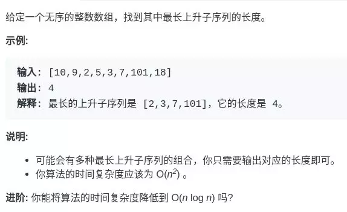

注意「子序列」和「子串」这两个名词的区别，子串一定是连续的，而子序列不一定是连续的。下面先来一步一步设计动态规划算法解决这个问题。

定义dp[i]：**以 nums[i] 这个数结尾的最长递增子序列的长度。**

算法演进过程如下：

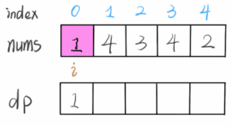

根据这个定义，我们的最终结果（子序列的最大长度）应该是 dp 数组中的最大值，即`res = max{dp[i]}`

状态转移（类似于数学归纳法）：

我们已经知道了 dp[0...4] 的所有结果，我们如何通过这些已知结果推出 dp[5] 呢？

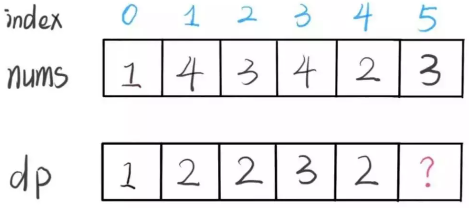

根据刚才我们对 dp 数组的定义，现在想求 dp[5] 的值，也就是想求以 nums[5] 为结尾的最长递增子序列。既然是递增子序列，我们只要**找到前面那些结尾比 3 小的子序列，然后把 3 接到最后**，就可以形成一个新的递增子序列，而且这个新的子序列长度加一。

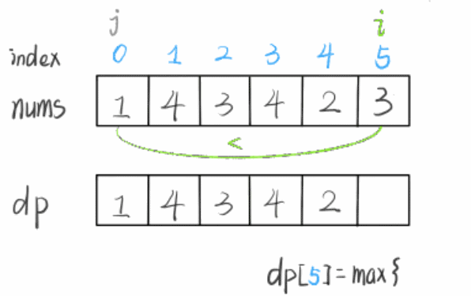

base case：dp 数组应该全部初始化为 1，因为子序列最少也要包含自己，所以长度最小为 1。

```java
class Solution {
    // dp[i]：以 nums[i] 这个数结尾的最长递增子序列的长度。
    public int lengthOfLIS(int[] nums) {
        int length = nums.length;
        int[] dp = new int[length];
        // 初始化最短都是1
        Arrays.fill(dp,1);
        for(int i=0;i<length;i++){
            for(int j=0;j<i;j++){
                if(nums[j]<nums[i]){
                    dp[i]=Math.max(dp[j]+1,dp[i]);
                }
            }
        }
        int res = Integer.MIN_VALUE;
        for(int i=0;i<length;i++){
            if(res<dp[i]){
                res = dp[i];
            }
        }
        return res;
    }
}
```

# 最长回文子序列

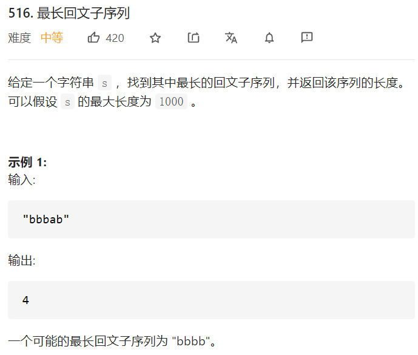

 dp 数组的定义是：**在子串`s[i..j]`中，最长回文子序列的长度为`dp[i][j]`**。

i处与j处字符**相等**，则`dp[i][j]=dp[i+1][j-1]+2`

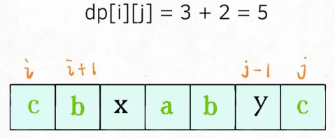

i处与j处字符**不相等**，则`dp[i][j]=Max{dp[i+1][j],dp[i][j-1]}`

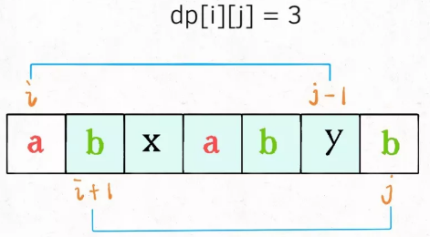

最终结果求的是`dp[0][n-1]`

而i=j，即字符串长度为1，最长回文子序列必然是1

j<i，没有字符串，设置为0

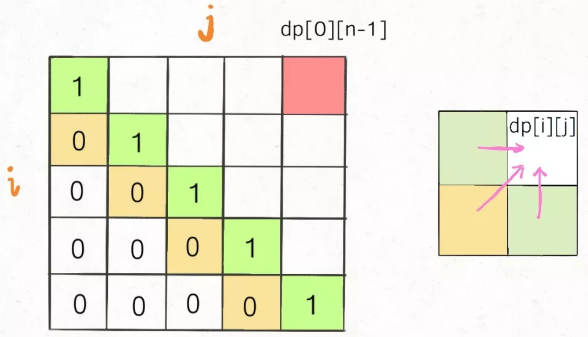

随后确定遍历方向：i越来越小，j越来越大

通过的代码如下：

```java
class Solution {
    public int longestPalindromeSubseq(String s) {
        int length = s.length();
        int[][] dp = new int[length][length];
        for(int i=0;i<length;i++){
            dp[i][i]=1;
        }
        // 遍历方向: i越来越小,j越来越大
        for(int i=length-2;i>=0;i--){
            for(int j=i+1;j<length;j++){
                if(s.charAt(i)==s.charAt(j)){
                    dp[i][j]=dp[i+1][j-1]+2;
                }else{
                    dp[i][j]=Math.max(dp[i][j-1],dp[i+1][j]);
                }
            }
        }
        return dp[0][length-1];
    }
}
```

#  最长公共子序列

 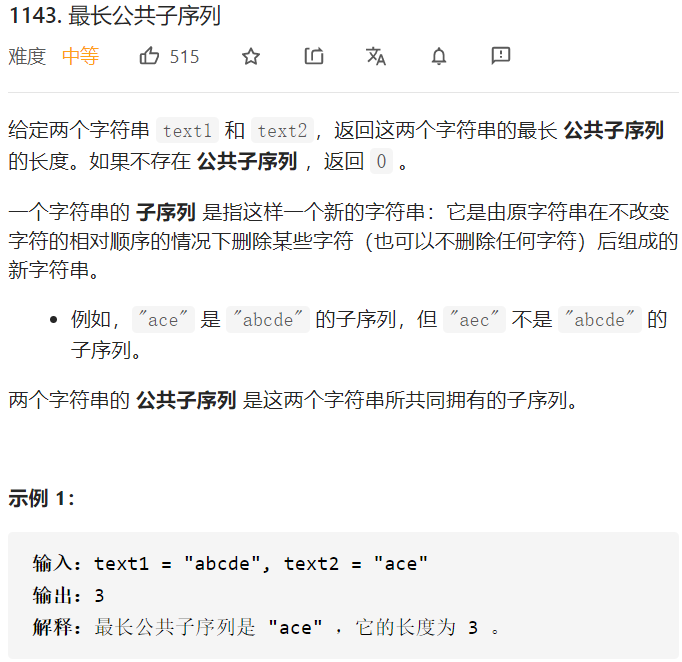

定义`dp[i][j]`：`text1[0:i-1]`和`text2[0:j-1]`的最长公共子序列。

选定的字符相等，往后加一，即`dp[i][j]=dp[i-1][j-1]+1;`

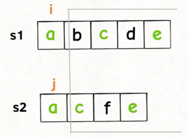

不相等，有三种情况：

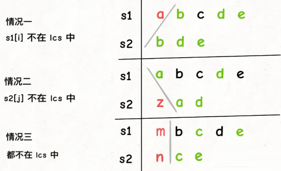

遍历方向：从字符串头位置向尾部位置顺序遍历

```java
class Solution {
    // 定义dp[i][j]表示text1[0:i-1]和text2[0:j-1]的最长公共子序列。
    public int longestCommonSubsequence(String text1, String text2) {
        int M = text1.length();
        int N = text2.length();
        int[][] dp = new int[M+1][N+1];
        for(int i=1;i<=M;i++){
            for(int j=1;j<=N;j++){
                if(text1.charAt(i-1)==text2.charAt(j-1)){
                    dp[i][j]=dp[i-1][j-1]+1;
                }else{
                    dp[i][j]=Math.max(dp[i][j-1],dp[i-1][j]);
                }
            }
        }
        return dp[M][N];
    }
}
```

# 最长和谐子序列

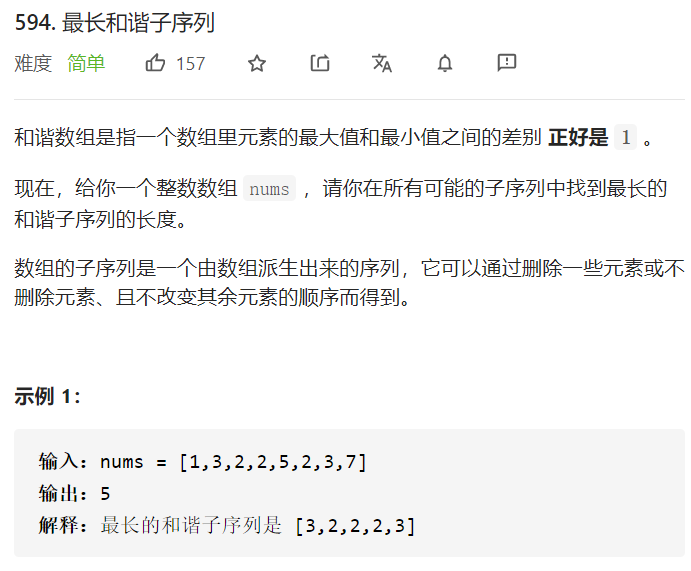

求解如下：

这题不需要动态规划，使用的是HashMap

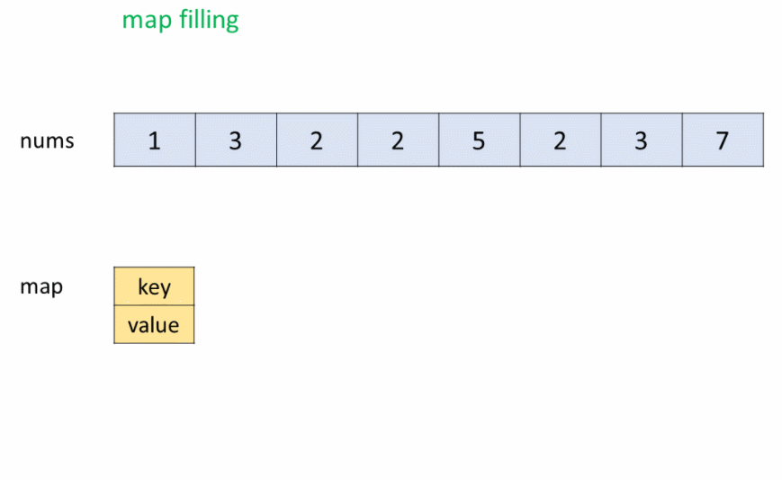

```java
class Solution {
    public int findLHS(int[] nums) {
        Map<Integer,Integer> map = new HashMap<>();
        for(int i:nums){
            if(map.containsKey(i)){
                map.put(i,map.get(i)+1);
            }else{
                map.put(i,1);
            }
        }
        int res = 0;
        for(int i:map.keySet()){
            if(map.containsKey(i+1)){
                res = Math.max(res,map.get(i)+map.get(i+1));
            }
        }
        return res;
    }
}
```

# 最大子序和

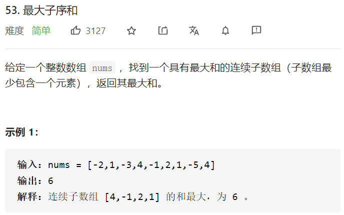

定义`dp[i]`：以坐标i结尾的子数组和

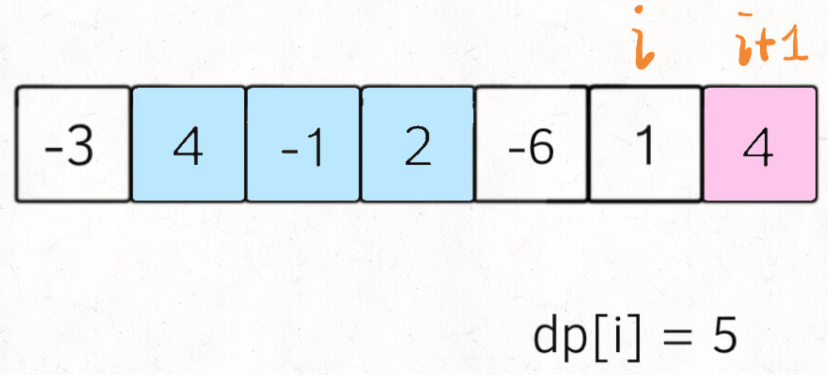

得到每个坐标i前的最大子数组和，最终遍历这个dp，找到最大值就是整个连续数组最大的和

```java
class Solution {
    public int maxSubArray(int[] nums) {
        int length = nums.length;
        if(length==1){
            return nums[0];
        }
        int[] dp = new int[length];
        Arrays.fill(dp,Integer.MIN_VALUE);
        dp[0]=nums[0];
        for(int i=1;i<length;i++){
            dp[i]=Math.max(nums[i],dp[i-1]+nums[i]);
        }
        int res = Integer.MIN_VALUE;
        for(int i:dp){
            if(res<i){
                res = i;
            }
        }
        return res;
    }
}
```

