# 一、稀疏数组和队列

## 稀疏数组

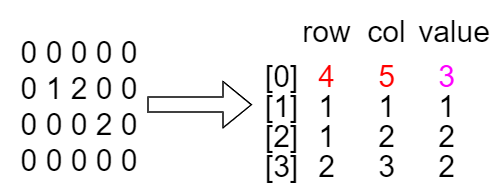

在稀疏数组中第0行代表的原先数组为`4*5`结构，一共`3`个不为0的值

## 数组实现队列

```java
// 使用数组模拟队列-编写一个ArrayQueue类
class ArrayQueue {
	private int maxSize; // 表示数组的最大容量
	private int front; // 队列头
	private int rear; // 队列尾
	private int[] arr; // 该数据用于存放数据, 模拟队列

	// 创建队列的构造器
	public ArrayQueue(int arrMaxSize) {
		maxSize = arrMaxSize;
		arr = new int[maxSize];
		front = -1; // 指向队列头部，分析出front是指向队列头的前一个位置
		rear = -1; // 指向队列尾，指向队列尾的数据(即就是队列最后一个数据)
	}

	// 判断队列是否满
	public boolean isFull() {
		return rear == maxSize - 1;
	}

	// 判断队列是否为空
	public boolean isEmpty() {
		return rear == front;
	}

	// 添加数据到队列
	public void addQueue(int n) {
		if (isFull()) {
			return;
		}
		rear++;
		arr[rear] = n;
	}

	// 获取队列的数据, 出队列
	public int getQueue() {
		if (isEmpty()) {
			throw new RuntimeException("队列空");
		}
		front++;
		return arr[front];

	}

	// 显示队列的所有数据
	public void showQueue() {
		if (isEmpty()) {
			return;
		}
		for (int i = 0; i < arr.length; i++) {
			System.out.printf("arr[%d]=%d\n", i, arr[i]);
		}
	}

	// 显示队列的头数据， 注意不是取出数据
	public int headQueue() {
		if (isEmpty()) {
			throw new RuntimeException("队列空");
		}
		return arr[front + 1];
	}
}
```

## 数组实现循环队列

对前面的数组模拟队列的优化，充分利用数组. 因此将数组看做是一个环形的。(通过**取模的方式来实现**即可) 

front变量的含义做一个调整： front 就指向队列的第一个元素，也就是说 arr[front] 就是队列的第一个元素，front初始值为0

rear 变量的含义做一个调整：rear 指向队列的最后一个元素的后一个位置，因为希望空出一个空间做为约定，rear初始值为0

队列为满：`(rear+1)%maxSize=front`

队列为空：`rear==front`

队列中有效数据个数：`(rear+maxSize-front)%maxSize`

```java
class CircleArray {
	private int maxSize;
	private int front; 
	private int rear;
	private int[] arr;
	
	public CircleArray(int arrMaxSize) {
		maxSize = arrMaxSize;
		arr = new int[maxSize];
	}
	
	// 判断队列是否满
	public boolean isFull() {
		return (rear  + 1) % maxSize == front;
	}
	
	// 判断队列是否为空
	public boolean isEmpty() {
		return rear == front;
	}
	
	// 添加数据到队列
	public void addQueue(int n) {
		if (isFull()) {
			return;
		}
		arr[rear] = n;
		rear = (rear + 1) % maxSize;
	}
	
	// 获取队列的数据, 出队列
	public int getQueue() {
		if (isEmpty()) {
			throw new RuntimeException("队列空");
		}
		// 这里需要分析出 front是指向队列的第一个元素
		// 1. 先把 front 对应的值保留到一个临时变量
		// 2. 将 front 后移, 考虑取模
		// 3. 将临时保存的变量返回
		int value = arr[front];
		front = (front + 1) % maxSize;
		return value;

	}
	
	// 显示队列的所有数据
	public void showQueue() {
		if (isEmpty()) {
			return;
		}
		// 思路：从front开始遍历，遍历多少个元素
		for (int i = front; i < front + size() ; i++) {
			System.out.printf("arr[%d]=%d\n", i % maxSize, arr[i % maxSize]);
		}
	}
	
	// 求出当前队列有效数据的个数
	public int size() {
		return (rear + maxSize - front) % maxSize;   
	}
	
	// 显示队列的头数据， 注意不是取出数据
	public int headQueue() {
		if (isEmpty()) {
			throw new RuntimeException("队列空");
		}
		return arr[front];
	}
}
```

# 二、链表

定义`Node`节点：

> 注意这里的属性要用public，否则后面无法直接访问，当然也可以用private，用getter、setter访问，不过较麻烦

```java
public class Node {
    public int no;
    public String name;
    public Node next;

    public Node(int no, String name) {
        this.no = no;
        this.name = name;
    }

    @Override
    public String toString() {
        return "Node [no=" + no + ", name=" + name + "]";
    }
}
```

## 单链表

```java
/**
 * @author Jonny Long
 * @date 2021/3/7 9:15
 * 以下单链表带有头节点
 */
public class SingleLinkedList {
    // 初始化头节点
    private Node head = new Node(0, "");

    // 返回头节点
    public Node getHead() {
        return head;
    }

    // 链表长度
    public static int getLength(Node head) {
        if (head.next == null) {
            return 0;
        }
        Node cur = head.next;
        int length = 0;
        while (cur != null) {
            cur = cur.next;
            length++;
        }
        return length;
    }

    // 遍历链表
    public void list() {
        if (head.next == null) {
            System.out.println("链表为空");
            return;
        }
        Node temp = head.next;
        while (temp != null) {
            System.out.println(temp);
            temp = temp.next;
        }
    }

    // 头插法
    public void insertFirst(Node node) {
        node.next = head.next;
        head.next = node;
    }

    // 尾插法
    public void append(Node node) {
        Node temp = head;
        while (temp.next != null) {
            temp = temp.next;
        }
        temp.next = node;
    }

    // 插入到指定位置
    public void insertPos(Node node, int pos) {
        Node temp = head;
        while (temp.next != null && pos != 0) {
            temp = temp.next;
            pos--;
        }
        node.next = temp.next;
        temp.next = node;
    }

    // 修改节点信息
    public void update(Node newNode) {
        //判断是否空
        if (head.next == null) {
            System.out.println("链表为空，更新失败");
        }
        Node temp = head.next;
        while (temp != null) {
            if (temp.no == newNode.no) {
                temp.name = newNode.name;
                return;
            }
            temp = temp.next;
        }
        System.out.println("没有找到该节点");
    }

    // 删除节点
    public void del(int no) {
        Node temp = head;
        while (temp.next != null) {
            if (temp.next.no == no) {
                temp.next = temp.next.next;
                return;
            }
            temp = temp.next;
        }
        System.out.println("没有找到该节点");
    }

    // 单链表翻转
    public static void reverseList(Node head) {
        if (head.next == null || head.next.next == null) {
            return;
        }
        Node cur = head.next;
        Node p;
        // 断开头节点与链表主体的连接
        head.next = null;
        while (cur != null) {
            p = cur.next;
            cur.next = head.next;
            head.next = cur;
            cur = p;
        }
    }
}
```

这里需要注意getLength是静态方法，传入的是链表头，使用方式如下：

```java
int len = SingleLinkedList.getLength(singleLinkedList.getHead());
```

## 链表的改进

双链表：和普通链表相比，允许直接访问前驱节点，保存两个指针

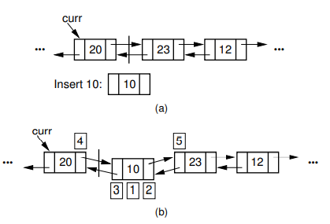

循环链表：尾部和头部相连的链表

# 三、栈

## 数组栈

```java
/**
 * @author Jonny Long
 * @date 2021/3/7 11:10
 * 指针指向栈底，所以入栈是先自增指针，出栈是后自减指针
 */
public class ArrayStack {
    private int maxSize;
    private int[] stack;
    private int top = -1;

    // 构造器
    public ArrayStack(int maxSize) {
        this.maxSize = maxSize;
        stack = new int[this.maxSize];
    }

    // 栈满
    public boolean isFull() {
        return top == maxSize - 1;
    }

    // 栈空
    public boolean isEmpty() {
        return top == -1;
    }

    // 获取栈顶元素
    public int peek(){
        if (isEmpty()){
            throw new RuntimeException("栈为空");
        }
        return stack[top];
    }

    // 入栈
    public void push(int value){
        if (isFull()){
            System.out.println("栈满");
            return;
        }
        top++;
        stack[top]=value;
    }

    // 出栈
    public int pop(){
        if (isEmpty()){
            throw new RuntimeException("栈为空");
        }
        int value=stack[top];
        top--;
        return value;
    }

    // 遍历栈
    public void list(){
        if (isEmpty()){
            System.out.println("栈为空");
            return;
        }
        for (int i = top; i > -1 ; i--) {
            System.out.printf("stack[%d]=%d\n",i,stack[i]);
        }
    }
}
```

# 四、排序

## 普通排序

```java
/**
 * @author Jonny Long
 * @date 2021/3/9 10:50
 */
public class MySort {
    // 冒泡排序
    public static void bubbleSort(double[] arr) {
        double temp;
        for (int i = 0; i < arr.length; i++) {
            for (int j = 0; j < arr.length - 1 - i; j++) {
                if (arr[j] > arr[j + 1]) {
                    temp = arr[j];
                    arr[j] = arr[j + 1];
                    arr[j + 1] = temp;
                }
            }
        }
    }

    // 选择排序
    public static void selectSort(double[] arr) {
        for (int i = 0; i < arr.length; i++) {
            double minNum = arr[i];
            int minIndex = i;
            for (int j = i + 1; j < arr.length; j++) {
                if (arr[j] < minNum) {
                    minNum = arr[j];
                    minIndex = j;
                }
            }
            arr[minIndex] = arr[i];
            arr[i] = minNum;
        }
    }

    // 插入排序
    public static void insertSort(double[] arr) {
        for (int i = 1; i < arr.length; i++) {
            double insertVal = arr[i];
            int index = i - 1;
            while (index >= 0 && insertVal < arr[index]) {
                arr[index + 1] = arr[index];
                index--;
            }
            arr[index + 1] = insertVal;
        }
    }

    // 希尔排序-交换法
    public static void shellSort(double[] arr){
        double temp = 0;
        int count = 0;
        for (int gap = arr.length / 2; gap > 0; gap /= 2) {
            for (int i = gap; i < arr.length; i++) {
                for (int j = i - gap; j >= 0; j -= gap) {
                    if (arr[j] > arr[j + gap]) {
                        temp = arr[j];
                        arr[j] = arr[j + gap];
                        arr[j + gap] = temp;
                    }
                }
            }
        }
    }

    // 希尔排序-移动法
    public static void shellSort2(double[] arr){
        for (int gap = arr.length / 2; gap > 0; gap /= 2) {
            for (int i = gap; i < arr.length; i++) {
                int j = i;
                double temp = arr[j];
                if (arr[j] < arr[j - gap]) {
                    while (j - gap >= 0 && temp < arr[j - gap]) {
                        arr[j] = arr[j-gap];
                        j -= gap;
                    }
                    arr[j] = temp;
                }
            }
        }
    }

    // 快速排序
    public static void quickSort(double[] arr,int left, int right){
        int l = left;
        int r = right;
        double pivot = arr[(left + right) / 2];
        double temp = 0;
        while( l < r) {
            while( arr[l] < pivot) {
                l += 1;
            }
            while(arr[r] > pivot) {
                r -= 1;
            }
            if( l >= r) {
                break;
            }
            //交换
            temp = arr[l];
            arr[l] = arr[r];
            arr[r] = temp;
            //如果交换完后，发现这个arr[l] == pivot值 相等 r--， 前移
            if(arr[l] == pivot) {
                r -= 1;
            }
            //如果交换完后，发现这个arr[r] == pivot值 相等 l++， 后移
            if(arr[r] == pivot) {
                l += 1;
            }
        }
        // 如果 l == r, 必须l++, r--, 否则为出现栈溢出
        if (l == r) {
            l += 1;
            r -= 1;
        }
        // 向左递归
        if(left < r) {
            quickSort(arr, left, r);
        }
        // 向右递归
        if(right > l) {
            quickSort(arr, l, right);
        }
    }

    //分+合方法
    public static void mergeSort(double[] arr, int left, int right, double[] temp) {
        if(left < right) {
            int mid = (left + right) / 2; //中间索引
            //向左递归进行分解
            mergeSort(arr, left, mid, temp);
            //向右递归进行分解
            mergeSort(arr, mid + 1, right, temp);
            //合并
            merge(arr, left, mid, right, temp);

        }
    }

    //合并的方法
    /**
     *
     * @param arr 排序的原始数组
     * @param left 左边有序序列的初始索引
     * @param mid 中间索引
     * @param right 右边索引
     * @param temp 做中转的数组
     */
    public static void merge(double[] arr, int left, int mid, int right, double[] temp) {
        int i = left;
        int j = mid + 1;
        int t = 0;
        while (i <= mid && j <= right) {
            if(arr[i] <= arr[j]) {
                temp[t] = arr[i];
                t += 1;
                i += 1;
            } else {
                temp[t] = arr[j];
                t += 1;
                j += 1;
            }
        }
        while( i <= mid) {
            temp[t] = arr[i];
            t += 1;
            i += 1;
        }
        while( j <= right) {
            temp[t] = arr[j];
            t += 1;
            j += 1;
        }
        t = 0;
        int tempLeft = left;
        while(tempLeft <= right) {
            arr[tempLeft] = temp[t];
            t += 1;
            tempLeft += 1;
        }
    }
}
```

## 堆排序

**步骤一 构造初始堆。将给定无序序列构造成一个大顶堆（一般升序采用大顶堆，降序采用小顶堆)。** 

**原始的数组 [4, 6, 8, 5, 9]** 

1）假设给定无序序列结构如下

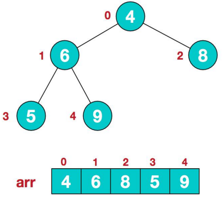

2）此时我们从最后一个非叶子结点开始（叶结点自然不用调整，第一个非叶子结点 

arr.length/2-1=5/2-1=1，也就是下面的 6 结点），从左至右，从下至上进行调整。

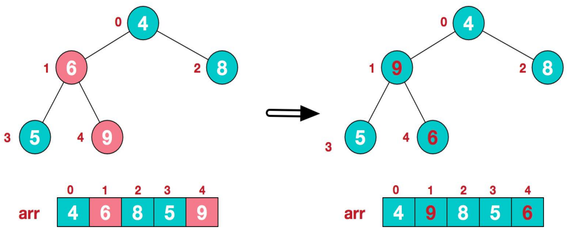

3）找到第二个非叶节点 4，由于[4,9,8]中 9 元素最大，4 和 9 交换。

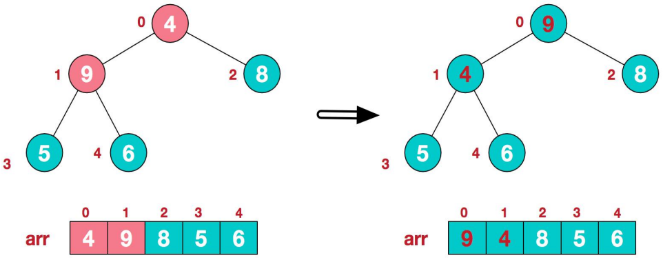

4）这时，交换导致了子根[4,5,6]结构混乱，继续调整，[4,5,6]中 6 最大，交换 4 和 6。

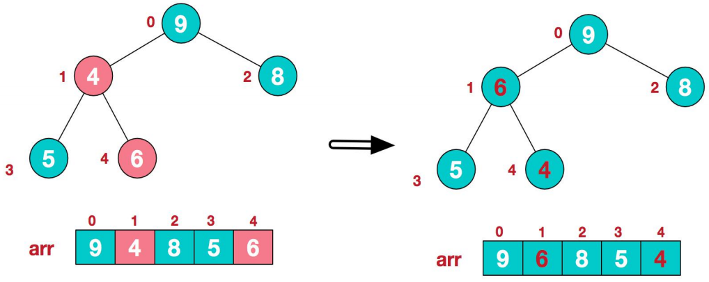

此时，我们就将一个无序序列构造成了一个大顶堆。

**步骤二 将堆顶元素与末尾元素进行交换，使末尾元素最大。然后继续调整堆，再将堆顶元素与末尾元素交换，得到第二大元素。如此反复进行交换、重建、交换。**

1）将堆顶元素 9 和末尾元素 4 进行交换

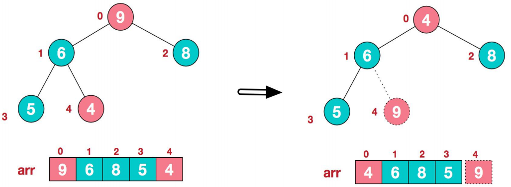

2）重新调整结构，使其继续满足堆定义

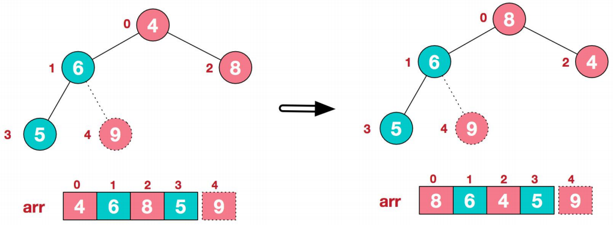

3）再将堆顶元素 8 与末尾元素 5 进行交换，得到第二大元素 8

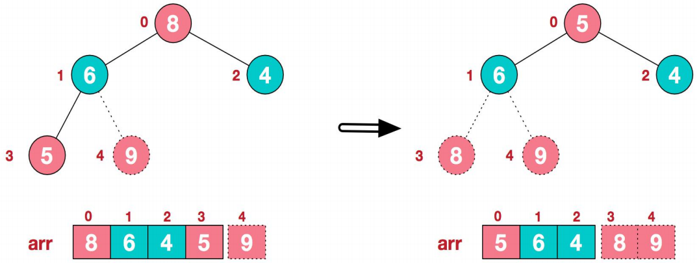

4）后续过程，继续进行调整，交换，如此反复进行，最终使得整个序列有序

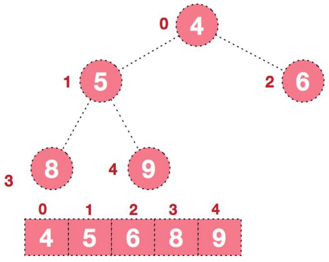

再简单总结下堆排序的基本思路：

1）将无序序列构建成一个堆，根据升序降序需求选择大顶堆或小顶堆；

2）将堆顶元素与末尾元素交换，将最大元素“沉”到数组末端；

3）重新调整结构，使其满足堆定义，然后继续交换堆顶元素与当前末尾元素，反复执行调整+交换步骤， 直到整个序列有序。

```java
/**
 * @author Jonny Long
 * @date 2021/3/16 9:19
 */
public class HeapSort {
    public static void heapSort(double[] arr) {
        double temp = 0;
        //完成我们最终代码
        //将无序序列构建成一个堆，根据升序降序需求选择大顶堆或小顶堆
        for (int i = arr.length / 2 - 1; i >= 0; i--) {
            adjustHeap(arr, i, arr.length);
        }
        for (int j = arr.length - 1; j > 0; j--) {
            //交换
            temp = arr[j];
            arr[j] = arr[0];
            arr[0] = temp;
            adjustHeap(arr, 0, j);
        }
    }

    //将一个数组(二叉树), 调整成一个大顶堆

    /**
     * 功能： 完成 将 以 i 对应的非叶子结点的树调整成大顶堆
     * 举例  int arr[] = {4, 6, 8, 5, 9}; => i = 1 => adjustHeap => 得到 {4, 9, 8, 5, 6}
     * 如果我们再次调用  adjustHeap 传入的是 i = 0 => 得到 {4, 9, 8, 5, 6} => {9,6,8,5, 4}
     *
     * @param arr    待调整的数组
     * @param i      表示非叶子结点在数组中索引
     * @param length 表示对多少个元素继续调整， length 是在逐渐的减少
     */
    private static void adjustHeap(double[] arr, int i, int length) {
        double temp = arr[i];
        for (int k = i * 2 + 1; k < length; k = k * 2 + 1) {
            // 说明左子结点的值小于右子结点的值
            if (k + 1 < length && arr[k] < arr[k + 1]) {
                k++;
            }
            if (arr[k] > temp) {
                arr[i] = arr[k];
                i = k;
            } else {
                break;
            }
        }
        arr[i] = temp;
    }
}
```

## 拓扑排序

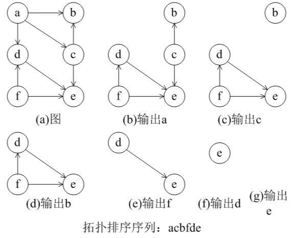

# 五、查找

```java
public class MySearch {
    // 线性查找
    public static int seqSearch(double[] arr, int value) {
        // 线性查找是逐一比对，发现有相同值，就返回下标
        for (int i = 0; i < arr.length; i++) {
            if (arr[i] == value) {
                return i;
            }
        }
        return -1;
    }

    // 二分查找(非递归)
    public static int binarySearch(double[] arr, int left, int right, double val) {
        while (left <= right) {
            int mid = left + ((right - left) / 2);
            if (arr[mid] == val) {
                return mid;
            } else if (arr[mid] < val) {
                left = mid + 1;
            } else {
                right = mid - 1;
            }
        }
        return -1;
    }

    // 二分查找(递归)
    public static int binarySearchRecursive(double[] arr, int left, int right, double val) {
        if (left > right) {
            return -1;
        }
        int mid = left + ((right - left) / 2);
        if (arr[mid] == val) {
            return mid;
        } else if (arr[mid] < val) {
            return binarySearchRecursive(arr, mid + 1, right, val);
        } else {
            return binarySearchRecursive(arr, left, mid - 1, val);
        }
    }

    // 插值查找
    public static int insertSearch(double[] arr, int left, int right, double val) {
        if (left > right || val < arr[0] || val > arr[arr.length - 1]) {
            return -1;
        }
        int mid = (int) (left + (right - left) * (val - arr[left]) / (arr[right] - arr[left]));
        if (arr[mid] == val) {
            return mid;
        } else if (arr[mid] < val) {
            return binarySearchRecursive(arr, mid + 1, right, val);
        } else {
            return binarySearchRecursive(arr, left, mid - 1, val);
        }
    }
}

```

# 六、树

## 二叉树

二叉树节点：

```java
/**
 * @author Jonny Long
 * @date 2021/3/7 12:54
 */
@Data
@ToString(of = {"no","name"})
public class Node {
    private int no;
    private String name;
    private Node left;
    private Node right;

    public Node(int no, String name) {
        this.no = no;
        this.name = name;
    }
}
```

具体使用：

```java
/**
 * @author Jonny Long
 * @date 2021/3/7 12:51
 */
public class BinaryTree {
    private Node root;

    public void setRoot(Node root) {
        this.root = root;
    }

    public Node getRoot() {
        return root;
    }

    // 先序遍历
    public void preOrder(Node current) {
        if (current != null) {
            System.out.println(current);
            preOrder(current.getLeft());
            preOrder(current.getRight());
        }
    }

    // 中序遍历
    public void infixOrder(Node current) {
        if (current != null) {
            infixOrder(current.getLeft());
            System.out.println(current);
            infixOrder(current.getRight());
        }
    }

    // 后序遍历
    public void postOrder(Node current) {
        if (current != null) {
            postOrder(current.getLeft());
            postOrder(current.getRight());
            System.out.println(current);
        }
    }

    // 递归前序查找
    public Node preOrderSearch(Node current, int no) {
        // 比较当前结点是不是
        if (current.getNo() == no) {
            return current;
        }
        Node res = null;
        // 1.则判断当前结点的左子节点是否为空，如果不为空，则递归前序查找
        // 2.如果左递归前序查找，找到结点，则返回
        if (current.getLeft() != null) {
            res = preOrderSearch(current.getLeft(), no);
        }
        if (res != null) {
            return res;
        }
        // 1.左递归前序查找，找到结点，则返回，否继续判断，
        // 2.当前的结点的右子节点是否为空，如果不空，则继续向右递归前序查找
        if (current.getRight() != null) {
            res = preOrderSearch(current.getRight(), no);
        }
        return res;
    }

    // 递归中序查找
    public Node infixOrderSearch(Node current, int no) {
        Node res = null;
        if (current.getLeft() != null) {
            res = infixOrderSearch(current.getLeft(), no);
        }
        if (res != null) {
            return res;
        }
        if (current.getNo() == no) {
            return current;
        }
        if (current.getRight() != null) {
            res = infixOrderSearch(current.getRight(), no);
        }
        return res;
    }

    // 递归后序查找
    public Node postOrderSearch(Node current, int no) {
        Node res = null;
        // 左子树
        if (current.getLeft() != null) {
            res = postOrderSearch(current.getLeft(), no);
        }
        if (res != null) {
            return res;
        }
        // 右子树
        if (current.getRight() != null) {
            res = postOrderSearch(current.getRight(), no);
        }
        if (res != null) {
            return res;
        }
        if (current.getNo() == no) {
            return current;
        }
        return res;
    }

    // 二叉树深度
    public int depthTree(Node current) {
        int m, n;
        if (current == null) {
            return 0;
        }
        m = depthTree(current.getLeft());
        n = depthTree(current.getRight());
        return Math.max(m, n) + 1;
    }

    /**
     * 删除操作：
     * 如果删除的节点是叶子节点，则删除该节点
     * 如果删除的节点是非叶子节点，则删除该子树
     * 1. 因为我们的二叉树是单向的，所以我们是判断当前结点的子结点是否需要删除结点，而不能去判断当前这个结点是不是需要删除结点.
     * 2. 如果当前结点的左子结点不为空，并且左子结点 就是要删除结点，就将this.getLeft() = null; 并且就返回(结束递归删除)
     * 3. 如果当前结点的右子结点不为空，并且右子结点 就是要删除结点，就将this.getRight()= null ;并且就返回(结束递归删除)
     * 4. 如果第2和第3步没有删除结点，那么我们就需要向左子树进行递归删除
     * 5. 如果第4步也没有删除结点，则应当向右子树进行递归删除.
     */
    public void delNode(Node current, int no) {
        if (current.getLeft() != null && current.getLeft().getNo() == no) {
            current.setLeft(null);
            return;
        }
        if (current.getRight() != null && current.getRight().getNo() == no) {
            current.setRight(null);
            return;
        }
        if (current.getLeft() != null) {
            delNode(current.getLeft(), no);
        }
        if (current.getLeft() != null) {
            delNode(current.getRight(), no);
        }
    }
}
```

## 顺序存储二叉树

+ 顺序二叉树通常只考虑完全二叉树 

+ 第 n 个元素的左子节点为`2 * n + 1 `

+ 第 n 个元素的右子节点为 `2 * n + 2 `

+ 第 n 个元素的父节点为 `(n-1) / 2 `

+ n : 表示二叉树中的第几个元素

```java
/**
 * @author Jonny Long
 * @date 2021/3/7 17:49
 */
public class ArrBinaryTree {
    private int[] arr;

    public ArrBinaryTree(int[] arr) {
        this.arr = arr;
    }

    // 先序遍历顺序二叉树
    public void preOrder(int index) {
        if (arr == null || arr.length == 0) {
            System.out.println("数组为空，无法遍历");
        }
        System.out.println(arr[index]);
        if ((index * 2 + 1) < arr.length) {
            preOrder(2 * index + 1);
        }
        if ((index * 2 + 2) < arr.length) {
            preOrder(2 * index + 2);
        }
    }
}
```

## 线索二叉树

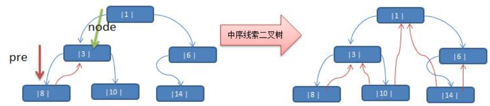

（1）left 指向的是左子树，也可能是指向的前驱节点. 比如 ① 节点 left 指向的左子树, 而 ⑩ 节点的 left 指向的 就是前驱节点. 

（2）right 指向的是右子树，也可能是指向后继节点，比如 ① 节点 right 指向的是右子树，而⑩ 节点的 right 指向 的是后继节点

重新定义的ThreadedNode节点：

```java
@Data
@ToString(of = {"no","name"})
public class ThreadedNode {
    private int no;
    private String name;
    private ThreadedNode left;
    private ThreadedNode right;
    /**
     * false：子节点
     * true：前驱或后继节点
     */
    private boolean isLeftType=false;
    private boolean isRightType=false;

    public ThreadedNode(int no, String name) {
        this.no = no;
        this.name = name;
    }
}
```

ThreadedBinaryTree类：

```java
public class ThreadedBinaryTree {
    private ThreadedNode root;
    private ThreadedNode preNode;

    public void setRoot(ThreadedNode root) {
        this.root = root;
    }

    public ThreadedNode getRoot() {
        return root;
    }

    // 中序遍历
    public void infixOrder(ThreadedNode current) {
        if (current != null) {
            infixOrder(current.getLeft());
            System.out.println(current);
            infixOrder(current.getRight());
        }
    }

    // 中序线索化二叉树
    public void threadedNodes(ThreadedNode node){
        if (node==null){
            return;
        }
        threadedNodes(node.getLeft());
        if (node.getLeft()==null){
            node.setLeft(preNode);
            node.setLeftType(true);
        }
        if (preNode != null && preNode.getRight() == null) {
            preNode.setRight(node);
            preNode.setRightType(true);
        }
        // 每处理一个结点后，让当前结点是下一个结点的前驱结点
        preNode = node;
        threadedNodes(node.getRight());
    }

    // 遍历线索化二叉树
    public void threadedList(){
        // 定义移动指针p
        ThreadedNode p = root;
        while (p!=null){
            while (p.isLeftType()==false){
                p=p.getLeft();
            }
            System.out.println(p);
            while (p.isRightType()==true){
                p=p.getRight();
                System.out.println(p);
            }
            // 替换遍历的结点
            p=p.getRight();
        }
    }
}
```

## 二叉搜索树

**二叉排序树**：BST: (Binary Sort(Search) Tree)，对于二叉排序树的**任何一个非叶子节点**，要求**左子节点的值比当前节点的值小，右子节点的值比当前节点的值大。**


BSTNode节点：

```java
@Data
@ToString(of = "value")
public class BSTNode {
    private double value;
    private BSTNode left;
    private BSTNode right;

    public BSTNode(double value) {
        this.value = value;
    }
}
```

二叉排序树主类：

```java
@Data
public class BinarySortTree {
    private BSTNode root;

    // 先序遍历
    public void preOrder(BSTNode current) {
        if (current != null) {
            System.out.println(current);
            preOrder(current.getLeft());
            preOrder(current.getRight());
        }
    }

    // 中序遍历
    public void infixOrder(BSTNode current) {
        if (current != null) {
            infixOrder(current.getLeft());
            System.out.println(current);
            infixOrder(current.getRight());
        }
    }

    // 后序遍历
    public void postOrder(BSTNode current) {
        if (current != null) {
            postOrder(current.getLeft());
            postOrder(current.getRight());
            System.out.println(current);
        }
    }

    // 根据value查询节点(非递归方法)
    public BSTNode search(double value) {
        BSTNode p = this.root;
        while (p != null) {
            if (value < p.getValue()) {
                p = p.getLeft();
            } else if (value > p.getValue()) {
                p = p.getRight();
            } else {
                return p;
            }
        }
        return null;
    }

    // 根据value查询节点(递归方法)
    public BSTNode searchByRecursion(BSTNode current, double value) {
        if (current == null) {
            return null;
        }
        if (value < current.getValue()) {
            return searchByRecursion(current.getLeft(), value);
        } else if (value > current.getValue()) {
            return searchByRecursion(current.getRight(), value);
        } else {
            return current;
        }
    }

    // 查找最大值
    public BSTNode findMax() {
        BSTNode p = this.root;
        while (p.getRight() != null) {
            p = p.getRight();
        }
        return p;
    }

    // 查找最小值
    public BSTNode findMin() {
        BSTNode p = this.root;
        while (p.getLeft() != null) {
            p = p.getLeft();
        }
        return p;
    }

    // 查找某个节点的父亲节点
    public BSTNode searchParent(BSTNode node) {
        BSTNode p = this.root;
        while (p != null) {
            // 为了避免空指针异常，需要提前判断左孩子和右孩子是否为空
            if (p.getLeft() != null && p.getLeft().getValue() == node.getValue()) {
                return p;
            }
            if (p.getRight() != null && p.getRight().getValue() == node.getValue()) {
                return p;
            }
            if (node.getValue() > p.getValue()) {
                p = p.getRight();
            } else {
                p = p.getLeft();
            }
        }
        return null;
    }

    // 插入节点(非递归方法)
    public void insert(BSTNode node) {
        BSTNode p = this.root;
        if (node == null) {
            return;
        }
        while (p != null) {
            if (node.getValue() < p.getValue()) {
                if (p.getLeft() == null) {
                    p.setLeft(node);
                    break;
                } else {
                    p = p.getLeft();
                }
            } else {
                if (p.getRight() == null) {
                    p.setRight(node);
                    break;
                } else {
                    p = p.getRight();
                }
            }
        }
    }

    /**
     * 删除二叉排序树中的某个节点，并将其子节点连接上去
     */
    public void delete(BSTNode node) {

    }

    // 销毁二叉排序树
    private void destroy(BSTNode tree) {
        if (tree == null)
            return;
        if (tree.getLeft() != null) {
            destroy(tree.getLeft());
        }
        if (tree.getRight() != null) {
            destroy(tree.getRight());
        }
        tree = null;
    }
}
```

## 堆

### 基本性质

大根堆：根节点值比子节点要大


堆和数组的关系：

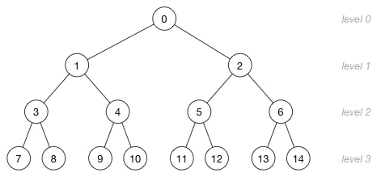

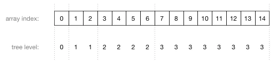

!> 注意：这里节点上的数字表示的是数组索引值，而不是节点保存的值

由上图可以看到，数组中父节点总是在子节点的前面。

在堆中，在当前层级所有的节点都已经填满之前不允许开是下一层的填充，所以堆总是有这样的形状：

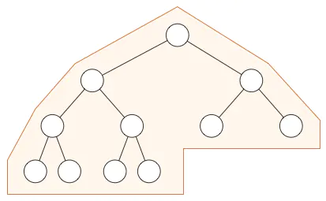

### 插入

我们将数字 `16` 插入到这个堆中：

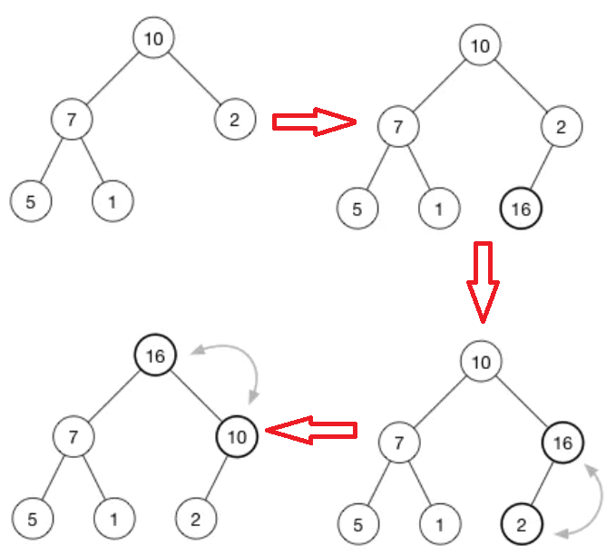

### 删除根节点

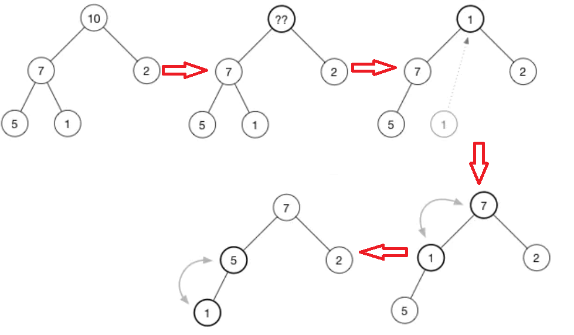


## 二叉平衡树

性质：左右子树高度之差的绝对值不超过1，`平衡因子=左子树高度-右子树高度`

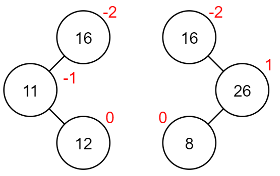

平衡步骤：

1. 找平衡因子=2
2. 找插入新节点后失去平衡的最小子树
3. 平衡调整

要求：

+ 距离插入节点最近
+ 平衡因子绝对值大于1的节点作为根

二叉平衡树的调整：

+ LL型——R
+ RR型——L
+ LR型——LR
+ RL型——RL

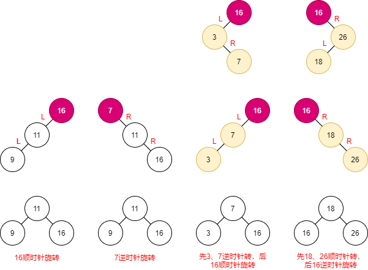

二叉平衡树的添加节点和删除节点：

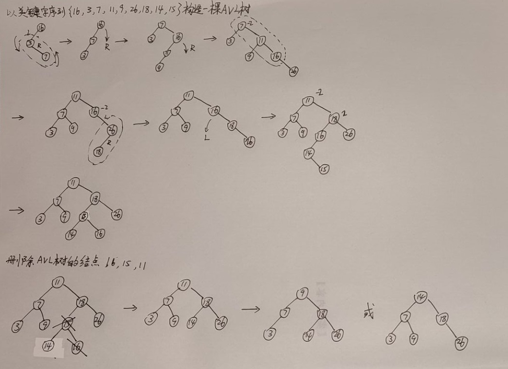

## 红黑树

## B树

### B-树

B树英文官方定义：

1、Every node has at most m children.（每个节点最多m个孩子）

2、Every non-leaf node (except root) has at least [m/2] child nodes.（除了根节点的非叶子节点至少m/2个孩子节点）

3、The root has at least two children if it is not a leaf node.（根节点如果不是叶子节点，至少两个孩子）

4、A non-leaf node with k children contains k − 1 keys.（有k个孩子的无叶子节点包含k-1个关键字）

5、All leaves appear in the same level.（所有叶子节点出现在同一层）


### B+树

1、B+树非叶子节点不存放数据，只存放keys。

2、B+树的叶子节点之间存在指针相连，而且是单链表。

在B-树基础上，为叶子结点增加链表指针，所有关键字都在叶子结点中出现，非叶子结点作为叶子结点的索引；B+树总是到叶子结点才命中；


### B*树

在B+树基础上，为非叶子结点也增加链表指针，将结点的最低利用率从1/2提高到2/3；


## 字典数


# 七、图

```java
/**
 * @author Jonny Long
 * @date 2021/3/10 20:05
 */
public class Graph {
    // 存储顶点集合
    private ArrayList<String> vertexList;
    // 存储图对应的邻结矩阵
    private int[][] edges;
    // 表示边的数目
    private int numOfEdges;
    // 定义给数组boolean[], 记录某个结点是否被访问
    private boolean[] isVisited;

    // 构造器
    public Graph(int n) {
        edges = new int[n][n];
        vertexList = new ArrayList<String>(n);
        numOfEdges = 0;
        isVisited = new boolean[n];
    }

    // 插入节点
    public void insertVertex(String v) {
        vertexList.add(v);
    }

    /**
     * 插入边
     * @param v1     节点
     * @param v2     节点
     * @param weight 权重
     */
    public void insertEdge(int v1, int v2, int weight) {
        edges[v1][v2] = weight;
        edges[v2][v1] = weight;
        numOfEdges++;
    }

    // 获取节点个数
    public int getNumOfVertex() {
        return vertexList.size();
    }

    // 获取边的个数
    public int getNumOfEdges() {
        return numOfEdges;
    }

    // 获取边的权重
    public int getWeight(int v1, int v2) {
        return edges[v1][v2];
    }

    // 获取下标对应的数据
    public String getValueByIndex(int i) {
        return vertexList.get(i);
    }

    // 输出顶点集合
    public void showVertex() {
        System.out.println(vertexList);
    }

    // 输出邻结矩阵
    public void showGraph() {
        for (int i = 0; i < edges.length; i++) {
            for (int j = 0; j < edges.length; j++) {
                System.out.print(edges[i][j] + "\t");
            }
            System.out.print("\n");
        }
    }

    // 得到第一个邻接结点的下标 w
    public int getFirstNeighbor(int index) {
        for (int i = 0; i < vertexList.size(); i++) {
            if (edges[index][i] > 0) {
                return i;
            }
        }
        return -1;
    }

    // 根据前一个邻接结点的下标来获取下一个邻接结点
    public int getNextNeighbor(int v1, int v2) {
        for (int j = v2 + 1; j < vertexList.size(); j++) {
            if (edges[v1][j] > 0) {
                return j;
            }
        }
        return -1;
    }

    // 深度优先搜索
    private void dfs(boolean[] isVisited, int i) {
        System.out.print(getValueByIndex(i) + "->");
        isVisited[i] = true;
        int w = getFirstNeighbor(i);
        while (w != -1) {
            if (!isVisited[w]) {
                dfs(isVisited, w);
            }
            w = getNextNeighbor(i, w);
        }
    }

    public void dfs() {
        isVisited = new boolean[vertexList.size()];
        for (int i = 0; i < getNumOfVertex(); i++) {
            if (!isVisited[i]) {
                dfs(isVisited, i);
            }
        }
    }

    //对一个结点进行广度优先遍历的方法
    private void bfs(boolean[] isVisited, int i) {
        // 表示队列的头结点对应下标
        int u;
        // 邻接结点w
        int w;
        LinkedList<Integer> queue = new LinkedList<>();
        System.out.print(getValueByIndex(i) + "=>");
        isVisited[i] = true;
        queue.addLast(i);
        while (!queue.isEmpty()) {
            u = (Integer) queue.removeFirst();
            w = getFirstNeighbor(u);
            while (w != -1) {//找到
                if (!isVisited[w]) {
                    System.out.print(getValueByIndex(w) + "=>");
                    isVisited[w] = true;
                    queue.addLast(w);
                }
                w = getNextNeighbor(u, w);
            }
        }
    }

    //遍历所有的结点，都进行广度优先搜索
    public void bfs() {
        isVisited = new boolean[vertexList.size()];
        for (int i = 0; i < getNumOfVertex(); i++) {
            if (!isVisited[i]) {
                bfs(isVisited, i);
            }
        }
    }
}
```

# 八、常用算法

## 二分

二分查找难不在算法，而在于细节

```js
/**
 * @description : 二分查找，正常查找
 * @return  {*} 找到返回该位置，找不到返回-1
 * @param {*} arr 传入的数组
 * @param {*} val 要查找的值
 */
let binarySearch = function (arr, val) {
    if (arr.length === 0) {
        return -1;
    }
    let left = 0;
    let right = arr.length - 1;
    while (left <= right) {
        let mid = left + Math.floor((right - left) / 2);
        if (arr[mid] == val) {
            return mid;
        } else if (arr[mid] < val) {
            left = mid + 1;
        } else {
            right = mid - 1;
        }
    }
    return -1;
};
/**
 * @description : 二分查找，左侧区间，[0,arr.length)
 * 子区间：[left,mid)  [mid+1,right)
 * @return  {*} 返回left，就是查找的最左位置，找不到返回0
 * @param {*} arr
 * @param {*} val
 */
let binarySearchLeft = function (arr, val) {
    if (arr.length === 0) {
        return -1;
    }
    let left = 0;
    let right = arr.length;
    while (left < right) {
        let mid = left + Math.floor((right - left) / 2);
        if (arr[mid] < val) {
            left = mid + 1;
        } else if (arr[mid] > val) {
            right = mid;
        } else if (arr[mid] == val) {
            right = mid;
        }
    }
    return left;
}
/**
 * @description : 二分查找，右侧区间，[0,arr.length)
 * 子区间：[left,mid)  [mid+1,right)
 * @return  {*} 返回left-1，就是查找的最右位置，找不到返回0
 * @param {*} arr
 * @param {*} val
 */
let binarySearchRight = function (arr, val) {
    if (arr.length === 0) {
        return -1;
    }
    let left = 0;
    let right = arr.length;
    while (left < right) {
        let mid = left + Math.floor((right - left) / 2);
        if (arr[mid] <= val) {
            left = mid + 1;
        } else if (arr[mid] > val) {
            right = mid;
        } else if (arr[mid] == val) {
            left = mid + 1;
        }
    }
    return left - 1;
}
let arr = [1, 5, 8, 9, 9, 9, 9, 11];
let res = binarySearch(arr, 9);
let res2 = binarySearchLeft(arr, 9);
let res3 = binarySearchRight(arr, 9);
console.log(res);  // 3
console.log(res2);  // 3
console.log(res3);  // 6
```

来梳理一下这些细节差异的因果逻辑：

第一个，最基本的二分查找算法：

```
因为我们初始化 right = nums.length - 1
所以决定了我们的「搜索区间」是 [left, right]
所以决定了 while (left <= right)
同时也决定了 left = mid+1 和 right = mid-1

因为我们只需找到一个 target 的索引即可
所以当 nums[mid] == target 时可以立即返回
```

第二个，寻找左侧边界的二分查找：

```
因为我们初始化 right = nums.length
所以决定了我们的「搜索区间」是 [left, right)
所以决定了 while (left < right)
同时也决定了 left = mid + 1 和 right = mid

因为我们需找到 target 的最左侧索引
所以当 nums[mid] == target 时不要立即返回
而要收紧右侧边界以锁定左侧边界
```

第三个，寻找右侧边界的二分查找：

```
因为我们初始化 right = nums.length
所以决定了我们的「搜索区间」是 [left, right)
所以决定了 while (left < right)
同时也决定了 left = mid + 1 和 right = mid

因为我们需找到 target 的最右侧索引
所以当 nums[mid] == target 时不要立即返回
而要收紧左侧边界以锁定右侧边界

又因为收紧左侧边界时必须 left = mid + 1
所以最后无论返回 left 还是 right，必须减一
```

## 分治

```java
/**
 * @author Jonny Long
 * @date 2021/3/12 16:20
 */
public class Hanoitower {
    public static void hanoiTower(int num, char a, char b, char c) {
        //如果只有一个盘
        if(num == 1) {
            System.out.println("第1个盘从 " + a + "->" + c);
        } else {
            //如果我们有 n >= 2 情况，我们总是可以看做是两个盘 1.最下边的一个盘 2. 上面的所有盘
            //1. 先把 最上面的所有盘 A->B， 移动过程会使用到 c
            hanoiTower(num - 1, a, c, b);
            //2. 把最下边的盘 A->C
            System.out.println("第" + num + "个盘从 " + a + "->" + c);
            //3. 把B塔的所有盘 从 B->C , 移动过程使用到 a塔
            hanoiTower(num - 1, b, a, c);
        }
    }
}
```

## 贪心

1）**在每一步选择中都采取最好或者最优（即最有利）的选择**，从而希望能够导致结果是最好或者最优的算法

2）贪婪算法所得到的结果不一定是最优的结果（有时候会是最优解），但是都是相对近似最优解的结果

## KMP

> KMP算法的核心思想：设法让主串不回退，让子串回退的更少

整个过程分为两步：

1. 为子串建立一张最长匹配长度的表
2. 利用这种表的索引对主串实现匹配判断

测试样本：

```
主串："fsaabababzabababaaba"
子串："abababzabababa"
```

### 第一步

规则：**对每个子字符串 [0...i]，算出其「相匹配的前缀与后缀中，最长的字符串的长度」。**

例如：

```
当i=5时，对子字符串ababab来说
前缀：a、ab、aba、abab、ababa
后缀：b、ab、bab、abab、babab
此时最长匹配长度为4，匹配项为abab，同时其中同时看到另外一个匹配项ab
```

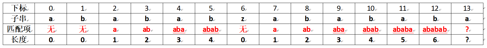

了解了这张表的来历，那么应该怎样简化运算来求解最后一位a的最长匹配长度呢？

```
当i=12时，对子字符串 abababzababab 来说，
前缀：a, ab, aba, abab, ababa, ababab, abababz, ...
后缀：b, ab, bab, abab, babab, ababab, zababab, ...
```

子字符串`abababzababab`前缀后缀最大匹配了6个（ababab），那次大匹配了多少呢？容易看出次大匹配了4个（abab），更仔细地观察可以发现，次大匹配的前缀后缀只可能在 ababab 中，所以次大匹配数就是 ababab 的最大匹配数！第三大同理，可得`abab`的最大匹配数，查表可得该值为2。

？处找最大匹配发现结尾不是z，所以就不能直接6+1=7，应该找次大匹配，发现刚好对上abab后的字符a，所以？为4+1=5，匹配项为`abab`

到此为止，第一步已经完成了

代码如下：

```java
// 构造 pattern 的最大匹配数表
public static int[] calculateMaxMatchLengths(String pattern) {
    int[] maxMatchLengths = new int[pattern.length()];
    int maxLength = 0;
    for (int i = 1; i < pattern.length(); i++) {
        while (maxLength > 0 && pattern.charAt(maxLength) != pattern.charAt(i)) {
            maxLength = maxMatchLengths[maxLength - 1];
        }
        if (pattern.charAt(i) == pattern.charAt(maxLength)) {
            maxLength++;
        }
        maxMatchLengths[i] = maxLength;
    }
    return maxMatchLengths;
}
```

### 第二步

既然子串的表已经建立，那么下一步就是对主串使用了

首先，主串是不回退的，所以这里用for循环实现从头到尾的遍历，同时对应寻找子串的最大匹配

在循环内部分三种情况执行：

1. 部分匹配成功，指针i和count往后移动
2. 匹配失败，改变count，寻找次大匹配
3. 完全匹配成功，记录位置

```java
public static List<Integer> KMP_search(String text,String pattern){
    List<Integer> positions=new ArrayList<>();
    int[] maxMatchLengths = calculateMaxMatchLengths(pattern);
    int count = 0;
    for (int i = 0; i < text.length(); i++) {
        // charAt() 方法用于返回指定索引处的字符。索引范围为从 0 到 length() - 1。
        while (count > 0 && pattern.charAt(count) != text.charAt(i)) {
            count = maxMatchLengths[count - 1];
        }
        if (pattern.charAt(count) == text.charAt(i)) {
            count++;
        }
        if (count == pattern.length()) {
            // 完全匹配成功时
            positions.add(i - pattern.length() + 1);
            count = maxMatchLengths[count - 1];
        }
    }
    return positions;
}
```

好了，到此为止KMP算法的核心已经写完了。


