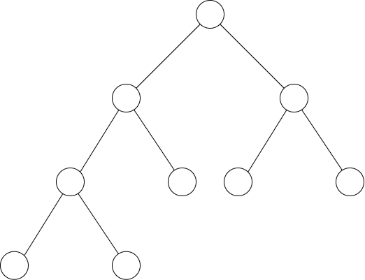
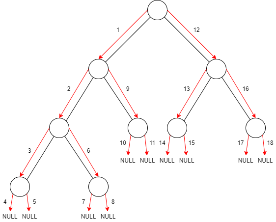
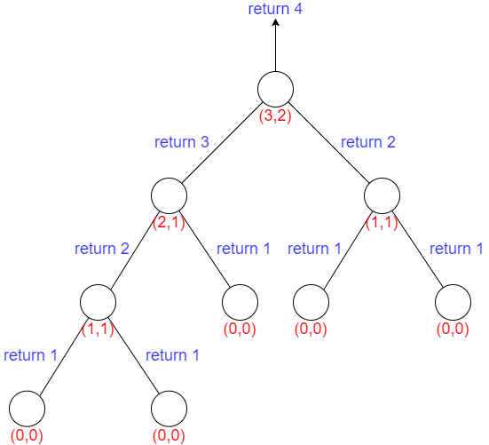
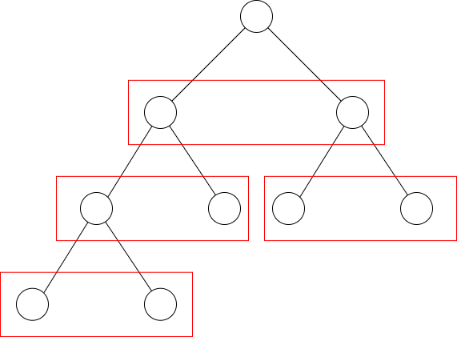

> 本文旨在探讨树模型相关的递归操作

# 树模型的访问顺序

假设树模型如下：



见下面两段代码：

```cpp
void Before_Search(pTreeNode T){
    if(T){
        count<<T->sh;	//sh是结点存储的字符
        Before_Search(T->lchild);
        Before_Search(T->rchild);;
    }
}
```

```cpp
int Depth_Tree(pTreeNode T){
    int m,n;
    if(T==NULL)
        return 0;
    m=Depth_Tree(T->lchild);
    n=Depth_Tree(T->rchild);
    return max(m,n)+1;
}
```

发现他们都有类似的结构：

```cpp
ElemType F(pTreeNode T){
	//递归终止条件
    ...
    F(T->lchild);
    F(T->rchild);
    ...
    return ElemType;
}
```

在这种代码结构下，访问结点顺序是固定的（访问顺序用红色标出了）：



这种树模型对应的递归的多个抽象条件，同理若递归`T->child(1),T->child(2),……T->child(n)`，一个父结点有多个子结点，这时候二叉树变成了n叉树，抽象条件从2变为了n，即：

```cpp
ElemType F(pTreeNode T){
	//递归终止条件
    ...
    F(T->child_1);
    F(T->child_2);
    ...
    F(T->child_n);
    ...
    return ElemType;
}
```

# 二叉树深度

现在尝试分析如何求二叉树的最深深度：

```cpp
int Depth_Tree(pTreeNode T){
    int m,n;
    if(T==NULL)
        return 0;
    m=Depth_Tree(T->lchild);
    n=Depth_Tree(T->rchild);
    return max(m,n)+1;
}
```



由以上分析现在要求二叉树的最浅深度，尝试修改代码如下：

```cpp
int Depth_Tree(pTreeNode T){
    int m,n;
    if(T==NULL)
        return 1;
    m=Depth_Tree(T->lchild);
    n=Depth_Tree(T->rchild);
    return min(m,n)+1;
}
```

对上图的执行结果应该是3

# 与图的深度遍历联系

经过上面的分析发现这种方式与图的深度遍历很像，但它们确实是有区别的

+ 二叉树是有向图，而图的深度遍历算法使用的是无向图
+ 二叉树递归每个结点其子结点蕴含的抽象条件是不同的，同结点的孩子且同层抽象条件不同；而图所有结点是等价的



在这张图中，所有框起来的结点抽象条件的集合是相同的

```java
public void dfs(Graph G,int v){
    marked[v]=true;
    count++;
    //G.adj(v)代表的是v的邻接结点组成的集合，包括上一个访问过的结点
    for(int w:G.adj(v)){
        dfs(G,w);
    }
}
```

