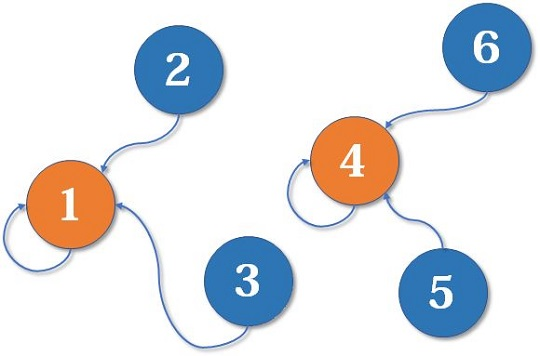
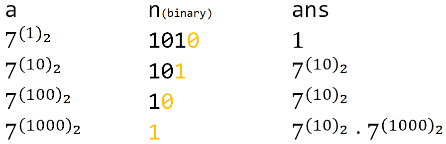
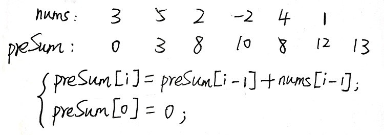
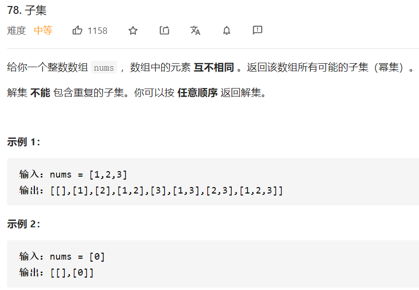

# 时间复杂度概要

O(logn)：

- [x] 二分
- [x] 并查集
  - [x] 普通并查集
  - [x] 种类并查集
- [x] 快速幂
- [x] 最大公约数（欧几里得算法）

O(n)：

- [x] 差分数组
- [x] 前缀和
- [ ] 桶排序
- [x] 单调栈
- [x] 滑动窗口
- [x] 双指针
  - [x] 快慢指针
  - [x] 左右指针
- [x] bfs/dfs
- [x] 拓扑排序
- [ ] 欧拉回路
- [ ] KMP
- [ ] 字典树

O(nlogn)：

- [x] 堆
- [ ] ST表
- [ ] 线段树
- [ ] 二叉搜索树
- [ ] 归并排序
- [x] 快速排序
- [ ] 最短路径
- [ ] 最小生成树
- [ ] 凸包

O(n^(3/2))：

- [ ] 分块
- [ ] 希尔排序

O(nm)：

- [ ] 背包问题
- [ ] 匈牙利匹配


根据数据长度判断时间复杂度：


# O(logn)

## 二分

### 二分查找的模型

| 模型         | mid处           | 返回值                   |
| ------------ | --------------- | ------------------------ |
| 正常查找     | 直接返回mid     | mid处返回mid，否则返回-1 |
| 左侧区间查找 | right = mid;    | left                     |
| 右侧区间查找 | left = mid + 1; | left - 1                 |


```js
/**
 * @description : 二分查找，正常查找
 * @return  {*} 找到返回该位置，找不到返回-1
 * @param {*} arr 传入的数组
 * @param {*} val 要查找的值
 */
let binarySearch = function (arr, val) {
    if (arr.length === 0) {
        return -1;
    }
    let left = 0;
    let right = arr.length - 1;
    while (left <= right) {
        let mid = left + Math.floor((right - left) / 2);
        if (arr[mid] == val) {
            return mid;
        } else if (arr[mid] < val) {
            left = mid + 1;
        } else {
            right = mid - 1;
        }
    }
    return -1;
};
/**
 * @description : 二分查找，左侧区间，[0,arr.length)
 * 子区间：[left,mid)  [mid+1,right)
 * @return  {*} 返回left，就是查找的最左位置，找不到返回0
 * @param {*} arr
 * @param {*} val
 */
let binarySearchLeft = function (arr, val) {
    if (arr.length === 0) {
        return -1;
    }
    let left = 0;
    let right = arr.length;
    while (left < right) {
        let mid = left + Math.floor((right - left) / 2);
        if (arr[mid] < val) {
            left = mid + 1;
        } else if (arr[mid] > val) {
            right = mid;
        } else if (arr[mid] == val) {
            right = mid;
        }
    }
    return left;
}
/**
 * @description : 二分查找，右侧区间，[0,arr.length)
 * 子区间：[left,mid)  [mid+1,right)
 * @return  {*} 返回left-1，就是查找的最右位置，找不到返回0
 * @param {*} arr
 * @param {*} val
 */
let binarySearchRight = function (arr, val) {
    if (arr.length === 0) {
        return -1;
    }
    let left = 0;
    let right = arr.length;
    while (left < right) {
        let mid = left + Math.floor((right - left) / 2);
        if (arr[mid] <= val) {
            left = mid + 1;
        } else if (arr[mid] > val) {
            right = mid;
        } else if (arr[mid] == val) {
            left = mid + 1;
        }
    }
    return left - 1;
}
```

测试：

```js
let arr = [1, 5, 8, 9, 9, 9, 9, 11];
let res = binarySearch(arr, 9);
let res2 = binarySearchLeft(arr, 9);
let res3 = binarySearchRight(arr, 9);
console.log(res);  // 3
console.log(res2);  // 3
console.log(res3);  // 6
```

### 例题1


```js
/**
 * @param {number[]} weights
 * @param {number} D
 * @return {number}
 */
var shipWithinDays = function (weights, D) {
    let low = maxDays(weights);
    let high = sum(weights) + 1;
    while (low < high) {
        let mid = low + Math.floor((high - low) / 2);
        if (canFinish(weights, D, mid)) {
            high = mid;
        } else {
            low = mid + 1;
        }
    }
    return low - 1;
};

let canFinish = function (weights, D, carry) {
    let j = 0;
    for (let i = 0; i < D; i++) {
        let cap = carry;
        while (weights[j] < cap) {
            cap = cap - weights[j];
            j++;
        }
    }
    if (j == weights.length) {
        return true;
    } else {
        return false;
    }
}

let sum = function (weights) {
    let sum = 0;
    for (let w of weights) {
        sum = sum + w;
    }
    return sum;
}

let maxDays = function (weights) {
    let max = -Infinity;
    for (let w of weights) {
        if (w > max) {
            max = w;
        }
    }
    return max;
}
```

## 并查集

### 普通并查集（找领导）

并查集被很多OIer认为是最简洁而优雅的数据结构之一，主要用于解决一些**元素分组**的问题。它管理一系列**不相交的集合**，并支持两种操作：

- **合并**（Union）：把两个不相交的集合合并为一个集合。
- **查询**（Find）：查询两个元素是否在同一个集合中。

并查集的重要思想在于，**用集合中的一个元素代表集合**。

并查集初始状态：


通过一系列转化：



最终状态：


```js
let fa = [];
let rank = [];
function init(n) {
    for (let i = 1; i <= n; i++) {
        fa[i] = i;
        rank[i] = i;
    }
}

function find(x) {
    return fa[x] === x ? x : (fa[x] = find(fa[x]));
}

function merge(i, j) {
    let x = find(i), y = find(j);
    if (rank[x] <= rank[y]) {
        fa[x] = y;
    } else {
        fa[y] = x;
    }
    if (rank[x] === rank[y] && x != y) {
        rank[y]++;
    }
}

init(6);
merge(2, 3);
merge(1, 3);
merge(3, 4);
merge(5, 6);

let x = 6;
let y = 3;
console.log(find(x) === find(y) ? "Yes" : "No");
```

这个根据调试得到的所有merge后的fa数组对应元素：


- 查询：递归查询该元素的祖元素
- 合并：把一个集合簇的祖元素接到另一个集合簇的祖元素上
  - rank：判断是x集合接到y上还是y接到x上

### 种类并查集（敌人的敌人是朋友）

开一个**两倍大小**的并查集。例如，假如我们要维护4个元素的并查集，我们改为开8个单位的。

我们`merge(1, 2+n), merge(1+n, 2);`。这里n就等于4，但我写成n这样更清晰。对于1个编号为i的元素，i+n是它的敌人。所以这里的意思就是：1是2的敌人，2是1的敌人。


现在假如我们又知道2和4是敌人，我们`merge(2, 4+n), merge(2+n, 4);`：


**敌人的敌人就是朋友**，2和4是敌人，2和1也是敌人，所以这里，1和4通过2+n这个元素**间接**地连接起来了。这就是种类并查集工作的原理。

捕食问题：可以用一个三倍大小的并查集进行维护。


## 快速幂

### 递归快速幂


代码很简单：

```js
/**
 * @description: 递归快速幂
 * @return {*} 幂运算的结果
 * @param {*} a 底
 * @param {*} n 幂
 */
function pow(a, n){
    if (n == 0)
        return 1;
    else if (n % 2 == 1)
        return pow(a, n - 1) * a;
    else
    {
        let temp = pow(a, n / 2);
        return temp * temp;
    }
}
```

### 非递归快速幂



```js
/**
 * @description: 非递归快速幂
 * @return {*} 幂运算的结果
 * @param {*} a 底
 * @param {*} n 幂
 */
function pow(a, n) {
    let ans = 1;
    while (n) {
        // 如果n的当前末位为1
        if (n & 1) {
            ans = ans * a;
        }
        a = a * a;
        n = n >> 1;
    }
    return ans;
}
```

## 欧几里得算法

```js
/**
 * @description: 欧几里得算法，求最大公因数
 * @return {*} 最大公因数
 * @param {*} M num1
 * @param {*} N num2
 */
function gcd(M, N) {
    let rem;
    while (N > 0) {
        rem = M % N;
        M = N;
        N = rem;
    }
    return M;
}
```

# O(n)

## 前缀和



```js
let nums = [3, 5, 2, -2, 4, 1];
/**
 * @description: 求前缀和数组
 * @return {*} 返回前缀和数组preSum
 * @param {*} nums 传入的数组
 */
function prefixSum(nums) {
    let preSum = [];
    preSum[0] = 0;
    for (let i = 0; i < nums.length; i++) {
        preSum[i + 1] = preSum[i] + nums[i];
    }
    return preSum;
}
/**
 * @description: 求[i,j)区间内的数组和
 * @return {*} 数组和
 * @param {*} preSum 前缀数组
 * @param {*} i 左坐标
 * @param {*} j 右坐标
 */
function sumFromTo(preSum,i,j) {
    return preSum[j]-preSum[i];
}
```

测试：

```js
let preSum = prefixSum(nums);
let sum = sumFromTo(preSum,1,4)
console.log(sum); // 5
```

## 差分数组


```js
let nums = [8,2,6,3,1];
/**
 * @description: 求差分数组
 * @return {*} 返回差分数组diff
 * @param {*} nums 传入的数组
 */
function diff(nums) {
    let diffArray = [];
    diffArray[0]=nums[0];
    for(let i=1;i<nums.length;i++){
        diffArray[i]=nums[i]-nums[i-1];
    }
    return diffArray;
}
/**
 * @description: 让区间[i,j]内元素都加3
 * @param {*} diffArray 差分数组diff
 * @param {*} i 左坐标
 * @param {*} j 右坐标
 * @param {*} addNum 要加的数
 */
function diffAddNum(diffArray,i,j,addNum) {
    diffArray[i]+=addNum;
    diffArray[j+1]-=addNum;
}
/**
 * @description: 通过差分数组，找到原数组
 * @return {*} 原数组
 * @param {*} diffArray 差分数组
 */
function deDiff(diffArray) {
    let resNum = [];
    resNum[0]=diffArray[0];
    for(let i=1;i<diffArray.length;i++){
        resNum[i]=resNum[i-1]+diffArray[i];
    }
    return resNum;
}
```

测试：

```js
console.log(nums);
let diffArray = diff(nums);
diffAddNum(diffArray,1,3,3);
console.log(diffArray);
let resNum = deDiff(diffArray);
console.log(resNum);
/***********************
[ 8, 2, 6, 3, 1 ]
[ 8, -3, 4, -3, -5 ]
[ 8, 5, 9, 6, 1 ]
**********************/
```

## 快慢指针

### 判定链表中是否含有环


```js
/**
 * Definition for singly-linked list.
 * function ListNode(val) {
 *     this.val = val;
 *     this.next = null;
 * }
 */

/**
 * @param {ListNode} head
 * @return {boolean}
 */
var hasCycle = function(head) {
    if(head===null || head.next===null){
        return false;
    }
    let slow = head,fast = head;
    while(fast!=null){
        slow = slow?.next;
        fast = fast?.next?.next;
        if(slow === fast){
            return true;
        }
    }
    return false;
};
```

### 环形链表位置


算法思路：


```js
var detectCycle = function(head) {
    if (head === null) {
        return null;
    }
    let slow = head, fast = head;
    while (fast !== null) {
        slow = slow.next;
        if (fast.next !== null) {
            fast = fast.next.next;
        } else {
            return null;
        }
        if (fast === slow) {
            let ptr = head;
            while (ptr !== slow) {
                ptr = ptr.next;
                slow = slow.next;
            }
            return ptr;
        }
    }
    return null;
};
```

### 寻找链表的倒数第 `n` 个元素


```js
var removeNthFromEnd = function(head, n) {
    let fast, slow;
    fast = slow = head;
    while(n !== 0){
        fast = fast?.next;
        n--;
    }
    if(fast === null){
        return head.next;
    }
    while(fast!==null && fast.next !== null){
        fast = fast?.next;
        slow = slow?.next;
    }
    slow.next = slow.next.next;
    return head;
};
```

## 左右指针

### 两数之和


```js
var twoSum = function(numbers, target) {
    numbers.sort((a,b)=>{
        return a<b?-1:1;
    });
    let len = numbers.length;
    let left = 0;
    let right = len-1;
    while(left<right){
        let sum = numbers[left] + numbers[right];
        if(sum<target){
            left++;
        }else if(sum==target){
            return [left+1,right+1];
        }else{
            right--;
        }
    }
    return [-1,-1];
};
```

### 翻转字符串


```js
var reverseString = function(s) {
    let len = s.length;
    let left = 0;
    let right = len - 1;
    while(left<right){
        swap(s,left,right);
        left++,right--;
    }
    return s;
};
let swap = function (s,left,right){
    // 另一种写法,JS特有的
    // [s[right],s[left]]=[s[left],s[right]];
    let temp = s[left];
    s[left] = s[right];
    s[right] = temp;
}
```

## 滑动窗口

### 滑动窗口算法框架

```java
/* 滑动窗口算法框架 */
void slidingWindow(string s, string t) {
    unordered_map<char, int> need, window;
    for (char c : t) need[c]++;

    int left = 0, right = 0;
    int valid = 0; 
    while (right < s.size()) {
        // c 是将移入窗口的字符
        char c = s[right];
        // 右移窗口
        right++;
        // 进行窗口内数据的一系列更新
        ...

        /*** debug 输出的位置 ***/
        printf("window: [%d, %d)\n", left, right);
        /********************/

        // 判断左侧窗口是否要收缩
        while (window needs shrink) {
            // d 是将移出窗口的字符
            char d = s[left];
            // 左移窗口
            left++;
            // 进行窗口内数据的一系列更新
            ...
        }
    }
}
```

### 最小覆盖子串


```js
let addMap = function (map, c) {
    if (!map.has(c)) {
        map.set(c, 1);
    } else {
        map.set(c, map.get(c) + 1);
    }
}
/**
 * @param {string} s 待匹配串
 * @param {string} t 子串
 * @return {string} 返回的字符串
 */
var minWindow = function (s, t) {
    let need = new Map();
    let window = new Map();
    let left = 0, right = 0;
    let valid = 0;
    let start = 0, len = Infinity;
    for (let c of t) {
        addMap(need, c);
    }
    while (right < s.length) {
        let c = s[right];
        right++;
        if (need.has(c)) {
            addMap(window, c);
            if (window.get(c) === need.get(c)) {
                valid++;
            }
        }
        // console.log("window: [%d, %d)", left, right);
        while (valid === need.size) {
            if (right - left < len) {
                start = left;
                len = right - left;
            }
            let d = s[left];
            left++;
            if (need.has(d)) {
                if (window.get(d) === need.get(d)) {
                    valid--;
                }
                window.set(d, window.get(d) - 1);
            }
        }
    }
    return len === Infinity ? "" : s.substr(start, len);
};
```

## 单调栈

单调栈的使用情况：对序列中每个元素，找到下一个比它大的元素。

```java
// 给Array原型添加peek函数，取出栈顶指针
Array.prototype.peek = function(){
    return this[this.length-1];
};
// 给Array原型添加isEmpty函数，判断栈是否为空
Array.prototype.isEmpty = function(){
    return this.length===0?true:false;
};
function nextGreaterElement(nums) {
    let stack = new Array();
    let ans = new Array(nums.length);
    ans.fill(-1);
    for(let i=0;i<nums.length-1;i++){
        while(!stack.isEmpty() && nums[stack.peek()]<nums[i]){
            ans[stack.pop()]=i;
        }
        stack.push(i);
    }
    return ans;
}
```

测试：

```js

let nums = [73,74,75,71,69,72,76,73];
let ans = nextGreaterElement(nums);
console.log(ans);
/******************************
[ 1, 2, 6, 5, 5, 6, -1, -1]
******************************/
```

执行过程如下，不过这里我是用ans保存的下一个较大元素的位置，而不是位置差：

> 当然，保存下一个较大元素的位置有两种方式：
>
> + 使用数组，建立两个位置的索引关系
> + 使用Map，建立值与下一个较大元素的位置的索引关系


## DFS

### DFS框架

```python
result = []
def backtrack(路径, 选择列表):
    if 满足结束条件:
        result.add(路径)
        return

    for 选择 in 选择列表:
        做选择
        backtrack(路径, 选择列表)
        撤销选择
```

### 例题1

[46. 全排列 - 力扣（LeetCode） (leetcode-cn.com)](https://leetcode-cn.com/problems/permutations/)


```js
/**
 * @param {number[]} nums
 * @return {number[][]}
 */
 Array.prototype.contains = function(num){
    for(let i=0;i<this.length;i++){
        if(this[i]===num){
            return true;
        }
    }
    return false;
};
var permute = function(nums) {
    let res = [];
    let track = [];
    backtrack(nums,track);
    return res;

    function backtrack(nums,track){
        if(nums.length===track.length){
            let newTrack = [];
            Object.assign(newTrack,track)
            res.push(newTrack);
            return;
        }
        for(let num of nums){
            if(track.contains(num)){
                continue;
            }
            track.push(num);
            backtrack(nums,track);
            track.pop();
        }
    }
};
```

### 例题2

[78. 子集 - 力扣（LeetCode） (leetcode-cn.com)](https://leetcode-cn.com/problems/subsets/)



这个需要剪枝：


```js
/**
 * @param {number[]} nums
 * @return {number[][]}
 */
var subsets = function(nums) {
    let res = [];
    let track = [];
    trackback(nums,track,0);
    return res;

    function trackback(nums,track,start){
        let newTrack = [];
        Object.assign(newTrack,track);
        res.push(newTrack);
        for(let i=start;i<nums.length;i++){
            track.push(nums[i]);
            trackback(nums,track,i+1)
            track.pop();
        }
    }
};
```

## BFS

### BFS框架

要说框架的话，我们先举例一下 BFS 出现的常见场景好吧，**问题的本质就是让你在一幅「图」中找到从起点 `start` 到终点 `target` 的最近距离，这个例子听起来很枯燥，但是 BFS 算法问题其实都是在干这个事儿**

```java
// 计算从起点 start 到终点 target 的最近距离
int BFS(Node start, Node target) {
    Queue<Node> q; // 核心数据结构
    Set<Node> visited; // 避免走回头路

    q.offer(start); // 将起点加入队列
    visited.add(start);
    int step = 0; // 记录扩散的步数

    while (q not empty) {
        int sz = q.size();
        /* 将当前队列中的所有节点向四周扩散 */
        for (int i = 0; i < sz; i++) {
            Node cur = q.poll();
            /* 划重点：这里判断是否到达终点 */
            if (cur is target)
                return step;
            /* 将 cur 的相邻节点加入队列 */
            for (Node x : cur.adj())
                if (x not in visited) {
                    q.offer(x);
                    visited.add(x);
                }
        }
        /* 划重点：更新步数在这里 */
        step++;
    }
}
```

### 例题1

[111. 二叉树的最小深度 - 力扣（LeetCode） (leetcode-cn.com)](https://leetcode-cn.com/problems/minimum-depth-of-binary-tree/)

求二叉树最小高度


```
输入：root = [3,9,20,null,null,15,7]
输出：2
```

```js
/**
 * Definition for a binary tree node.
 * function TreeNode(val, left, right) {
 *     this.val = (val===undefined ? 0 : val)
 *     this.left = (left===undefined ? null : left)
 *     this.right = (right===undefined ? null : right)
 * }
 */
/**
 * @param {TreeNode} root
 * @return {number}
 */
var minDepth = function (root) {
    if (!root === true) {
        return 0;
    }
    let queue = [];
    let depth = 1;
    queue.push(root);
    while (queue.length !== 0) {
        // 踩坑：这里queue.length要另外写在外面，要是写在循环里是动态改变的，最终结果始终输出1
        let ql = queue.length;
        for (let i = 0; i < ql; i++) {
            let cur = queue.shift();
            if (cur.left === null && cur.right === null) {
                return depth;
            }
            if (cur.left !== null) {
                queue.push(cur.left);
            }
            if (cur.right !== null) {
                queue.push(cur.right);
            }
        }
        depth++;
    }
    return depth;
};
```

## 拓扑排序

### 算法图解

**拓扑排序**是对**DAG**（有向无环图）上的节点进行排序。

拓扑排序最经典的算法是**Kahn算法**。首先，先拿出所有入度为0的点排在前面，并在原图中将它们删除：


```cpp
// deg是入度，在存图的时候需要录入数据
// A是排序后的数组
int deg[MAXN], A[MAXN];
bool toposort(int n){
    int cnt = 0;
    queue<int> q;
    for (int i = 1; i <= n; ++i)
        if (deg[i] == 0)
            q.push(i);
    while (!q.empty())
    {
        int t = q.front();
        q.pop();
        A[cnt++] = t;
        for (auto to : edges[t])
        {
            deg[to]--;
            if (deg[to] == 0) // 出现了新的入度为0的点
                q.push(to);
        }
    }
    return cnt == n;
}
```

返回值为是否成功进行拓扑排序，也即是否存在环。也就是说拓扑排序是可以用来简单地**判环**的。有时会要求输出**字典序最小**的方案这时把`queue`改成`priority_queue`即可，复杂度会多一个`log`。

### 例题1

> 图的边的表示可以用邻接表，也可以用邻接矩阵，一般采用前者，因为在程序实现时候空间复杂度都是O(n^2)，但是邻接表可能优化一点点

[207. 课程表 - 力扣（LeetCode） (leetcode-cn.com)](https://leetcode-cn.com/problems/course-schedule/)


```js
/**
 * @param {number} numCourses
 * @param {number[][]} prerequisites 邻接二维数组
 * @return {boolean}
 */
var canFinish = function (numCourses, prerequisites) {
    // 入度数组，对应0~numCourses-1每个课程的入度
    let inDegree = new Array(numCourses).fill(0);
    // 邻接表，用对象或者数组均可以
    let map = {};
    for (let i = 0; i < prerequisites.length; i++) {
        // 求课的初始入度值
        inDegree[prerequisites[i][0]]++;
        // 添加到邻接表中，有就push，没有就新建
        if (map[prerequisites[i][1]]) {
            map[prerequisites[i][1]].push(prerequisites[i][0]);
        } else {
            map[prerequisites[i][1]] = [prerequisites[i][0]];
        }
    }
    let queue = [];
    // 所有入度为0的课入列
    for (let i = 0; i < inDegree.length; i++) {
        if (inDegree[i] == 0){
            queue.push(i);
        }
    }
    let count = 0;
    while (queue.length > 0) {
        // 当前选的课，出列
        let selected = queue.shift();
        // 选课数+1
        count++;
        // 获取这门课对应的后续课的集合
        let toEnQueue = map[selected];
        // 确实有后续课
        if (toEnQueue && toEnQueue.length) {
            for (let i = 0; i < toEnQueue.length; i++) {
                // 依赖它的后续课的入度-1
                inDegree[toEnQueue[i]]--;
                // 如果因此减为0，入列
                if (inDegree[toEnQueue[i]] == 0) {
                    queue.push(toEnQueue[i]);
                }
            }
        }
    }
    // 选了的课等于总课数，true，否则false
    return count === numCourses;
};
```

## 字典树


# O(nlogn)

## 快速排序

```js
/**
 * @description: 快速排序
 * @param {*} arr 传入的数组
 * @param {*} left 左坐标
 * @param {*} right 右坐标
 */
function quickSort(arr, left, right) {
    let l = left;
    let r = right;
    let pivot = arr[Math.floor((left + right) / 2)];
    let temp = 0;
    while (l < r) {
        while (arr[l] < pivot) l++;
        while (arr[r] > pivot) r--;
        if (l >= r) break;
        // 交换
        temp = arr[l];
        arr[l] = arr[r];
        arr[r] = temp;
        if (arr[l] === pivot) r--;
        if (arr[r] === pivot) l++;
    }
    if (l === r) {
        l++;
        r--;
    }
    if (left < r) quickSort(arr, left, r);
    if (right > l) quickSort(arr, l, right);
}
```

测试：

```js
let arr = [1, 11, 15, 12, -8, 0, -90, 100, 0];
quickSort(arr, 0, arr.length - 1);
console.log(arr);
```

## 归并排序

## 堆

二叉堆：完全二叉树

堆和数组：


注意：这里节点上的数字表示的是数组索引值，而不是节点保存的值

插入节点：


删除节点：


```js
/*
 * @Author: LongSir
 * @LastEditTime: 2021-05-04 19:27:12
 * @description: 大根堆，节点元素最大
 */
class PriorityQueue {
    constructor(arr) {
        if (arr.length) {
            this.pq = [];
            this._buildTree(arr);
            return;
        }
        this.pq = [];
    }
    // 父亲节点
    parent(root) {
        return Math.floor((root + 1) / 2) - 1;
    }
    // 左孩子节点
    leftChild(root) {
        return root * 2 + 1;
    }
    // 右孩子节点
    rightChild(root) {
        return root * 2 + 2;
    }
    // 构建树
    _buildTree(arr) {
        Object.assign(this.pq, arr);
    }
    // 交互数组位置i和j
    _exch(i, j) {
        let temp = this.pq[i];
        this.pq[i] = this.pq[j];
        this.pq[j] = temp;
    }
    // pq[i]是否比pq[j]小
    _less(i, j) {
        if (this.pq[i] < this.pq[j]) {
            return -1;
        } else if (this.pq[i] === this.pq[j]) {
            return 0;
        } else {
            return 1;
        }
    }
    // 上浮
    _swim(k) {
        while (this._less(this.parent(k), k) < 0) {
            this._exch(this.parent(k), k);
            k = this.parent(k);
        }
    }
    // 下沉
    _sink(k) {
        while (this._less(k, this.leftChild(k)) < 0 || this._less(k, this.rightChild(k)) < 0) {
            if (this._less(this.leftChild(k), this.rightChild(k)) < 0) {
                this._exch(k, this.rightChild(k));
                k = this.rightChild(k);
            } else {
                this._exch(k, this.leftChild(k));
                k = this.leftChild(k);
            }
        }
    }
    show() {
        console.log(this.pq);
    }
    // 实现队列
    enqueue(val) {
        this.pq.push(val);
        this._swim(this.pq.length - 1);
    }
    dequeue() {
        let dqNode = this.pq.shift();
        let last = this.pq.pop();
        this.pq.unshift(last);
        this._sink(0);
        return dqNode;
    }
    // 取队首的值
    getFirst() {
        return this.pq[0];
    }
}
```

测试：

```js
let arr = [10, 5, 6, 2, 3];
let priorityQueue = new PriorityQueue(arr);
priorityQueue.show();
priorityQueue.enqueue(7);
priorityQueue.dequeue(11);
priorityQueue.show();
```

## 线段树


# O(m*n)

## 匈牙利匹配

匈牙利算法主要用来解决两个问题：求二分图的**最大匹配数**和**最小点覆盖数**。

最大匹配问题相当于，**假如你是红娘，可以撮合任何一对有暧昧关系的男女，那么你最多能成全多少对情侣**？

我们从B1看起（男女平等，从女生这边看起也是可以的），他与G2有暧昧，那我们就先暂时把他与G2连接（注意这时只是你作为一个红娘在纸上构想，你没有真正行动，此时的安排都是暂时的）。


来看B2，B2也喜欢G2，这时G2已经“名花有主”了（虽然只是我们设想的），那怎么办呢？我们倒回去看G2目前被安排的男友，是B1，B1有没有别的选项呢？有，G4，G4还没有被安排，那我们就给B1安排上G4。


然后B3，B3直接配上G1就好了，这没什么问题。至于B4，他只钟情于G4，G4目前配的是B1。B1除了G4还可以选G2，但是呢，如果B1选了G2，G2的原配B2就没得选了。我们绕了一大圈，发现B4只能注定单身了，可怜。（其实从来没被考虑过的G3更可怜）


```cpp
#include <cstdio>
#include <cstring>
int Map[205][205], p[205], vis[205], N, T;
bool match(int i){
    for (int j = 1; j <= N; ++j){
        if (Map[i][j] && !vis[j]){
            // 访问过的标记为1
            vis[j] = 1;
            // 递归查询右图，匹配成功立刻返回true
            if (p[j] == 0 || match(p[j])){
                p[j] = i;
                return true;
            }
        }
    }
    return false;
}
int Hungarian(){
    int cnt = 0;
    for (int i = 1; i <= N; ++i){
        memset(vis, 0, sizeof(vis));
        if (match(i))
            cnt++;
    }
    return cnt;
}
```


