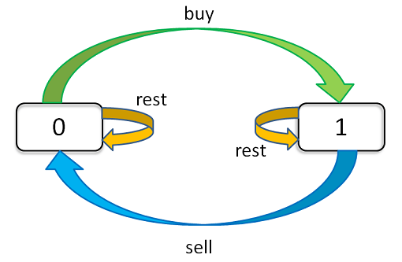

# 解题框架

每天的三种选择：buy、sell、rest

状态转换：



参照条件：

+ 交易天数
+ 交易最大次数
+ 当前持有状态（0表示未持有，1表示持有）

```
dp[i][k][0 or 1]
0 <= i <= n-1, 1 <= k <= K
n 为天数，大 K 为最多交易数
```

比如说 `dp[3][2][1]` 的含义就是：今天是第三天，我现在手上持有着股票，至今最多进行 2 次交易。

状态转移方程：

```
dp[i][k][0] = max(dp[i-1][k][0], dp[i-1][k][1] + prices[i])
              max(   选择 rest  ,    选择 sell      )
dp[i][k][1] = max(dp[i-1][k][1], dp[i-1][k-1][0] - prices[i])
              max(   选择 rest  ,    选择 buy       )
```

base case：

```
dp[-1][k][0] = 0
解释：因为 i 是从 0 开始的，所以 i = -1 意味着还没有开始，这时候的利润当然是 0 。
dp[-1][k][1] = -infinity
解释：还没开始的时候，是不可能持有股票的，用负无穷表示这种不可能。
dp[i][0][0] = 0
解释：因为 k 是从 1 开始的，所以 k = 0 意味着根本不允许交易，这时候利润当然是 0 。
dp[i][0][1] = -infinity
解释：不允许交易的情况下，是不可能持有股票的，用负无穷表示这种不可能。
```

# 开始解题

## 121. 买卖股票的最佳时机

### 题目描述

给定一个数组`prices`，它的第i个元素`prices[i]`表示一支给定股票第i天的价格。

你只能选择**某一天**买入这只股票，并选择在**未来的某一个不同的日子**卖出该股票。设计一个算法来计算你所能获取的最大利润。

返回你可以从这笔交易中获取的最大利润。如果你不能获取任何利润，返回 0 。

**示例 1：**

```
输入：[7,1,5,3,6,4]
输出：5
解释：在第 2 天（股票价格 = 1）的时候买入，在第 5 天（股票价格 = 6）的时候卖出，最大利润 = 6-1 = 5 。
注意利润不能是 7-1 = 6, 因为卖出价格需要大于买入价格；同时，你不能在买入前卖出股票。
```

**示例 2：**

```
输入：prices = [7,6,4,3,1]
输出：0
解释：在这种情况下, 没有交易完成, 所以最大利润为 0。
```


提示：

+ `1 <= prices.length <= 105`
+ `0 <= prices[i] <= 104`

### 解法

交易次数为1次，即k=1

```java
class Solution {
    public int maxProfit(int[] prices) {
        int n = prices.length;
        int[][] dp = new int[n][2];
        for (int i = 0; i < n; i++) {
            // 边界i=0时的优化
            if (i - 1 == -1) {
                /**
                 * dp[i][0]
                 * = max(dp[-1][0], dp[-1][1] + prices[i])
                 * = max(0, -infinity + prices[i])
                 * = 0
                 */
                dp[i][0] = 0;
                /**
                 * dp[i][1]
                 * = max(dp[-1][1], dp[-1][0] - prices[i])
                 * = max(-infinity, 0 - prices[i])
                 * = -prices[i]
                 */
                dp[i][1] = -prices[i];
                continue;
            }
            dp[i][0] = Math.max(dp[i-1][0], dp[i-1][1] + prices[i]);
            // 由于k=1，故dp[i-1][k-1][0]-prices[i] 写成 -prices[i]
            dp[i][1] = Math.max(dp[i-1][1], -prices[i]);
        }
        return dp[n - 1][0];
    }
}
```

当然，以上题解提交成功，但是空间复杂度太高，可以优化。

```java
class Solution {
    public int maxProfit(int[] prices) {
        int n = prices.length;
        int dp0 = 0, dp1 = Integer.MIN_VALUE;
        for (int i = 0; i < n; i++) {
            dp0 = Math.max(dp0, dp1 + prices[i]);
            dp1 = Math.max(dp1, -prices[i]);
        }
        return dp0;
    }
}
```

## 122. 买卖股票的最佳时机 II

### 题目描述

给定一个数组，它的第 i 个元素是一支给定股票第 i 天的价格。

设计一个算法来计算你所能获取的最大利润。你可以尽可能地完成更多的交易（多次买卖一支股票）。

注意：你不能同时参与多笔交易（你必须在再次购买前出售掉之前的股票）。

**示例 1：**

```
输入: [7,1,5,3,6,4]
输出: 7
解释: 在第 2 天（股票价格 = 1）的时候买入，在第 3 天（股票价格 = 5）的时候卖出, 这笔交易所能获得利润 = 5-1 = 4 。随后，在第 4 天（股票价格 = 3）的时候买入，在第 5 天（股票价格 = 6）的时候卖出, 这笔交易所能获得利润 = 6-3 = 3 。
```

**示例 2：**

```
输入: [1,2,3,4,5]
输出: 4
解释: 在第 1 天（股票价格 = 1）的时候买入，在第 5 天 （股票价格 = 5）的时候卖出, 这笔交易所能获得利润 = 5-1 = 4 。
     注意你不能在第 1 天和第 2 天接连购买股票，之后再将它们卖出。
     因为这样属于同时参与了多笔交易，你必须在再次购买前出售掉之前的股票。
```

### 解法

```java
class Solution {
    // k = +infinity,故将交易次数去掉
    public int maxProfit(int[] prices) {
        int n = prices.length;
        int[][] dp = new int[n][2];
        for(int i=0;i<n;i++){
            if(i==0){
                dp[0][0]=0;
                dp[0][1]=-prices[0];
                continue;
            }
            dp[i][0] = Math.max(dp[i-1][0], dp[i-1][1] + prices[i]);
            dp[i][1] = Math.max(dp[i-1][1], dp[i-1][0] - prices[i]);
        }
        return dp[n-1][0];
    }
}
```

优化版：

```java
class Solution {
    // k = +infinity,故将交易次数去掉
    public int maxProfit(int[] prices) {
        int n = prices.length;
        int dp0=0,dp1=Integer.MIN_VALUE;
        for(int i=0;i<n;i++){
            dp0 = Math.max(dp0, dp1 + prices[i]);
            dp1 = Math.max(dp1, dp0 - prices[i]);
        }
        return dp0;
    }
}
```

## 123. 买卖股票的最佳时机 III

### 题目描述

给定一个数组，它的第 i 个元素是一支给定的股票在第 i 天的价格。

设计一个算法来计算你所能获取的最大利润。你最多可以完成 两笔 交易。

注意：你不能同时参与多笔交易（你必须在再次购买前出售掉之前的股票）。

**示例 1：**

```
输入：prices = [3,3,5,0,0,3,1,4]
输出：6
解释：在第 4 天（股票价格 = 0）的时候买入，在第 6 天（股票价格 = 3）的时候卖出，这笔交易所能获得利润 = 3-0 = 3 。
     随后，在第 7 天（股票价格 = 1）的时候买入，在第 8 天 （股票价格 = 4）的时候卖出，这笔交易所能获得利润 = 4-1 = 3 。
```

**示例 2：**

```
输入：prices = [1,2,3,4,5]
输出：4
解释：在第 1 天（股票价格 = 1）的时候买入，在第 5 天 （股票价格 = 5）的时候卖出, 这笔交易所能获得利润 = 5-1 = 4 。   
     注意你不能在第 1 天和第 2 天接连购买股票，之后再将它们卖出。   
     因为这样属于同时参与了多笔交易，你必须在再次购买前出售掉之前的股票。
```

**示例 3：**

```
输入：prices = [7,6,4,3,1] 
输出：0 
解释：在这个情况下, 没有交易完成, 所以最大利润为 0。
```

### 解法

```java
class Solution {
    // k = 2
    public int maxProfit(int[] prices) {
        int n = prices.length;
        int max_k = 2;
        // 交易天数、交易次数、交易状态
        int[][][] dp = new int[n][max_k+1][2];
        for(int i=0;i<n;i++){
            for(int k=max_k;k>0;k--){
                if(i==0){
                    dp[0][2][0]=0;
                    dp[0][2][1]=-prices[i];
                    dp[0][1][0]=0;
                    dp[0][1][1]=-prices[i];
                    continue;
                }
                dp[i][k][0] = Math.max(dp[i-1][k][0],dp[i-1][k][1]+prices[i]);
                dp[i][k][1] = Math.max(dp[i-1][k][1],dp[i-1][k-1][0]-prices[i]);
            }
        }
        return dp[n-1][max_k][0];
    }
}
```

优化版：

```java
class Solution {
    // k = 2
    public int maxProfit(int[] prices) {
        int n = prices.length;
        int dp_i10 = 0, dp_i11 = Integer.MIN_VALUE;
        int dp_i20 = 0, dp_i21 = Integer.MIN_VALUE;
        for(int i=0;i<n;i++){
            dp_i20 = Math.max(dp_i20, dp_i21 + prices[i]);
            dp_i21 = Math.max(dp_i21, dp_i10 - prices[i]);
            dp_i10 = Math.max(dp_i10, dp_i11 + prices[i]);
            dp_i11 = Math.max(dp_i11, -prices[i]);
        }
        return dp_i20;
    }
}
```

