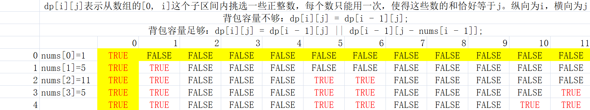

# 0-1 背包问题

给你一个可装载重量为`W`的背包和`N`个物品，每个物品有重量和价值两个属性。其中第`i`个物品的重量为`wight[i]`，价值为`value[i]`，现在让你用这个背包装物品，最多能装的价值是多少？

举个简单的例子，输入如下：

```
N = 3, W = 4
wight = [2, 1, 3]
value = [4, 2, 3]
```

算法返回 6，选择前两件物品装进背包，总重量 3 小于`W`，可以获得最大价值 6。

**第一步要明确两点，「状态」和「选择」。所以状态有两个，就是「背包的容量」和「可选择的物品」**。

```
for 状态1 in 状态1的所有取值：
    for 状态2 in 状态2的所有取值：
        for ...
            dp[状态1][状态2][...] = 择优(选择1，选择2...)
```

**第二步要明确`dp`数组的定义**。

`dp[i][w]`的定义如下：对于前`i`个物品，当前背包的容量为`w`，这种情况下可以装的最大价值是`dp[i][w]`。

根据这个定义，我们想求的最终答案就是`dp[N][W]`。base case 就是`dp[0][..] = dp[..][0] = 0`，因为没有物品或者背包没有空间的时候，能装的最大价值就是 0。

**第三步，根据「选择」，思考状态转移的逻辑**。

如果你没有把这第`i`个物品装入背包，那么很显然，最大价值`dp[i][w]`应该等于`dp[i-1][w]`。你不装嘛，那就继承之前的结果。

如果你把这第`i`个物品装入了背包，那么`dp[i][w]`应该等于`dp[i-1][w-wight[i-1]] + value[i-1]`。而`dp[i-1][w-wight[i-1]]`也很好理解：你如果想装第`i`个物品，你怎么计算这时候的最大价值？**换句话说，在装第`i`个物品的前提下，背包能装的最大价值是多少？**

```java
public int knapsack(int W, int N, int[] wight, int[] value) {
    for (int i = 1; i <= N; i++) {
        for (int w = 1; w <= W; w++) {
            if (w - wight[i-1] < 0) {
                dp[i][w] = dp[i - 1][w];
            } else {
                dp[i][w] = Math.max(dp[i - 1][w - wight[i-1]] + value[i-1], dp[i - 1][w]);
            }
        }
    }
    return dp[N][W];
}
```

# 子集分割

## 416. 分割等和子集

### 题干

给定一个**只包含正整数的非空**数组。是否可以将这个数组分割成两个子集，使得两个子集的元素和相等。

注意：

+ 每个数组中的元素不会超过 100

+ 数组的大小不会超过 200

**示例 1：**

```
输入: [1, 5, 11, 5]
输出: true
解释: 数组可以分割成 [1, 5, 5] 和 [11].
```

**示例 2：**

```
输入: [1, 2, 3, 5]
输出: false
解释: 数组不能分割成两个元素和相等的子集
```

### 解法分析

**第一步要明确两点，「状态」和「选择」**。

状态就是「背包的容量」和「可选择的物品」，选择就是「装进背包」或者「不装进背包」。

**第二步要明确 `dp` 数组的定义**。

`dp[i][j]`表示从数组的 `[0, i]` 这个子区间内挑选一些正整数，每个数只能用一次，使得这些数的和**恰好等于** `j`。

**第三步，根据「选择」，思考状态转移的逻辑**。

如果不把 `nums[i]` 算入子集，**或者说你不把这第 `i` 个物品装入背包**，那么是否能够恰好装满背包，取决于上一个状态 `dp[i-1][j]`，继承之前的结果。

如果把 `nums[i]` 算入子集，**或者说你把这第 `i` 个物品装入了背包**，那么是否能够恰好装满背包，取决于状态 `dp[i-1][j-nums[i-1]]`。

```java
class Solution {
    // dp[i][j]表示从数组的[0, i]这个子区间内挑选一些正整数
    // 每个数只能用一次，使得这些数的和恰好等于j。
    public boolean canPartition(int[] nums) {
        int sum = 0;
        for (int num : nums) {
            sum += num;
        }
        if (sum % 2 == 1) {
            return false;
        }
        int n = nums.length;
        boolean[][] dp = new boolean[n + 1][sum / 2 + 1];
        /**
         * dp[..][0] = true 和 dp[0][..] = false
         * 背包没有空间的时候，就相当于装满了，而当没有物品可选择的时候，肯定没办法装满背包。
         */
        for (int i = 0; i <= n; i++) {
            dp[i][0] = true;
        }
        for (int i = 1; i <= n; i++) {
            for (int j = 1; j <= sum / 2; j++) {
                if (j < nums[i - 1] ) {
                    // 背包容量不足，不能装入第i个物品，取上个状态
                    dp[i][j] = dp[i - 1][j];
                } else {
                    // 装入或不装入背包
                    dp[i][j] = dp[i - 1][j] || dp[i - 1][j - nums[i - 1]];
                }
            }
        }
        return dp[n][sum / 2];
    }
}
```

根据以上算法，假设`nums = {1,5,11,5}`



### 状态压缩

再进一步，是否可以优化这个代码呢？**注意到 `dp[i][j]` 都是通过上一行 `dp[i-1][..]` 转移过来的**，之前的数据都不会再使用了。

所以，我们可以进行状态压缩，将二维 `dp` 数组压缩为一维，节约空间复杂度：

```java
class Solution {
    public boolean canPartition(int[] nums) {
        int sum = 0;
        for (int num : nums) {
            sum += num;
        }
        if (sum % 2 == 1) {
            return false;
        }
        int n = nums.length;
        boolean[] dp = new boolean[sum / 2 + 1];
        dp[0] = true;
        for (int i = 0; i < n; i++) {
            for (int j = sum / 2; j >= 0; j--) {
                if (j - nums[i] >= 0) {
                    dp[j] = dp[j] || dp[j - nums[i]];
                }
            }
        }
        return dp[sum / 2];
    }
}
```

## 474. 一和零

给你一个二进制字符串数组 strs 和两个整数 m 和 n 。

请你找出并返回 strs 的最大子集的大小，该子集中 最多 有 m 个 0 和 n 个 1 。

如果 x 的所有元素也是 y 的元素，集合 x 是集合 y 的 子集 。

**示例 1：**

```
输入：strs = ["10", "0001", "111001", "1", "0"], m = 5, n = 3
输出：4
解释：最多有 5 个 0 和 3 个 1 的最大子集是 {"10","0001","1","0"} ，因此答案是 4 。
其他满足题意但较小的子集包括 {"0001","1"} 和 {"10","1","0"} 。{"111001"} 不满足题意，因为它含 4 个 1 ，大于 n 的值 3 。
```

**示例 2：**

```
输入：strs = ["10", "0", "1"], m = 1, n = 1
输出：2
解释：最大的子集是 {"0", "1"} ，所以答案是 2 。
```

### 解法分析

动态规划的思路是：物品一个一个尝试，容量一点一点尝试，每个物品分类讨论的标准是：选与不选。

**定义状态：**尝试题目问啥，就把啥定义成状态。`dp[i][j][k]`表示输入字符串在子区间 [0, i] 能够使用`j`个 0 和`k`个 1 的字符串的最大数量。

**状态转移方程：**

`dp[i][j][k]= dp[i - 1][j][k]；不选择当前考虑的字符串，至少是这个数值`

`dp[i - 1][j - 当前字符串使用0的个数][k - 当前字符串使用0的个数] + 1 & 选择当前考虑的字符串`

**初始化：**为了避免分类讨论，通常多设置一行。这里可以认为第0个字符串是空串，第0行默认初始化为0

**输出：**输出是最后一个状态，即：`dp[len][m][n]`。

```java
class Solution {
    private int[] countZeroAndOne(String str) {
        int[] cnt = new int[2];
        for (char c : str.toCharArray()) {
            cnt[c - '0']++;
        }
        return cnt;
    }

    // 定义dp[i][j][k]:在[0,i]区间中,0个数位i,1个数位j的字符串的最大数量
    public int findMaxForm(String[] strs, int m, int n) {
        int length = strs.length;
        if(length == 0){
            return 0;
        }
        int[][][] dp = new int[length+1][m+1][n+1];
        for(int i=1;i<=length;i++){
            int[] cnt = countZeroAndOne(strs[i-1]);
            for(int j=0;j<=m;j++){
                for(int k=0;k<=n;k++){
                    int zeroCount = cnt[0];
                    int oneCount = cnt[1];
                    dp[i][j][k] = dp[i-1][j][k];
                    if(j>=zeroCount && k>=oneCount){
                        dp[i][j][k] = Math.max(dp[i-1][j][k],dp[i-1][j-zeroCount][k-oneCount]+1);
                    }
                }
            }
        }
        return dp[length][m][n];
    }
}
```


# 完全背包

## 518. 零钱兑换 II

### 题干

给定不同面额的硬币和一个总金额。写出函数来计算可以凑成总金额的硬币组合数。假设每一种面额的硬币有无限个。 

**示例 1：**

```
输入: amount = 5, coins = [1, 2, 5]
输出: 4
解释: 有四种方式可以凑成总金额:
5=5
5=2+2+1
5=2+1+1+1
5=1+1+1+1+1
```

**示例 2：**

```
输入: amount = 3, coins = [2]
输出: 0
解释: 只用面额2的硬币不能凑成总金额3。
```

**示例 3：**

```
输入: amount = 10, coins = [10] 
输出: 1
```

### 解法分析


