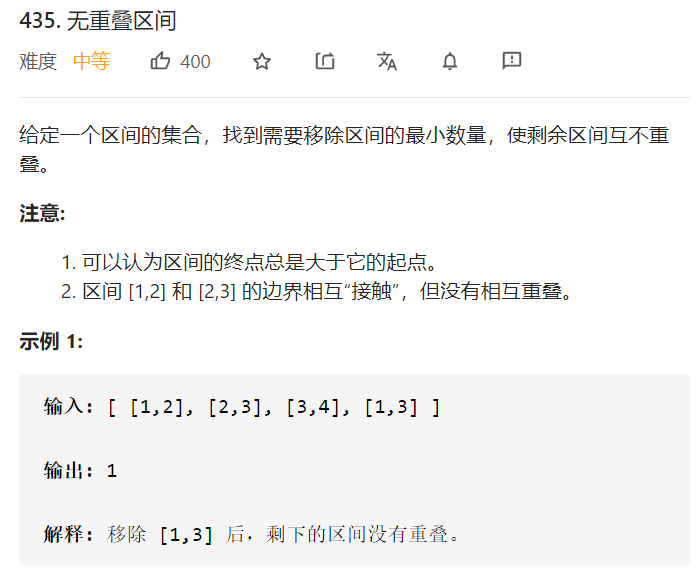
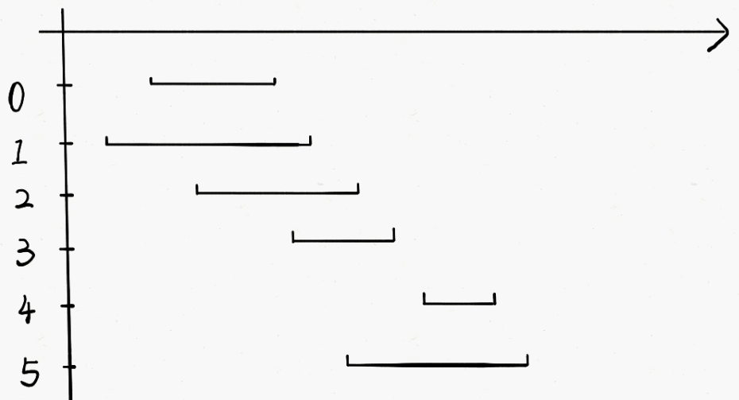
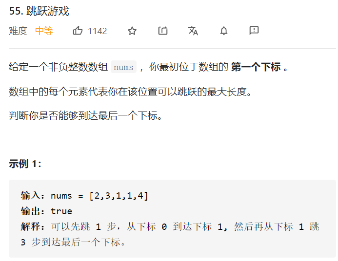
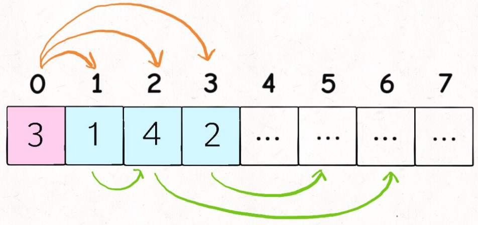

> 贪心算法可以认为是动态规划算法的一个特例，相比动态规划，使用贪心算法需要满足更多的条件（贪心选择性质），但是效率比动态规划要高。

# 区间调度问题



分三步进行贪心：

1. 从区间集合 intvs 中选择一个区间 x，这个 x 是在当前所有区间中**结束最早的**（end 最小）。

2. 把所有与 x 区间相交的区间从区间集合 intvs 中删除。

3. 重复步骤 1 和 2，直到 intvs 为空为止。之前选出的那些 x 就是最大不相交子集。



```java
class Solution {
    public int eraseOverlapIntervals(int[][] intervals) {
        int length = intervals.length;
        Arrays.sort(intervals,new Comparator<int[]>(){
            @Override
            public int compare(int[] a,int[] b){
                // 注意这里为何不用a[1]-b[1]，是为了防止溢出
                // 改成三目运算符可以解决这个问题
                return a[1]<b[1]?-1:1;
            }
        });
        int count=1;
        int x_end=intervals[0][1];
        for(int[] itvals:intervals){
            int start=itvals[0];
            if(start>=x_end){
                count++;
                x_end=itvals[1];
            }
        }
        // 得到的count是不重叠的独立区间数，length-count就是要删的重复区间
        return length-count;
    }
}
```

# 跳跃游戏

## Jump Game I



### 动态规划

另一个文档讲过这个问题： [动态规划专题](动态规划专题.md) 

```java
class Solution {
    public boolean canJump(int[] nums) {
        boolean[] f = new boolean[nums.length];
        f[0]=true;
        for (int i = 1; i < nums.length; i++) {
            f[i]=false;
            for (int j = 0; j < i; j++) {
                // =：j加上nums[j]后恰好调到i的位置
                // >：最后一步跳过i的位置
                if (f[j] && j + nums[j] >= i) {
                    f[i] = true;
                    break;
                }
            }
        }
        return f[nums.length - 1];
    }
}
```

### 贪心

以题目中的示例一：

```
[2, 3, 1, 1, 4]
```

为例：

- 我们一开始在位置0，可以跳跃的最大长度为2，因此最远可以到达的位置被更新为2；

- 我们遍历到位置 1，由于 1<=2，因此位置1可达。我们用1加上它可以跳跃的最大长度3，将最远可以到达的位置更新为4。由于4大于等于最后一个位置4，因此我们直接返回True。


我们再来看看题目中的示例二：

```
[3, 2, 1, 0, 4]
```

- 我们一开始在位置0，可以跳跃的最大长度为3，因此最远可以到达的位置被更新为3；
- 我们遍历到位置1，由于1<=3，因此位置1可达，加上它可以跳跃的最大长度2得到3，没有超过最远可以到达的位置；

- 位置2、位置3同理，最远可以到达的位置不会被更新；

- 我们遍历到位置4，由于4 > 3，因此位置4不可达，我们也就不考虑它可以跳跃的最大长度了。


在遍历完成之后，位置4仍然不可达，因此我们返回 False。

```java
class Solution {
    public boolean canJump(int[] nums) {
        int maxPos=0;
        int length = nums.length;
        for(int i=0;i<length;i++){
            if(i>maxPos){
                return false;
            }else{
                maxPos=Math.max(i+nums[i],maxPos);
            }
        }
        return true;
    }
}
```

## Jump Game II


贪心策略：选择每次后面几个最有【潜力】位置中的一个



```java
class Solution {
    public int jump(int[] nums) {
        int length = nums.length;
        if(length==1){
            return 0;
        }
        int i=0;
        int count=0;
        while(i<length-1){
            if(nums[i]>=length-1-i){
                count++;
                break;
            }
            int maxPos = Integer.MIN_VALUE;
            int maxNum = Integer.MIN_VALUE;
            for(int j=i+1;j<=i+nums[i];j++){
                if(maxNum<=nums[j]+j){
                    maxNum=nums[j]+j;
                    maxPos=j;
                }
            }
            count++;
            i=maxPos;
        }
        return count;
    }
}
```

同样是思路，这是别人的贪心代码：

```java
class Solution {
    public int jump(int[] nums) {
        int length = nums.length;
        int end = 0,farthest = 0;
        int jumps = 0;
        for(int i=0;i<length-1;i++){
            farthest = Math.max(nums[i]+i,farthest);
            if(end == i){
                jumps++;
                end = farthest;
            }
        }
        return jumps;
    }
}
```

