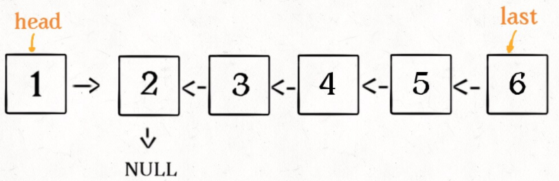

# 翻转链表一部分

## 翻转整个链表

**对于递归算法，最重要的就是明确递归函数的定义**。具体来说，我们的 `reverse` 函数定义是这样的：

**输入一个节点 `head`，将「以 `head` 为起点」的链表反转，并返回反转之后的头结点**。

```java
public ListNode reverse(ListNode head) {
    if (head == null || head.next == null) return head;
    ListNode last = reverse(head.next);
    head.next.next = head;
    head.next = null;
    return last;
}
```

比如链表：


执行该函数`reverse(head.next)`后变成如下：



现在再来看下面的代码：

```java
head.next.next = head;
```


接下来：

```java
head.next = null;
return last;
```


## 反转链表前 N 个节点

这次我们实现一个这样的函数：

```java
// 将链表的前 n 个节点反转（n <= 链表长度）
ListNode reverseN(ListNode head, int n)
```

比如说对于下图链表，执行 `reverseN(head, 3)`：


```java
class Solution{
    ListNode successor = null; // 后驱节点

	// 反转以 head 为起点的 n 个节点，返回新的头结点
    ListNode reverseN(ListNode head, int n) {
        if (n == 1) { 
            // 记录第 n + 1 个节点
            successor = head.next;
            return head;
        }
        // 以 head.next 为起点，需要反转前 n - 1 个节点
        ListNode last = reverseN(head.next, n - 1);
        head.next.next = head;
        // 让反转之后的 head 节点和后面的节点连起来
        head.next = successor;
        return last;
    }
}
```


## 反转链表的一部分

### 92. 反转链表 II

给你单链表的头指针 head 和两个整数 left 和 right ，其中 left <= right 。请你反转从位置 left 到位置 right 的链表节点，返回 反转后的链表 。

**示例 1：**


```
输入：head = [1,2,3,4,5], left = 2, right = 4
输出：[1,4,3,2,5]
```
示例 2：

```
输入：head = [5], left = 1, right = 1
输出：[5]
```

### 解法

```java
class Solution {
    ListNode successor = null; // 后驱节点

	// 反转以 head 为起点的 n 个节点，返回新的头结点
    ListNode reverseN(ListNode head, int n) {
        if (n == 1) { 
            // 记录第 n + 1 个节点
            successor = head.next;
            return head;
        }
        // 以 head.next 为起点，需要反转前 n - 1 个节点
        ListNode last = reverseN(head.next, n - 1);
        head.next.next = head;
        // 让反转之后的 head 节点和后面的节点连起来
        head.next = successor;
        return last;
    }

    public ListNode reverseBetween(ListNode head, int m, int n) {
        if (m == 1) {
            return reverseN(head, n);
        }
        // 前进到反转的起点触发 base case
        head.next = reverseBetween(head.next, m - 1, n - 1);
        return head;
    }
}
```

# k个一组翻转链表

## 25. K 个一组翻转链表

给你一个链表，每 k 个节点一组进行翻转，请你返回翻转后的链表。

k 是一个正整数，它的值小于或等于链表的长度。

如果节点总数不是 k 的整数倍，那么请将最后剩余的节点保持原有顺序。

**进阶：**

你可以设计一个只使用常数额外空间的算法来解决此问题吗？
你不能只是单纯的改变节点内部的值，而是需要实际进行节点交换。

**示例 1：**


```
输入：head = [1,2,3,4,5], k = 2
输出：[2,1,4,3,5]
```

**示例 2：**


```
输入：head = [1,2,3,4,5], k = 3
输出：[3,2,1,4,5]
```

**示例 3：**

```
输入：head = [1,2,3,4,5], k = 1
输出：[1,2,3,4,5]
```

**示例 4：**

```
输入：head = [1], k = 1
输出：[1]
```

## 问题分析

递归性质：比如说我们对这个链表调用 `reverseKGroup(head, 2)`，即以 2 个节点为一组反转链表


如果我设法把前 2 个节点反转，那么后面的那些节点怎么处理？后面的这些节点也是一条链表，而且规模（长度）比原来这条链表小，这就叫**子问题**。


发现了递归性质，就可以得到大致的算法流程：

**1、先反转以 `head` 开头的 `k` 个元素**。


**2、将第 `k + 1` 个元素作为 `head` 递归调用 `reverseKGroup` 函数**。


**3、将上述两个过程的结果连接起来**。


## 代码实现

首先，我们要实现一个 `reverse` 函数反转一个区间之内的元素。在此之前我们再简化一下，给定链表头结点，如何反转整个链表？

```java
/** 反转区间 [a, b) 的元素，注意是左闭右开 */
public ListNode reverse(ListNode a, ListNode b) {
    ListNode pre, cur, nxt;
    pre = null; cur = a; nxt = a;
    // while 终止的条件改一下就行了
    while (cur != b) {
        nxt = cur.next;
        cur.next = pre;
        pre = cur;
        cur = nxt;
    }
    // 返回反转后的头结点
    return pre;
}
```

现在我们迭代实现了反转部分链表的功能，接下来就按照之前的逻辑编写 `reverseKGroup` 函数即可：

```java
public ListNode reverseKGroup(ListNode head, int k) {
    if (head == null) return null;
    // 区间 [a, b) 包含 k 个待反转元素
    ListNode a, b;
    a = b = head;
    for (int i = 0; i < k; i++) {
        // 不足 k 个，不需要反转，base case
        if (b == null) return head;
        b = b.next;
    }
    // 反转前 k 个元素
    ListNode newHead = reverse(a, b);
    // 递归反转后续链表并连接起来
    a.next = reverseKGroup(b, k);
    return newHead;
}
```

