# 关于本书

> 书名：为何会拿好人卡
>
> 作者：张国洋(中)
>
> 自我评分：★★★★★
>
> 阅读时间：2021年01月

# 内容摘要

## 一、告白

**你如果想脱离好人卡的日子，你就「绝对、千万、一定不要告白」。**

陌生表白：

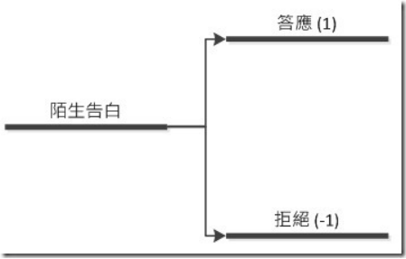

陌生告白「被拒绝机率」原则还是大于「成功机率」。 所以你可以自己抓个你觉得有把握的数字填入。 那期望值的计算方式，就是`1*成功机率 +(-1*失败机率)`。

认识者表白：

人普遍对于做正式承诺这件事情，会抱持特别警戒感。 因为人类不愿意让自己在心理上去面对前后不一的矛盾感。 所以一旦需要做出正确承诺下，我们就会考量未来违背誓言的可能性。

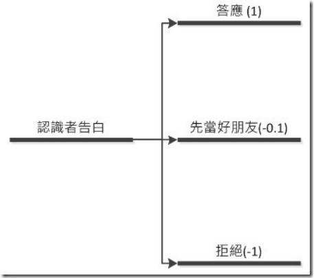

你最想告白时，刚好是最不适合告白的时间。大部分人会忍不住想告白的时机，刚巧是因为自己处在一个最焦虑、也最不清楚对方态度的时候。告白这件事情背后的成因，通常都在于我们很害怕。 我们在那当下觉得极度没有安全感、觉得缺乏自信，觉得两人互动下好像有点那样的味道，可是又不确定。 所以赌一把，告诉对方我喜欢你，请你「明确地」答应跟我交往，让我安心吧。

**恋爱胜利的关键不是定义身分，而是让自己先能留在比赛场中。**

## 二、安全感

女性「安全感」的需求，其实可以先大刀一切分成两个不同的时期「结婚对象」、以及「交往对象」。在这两个时期，通常追求的是不完全一样的东西。

男人其实是一种较习惯于稳定的动物。但女人，从根本上其实是一种较习惯于变动的动物。

安全感的三个条件：

1.危险但不危险的气氛

女人其实喜欢进行「控制范围内的小冒险」。一句话来定义，就是「把我放在一个危险(或刺激)情境、但是不让我感到危险。」

最直接的方式，就是你个人的反差性。比方说，你本身会让人感觉到一些不安或难以捉摩(比方说跟你相处好像有点危险性或觉得你很凶)，但相处下却发现你其实对她不错。这种形象落差，就会产生安全感。

始终如一的乖巧温顺、随传随到，并不会直接连到可靠度与安全感上。相反的，要能提供「对比与反差」，然后你再适度地引导出依赖感，最后就会让女人觉得你很有安全感。

2.创造能带着她参与的有趣环境

前面提到女性喜欢生活上的小刺激。但也请别误会，这刺激感并不是去抢银行、或颠沛流离的到处流浪这种；而是让她有机会体验一下不同的人生、学习不同的新知、开拓眼界、些微的堕落、甚至单纯就是让她觉得好玩。这时候，你若是那个引领的人，在她感受刺激的同时，也感受到有人带领或是有人照顾。这几个条件成立下，安全感也会产生。

3.环境造成的心跳加速

心跳加速的效果不一定需要是直接来自于你个人的魅力。只要那样的环境，你也能继承环境带来的效果。

当然，有人一定会反驳，周围也是有很多男生靠着买早餐、送消夜、温馨接送、以及稳定不变的奉献而抱得美人归。难道一个男人工作稳定、专情、招之则来挥之则去的听话安分，真的不能带来安全感吗？讲完全不能是不对的，这伎俩确实是有其效果。但这类技巧却带来另一个问题，就是你很容易会把自己放在备胎的位置。万一过程中有个能带来更高刺激度的男人，极可能会一下就把她抢走了。**那些靠乖巧温顺招式赢得胜利的男人，并非这方法很棒，通常仅是因为「没有别人来抢」，或是「没有出现更吸引女方的男人」而已。**

所以从这整篇分析中，聪明的男人应该看出来两个点。**一个呢，是你要尽可能去当那个能毫无危害带来刺激的人。另一个呢，就是避免当成安全气垫-出了问题才会想到你。**换言之，你要成功的建构安全感，你就得创造环境、掌握环境，而不是当个环境的反应者。

## 三、两性关系阶段

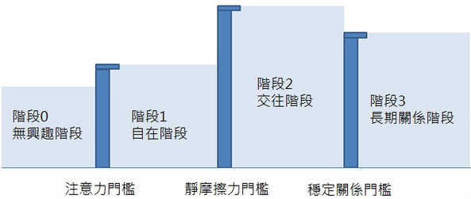

1.无兴趣阶段：

连入场卷都没有

2.自在阶段：

这是女人开始对你产生兴趣，并觉得在你面前可以适度放松的阶段。这阶段开始，你有机会进一步接触她。

你若在这阶段待得太短，后续会很辛苦，两人有很多「磨合」问题要处理。可是呢，你若在这阶段待太久，你则可能变成好姊妹或好朋友。

这阶段，女性不会给你任何承诺(Commitment)。但如前面提到，在长期关系建立上，这里却是最重要的一个时刻。因为男人若做的正确，你可以让她建立充分的安全感，累积足够的信心，并把你当成一个可敬、可信、且愿意重视的伴侣。此外，还有一个重要的观念：若在这阶段你观察发现两人未必这么契合，稍微退后大家也还是能当长期的朋友，谁也不会受伤。这也是为何我会鼓励大家不要告白的缘故。

3.交往阶段：

女人在选择交往对象时，开出的标准其实通常都高于她延续这段关系所需要的条件(意思就是规格开的比实际需求高)。一个原因在于，女人刻意拉高标准，可以排除那些只是想占便宜的男人。毕竟会愿意投资超额心力的，应该不会是只想想占便宜的好色之徒。另一个原因，则是当女性本身条件不错时，想赢得她芳心的男人多如牛毛，拉高交往门槛，是她可以最不费吹灰之力的筛选机制。

当男人突破静摩擦力门槛后，这时候你就是自己跟自己比较了。这就如同进入公司后的试用期。只要你在这阶段不犯错，能证明自己对于女人的关爱，给予其舒适感、安全感，就会逐步垫高女人的沉没成本。当沉没成本累积充分后，女人都会愿意跟这男人发展长期关系。

4.长期关系阶段：

经过0-3阶段最后走入婚姻关系的话，女性只有在三个情境下才会再生出变动。哪三个？1生活稳定感受到威胁；2出现一个总分更强的男人，能在诱惑模型(见诱惑评价模型系列文章:感情的诱惑评价模型(一))上产生高价值；3目前生活让她感到无趣。

所以就大部分的情况而言，只要男人策略正确的执行到阶段3，自己不乱犯错、不让她觉得沉闷、自己不要在内外条件堕落，这段关系将牢不可破。

## 四、涉入度和阻力最小策略

**男女关系也是一样，一段能走的长且远的关系，必须两人在能量上是接近的；男女两方应该要「势均力敌」。** 若以网球来比拟，需要的不是一方很强、能一直杀球，而是两个人能力相同，能把对方发过来的球稳定的击回(虽然没输赢，但才能打最久)。

既然彼此投入的能量至关重大，怎么去「确认」以及去「拉升」彼此的能量，即是我认为在「自在阶段」非常重要的一件事。 因为你必须在这个阶段累积你与女生的亲密感、信任度、记忆、安全感等要素。 若能藉此逐步加温，这段感情才会走得踏实。可是加温也不是乱加温。 以下图为例，好的加温曲线应该要如那条红线。 这条红线不但是你的投入度，也必须让对方的投入度以类似的线形逐渐长高。

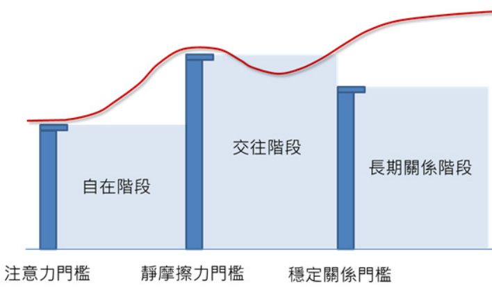

阻力最小策略：女生对你开始感到自在时，其实就是必须开始界定互动模式的时间。 就算没有人刻意在引导，彼此还是会透过「相互探索」来找出此赛局的「纳什均衡」。 若在这时段行事错误，你们构筑的关系就可能非常脆弱。 虽然最后可能也「看似」交往了，但能量不对等下，最后迟早会崩坏。

**你在跨入女性的「自在阶段」后，最需要关注的，不是女性有没有答应跟你交往，而是想办法拉高女性对这段感情的「涉入度」。 涉入度是个行销相关的用语，指的是「个人被特殊情境或刺激所激发的驱力或关心程度」。**

好的关系应该要让彼此的参与等距离的提升。 意思是说，你是引导的那个人，但你不能过分心急，你需要**花些时间等待她(或诱发她)增长好感度(以及涉入度)，并跟上你的步调。**

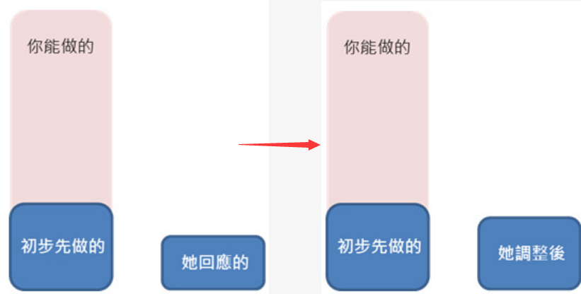

以上图为例，红色的杆子是你可以奉献出来的能量。 **可是你要先克制，只先以力道合适的方式跟她相处。** 她一开始可能会稍微冷淡，这是正常的，因为她不了解你，也还不觉得为何要为你这人花心思。当你感受她有开始对这份关系增加力道后，才再拉升你的投入。 **执行正确下，你增加的投入会被她视为争取到的「成就感」。 成就感会让她渴望更多，也会更加深力道来回报。 正向循环即会展开。**换言之，你在这阶段「唯一重要」的事情，就是得让对方有一种：**我得对这关系投入力量的心情。** 这心情很重要，因为这是所谓「共谋」关系的成形。 共谋关系成立后，她看事情才会有「我们」这字眼的意识。

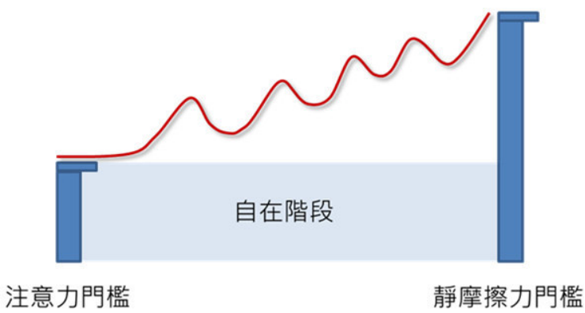

过程其实必须包含「上升」，以及「冷却」的过程。 上升让她感受更多来自于你的价值，冷却的过程则让她沉淀，确认她享受这些价值，让她在心底强化她「想要这些价值」的动机，最后才会促使她下定决心的跟上来。

这是为何我会一直强调，**你得在女方的「自在阶段」待一段够长时间，但又不至于长到变成朋友。 因为这段时间，是我们能有效垫高底部，把女方的涉入度从「情境涉入」改变成「持久涉入」的过程**(意思是说，她不是因为感动或是环境造成的假象，而是真的下定决心跟上来)。 唯有这样才能让关系长期变成平等、互动和谐、且产生稳定并成熟的恋情。(这概念很重要，请要反覆看懂！)

试想想，**若你一出场就宣示你愿意「奉献一切」来讨好她，那她就会把重心放在「享受这段呵护」，而非呵护一段她觉得有价值关系。** 对她而言，她考虑的就仅仅是「我」(她自己)，而不是「我们」。

策略正确的另一个好处是，你因为在过程中慢慢拉抬，若到了任何位置她不愿意再跟上来，你立刻就会察觉到。 **届时要停损或是改变策略都方便得多，虽然可能还是会有伤心与失望，但最少你不会损失太多时间，沉没成本也不会高到让人难以停损**(换言之，也可以连带降低每次失恋的痛苦时间)。

更重要的是，奉献式的追求，就如同不断买玩具的母亲一样，你只是把自己**平庸化**了。 宠坏的孩子不会感激母亲，女人也不会感激那些试图靠物质力量收买她的男人。 尤其若你追的女孩子条件很好，采取奉献式追求的男人已经多如牛毛，你将只是one of them(除非你真是非常有钱，有钱到另一个层次那才又另当别论)。 另外，女人还有一个特性，他们其实不会重视那些「只能」不断讨好她的人。 **她们会认真爱的，是她们觉得尊重、觉得比她厉害、觉得有价值的男人。 这些男人，通常都是她想抬头仰望的对象(也就是能让她想要付出的男人)。 所以你若采取的是奉献、是追求、是痴心，女人或许会因为感动而首肯，或许会因为依赖而委身，但那不是爱。** 只要这段关系没让她有「想不断为你多做些甚么的心情」，女人在本心上就不会认为那是爱。 也因为不是爱，你就得长期背负着高风险。

## 五、调情

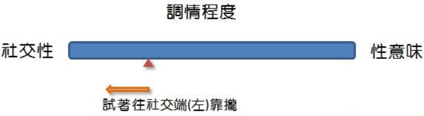

当你位在阶段0的时候，女人是不会跟你调情的。像在刚刚举的第二个例子中，她甚至根本不愿意多跟你回应。这表示你还无法让她自在，所以她不会以玩笑甚至调情方式回应你。

当你丢出一个带有调情味道的举动或是话语时，女人其实脑中会迅速做出判断。
判断甚么呢？

+ 她对你的评价

+ 她对你的好感度

+ 她与你未来发展的可能性

要进入游戏，最核心的条件其实只有两项：

+ 第一个条件是：长相不讨厌
+ 第二个条件是：让她有好奇心

趣味性：

你很幽默、跟你很好聊天、你懂很多好玩的东西、相同的喜好兴趣

才能与经历：

知道很多她不知道的东西、你与众不同、让她产生想了解你的欲望、有机会带她看另一个世界、你拥有与她大不相同的人生经历

让她崇拜：

拥有比她厉害的技术或知识(前提是她有兴趣的领域)、拥有比她更高段的才能(前提也是她必须有兴趣的领域)、懂很多事情、能引领她、权威与权力、社会地位与头衔、就是莫名让她觉得很厉害

从上面几点你可以看出，若想让女生放下心防，**外表「及格」很重要。再来若你又有其他能引起她好奇的一些条件，你就有机会突破「注意力门槛」。**她就会愿意以正面的方式跟你接近(或让你接近)，这是进入追求之道的第一步。唯有进入这阶段时，调情才会产生作用(对方才会反馈)。

调情在追求中「最主要的功能」是作为一种「礼貌性」的量测手段。你要从女性的「自在阶段」转移到「交往阶段」，有可能是一条漫长的路。正常的进展时间有可能介于3天到3个月之间，并会经历数个查核点。这期间中，你要不断拉近与女方的距离。距离的控制权通常是在女方手上。**她喜欢你、信任你、感到足够安全感下，就会愿意让距离靠近；但她讨厌你、不认同你、防备你、或感到不安时，就会希望你别靠太近。**所以你做为一个追求者，必须随时调整你的力道。

**每次达到一个里程碑，停留适当时间后，就要测试「是否还可以更靠近」。**怎么测试？就是用力道强一些的调情手段试探。如果她正面回应，你就等于往前又站了一步。如果她不接球，或甚至不悦了，你则就退回刚刚的位置。只要步调掌握得好，其实并不会在关系上造成致命的影响。

在自在阶段时，女人能接受的调情力道较偏左。随着对你好感的增加，她能接受的调情力道会越来越偏右。要提醒的是，调情因为会发生在女性的自在阶段，所以就算是让她感到自在的普通朋友也可能有调情的行为发生。所以，**女人愿意调情未必表示她爱上你；只是代表你可以开始跟她有多些的互动。一直要到女人能接受具有更强性意味的调情力道时，才表示你或许已经处在女人认可的「交往阶段」。**

当这互动到达一个临界点后，你们就会产生默契、产生共同价值、产生共谋关系。这时候关系将非常稳固，而且因为在这互动中，谁也不是弱者，谁也不用迁就对方，这种关系将最可长可久。

调情的两个重点：

+ 观察

「观察」就是解读女方对于某些动作的反应。举例而言，你握她的手，她表情如何？紧张？慌乱？高兴？安慰？这都告诉你某些讯息。

+ 跟随

跟女生互动是一模一样的。若你调情力量加太高，却没有得到正确反应，那你就往后退。休息一段时间后，试着以减弱一点的力道再靠近一些。若这次对方没有反抗，就在那边稍等一段时间，然后再用一次加重力道的调情方式，试着重新拉近一次。

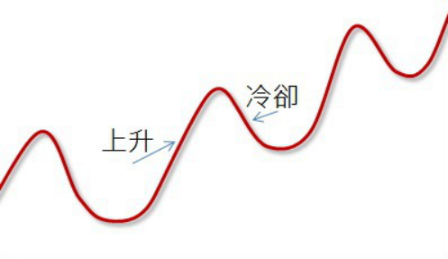

这概念若画成图，就是以上这样的曲线(在之前的文章出现过)。你拉升这段关系的热度，并不是一股脑地拼命的拉。那种拉法要不是自己精疲力竭，要不是对方会觉得压力很大。反而要「关注女生的步调」，有节奏地进行(这也是一种男人该有的体贴)。每次感到抗拒时，就稍微退回一点。唯有你愿意主动退回，让女生「冷静并累积」对你的感觉，下一次才可能拉得更高。甚至有些时候，你还得自己刻意降温(这也是一个能把关系拉得更高的关键，但这进阶议题我们后续再讨论)。

总之，上面这张图很重要，请对这议题有兴趣的读者反覆看懂。并记得这句话：**追求不是由黑或白的改变，而是从黑经历「不同渐层」的过程。**

## 六、IKEA

若只是不断调情，仅是知道你与对方的距离。**与调情必须同时进展的，是你还需要提升对方的「涉入度」。**

涉入度理论两个相关：

+ 情境涉入：人因为讯息(如广告)、环境影响、或是特殊情境的刺激所提升的关心程度。创造出一个对的情境确实有可能让他人意乱情迷；可是缺点在于，一但离开那环境、或是情境刺激不再了，关心程度也可能消逝无踪。
+ 持久涉入：个人因为「内生性的需要」而对某个议题产生的关切性。包含了价值观、兴趣、必须性、喜爱、目标、甚至过往经验等因素产生的关切。这类需求因为发自内心，是本愿的关切，就算客观环境产生变化，这关切程度也可能延续下去。

所以呢，你要让一段感情长久，你就得让你的对手产生「自发性」的「持久涉入」，这也是为何我从不谈甚么追求手段之类的技巧性东西。甚至我还一再强调「长期关系不该靠追」这样的论述。因为那类东西(也就是一般人直觉用的方法)，通常只能产生情境涉入。除非你有把握长期维持此情境的延续，否则你必然会随着状态变动而失去她。(比方说兵变、或是毕业后的分手潮，都是源自于环境变化下造成情境涉入的瓦解)。

上面这段文字若有人觉得太抽象，那简单且白话的写法就是：**你若要一段稳定的长期关系，你就得让对方觉得这段关系「跟她有关」，让她「希望」能从这段关系中得到「她想要的东西」。**

**唯有这段关系对她感到重要，且有很多她关注的渴望寄托在其中，那她才会不断投入。「投入」会拉升她的热度，「投入」会产生更多的渴望，也才会又引领她产生更多的投入。当这样的正向循环展开后，这段感情才能平等且正常的延续长久。**

IKEA效应：劳动会增加人们对于工作成果的感情

**大部分拿好人卡的男人都会犯一个共同且严重的错误，就是他们建构一个「单方面付出的环境」。**他们埋首投入心血以时间，并误以为努力到某个门槛后，对方认同他的努力后就会等量回报。

但请记得，这是对女人完全的误解。**如果你不能让对方有「想为这段关系投入心力的意愿」，那基本上这段关系是永远也不会有充分的基础。若只是单方面地给予，做出各类「希望女生感动的事情，以求女生了解自己对她好」，你其实是自己在「拉远」对方对你的好感。**

一个我要在这里顺便提到的事情：除非1.你跟一个女性已经交往超过6个月以上，或是2.除非你确定她对你有好感，否则绝对不要送花、不要写诗写歌、更不要做甚么手制卡片、手制蛋糕、手制视讯、亲手录音录歌。

女人若不能对你产生自发性的激情，她就没办法说服自己跟你交往。再换句话说，**女人若不能对你产生自发性的激情，你就没有办法增加她的持久涉入。**这时候只要有情境上的变动，她就会把你推开，就算他曾经答应跟你交往，结果也会是一样的。

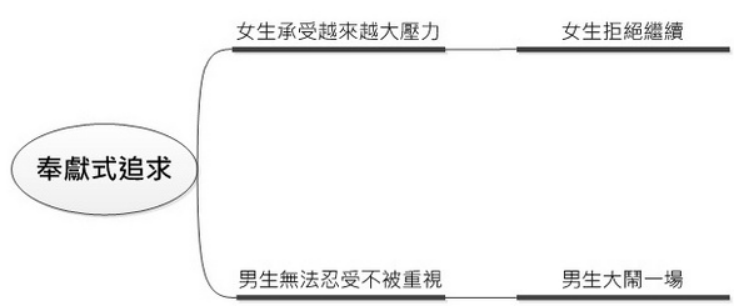

触发IKEA情节：

**你要让一段关系成功，关键不在给予、而在「敢要」两字。唯有敢要，你才会创造对方的IKEA情节。**不过也要先说，「敢要」并不是要你直接要求对方跟你发生关系，也不是要你去命令对方，那只会得到被打一巴掌的下场。「敢要」的真正意涵，是让女方在你的引导下，对这段关系有所「投资」。一个简单的例子，就是请她先帮忙你些小忙。

+ 在于你间接地提升了她的自尊心。你让她觉得自己的内在以及技能受到他人肯定。
+ 心理学的研究证实，我们会喜欢那些向我们寻求帮助的人。
+ 你日后回送个饮料点心来感谢她，不也就是个关系建立点了。

请记着，**女人在一段关系展开前，最担心的是男人仅为了美貌或是性欲而接近自己。**所以若你只是一昧送礼物、赞美、并承认自己是被「对方的美貌」迷得神魂颠倒，女人其实对你是会有疑虑的。

所谓相爱，不是因为女人觉得你做的事情很好而回应你；这不是爱，尤其不是女人期望的爱。相反的，**她们希望碰到某个值得的人，让她们可望投入心力，让她变成一个「比原来更好的存在」。这种能激起她「渴望投入心力」的动力，才是吸引女人且让她们心折的东西。**

女人的心里还有另一个非常重要的关键：**就是大部分时候，他们会逃避做决定的责任。所以关键门槛，你必须主动拉着她越过。可是越过后，你反而不能让她继续逃避。**不能让她有一种「我只是被逼」，「我只是受限于他的强势」，这样的心理欺骗。你必须让她自己认同那个决策的「共谋意识」。

**长期关系要建构，绝对不能只是拼命拉升。你拉升的同时，也要适度的冷却。**所谓冷却，就是在一个情绪拉高的最高点上放松力道。让对方冷静，让对方仔细思考自己是否真有意愿继续。这是垫高底部的关键。这会发生在发现对方的抗拒点时，也会发生在你自觉拉升太快的时候。但只要她因为冷却而又来主动靠近，那表示「对方目前为止对你的认同」，也表示对方把自己涉入度拉高了。女方拉高涉入度，日后约会中对于你话题以及表现的观察门槛也会降低。

冷却后女方也不来救的状况：

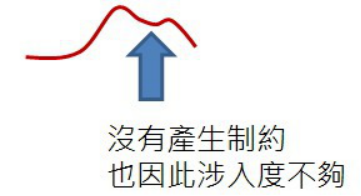

冷却后，她回头来关心，表示她是重视这段关系。换言之，整个关系应该有机会再高过前高：

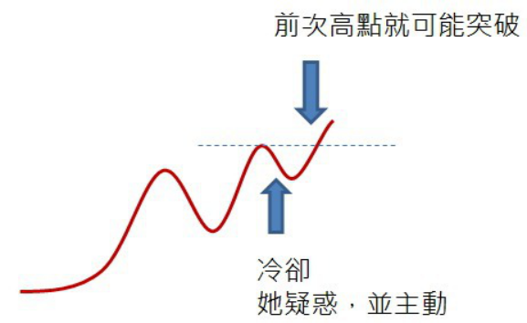

随着你的经验增长，你可以透过细小且持续拉高以及冷却的举动，让女方不断地想更了解你，而这是女人情愫增长的关键。另外我要提醒的是，若女孩子对你的好感度到了某个点就怎么也上不去时，你猛攻是没用的。以我自己而言，两三次退后都无法过前高的话，我可能会选择做个「更大的冷却」，甚至必要时整个停损。

第一个峰(A)是本次关系的高点。曲线从开始到这里都是缓慢上升，表示两人关系热度不断加温。但到了这里，对方开始有所抗拒。所以我会稍微降低压力，让热度小小拉回(如回到B点)。待对方冷静一段时间后，我会再试着突破一次。第二次引领若还失败，我可能还会再试第三次…可是如果连续两三次尝试(C、D)都无法再突破前高，那我会做一个较大的冷却处理(回到E点)。因为当你做一个大幅度的冷却处理下，你会产生明确的疏离感，这时候女方会察觉。她若在意这段关系，这时她必然会重新回应你，确保你不会跑走。两人关系就有可能会重新往高点攀升，也可能会突破前一个压力点。

当然，也有时候你的冷却女方其实无所谓，两人关系会停在低点附近的位置(E点到B点附近)，两人也可以很有默契地退回成朋友关系。有人会说，这样不是很可惜？其实不会，因为对方的热度若拉不起来，你就算勉强靠些技巧冲破一次，下次的高点可能还是在不远处。你并没有根源的解决这问题(强化她对你的兴趣)，最后你还是要面对是否停损这样的问题。

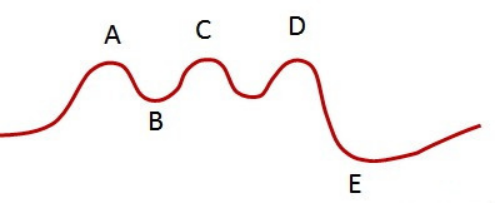

你要跟一个女人发展长期关系，你不能只是给予。你要透过力道合适的要求，让她感觉她在贡献某种价值。这会引领到成就感、自我价值的肯定、自尊的增长、甚至自我实现。这是IKEA情节的根源。

## 七、开局方法和感动的代价

以电影票、牛排餐厅、或是演唱会门票而言，男人会觉得如此慎重地邀请应该代表诚意。可是女人其实不会先往那边想。女人会先联想到的，反而是其中隐含的「责任问题」。如果她不喜欢你，或是没有足够的好感，那你「豪华的开场」就创造了一个唯一解：「为了避免后续麻烦，最好的选择就是不要冒险跟你出去」。**换言之，当你把初次的邀约弄的很「正式」且「昂贵」时，你就是在自己封杀啦。**

过度诚意、想以此感动对方时，其实带给你的通常是负面影响。这时候，你若没搞清楚问题就在于你太有诚意了，还试着要增加金额、搞悲情、亲手写信、亲自写歌、手做卡片、手做礼物、做悲壮的事情、在大众面前告白、或是其他想靠感动因子达成目标的举动时，你其实都是在「把对方推得更远」。**因为在她还不够了解你的情况下，你投入的越多，就表示她进入这段关系后要面对的风险越大。合适长期交往的女人对此绝对会有顾虑的，你也几乎必败无疑。**

**好女生怕欠你人情还不了，所以一律婉拒你；至于那些拿了不手软的，或是想透过测试你愿意忍受多大苦难来筛选的，偏偏也通常不是好对象。**

有些男人把「女人答应约会」给予过高的权重，甚至会误以为这就代表两人交往了，以至于过度重视第一次约会的形式与内容。这认知是完全不正确的。约会其实是「自在阶段中」的一小个过程，是用来测试两人「在独处环境中是否能自在相处」。**所以约会这件事，与其花时间想着要让女生惊喜或是感动，还不如多花心思让整个过程轻松、无感、无压力、并让对方察觉跟你在一起的乐趣。**这样才能确认对方若愿意跟你交往，是真的认同你这个人；也才能确定她并非只是贪图你的好处，用时间甚至肉体来换取那些礼物或代价。若是走到后者，那就肯定不会是一个健康的长期关系啦。

总之，你在自在阶段必须让女生接收到一个隐含的讯息：「我觉得跟妳很谈得来，所以愿意与你分享我部份的生活时间。不过我并不给妳压力，妳可以自由选择要不要跟我相处、要何时相处、要花多少时间相处。妳愿意跟我约会，我会很高兴；但妳不想来也没关系，我也还是有我正常的生活要过。」若抱持这态度，女人就能毫无压力的慢慢认识你，也有机会对你产生好奇。

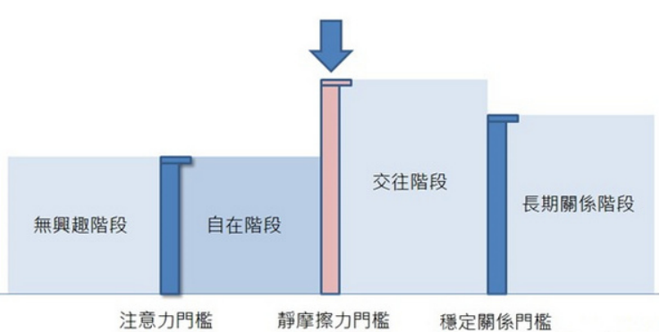

**大部分男人犯错的地方，就是刚好是反着做。在突破静摩擦力门槛前极度的关心+贴心；但静摩擦力门槛过了后，反而就默不关心了。也难怪很多女人总抱怨男人交往后就变了。**把握一个简单的原则，只要你想像起来觉得会让女人「惊喜」的举动，通常就是太过了(笑)。

如果女方跟朋友形容起你，直觉想到的形容词是感动，那你这人其实是失败的。感动代表你毫无特色，但唯一好在够乖、够用心。可是偏偏她对你没有更多的感觉，所以觉得很困扰。讲得更直接一点，就是所谓的鸡肋–食之无味、但弃之可惜。**女人会欣赏男人对她朋友的用心，但不表示换成她后她会欣然接受。**

请记着，在追女孩子这件事情上，低调在大部分的情境下都好过高调。所以请小心在开场时降低带给女方的压力，并避开感动策略吧!

## 八、放弃逆转

思考这问题可比整天想着「可否逆转」以及「怎么逆转」来的更有意义。因为一般来说，追求失败不外乎下面三大原因(请划红线)：

1.因为接近方法不对。(你是很优，可是因为错误呈现或笨拙而只让对方看到坏的一面。)

2.因为对象不对。(你本身OK，只是这女孩要的刚好是你没有的素质。)

3.因为根本的能力不够。(女孩子了解你后觉得你并不合适。)

**当你足够成熟并碰上适合长期相处的对象，你应该会在恋爱中觉得充实、觉得平静、觉得温馨、觉得自在。**届时回头来看，你会发现那种患得患失、抱持「需要小心捧着」心情的恋爱，根本是可笑至极的。

**可是这里所谓的好人，并不是那种随招随到、会修电脑、会买早餐、或是低声下气百般讨好的男人。而是你必须成为一个有气度、温和、体贴、关怀、包容、不计较、有想法与见解、有智慧、有能力养家、不以自己认知的方式示爱、不以充满侵略性的方法接近、保持一个适度两人空间的男人。**这样的男人，肯定所有女人都会喜欢的。

## 九、几点注意

几项注意：

+ 不要告白(包含不要做出类似告白的举动)。
+ 不要问对方是否有男朋友。
+ 不要以为自己一成不变的生活型态会让女人觉得有安全感。
+ 不要把送礼物当主轴攻势。
+ 不要做手制礼物。
+ 不要只是一面倒的讨好女性。

几项错误：

+ 错误一：太早让朋友知道
+ 错误二：频繁询问「你觉得我怎么样」，或质问两人的关系
+ 错误三：「吃醋」或说出【那句话】….

两人是男女朋友时，你偶尔吃吃小醋，女生会觉得很有趣、也觉得很窝心。可是若你只在自在阶段，两人只是【一般朋友】，你开始吃醋可就大错特错了、也极度愚不可及！

总而言之，女生若喜欢你，觉得你有价值，怎么样都会往你靠拢。可是如果没有靠拢，不管你们现在是甚么头衔，她都不会花很多心思在你身上。这时候你还找对方谈一谈，说甚么「我觉得你不尊重我」、「我觉得你没把我当朋友」、「我觉得你没考虑我的感受」、「我觉得你其实并不重视我」，都只会让状况更恶化罢了。

+ 错误四：我喜欢你，但你并不用喜欢我
+ 错误五：宣称「我不会再出现了」，可是没几天又摸摸鼻子回来