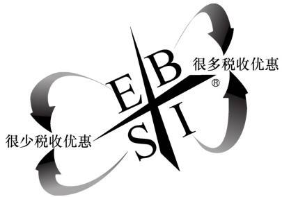
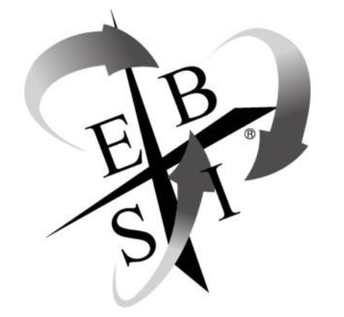

# 关于本书

> 书名：富爸爸财务自由之路
>
> 作者：罗伯特·清崎(美)
>
> 自我评分：★★★★★
>
> 阅读时间：2019年5月

# 内容简介

为什么有的人可以用较少的劳动取得较多的收入？为什么有的人可以少上税？为什么有的人可以享受比别人更多的财务上的自由？其实这只是因为他们懂得何时并且如何从“现金流象限”的一端过渡到另一端。本书为你揭示这一通往财务自由之路的秘密。

# 内容摘要

## 第一部分 现金流象限

1.因为对于一个很看重工作的人来说，你很难向他解释清楚为什么你不想拥有一份工作。挣钱需要一个梦想、一系列决定、快速学习的决心、正确利用你天赋的能力以及辨别出你的收入来自现金流象限哪一部分的本领。

2.E代表雇员，B代表企业主，S代表自由职业者，I代表投资人。雇员通过为另外一个人或一家公司工作而赚钱；自由职业者通过为自己工作而赚钱；企业主拥有能挣钱的企业，而投资者则从他们的各种投资中获利——换句话说，就是钱生钱。

E（employee，雇员）

“保障”这个词通常反映出恐惧的心理，一旦感到恐惧，E出于对安全感的需要就会使用这个词。涉及金钱和工作时，很多人甚至憎恨那种伴随经济无保障而来的恐惧感——因此他们渴望获得保障。不确定性会使他们感到不快乐，确定性才能让他们放心。他们内心有个声音：“我将给你这个——同时你得答应回报我那个。”

S（self-employed，自由职业者）

一个顽固的、典型的S不喜欢让自己的收入取决于别人。S不是通过寻求保障，而是通过控制局势和亲自解决问题来消除恐惧，这就是我称S为“亲力亲为的人”的原因。对于这群人来说，钱与他们的工作比起来并不是最重要的事情。他们的独立性、按照自己的方式做事的自由，以及在自己的领域里被尊为专家，都要比单纯的金钱重要得多。当你雇用他们时，最好的方式就是告诉他们你想要什么结果，然后把事情留给他们自己去做。他们不需要也不想被监督，如果你干预太多，他们只会停下工作，然后让你另请高明。钱的确不是第一位的，最重要的是他们的独立性。这类人通常不愿意雇用别人去做他们所做的事情，因为他们认为没有人能够胜任这项工作。当你雇用他们时，最好的方式就是告诉他们你想要什么结果，然后把事情留给他们自己去做。

B（business owner，企业主）

如果你有能力雇用别人为你做事，而且他们能比你做得更好时，为什么还要自己做呢？领导力就是激发人们做出最好表现的能力

他将一些商业成功所必需的技能教给我和他的儿子，这些技能包括阅读财务报表、市场营销、推销、会计、管理、生产和谈判，并且他强调应该学会与他人合作和领导他人。一位S拥有的是一份工作，而一位B拥有的则是一个系统，他只需要雇用合适的人去操作这个系统就可以了。

要想做一个成功的B，需要有：

- 对系统的所有权或控制权
- 领导他人的能力

I（investor，投资人）投资人用钱来赚钱。他们不必工作，因为他们的钱在为他们工作。

3.OPT和OPM

相信很多人都听说过，获得巨额财富的秘诀是：

1.OPT：Other People's Time的缩写，即：他人的时间。

2.OPM：Other People's Money的缩写，即：他人的金钱。

把钱存入退休账户的人和通过投资、积极地用钱生出更多的钱的人之间，存在着巨大的差异。 但是要知道靠赚取佣金、按小时收费来出售建议或出谋划策来获得工资，或者靠尽量低买高卖来挣钱的投资者，同通过识别或者创造良好投资机会来挣钱的投资者之间是存在着差别的。

许多专业的投资顾问几乎没有来自投资的收入。换句话说，“他们不做自己鼓吹的事情”。

4.富人变得更富的原因之一就是，他们有时能够挣到几百万美元，而且能够合法地不为这笔钱纳税。这是因为他们是在靠“资产项目”挣钱，而不是靠“收入项目”挣钱，或者说他们是作为投资者而不是工人来挣钱的。对于赌徒而言，投资是一种随机游戏；对于投资者来说，投资是一种技能游戏。而对于把钱转交给别人代为投资的人，投资通常是一种他们不想学习的游戏。对于这些人来说，最重要的事情是慎重挑选投资顾问。

5.S的回报虽然最高，但风险也最大，我认为它是最辛苦的象限，而且失败率很高。如果你停留在这个象限，成功了甚至比失败了还糟。这是因为，如果你是一位成功的S，你将比你在其他任何一个象限都要更努力地工作

6.税收和负债是大多数人永远感受不到财务安全或财务自由的两个主要原因。

7.工作安全模式：

这种模式中的人通常善于完成他们的工作。很多人花了多年时间读书，又花了多年时间工作以获得经验。问题是他们几乎不了解B象限或I象限。即使他们拥有退休金计划，他们在财务方面仍没有安全感，因为他们接受的培训只是为了获得工作或工作安全。

财务安全模式：

这个环形说明，这一类人不只是把钱存入退休金账户并期待着最好的结果，他们还作为投资人和雇员来接受教育，这让他们更加自信。正如我们在学校里学习一种职业技能一样，我建议你们试着去学习成为一名专业投资人。

无论人们挣多少钱，只有当他们能够在多个象限中工作时，才会觉得更安全。要获得财务安全就得安全地把脚放在两侧的象限。

8.为什么你建议要先到B象限呢？

- 经验和教育 如果你首先在B象限获得成功，那么你将更有可能成为一个有影响力的I。
- 现金流 如果你拥有一家企业并且运作良好，那么，此时你应该有多余的时间和现金流支持你在I象限的活动。

9.商业系统的类型

- 传统的由企业主B创办的C型企业——由你自己发展起来的系统
- 特许经营权——购买现成的系统
- 网络营销——购进并成为现存系统的一部分

10.投资者的7个等级

第0级：一无所有的投资者

这些人没有钱来投资。他们不是花掉了自己挣来的每一分钱，就是花的比挣的还多。

第1级：借钱者

这些人通过借钱解决财务问题，他们甚至还用借来的钱进行投资。

商人总是一厢情愿地认为自己可以自动地变成一位成功的投资者。事实上，商业规则并不总是与投资规则相同。

第2级：储蓄者

这些人通常定期地把一“小”笔钱存起来。这笔钱以低风险、低回报的方式保存着，比如货币市场的经常账户、储蓄账户和大额可转让定期存单。这个等级的人经常浪费他们最宝贵的资产——时间，去节省某一分钱。

第3级：“聪明的”投资者

3.A级 这类人构成了“别来烦我”族。

这些人只是把钱放着，很少关心他们的退休计划，或者把钱交给推荐“多元化”的理财专家。他们不考虑自己的财务前景，只是日复一日地努力工作，并对自己说：“至少我还有退休金计划”。当他们退休时，

3.B级 这类人是“愤世嫉俗者”。

他们通常看起来充满智慧，说话颇具权威性，在他们的领域里也很成功，但是在聪明的外表下，他们实际上不过是懦夫。他们总以为自己是游戏中人，但事实上他们只是旁观者。他们也想参与游戏，但很遗憾，他们如此害怕受到伤害。对他们而言，安全比游戏的乐趣更重要。

不要让这些“犬人”粉碎了你的财务梦想，虽然这个领域的确充斥着无赖和骗子，但是又有哪个行业不是这样呢？

3.C级 这种类型的人叫做“赌徒”。

这些人没有设定交易规则或准则。他们做事的方式就像“大男孩”，总是假想，直到他们赢了或者全部输光

第4级：长期投资者

他们在真正投资之前，会投资于自身教育。他们利用周期性投资，并尽可能地利用税收优惠。最重要的是，他们会向有能力的财务规划师征求意见。你应该坐下来，制定一个计划，控制你的花钱习惯，把你的各种债务最小化；用你的钱生活，并增加你的财富；弄清楚你每月要投资多少钱，按实际回报率用多长时间能收回成本，以最终实现你的目标。你的目标应该是这样的：我计划在多少岁时停止工作？我每月将需要多少钱？

如果你处在这个等级，那么你需要简化你的投资，不要频繁地改变花样。忘掉那些复杂的投资，只做绩效好的股票和共同基金，而且要赶快学会如何购买封闭式共同基金——如果你还不会的话。不要试图超越市场，使用保险工具时你得聪明点，把它作为保障措施而不是积累财富的措施。

第5级：成熟投资者

他们实行集中化，而不是常见的多元化投资战略。他们有长胜的记录，但也赔了很多钱，这带给他们智慧，而这些智慧只能从犯过的错误中获得。

第6级：资本家

资本家的目的是通过把别人的钱、别人的智慧和别人的时间和谐地组织在一起来赚钱。

第5级投资者通常用自己的钱为自己的资产组合创造投资，而真正的资本家通过使用别人的智慧和财富，为自己和他人创造投资。真正的资本家创造投资，然后把它们卖给市场。真正的资本家挣钱不需要自己有钱，因为他们知道如何使用别人的钱和别人的时间。资本家知道，经济混乱意味着新的机遇。在人们发现机会到来的几年前，他们早已参与了产生这种机会的一些项目、产品、公司或者国家的有关活动。

11.任何想成为第5级或第6级投资者的人，都必须先成为第4级投资者以发展他的技能。如果你想到达第5级或第6级，就不能简单地跳过第4级。任何没有第4级的技能并试图成为第5级或第6级投资者的人，事实上都是一个第3-C级投资者——一个赌徒！

12.许多人投资是因为他们想快速致富，他们最终没有成为投资者，而是成了梦想家、不法分子、赌徒和骗子，世界上到处都是这种人。如果你一无所知，那么任何财务建议都比没有建议好。但是如果你不能区分出好建议和坏建议，这将是非常危险的。

13.大多数人努力工作，不断地增加消费并购买新房子——使用新的抵押贷款。基于以上原因，政府提供税收减免，鼓励纳税人购买更贵的房子，而这意味着政府可以收到更多的财产税。不要忘了，每家抵押贷款公司还都要求你为抵押贷款购买保险。

14.“你欠越多人的债，你就越穷，”富爸爸说，“越多的人欠你的债，你就越富。这就是游戏规则。”如果你有太多的债务，这个世界就会拿走你所有的东西——你的时间、你的工作、你的家庭、你的生活、你的信心，然后再拿走你的尊严。

15.如果你能读懂财务报表，就能够看清事实，而不只是一家公司的财务成功；如果你能读懂财务报表，就能立即说出一个人应该怎样做——而不是听从他人的意见或凭你主观臆测。美国最伟大的投资家沃伦·巴菲特曾经说过：“如果你在玩捉人游戏，但20分钟后你还不知道替罪羊是谁，那么你就是替罪羊了。”了解金钱游戏和掌握它的玩法是通向财务自由过程中的一个重要部分，而更为重要的是，你需要成为现金流右侧象限的那种人。

## 第二部分 做最好的自己

1.富爸爸称钱为毒品，因为他注意到，人们在有钱时很高兴，没钱时就变得烦躁不安或者郁郁寡欢。这跟吸毒者一模一样，注射毒品之后就兴奋起来，没有毒品时就变得沮丧抑郁、充满暴力。

2.从左侧象限进入右侧最困难的一关就是，你必须改变目前的挣钱方式，”富爸爸说，“这不只是打破一种习惯，也是在戒掉一种‘瘾’。E象限代表为系统工作。S象限代表自成一个系统。B象限代表创造、拥有或控制系统。I象限代表投资于系统。

3.你内心中有一部分仍旧在寻找安全感，它在与你想获得自由的那部分斗争。只有你能决定最终谁会赢。你要么创建自己的企业，要么回去找份工作——永远停在那儿。

4.读懂数字、弄清财务系统和企业系统能使你看到一般人看不到的东西。拥有财务视觉能降低你的风险，相反，财务弱视会增加你的风险。如果你想在右侧象限获得成功，那么涉及钱时，你必须知道事实和建议之间的区别。你不能盲目听从左侧象限的人的建议。你必须清楚你的数字，必须了解事实，而数字会告诉你事实。在右侧象限，你能够做任何你想要的事情，并且使事情进行得和你喜欢的一样快，挣到你希望挣到的钱，但是你必须付出努力。你可以进展得很快，但是记住，不存在任何捷径。

5.我怎样才能致富？

不要在对方身上下工夫，要在你对对方的看法上下工夫。如果他们仍旧持有穷人或中产阶级的信念和想法，却做着富人做的事情，那么他们最终仍然只会拥有穷人和中产阶级拥有的东西。成为一个成年人就意味着你知道你必须做什么并且去做，即使你可能感觉并不喜欢做这件事。

6.不能克服对赔钱的恐惧的人最好不要投资，他们最好是把这项工作交给专业人员并且别去干涉人家的工作。要想做一个成功的投资者或企业主，你必须在情感上对赚钱和赔钱漠不关心，赚钱和赔钱只是游戏的一部分。

7.你借债时要小心。如果你个人借债，要确保数额很小；如果你借大额债务，要确保有人替你支付。

8.如果你是一名雇员，请继续你的工作。但你要开始在B象限或I象限花些时间，你的快速通向自由的道路必须要经过这两个象限。想感受到更多财务安全，秘密是在不止一个象限中进行操作。

9.会有无数的人对你说“你不能那样做”。如果你克服了那种思维定势，并遇到一些会对你说“是的，我知道怎样做这件事，而且我很高兴教给你”的人时，你的生活将变得很容易。

10.不要因为税收缘故进行商业或投资活动。税收漏洞是按照政府要求的方式做事的一种额外奖励，它应该是一种奖金，而不是理由。

## 第三部分 如何成为成功的B和I

1.当你花掉半年到一年学会了迈出这一小步之后，你就会理解这句话：“在你能跑之前必须学会走。”

2.富人的特性：

- 他们有长远的眼光和计划
- 他们相信延迟的回报
- 他们以有利于自己的方式运用复利的力量

3.每周花5个小时做下列事情中的一件或者更多件：

- 读报纸的商业版和《华尔街日报》
- 听电视或广播中的财经新闻
- 听关于投资和财务知识的教学磁带
- 读财经杂志和通讯
- 玩“现金流”游戏

4.决定你想成为哪种类型的投资者

现在我想采用另一种分类方法，将投资者分为3种类型：

- 类型A：寻找问题的投资者
- 类型B：寻找答案的投资者
- 类型C：舒尔茨型的投资者：“我什么都不知道。”

5.如何进入快车道我的建议是，小规模地开始并学会解决问题。当你变得更善于解决问题时，你将最终获得巨大的财富。

6.对那些想找到自己的财务快车道的人而言，请开始：

- 关注你自己的事业。
- 控制你的现金流。
- 了解风险和冒险之间的区别。
- 了解A、B、C这3种类型的投资者之间的区别，并选择同时做这3种类型的投资者。

7.填写财务报表

8.寻找导师：寻找B和I做导师的困难在于，大多数给出关于这两个象限和金钱问题的建议的人，往往来自E和S一侧的象限。

采取行动：

- 寻找导师——找出既在投资领域又在企业领域中的有可能成为你的导师的人。
- 你与之交往的人就是你的未来。

写下6位与你相处时间最多的人，你所有的孩子计作1人。记住限制条款是你与之相处的时间最多的人，而不是你们的关系类型。在每个人的名字后面列出他们所处的象限。

9.要特别留意你所说的话，尤其要留意那些发自你的内心、你的肺腑和你的灵魂的话语。如果想做出改变，你就必须了解由你的情感所产生的思想和话语。如果你不知道你的情感何时会影响你的思考，那么你就不能完成这个转变过程，你会阻碍自己进步，即使你说的是别人。