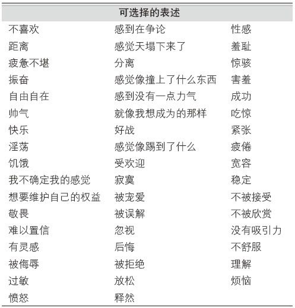

# 关于本书

> 书名：爱的博弈
>
> 作者：约翰·戈特曼、娜恩·西尔弗(美)
>
> 自我评分：★★★★
>
> 阅读时间：2020年10月

# 内容简介

适用于已婚、恋爱中的人士及希望提高人际交往技能的人群。

**两性关系，不是单方面的一厢情愿，而是双方的共同经营。**

# 内容摘要

## 信任困境

1.如果你不信任你的伴侣，就会改变对方而使自己利益最大化。同样，你的伴侣也希望改变你来达到其自私的目的。当你们缺乏信任时，就不会再考虑对方的利益了。

2.信任，不是一种在两个人之间生长的模糊不清的品质。当双方愿意为了对方的利益而改变自己的行为时，信任就产生了。亲密关系中的信任越多，对彼此的关爱就越多。

3.如果你不信任你的伴侣，就会改变对方而使自己利益最大化。同样，你的伴侣也希望改变你来达到其自私的目的。当你们缺乏信任时，就不会再考虑对方的利益了。

4.一段令人愉快的亲密关系对你的健康有益，而信任度低的婚姻会置人于死地。如果你感到自己的婚姻已经糟糕到了无可挽救的地步，结束它可以提升你的健康指数。

## 三种状态

1.美好盒子：美好盒子里装着积极的情绪和行为，比如兴趣、消遣、幽默、大笑、激动、愉悦、认同和同情。

中性盒子：中性盒子里装着那些既不积极也不消极的行为和情绪。双方在表达分歧时，可以保持平静。

糟糕盒子：糟糕盒子里装着所有消极行为，包括发火、指责、打架、威胁、防卫、悲伤、失望、恐惧、紧张、哀怨、恶心、消极抵制和轻视。

2.可信度：是指一个人有多愿意为一段关系牺牲自己，如果一对伴侣的信任度很高，他们的可信度往往也很高。

3.快乐的伴侣会更多地表现出那些能够得到高回报的行为（美好和中性的混合），最少地表现出低回报的行为（糟糕和糟糕、糟糕和中性的混合）。

4.一对伴侣在谈论过去的困难时是否能展现出正能量，并不完全在于他们面对的困难有多大，关键在于他们是如何阐述这些或积极或消极的事件的。

## 裂痕

第1步：“滑动门时刻”

当一个人表达出联结的需要时，另一个人的反应可以是拉开门走过去，也可以是关上门转身离开。这是发展亲密关系的关键时刻。

第2步：遗憾事件

滑动门时刻”演化成了遗憾事件。 再次强调，偶尔如此并不会毁掉婚恋关系。但如果在转身离开后却不能道歉并修复裂痕，伴侣间的关系就会朝着“捕鼠器”的方向跨出一大步。

第3步：蔡格尼克效应

我们对那些“未完成事项”的记忆力要比对那些已完成和终止的事件的强约两倍。在爱人之间，如果争吵能够以双方承认错误、改正错误和加强理解而告终，那么这段争吵很快就会被遗忘，换来更牢固而持久的婚恋关系。相反，如果在“滑动门时刻”招致了无法解决的遗憾事件，那么根据蔡格尼克效应，这段创伤就会活跃在记忆中，随时可能一遍又一遍地上演。

第4步：消极诠释

人们倾向于把中性甚至是积极的事件解读出消极的含义。这导致进入糟糕盒子的次数增加。 NSO的一般标志是倾向于从消极的角度去解读无害或者中性的评论。

第5步：四骑士的报复性破坏

阻碍关系的成功修复。它们分别是批评、蔑视、防御和筑墙。

## 背叛

首先，秘密出现了。当双方不再信任彼此，有了自己的秘密，冲突力量便蓄势待发。

接着，墙和窗的位置互换。对伴侣筑墙，对外面认识的异性开窗。

出轨者抛弃了伴侣和婚恋关系。当你和婚恋关系之外的人建立关系，你对长期婚恋关系的态度就会发生不可避免的转变。

背叛者认为伴侣不值得信任。伴侣出轨不是一夜之间的事，他们是在不知不觉中以一种缓慢到无法觉察的速度滑向这条不归之路的。从不再信任彼此，到找到新的知己，再到突破底线，婚恋关系本身才常常是导致外遇的原因。

10种走向背叛的方式是关系破裂的核心：

+ 不完全承诺。当一方催着另一方结婚或者同居、希望借此加深两人间的感情时，双方比较容易陷入不完全承诺的关系。在不想结婚时，结婚几乎永远都是错误的选择。
+ 精神出轨。如果你认为你的伴侣看到你和这个人的互动会感到不悦，或者因为你与其分享隐私而感到不安，那么这种亲密就是危险的。你正在调换你们牢固的婚恋关系中的墙和窗的位置去藏匿新的关系。如果你的伴侣发现了第三者发来的邮件，后果就会像须后水的痕迹或者床单上的香水味一样具有毁灭性。
+ 说谎：损耗信任的武器。
+ 反伴侣同盟：关系双面胶。联合自己的母亲对付自己的配偶。
+ 性欲减退
+ 轻视
+ 不公
+ 自私
+ 违背诺言

## 情绪协调和情绪指导

1.情绪协调：当伴侣能够深层次地相互理解，并能将这些理解用亲切的方式相互表达出来，真正的亲密就会从中产生。这种能力就是“情绪协调”。

2.试图通过转移注意力或者劝告孩子“忘了这件事吧”来改变孩子的感受。这种做法被我称为“情绪消除”（emotion dismissing）

3.情绪指导型的家长把孩子生气、恐惧、悲伤的情绪看作一种和孩子建立联系的机会，会去帮助孩子理解这些感受。

4.一些情绪消除型的伴侣在我们的研究中确实希望他们的伴侣到“一边”去难过。他们的回应不耐烦且不以为然，倾向于把伴侣描述为消极或者可怜的。他们把伴侣的情绪当作破坏自己情绪的负担，即使伴侣的难过和他们的关系无关。这样的伴侣就面临着严重的元情绪不匹配问题。

## 戈特曼-拉波波特蓝图

1.让其他人讲理去，你要做的是让你爱的人知道你站在他（她）的一边。你能理解和接受他（她）的情绪，并认为这些情绪是正当的——因为所有的情绪都是正当的。

2.记住吉诺特的名言：理解必须先于建议。我再进一步给你一个警告：如果对方没有问，根本不要给出建议。只要陪着他，倾听就是你能做出的最大贡献。

3.戈特曼-拉波波特蓝图：拉波波特提出，在促成对立双方开展合作时，如果你不能陈述对方的观点并且令其满意，就不要妄想说服对方、解决问题或达成共识。戈特曼-拉波波特蓝图将该理论用于说明婚恋关系。

4.在会议的一开始，要回顾最近你们之间发生过什么好事。强调正面、积极之事能化解许多紧张情绪，让你们双方都更愿意合作交流。

5.三条小建议：

+ 我的第一条建议是，语句一定要以“我”为重心。
+ 我的第二条建议是，一开始就点明你们要谈论的具体问题或事件，并且不要跑题。
+ 我的最后一条建议是，要仔细留意那些可能会刺激你伴侣情绪的因素。

6.如果你觉得自己在尊重对方观念方面存在困难，拉波波特的理论可能会对你有用。他发现，我们在与人争论时，往往倾向于把他人看作自己的对立面。 **我们认为自己的道德和品行都属上乘，而把对手贬低为道德败坏、品行不佳之人。**这一趋势被另一位社会心理学家弗里茨·海德（Fritz Heider）称为“基本归因错误”（fundamental attribution error）：“我人格高尚，你人格低劣。”

## 色情

1.色情场景几乎总专注于无感情和纯生理的内容。它们描述的是与浪漫无关、不带任何感情、随意的性行为。

2.在色情活动中，高潮则会增强人们与色情画面而不是伴侣的联系。这会让色情产品在消极对比中战胜伴侣。

## 性

1.在长期的婚恋关系中，情感上的疏远不能促进任何类型的性爱，它的作用恰恰相反。

2.女性认为性爱的快感在于亲密接触，而非高潮本身。

3.有研究指出，能和丈夫分享性爱感受的女性，对性生活感到满意的可能性是其他女性的5倍。

# 书的附录

## 亲密对话的4个补充技能

如果你不知该说些什么，试试下面的建议吧。

技能1：把感受转换成词语

技能2：提问

● 你现在感觉怎么样？

● 还有其他什么感觉？

● 你现在最需要什么？

● 实际上你最想要什么？

● 事情是怎么变成这样的？

● 你讲述的这些感受中最主要的是什么？

● 你现在最想说什么，对谁说？

● 你最怕想到的感觉是什么？

● 你有百味杂陈的感觉吗？是哪些？

● 你怎样看待自己的选择？

● 你的选择的优缺点各是什么？

● 你认为这影响了我们的关系或者别的关系吗？

● 你觉得自己过去应该做一些不一样的事吗？

● 你在这里承担着什么样的责任？

● 你是否要作出选择？什么样的选择？

● 你真正想问我的是什么？

● 你的价值观帮你作出了什么判断？

● 想一个你真正仰慕的人。在这种情况下他会怎么做，他会怎么看？

● 这种感觉和需求对于你来说有精神、道德、伦理或宗教层面的意义吗？是什么？

● 这里有任何人或事你想要反对吗？是谁或是什么？

● 这里有任何人或事让你仰慕吗？是谁或是什么？

● 你从这里学到了什么吗？是什么？

● 谁会成为这里受影响最深的人？他们会受什么影响？为什么？

● 这会让你想起以前经历过的其他事吗？是什么事？

● 现在提起这件事对你来说意味着什么？

● 这对你的自我认同和自我评价有什么影响？

● 这种情景对你有什么触动？

● 这种情景会让你发生什么改变？

● 你改变了多少？你正在发生多大的改变？这对你现在的处境有什么影响？

● 这些是怎么开始的？最开始的情况是怎样的？

● 你现在主要的反应或者抱怨是什么？

● 你觉得现在最该怪谁？

● 你觉得在接下来的5年里事情会怎样解决？

● 你希望在接下来的5年里怎样解决事情？

● 假设你现在只剩下6个月的生命。对你来说最重要的是什么？

● 你现在的目标是什么？

● 你觉得这件事是怎样融入你的整个生活的？

● 如果有的话，是什么让你这么生气？

● 你觉得“应该”怎样？（比如你应该承担什么责任？）

● 最让你感到扫兴的是什么？

● 你觉得自己身上有矛盾之处吗？哪些地方？

技能3：探求更多

● 告诉我事情的来龙去脉。

● 我想知道你的所有感觉。

● 对我说，我在听。

● 现在除了听你说话以外没什么更重要的事了。

● 我们有时间从头道来。

● 告诉我你最看重的是什么。

● 告诉我你现在需要什么。

● 告诉我你现在有什么选择。

● 不知道该做什么没关系，但来猜一下吧！

● 我想你已经很清楚了，请继续说吧。

● 告诉我你现在所有的感觉。

● 多说一点，让我多了解一些你现在的感受。

● 我想你现在已经想到一些解决办法了。告诉我你想到了什么。

● 你得帮助我了解怎样从你的角度看待这种情况。对你来说最重要的是什么？

● 告诉我你最关心的是什么。

● 告诉我你是怎样看待这种情况的。

● 告诉我你觉得你必须做出什么决定。

● 如果你能够改变在这种情况下某个关键人物的态度，你会怎么做。

技能4：表达共情

● 你非常重要。

● 我了解你的感觉。

● 你肯定感到特别绝望。

● 你说这个的时候，我能感到你特别绝望。

● 你遇到了麻烦。

● 我能感觉到你有多痛苦。

● 在你这么痛苦的时候，世界需要停一停。

● 你要是不用经历这一切该多好。

● 我站在你的一边。

● 我要是和你在一起就好了。

● 噢，听起来糟透了。

● 你一定觉得很无助吧。

● 我都不忍心听下去了。

● 我支持你。

● 我完全同意你的看法。

● 你肯定觉得麻烦缠身。

● 你说得完全正确。

● 听起来你被恶心到了。

● 怪不得你这么心烦。

● 我也这么觉得。

● 我想你是对的。

● 我能感受得到，你很痛苦。

● 要是没有这些事该多好。

● 那肯定烦死你了。

● 那肯定也会把我逼疯的。

● 那太让人恼火了。

● 听起来太让人沮丧。

● 好恐怖。

● 嗯，你说的我基本都同意。

● 我也会为这种事失望的。

● 这种事也会伤我的心。

● 我也会为这种事难受的。

● 可怜的宝贝儿。

● 噢！那肯定很让你伤心！

● 好吧，我想我懂了，所以你的感觉是……

● 所以你的意思是……

● 我也应付不了这种事。

● 我最欣赏你的地方是……

● 那会让我失去安全感。

● 听起来有点可怕。

## 冲突解决工具包

第1步：我现在的感受

第2步：我的需要

下面是常见的一些需要。承认你那时的所有感觉，共情地倾听伴侣的描述。

第3步：触发

什么会触动你们的按钮，增加你们的互动？

我感到：

第4步：承担责任

表达出你在这场争吵或者沟通不善的经历中承担了什么责任。

道歉：对不起，我……

总结：我对这种事件的特别贡献在于……

第5步：怎样把事情变得更好？

当类似问题再出现时，把你的伴侣应该做的事写下来？写下你自己能做的吧！