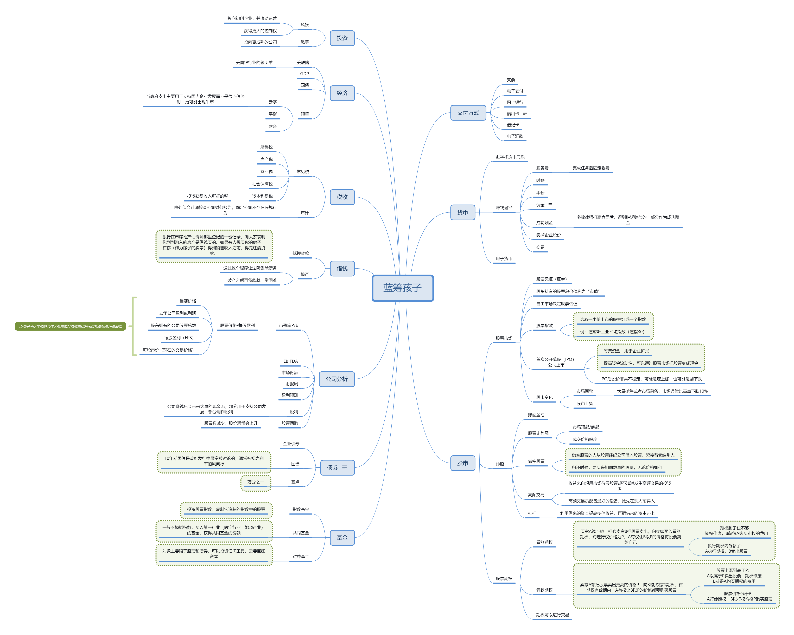

# 关于本书

> 书名：蓝筹孩子
>
> 作者：戴维·W.比安奇(美)
>
> 自我评分：★★★
>
> 阅读时间：2020年10月

# 内容简介

一本孩子和父母一起学习、认知的金融通识读本。

作为一个13岁孩子的父亲，作者看到一个令人沮丧的事实，他的儿子在学校没有学习任何关于金钱和投资的基础金融知识，于是他决定亲自教给孩子这项重要的人生技能。

书中通过生动真实的故事、切实可行的方法，以及简洁有趣的插画（出自17岁侄子之手），介绍了涉及金钱、储蓄与消费、信用卡、股票市场、股票买卖、期权、基金、债券、公司分析、借贷、税务、经济、私募与风投等热门的基础金融知识，让孩子从小就养成良好的储蓄和消费习惯，树立正确的金钱观和理财观。同时，父母也能在理财教育的过程中重新审视自己的各种理财行为，及时做出调整和修正。

# 思维导图

