# 一、计算机网络和因特网

# 二、应用层

## 应用层协议原理

### 客户端-服务器体系结构

> 两个要素：
>
> + 请求/响应
> + 固定IP地址

在**客户端-服务器体系结构**（client-server architecture）中，有一个总是打开的主机称作**服务器**，它服务于来自许多其他称为**客户**的主机的请求。当Web服务器接受到来自某客户对某对象的请求时，它向该客户所发送的请求的对象作为响应。（请求/响应）

客户-服务器体系结构的另个特征是该服务器具有固定的、周知的地址，该地址称为 IP 地址。（固定IP地址）

### P2P体系结构

应用程序在间断连接的主机对之间使用直接通信，这些主机对被称作对等方。

需要提及的是，某些应用具有混合的体系结构，它结合了客户端-服务器和P2P的元素。

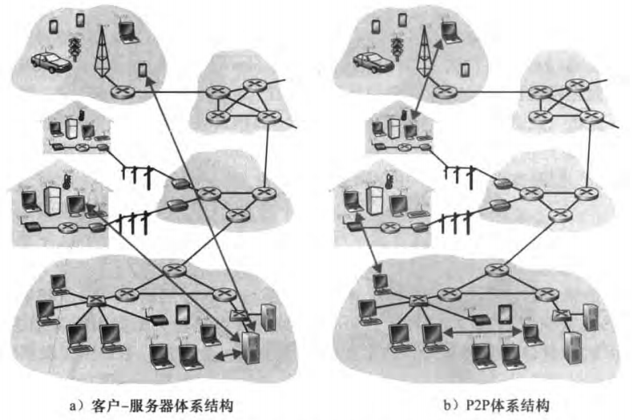

### 进程通信

1.客户和服务器进程

发起通信的进程被标识为客户，在会话开始时等待联系的进程是服务器

2.进程于计算机网络的接口

进程通过一个称为**套接字（sock­et）**的软件接口向网络发送报文和从网络接收报文。由于该套接字是建网络应用程序的可编程接口，因 此套接字也称为应用程序和网络之间的应用程序编程接口。应用程序开发者对千运输层的控制仅限于： ①选择运输层协议；② 也许能设定几个运输层参数，如最大缓存和最大报文段长度等。

3.进程寻址

①主机由IP地址标识；②目的端口号指定接收进程标识符

在因特网中，主机由其**IP地址**标识，目的地**端口号**则用于指定运行在接收主机上的接收进程。

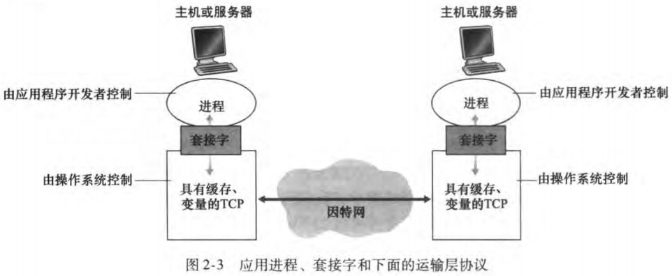

### 因特网提供的运输服务

#### TCP

+ **面向连接服务**：在应用层数据报文开始流动之前， TCP让客户和服务器互相交换运输层控制信息。在握手阶段后，一个**TCP连接**（TC connection）就在两个进程的套接字之间建立了。**全双工。**
+ **可靠数据传输服务**：通信进程能够依靠TCP，无差错、按适当顺序交付所有发送的数据。

+ TCP 协议还具有**拥塞控制机制**，当发送方和接收方之间的网络出现塞时TCP的拥控制机制会抑制发送进程（客户或服务器）

#### UDP服务

UDP 是一种不提供不必要服务的轻量级运输协议，它仅提供最小服务。**UDP 是无连接的，因此在两个进程通信前没有握手过程。**

|                  | TCP      | UDP                |
| ---------------- | -------- | ------------------ |
| 是否面向连接     | 面向连接 | 无连接             |
| 是否可靠数据传输 | 是       | 不可靠，轻量级传输 |
| 拥塞机制         | 有       | 无                 |

?> 总之，TCP有的UDP都没有，但UDP比TCP更轻量

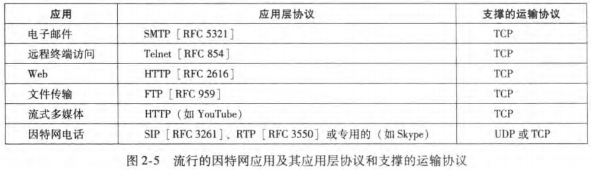

## Web和HTTP

### 持续连接和非持续连接

非持续连接：每个请求/响应对是经一个单独的TCP连接发送

持续连接：所有的请求及其响应应经过相同的TCP连接发送

#### 采用非持续连接的HTTP

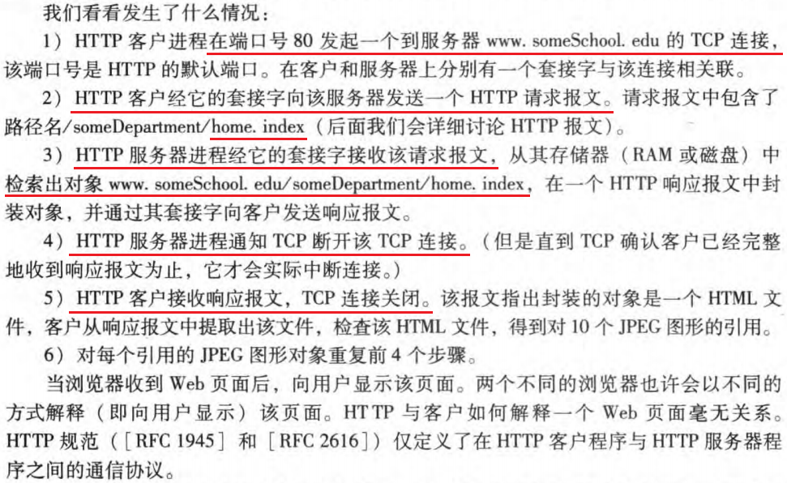

简单的讲过程如下：

客户发送TCP连接--->客户经过套接字发HTTP请求报文--->服务器接收请求报文，从存储器中检索URL执行的对象--->服务器通过套接字发送响应报文--->客户断开TCP连接

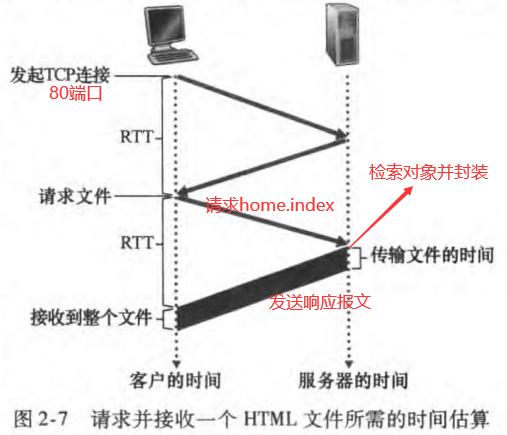

#### 持续连接的HTTP

非持续连接的缺点：

+ 必须为每个请求对象建立和维护一个全新的连接。每个连接客户端和服务器都要分配TCP缓冲区和保持TCP变量，都是负担。
+ 每个对象经受两倍RTT的交付时延，如上图所示

让多个对象（一个页面内的多个、多个页面）可以用单个持续TCP连接进行传送

### HTTP

#### 概括

Web的应用层协议是**超文本传输协议**（HyperText Transfer Protocol，HTTP）

对于`https://www.juejin.cn/events/all`

+ `www.juejin.cn`：主机名
+ `/events/all`：路径名

#### HTTP报文格式

HTTP报文通用格式，请求报文和响应报文格式相同：

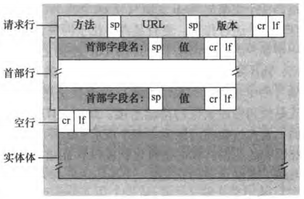

HTTP字段：

```bash
# 对象主机
Host: www.someschool.com
# 持续连接还是非持续连接
Connection: close
Connection: keep-alive
# 响应字段的长度
Content-Length: 6824
# 实体对象类型和字符编码
Content-Type: text/html; charset=utf-8
# 指明用户代理，向服务器发送请求的浏览器类型，即firefox
User-agent: Mozilla/5.0
# 该报文是由一台Apache Web服务器产生的
Server: Apache/2.2.3 (CentOS)
# 对象创建或者最后修改的日期和时间
Last-Modified: Tue, 18 Aug 2021 15:24:02 GMT
```

状态码：

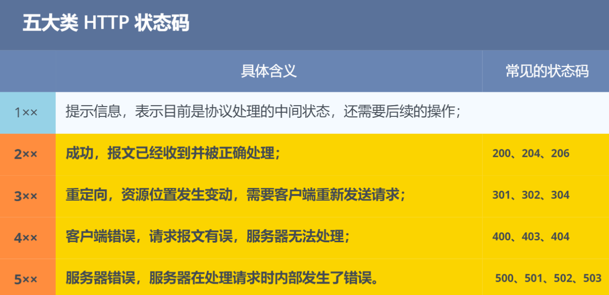

#### Cookie

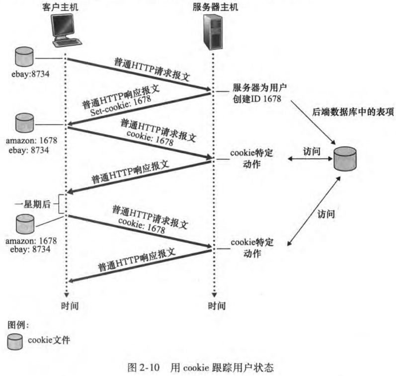

cookie 可以用于标识一个用户。用户首次访问一个站点时，可能需要提供一个用户标识（可能是名字）。在后继会话中，浏览器向服务器传递一个 cookie首部，从而向该服务器标识了用户。

#### Web缓存

Web缓存器 （Web cache）也叫代理服务器（proxy server）。**Web缓存器有自己的磁盘存储空间**，并在存储空间中保存最近请求过的对象的副本。

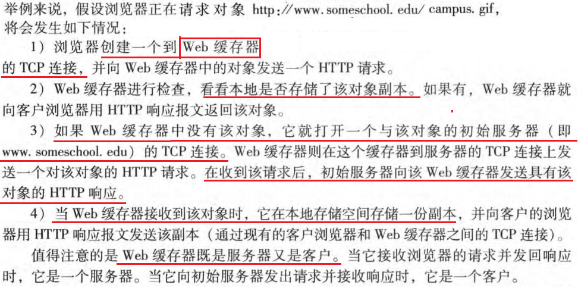

!> 缓存的基本原理都是通用的，类似于Cache

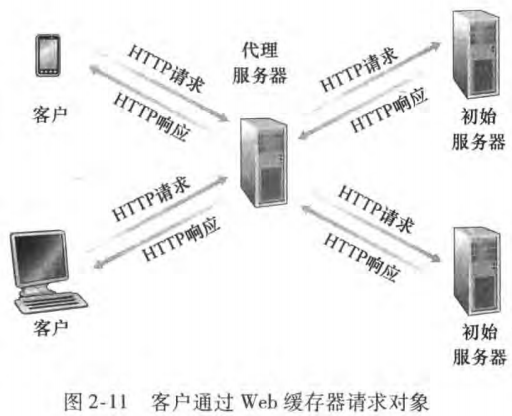

Web缓存的优点：

+ Web缓存器可以大大减少对客户请求的响应时间
+ Web缓存器能大大减少一个机构的接入链路到因特网的通信量

## 电子邮件

因特网电子邮件的组成：

+ 用户代理（user agent）
+ 邮件服务器（mail server）
+ 简单邮件传输协议（Simple Mail Transfer Protocol，SMTP）

每台邮件服务器上既运行SMTP客户端也运行SMTP的服务端

### SMTP

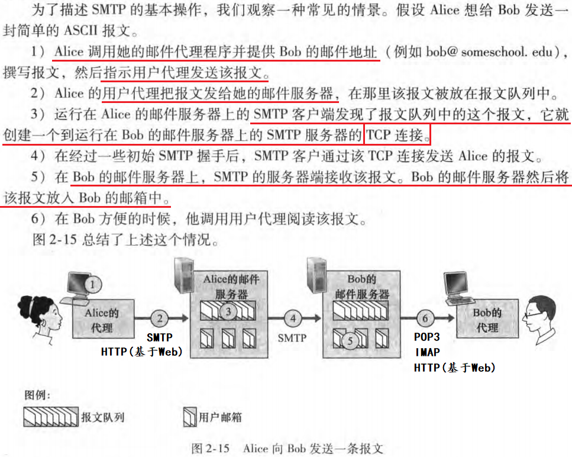

SMTP一般不使用中间邮件服务器发送邮件，即使这两个邮件服务器位于地球两端也是这样

### SMTP与HTTP的对比

相同：

+ SMTP和HTTP都使用持续连接

不同：

+ HTTP是个拉协议，即在方便的时候某些人在Web服务器上装载信息，用户使用HTTP从该服务器拉取这些信息；SMTP是个推协议，即发送邮件服务器把文件推向接收邮件服务器
+ SMTP要求每个报文（包括体）采用7比特ASCII码格式；HTTP数据则不受这种限制
+ HTTP把每个对象封装到它自己到HTTP响应报文中；SMTP则把所有报文对象放在一个报文中

### 邮件访问协议

> 这里暂且搁置，知道有就行

POP3、IMAP、HTTP

## DNS

### DNS的服务

域名系统：能进行**主机名到IP地址**转换的目录服务

DNS

+ 一个由分层的**DNS服务器**实现的**分布式数据库**
+ 一个使得主机能够查询分布式数据库的**应用层协议**
+ DNS协议**运行在UDP上，使用53端口**

为了使用户的主机能够将一个HTTP请求报文发送到Web服务器`www.someschool.edu`，该用户主机必须获得`www.someschool.edu`的IP地址，其做法如下：

1）同一台用户主机上运行着DNS应用的客户端

2）浏览器从上述URL中抽取出主机名`www.someschool.edu` ，并将这台主机名传给DNS应用的客户端

3）DNS客户向DNS服务器发送一个包含主机名的请求

4）DNS客户最终会收到一份回答报文，其中含有对应于该主机名的IP 地址。

5）一旦浏览器接收到来自DNS的该IP地址，它能够向位于该IP地址80 端口的HTTP服务器进程发起TCP连接

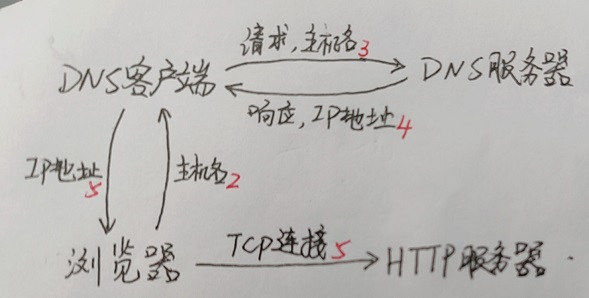

DNS的一些服务：

+ 主机别名
+ 邮件服务器别名
+ 负载均衡。DNS也用于在冗余服务器之间进行负载分配。由于这些冗余的Web服务器，**一个IP地址集合因此与同一规范主机名相联系。**

### 工作机理

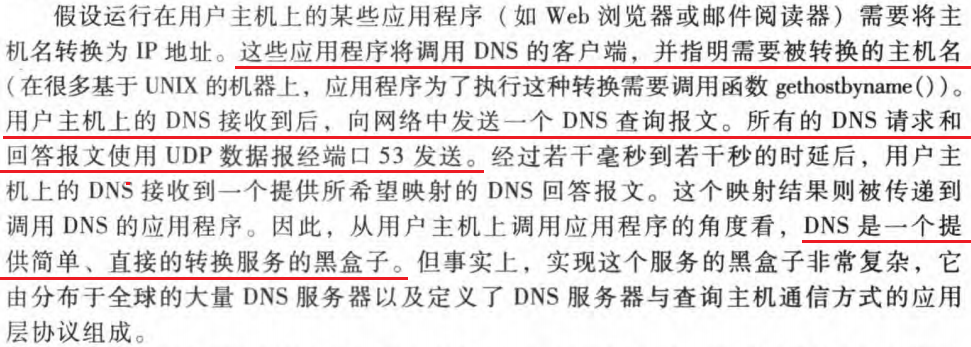

单个DNS服务器运行集中式数据库完全没有可扩展能力

#### 分布式、层次数据库

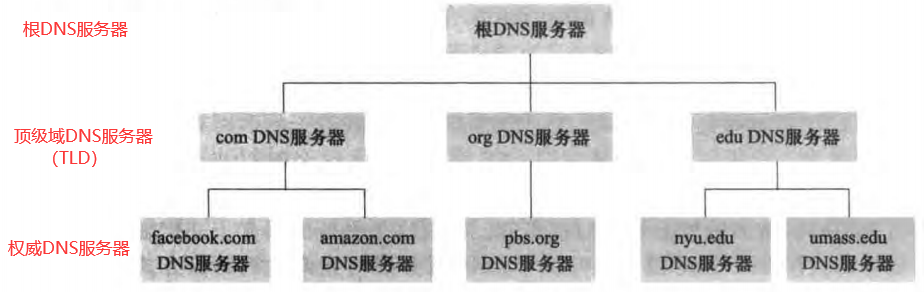

每个ISP都要一台本地DNS服务器，当主机与某个ISP连接时，该ISP提供一台主机的IP地址，该主机具有一台或多台其本地DNS服务器的IP地址（通常通过DHCP）

DNS服务器的交互，按照序号顺序进行：

> 这种方式被称作迭代查询，即广度优先搜索
>
> 另外有种链式DNS查询这里没有写出，是递归查询，深度优先搜索

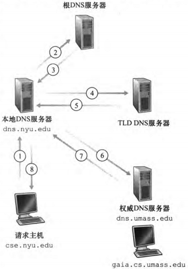

#### DNS缓存

一个请求链中，当某DNS服务器接收一个DNS回答（例如，包含某主机名到IP地址的映射）时，它能将映射缓存在本地存储器中。

### DNS报文

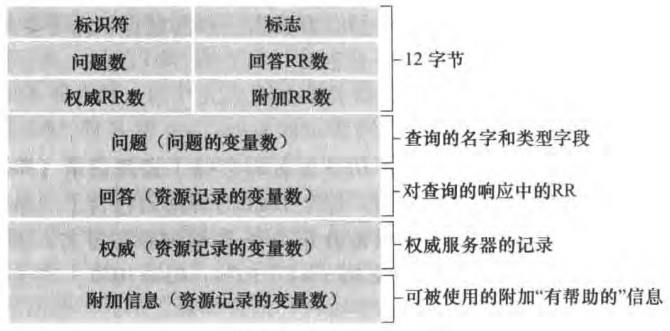

字段的解读如下：

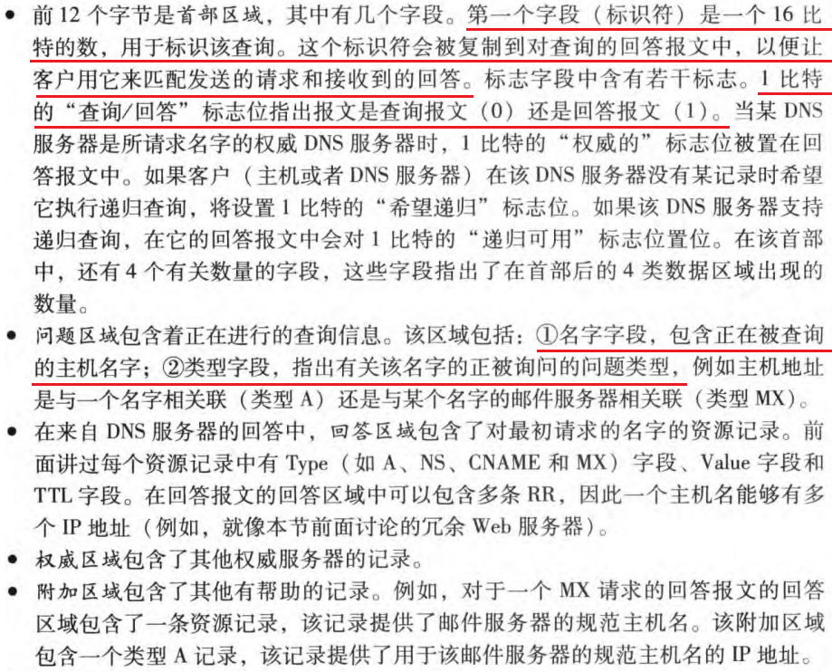

## 视频流和内容分发网

### HTTP流和DASH

**经HTTP的动态适应性流**（Dynamic Adaptive Streaming over HTTP，**DASH**）：视频编码为几个不同的版本，其中每个版本具有不同的比特率，对应不同的质量水平。客户动态地请求来自不同版本且长度为几秒的视频段数据块。

#### CDN

CDN管理分布在多个地理位置上的服务器，在它的服务器中存储视频的副本，并且所有试图将每个用户请求定向到一个将提供最好的用户体验的CDN位置。

CDN操作：

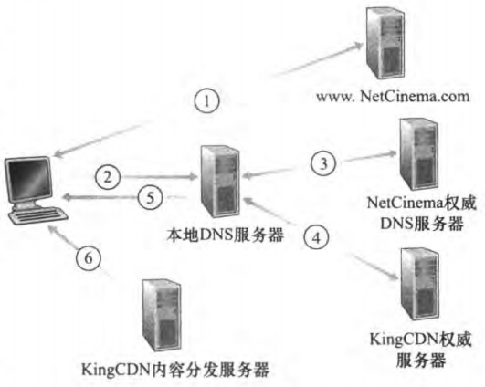

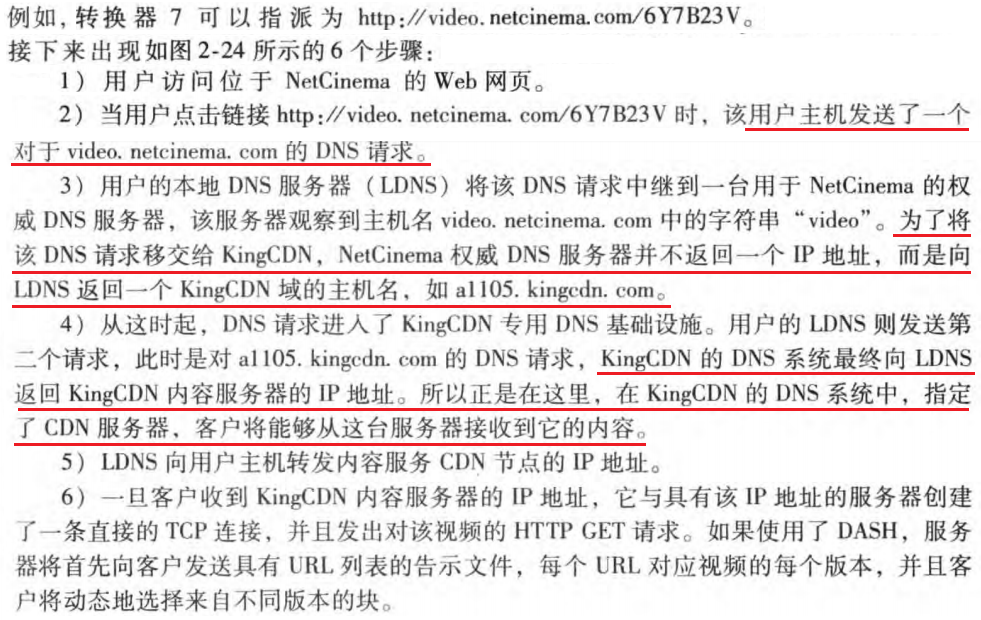

# 三、运输层

## 运输层概述

运输层协议为运行在不同 机上的应用进程之间提供了**逻辑通信**功能

网络路由器仅作用千该数据报的网络层字段 ；即它们不检查封装在该数据报的运输层报文段的字段。

在协议栈中，运输层刚好位于网络层之上。网络层提供了主机之间的逻辑通信，而运输层为运行在不同主机上的进程之间提供了逻辑通信。

UDP（用户数据报协议）：不可靠、无连接服务

TCP（传输控制协议）：可靠、面向连接服务

## 多路分解和多路复用

多路分解：将运输层报文段中的数据交付到正确的套接字

多路复用：在源主机从不同套接字中收集数据块，并为每个数据块封装上首部信息（这将在以后用于分解）从而生成报文段，然后将报文段传递到网络层。

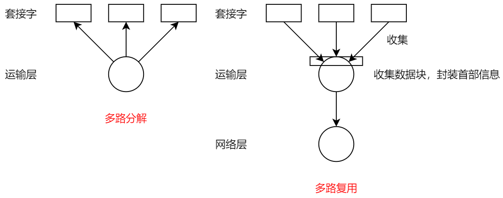

运输层输入实现分解服务？在主机上的**每个套接字能够分配一个端口号**，当报文段到达主机时，运输层检查报文段中的目的端口号，并将其定向到相应的套接字。

面向连接的多路分解和多路复用：

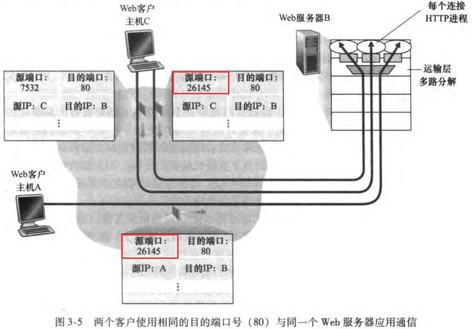

虽然源端口相同，但IP地址不同，也能被多路分解

## UDP

### UDP传输

UDP从应用进程得到数据，附加上用于多路分解/分解服务的源和目的端口号字段，以及两个其他的小字段，然后将形成的报文段交给网络层。

例子：

DNS报文---->UDP（添加首部）---->网络层（封装进IP数据报中）---->名字服务器

使用UPD的场景：

+ 无须连接建立。TCP在开始数据传输前要经过三次握手，UDP随时可以进行数据传输
+ 无连接状态
+ 分组首部开销小，每个TCP报文段都有20字节的首部开销，而UDP仅有8字节的开销
+ TCP的拥塞机制会导致因特网电话、视频会议之类的实时应用性能变差

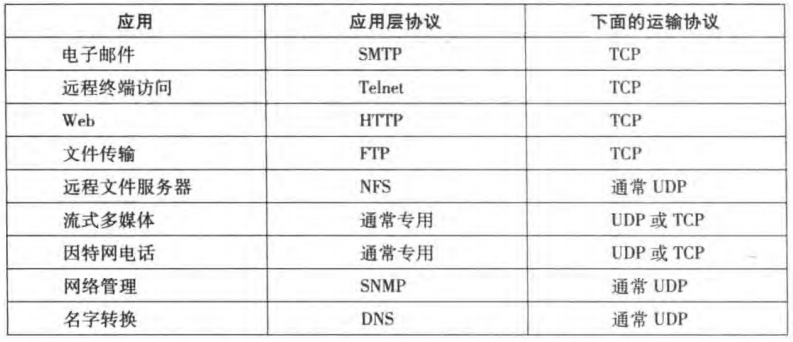

### 报文结构

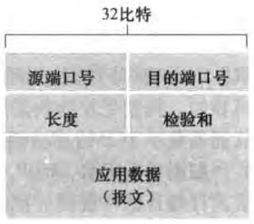

长度字段指示了在UDP报文段中的字节数。接收方使用校验和来检查该报文段中是否出现差错。

### UDP检验和

检验和用于确定当UDP报文段从源到达目的地移动时，其中的比特是否发生了改变

?> 只检错不纠错

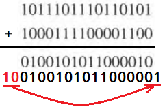

## 可靠传输原理

### rdt3.0（比特交替协议）

从发送方的观点来看，重传是一种万能灵药。发送方不知道是一个数据分组丢失，还是一个ACK丢失，或者只是该分组或ACK过度延时。在所有这些情况下，动作是同样的：重传

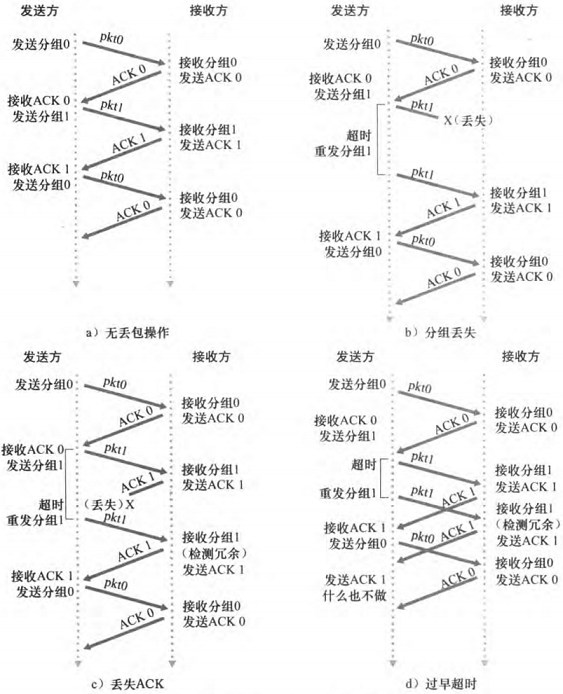

### 流水可靠数据传输协议

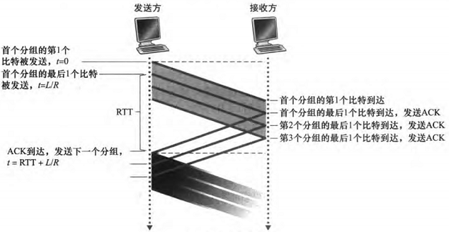

### 回退n步协议

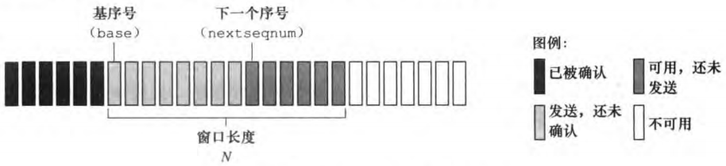

如果分组序号字段的比特数是k, 则该序号范围是[0, 2^k-1]

GBN发送方必须响应三种类型的事件：

+ 上层的调用
+ 收到一个ACK
+ 超时事件

!> 在GBN协议中，接收方丢弃所有失序的分组

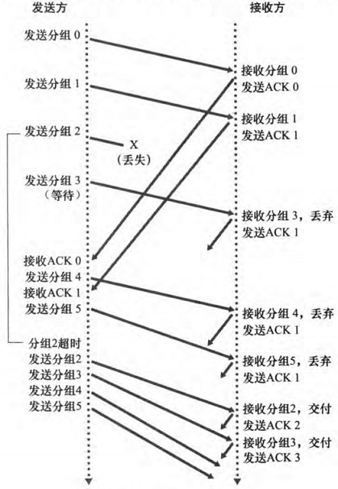

在接收方，分组2丢失，因此分组3、4和5被发现是失序分组并被丢弃

### 选择重传

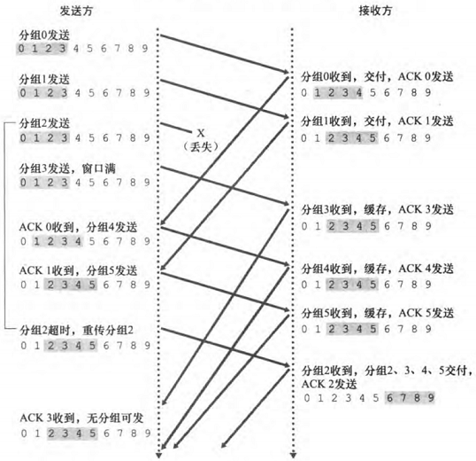

!> SR接收方窗口不能太大

SR接收方窗口太大的窘境，无法判断是一个新分组还是一次重传：

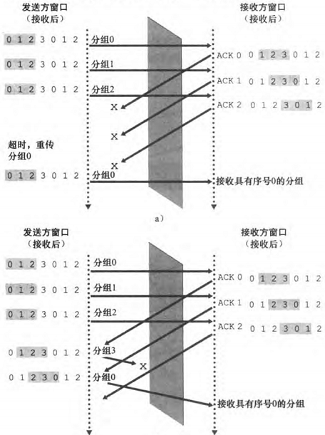

## TCP

### TCP连接

TCP是面向连接的，提供的是**全双工服务**。

客户首先发送一个特殊的TCP报文段，服务器用另一个特殊的TCP报文段来响应，最后，客户再用第三个特殊报文段作为响应。前两个报文段不承载“有效载荷”，也就是不包含应用层数据；而第三个报文段可以承载有效载荷。由于在这两台主机之间发送了3个报文段，所以这种连接建立过程常被称为**三次握手**。

TCP将数据引导到该连接的**发送缓存**里，发送缓存是发起三次握手期间设置的缓存之一。接下来TCP会不时从发送缓存里取出一块数据，并将数据传递到网络层。TCP可从缓存中取出并放入报文段中的数据数量受限于**最大报文段长度**（Maximum Segment Size，MSS）。

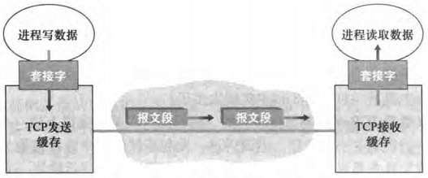

TCP为每块客户数据配上一个TCP首部，从而形成多个**TCP报文段**（TCP segment）。这些报文段被下传给网络层，网络层将其分别封装在网络层IP数据报中。然后这些IP数据报被发送到网络中。当TCP在另一端接收到一个报文段后，该报文段的数据就被放人该TCP连接的接收缓存中。

### TCP报文段结构

当TCP发送一个大文件时，例如某个Web页面上的一个图像时，TCP通常是将该文件划分成长度为MSS的若干快（最后一块除外，它通常小于MSS）

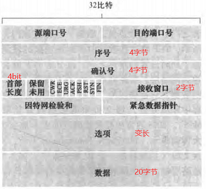

TCP字段的解释：

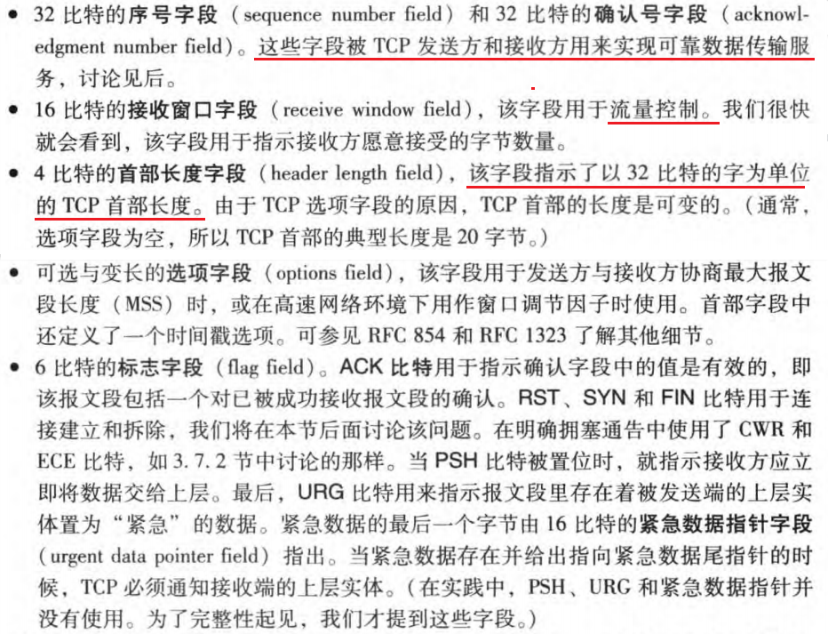

序号和确认号：

**TCP把数据看成一个无结构的、有序的字节流。**我们从TCP对序号的使用上可以看出这一点，因为序号是建立在传送的字节流之上，而不是建立在传送的报文段的序列之上。**一个报文段的序号（ sequence number for a segment）因此是该报文段首字节的字节流编号。**

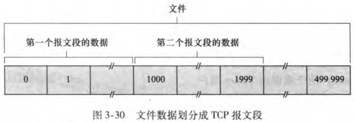


