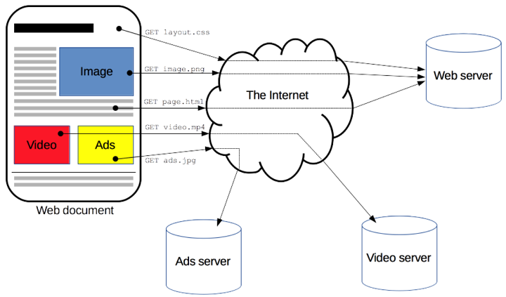
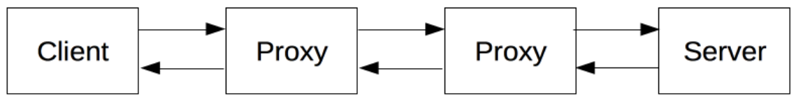
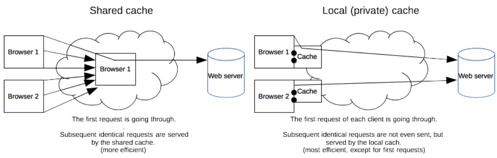
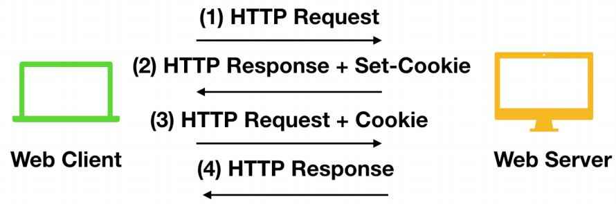
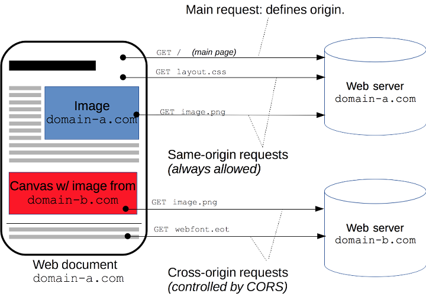
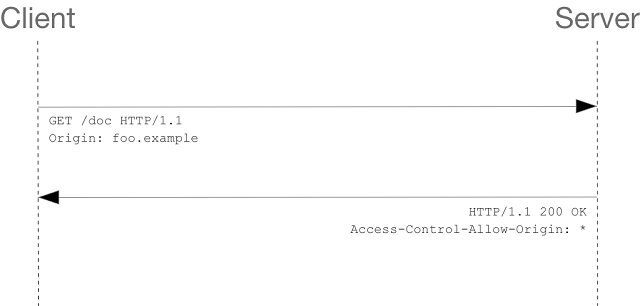
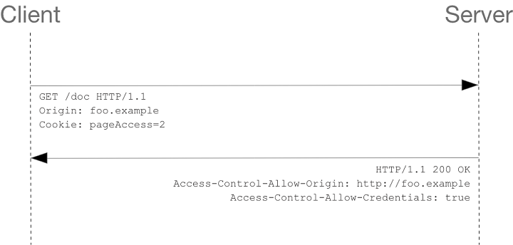

> 源文档：https://developer.mozilla.org/zh-CN/docs/Web/HTTP

# 一、HTTP概述

HTTP协议（HyperText Transfer Protocol，超文本传输协议）



## 基于HTTP的组件系统



发送请求Request，返回响应Responses

代理Proxies作用：

- 缓存（可以是公开的也可以是私有的，像浏览器的缓存）
- 过滤（像反病毒扫描，家长控制...）
- 负载均衡（让多个服务器服务不同的请求）
- 认证（对不同资源进行权限管理）
- 日志记录（允许存储历史信息）

## HTTP基本性质

+ 易读
+ 可扩展
+ 无状态、有会话的
  + HTTP是无状态的：在同一个连接中，两个执行成功的请求之间是没有关系的。
  + 使用HTTP的头部扩展，HTTP Cookies就可以解决这个问题。把Cookies添加到头部中，创建一个会话让每次请求都能共享相同的上下文信息，达成相同的状态。

!> 注意，HTTP本质是无状态的，使用Cookies可以创建有状态的会话。

+ HTTP是应用层协议，依赖传输层进行消息传递

在客户端（通常指浏览器）与服务器能够交互（客户端发起请求，服务器返回响应）之前，**必须在这两者间建立一个 TCP 链接**，打开一个 TCP 连接需要多次往返交换消息（因此耗时）。HTTP/1.0 默认为每一对 HTTP 请求/响应都打开一个单独的 TCP 连接。

+ 客户端和服务端进行信息交互
  + 连接TCP
  + 发送HTTP报文
  + 读取服务端返回的报文信息
  + 关闭连接

## HTTP报文

请求报文：


响应报文：


# 二、HTTP缓存

## 缓存种类

+ 浏览器缓存（私有）
+ 代理缓存（共享）
  + 例如：ISP 或你所在的公司可能会架设一个 web 代理来作为本地网络基础的一部分提供给用户。这样热门的资源就会被重复使用，减少网络拥堵与延迟。



常见的 HTTP 缓存只能存储 `GET`响应，对于其他类型的响应则无能为力。缓存的关键主要包括request method和目标URI

## 缓存控制

### Cache-control头

```bash
# 没有缓存
Cache-Control: no-store
# 缓存但重新验证
Cache-Control: no-cache
# 私有和公共缓存
Cache-Control: private
Cache-Control: public
# 过期
Cache-Control: max-age=31536000
# 验证方式
Cache-Control: must-revalidate
```

缓存但重新验证：每次有请求发出时，缓存会将此请求发到服务器，服务器端会验证请求中所描述的缓存是否过期，若未过期（注：实际就是返回304），则缓存才使用本地缓存副本。

私有和公共缓存："public" 表示该响应可以被任何中间人（比如中间代理、CDN等）缓存；"private"只有浏览器可以缓存。

过期：表示资源能够被缓存（保持新鲜）的最大时间。

验证方式：缓存在考虑使用一个陈旧的资源时，必须先验证它的状态，已过期的缓存将不被使用。

## 新鲜度


# 三、cookie和session

cookie：服务器发送到用户浏览器并保存在本地的一小块数据，它会在浏览器下次向同一服务器再发起请求时被携带并发送到服务器上。

Cookie 主要用于以下三个方面：

- 会话状态管理（如用户登录状态、购物车、游戏分数或其它需要记录的信息）
- 个性化设置（如用户自定义设置、主题等）
- 浏览器行为跟踪（如跟踪分析用户行为等）

## 创建cookie

### 请求与响应

服务器使用 `Set-Cookie`代理（一般是浏览器）发送 Cookie信息。

```bash
HTTP/1.0 200 OK
Content-type: text/html
Set-Cookie: yummy_cookie=choco
Set-Cookie: tasty_cookie=strawberry
```

现在，对该服务器发起的每一次新请求，浏览器都会将之前保存的Cookie信息通过 Cookie请求头部再发送给服务器。

```bash
GET /sample_page.html HTTP/1.1
Host: www.example.org
Cookie: yummy_cookie=choco; tasty_cookie=strawberry
```

### cookie生命周期

会话期 Cookie：浏览器关闭之后它会被自动删除

持久性 Cookie：取决于过期时间（`Expires`）或有效期（`Max-Age`）

```bash
Set-Cookie: id=a3fWa; Expires=Wed, 21 Oct 2015 07:28:00 GMT;
```

?> 当Cookie的过期时间被设定时，设定的日期和时间只与客户端相关，而不是服务端。

### 限制访问cookie

使用`Secure` 属性和`HttpOnly` 属性。

```bash
Set-Cookie: id=a3fWa; Expires=Wed, 21 Oct 2015 07:28:00 GMT; Secure; HttpOnly
```


### cookie作用域

`Domain` 和 `Path` 标识定义了Cookie的作用域：即允许 Cookie 应该发送给哪些URL。

Domain： 指定了哪些主机可以接受 Cookie。如果不指定，默认为 origin，**不包含子域名**。

> 例如，如果设置 `Domain=mozilla.org`，则 Cookie 也包含在子域名中（如`developer.mozilla.org`）。

Path：指定了主机下的哪些路径可以接受 Cookie。

> 例如，设置 `Path=/docs`，则以下地址都会匹配：
>
> - `/docs`
> - `/docs/Web/`
> - `/docs/Web/HTTP`

SameSite：Cookie 允许服务器要求某个 cookie 在跨站请求时不会被发送。

+ None：浏览器会在同站请求、跨站请求下继续发送 cookies，不区分大小写。
+ Strict：浏览器将只在访问相同站点时发送 cookie。
+ Lax：与 `Strict`类似，但用户从外部站点导航至URL时（例如通过链接）除外。 

### Document.cookie

```js
document.cookie = "yummy_cookie=choco";
document.cookie = "tasty_cookie=strawberry";
console.log(document.cookie);
// logs "yummy_cookie=choco; tasty_cookie=strawberry"
```

通过 JavaScript 创建的 Cookie 不能包含 HttpOnly 标志。

## 安全

!> 当机器处于不安全环境时，切记*不能*通过 HTTP Cookie 存储、传输敏感信息。使用诸如 JSON Web Tokens 之类的替代身份验证/机密机制。

缓解涉及Cookie的攻击的方法：

- 使用 `HttpOnly` 属性可防止通过 JavaScript 访问 cookie 值。
- `SameSite` 属性设置为`Strict` 或 `Lax`。

## Session

客户端请求服务端，服务端会为这次请求开辟一块内存空间，这个对象便是Session对象。Session弥补了 HTTP无状态特性。

服务器第一次接收到请求时，开辟了一块Session 空间（创建了Session对象)，同时生成一个`sessionld`，并通过响应头的`Set-Cookie: JSESSIONID=XXXXXXX`命令，向客户端发送要求设置Cookie的响应；客户端收到响应后，在本机客户端设置了一个`JSESSIONID=XXXXXXX`的Cookie信息，该Cookie 的过期时间为浏览器会话结束；




# 四、跨域资源共享

出于安全性，浏览器限制脚本内发起的跨源HTTP请求。



跨源资源共享标准新增了一组 HTTP 首部字段，允许服务器声明哪些源站通过浏览器有权限访问哪些资源。

## 控制场景

### 简单请求

- 使用下列方法之一：
  - GET
  - HEAD
  - POST
- 除了被用户代理自动设置的首部字段（例如 Connection ，User-Agent）和在 Fetch 规范中定义为 禁用首部名称 的其他首部，允许人为设置的字段为 Fetch 规范定义的 对 CORS 安全的首部字段集合。该集合为：
  - Accept
  - Accept-Language
  - Content-Language
  - Content-Type （需要注意额外的限制）
  - DPR
  - Downlink
  - Save-Data
  - Viewport-Width
  - Width
- Content-Type 的值仅限于下列三者之一：
  - text/plain
  - multipart/form-data
  - application/x-www-form-urlencoded
- 请求中的任意`XMLHttpRequestUpload`对象均没有注册任何事件监听器；`XMLHttpRequestUpload`对象可以使用 `XMLHttpRequest.upload`属性访问。
- 请求中没有使用`ReadableStream`对象。

比如说，假如站点`http://foo.example`的网页应用想要访问`http://bar.other`的资源。`http://foo.example`的网页中可能包含类似于下面的 JavaScript 代码：

```js
var invocation = new XMLHttpRequest();
var url = 'http://bar.other/resources/public-data/';

function callOtherDomain() {
  if(invocation) {
    invocation.open('GET', url, true);
    invocation.onreadystatechange = handler;
    invocation.send();
  }
}
```



分别检视请求报文和响应报文：

```bash
GET /resources/public-data/ HTTP/1.1
Host: bar.other
User-Agent: Mozilla/5.0 (Macintosh; U; Intel Mac OS X 10.5; en-US; rv:1.9.1b3pre) Gecko/20081130 Minefield/3.1b3pre
Accept: text/html,application/xhtml+xml,application/xml;q=0.9,*/*;q=0.8
Accept-Language: en-us,en;q=0.5
Accept-Encoding: gzip,deflate
Accept-Charset: ISO-8859-1,utf-8;q=0.7,*;q=0.7
Connection: keep-alive
Referer: http://foo.example/examples/access-control/simpleXSInvocation.html
# 请求来源
Origin: http://foo.example


HTTP/1.1 200 OK
Date: Mon, 01 Dec 2008 00:23:53 GMT
Server: Apache/2.0.61
# 该资源可以被任意外域访问
Access-Control-Allow-Origin: *
Keep-Alive: timeout=2, max=100
Connection: Keep-Alive
Transfer-Encoding: chunked
Content-Type: application/xml

[XML Data]
```

如果服务端仅允许来自`http://foo.example`的访问，该首部字段的内容如下：

```bash
Access-Control-Allow-Origin: http://foo.example
```

### 预检请求

```js
// 如下是一个需要执行预检请求的 HTTP 请求：
var invocation = new XMLHttpRequest();
var url = 'http://bar.other/resources/post-here/';
var body = '<?xml version="1.0"?><person><name>Arun</name></person>';

function callOtherDomain(){
  if(invocation)
    {
      invocation.open('POST', url, true);
      invocation.setRequestHeader('X-PINGOTHER', 'pingpong');
      invocation.setRequestHeader('Content-Type', 'application/xml');
      invocation.onreadystatechange = handler;
      invocation.send(body);
    }
}
```

上面的代码使用 POST 请求发送一个 XML 文档，该请求包含了一个自定义的请求首部字段（X-PINGOTHER: pingpong）。另外，该请求的 Content-Type 为 application/xml。因此，该请求需要首先发起“预检请求”。


OPTIONS 是 HTTP/1.1 协议中定义的方法，用以从服务器获取更多信息。该方法不会对服务器资源产生影响。 预检请求中同时携带了下面两个首部字段：

```bash
# 请求方法
Access-Control-Request-Method: POST
# 自定义首部
Access-Control-Request-Headers: X-PINGOTHER, Content-Type
```
响应预检请求，表明服务器将接受后续的实际请求：
```bash
# 运行的跨域地址
Access-Control-Allow-Origin: http://foo.example
# 服务器允许客户端使用 POST, GET 和 OPTIONS 方法发起请求
Access-Control-Allow-Methods: POST, GET, OPTIONS
# 服务器允许请求中携带字段 X-PINGOTHER 与 Content-Type
Access-Control-Allow-Headers: X-PINGOTHER, Content-Type
# 响应的有效时间为86400秒，也就是24小时。
Access-Control-Max-Age: 86400
```

### 附带身份凭证的请求

本例中，`http://foo.example`的某脚本向`http://bar.other`发起一个GET 请求，并设置 Cookies：

```js
var invocation = new XMLHttpRequest();
var url = 'http://bar.other/resources/credentialed-content/';

function callOtherDomain(){
    if(invocation) {
        invocation.open('GET', url, true);
        // withCredentials标志设置为true，从而向服务器发送Cookies
        invocation.withCredentials = true;
        invocation.onreadystatechange = handler;
        invocation.send();
    }
}
```

因为这是一个简单 GET 请求，所以浏览器不会对其发起“预检请求”。但是，如果服务器端的响应中未携带 `Access-Control-Allow-Credentials: true` ，浏览器将不会把响应内容返回给请求的发送者。



对于附带身份凭证的请求，服务器不得设置 `Access-Control-Allow-Origin` 的值为“`*`”。这是因为请求的首部中携带了 `Cookie` 信息，如果 `Access-Control-Allow-Origin` 的值为“`*`”，请求将会失败。而将 `Access-Control-Allow-Origin` 的值设置为 `http://foo.example`，则请求将成功执行。

## HTTP首部字段

### 响应

```bash
# 允许来自http://mozilla.com的请求
Access-Control-Allow-Origin: <origin> | *
Access-Control-Allow-Origin: http://mozilla.com
# 让服务器把允许浏览器访问的头放入白名单
Access-Control-Expose-Headers: X-My-Custom-Header, X-Another-Custom-Header
# 请求的结果能够被缓存多久
Access-Control-Max-Age: <delta-seconds>
# 指定了当浏览器的credentials设置为true时是否允许浏览器读取response的内容
Access-Control-Allow-Credentials: true
# 允许的HTTP方法
Access-Control-Allow-Methods: <method>[, <method>]*
# 用于预检请求的响应，指明了实际请求中允许携带的首部字段
Access-Control-Allow-Headers: <field-name>[, <field-name>]*
```

### 请求

```bash
# 表明预检请求或实际请求的源站
Origin: <origin>
# 允许的HTTP方法
Access-Control-Request-Method: <method>
# 用于预检请求，将实际请求所携带的首部字段告诉服务器
Access-Control-Request-Headers: <field-name>[, <field-name>]*
```

# 五、HTTP消息

请求与响应的相同和不同：


## 请求

### 起始行

+ HTTP方法：GET、PUT、POST
+ 请求目标，通常是URL
  + 绝对路径：`GET /background.pnd HTTP/1.0`
  + 完整URL：`GET http://developer.mozilla.org/en-US/docs HTTP/1.1`
  + 域名+端口，仅在使用 `CONNECT` 建立 HTTP 隧道时才使用：`CONNECT developer.mozilla.org:80 HTTP/1.1`
  + 通配符：`OPTIONS * HTTP/1.1`，代表整个服务器
+ HTTP版本

### Header


### Body

Body 大致可分为两类：

+ Single-resource bodies，由一个单文件组成。该类型 body 由两个 header 定义： Content-Type 和 Content-Length.
+ Multiple-resource bodies，由多部分 body 组成，每一部分包含不同的信息位。通常是和  HTML Forms 连系在一起。

## 响应

### 状态行

+ 协议版本，通常为`HTTP/1.1`
+ 状态码
+ 状态文本

```bash
HTTP/1.1 404 Not Found
```

### Headers


### Body

Body 大致可分为三类：

+ Single-resource bodies，由已知长度的单个文件组成。该类型 body 由两个 header 定义：Content-Type 和 Content-Length。
+ Single-resource bodies，由未知长度的单个文件组成，通过将 Transfer-Encoding 设置为 chunked 来使用 chunks 编码。
+ Multiple-resource bodies，由多部分 body 组成，每部分包含不同的信息段。但这是比较少见的。

## HTTP/2帧

HTTP/1.x 报文有一些性能上的缺点：

- Header 不像 body，它不会被压缩。
- 两个报文之间的 header 通常非常相似，但它们仍然在连接中重复传输。
- 无法复用。当在同一个服务器打开几个连接时：TCP 热连接比冷连接更加有效。

HTTP/2 引入了一个额外的步骤：它将 HTTP/1.x 消息分成帧并嵌入到流 (stream) 中。数据帧和报头帧分离，这将允许报头压缩。（多路复用）


# 六、HTTP/1.x 的连接管理

+ 短连接：每发起一个请求时都会创建一个新的连接，并在收到应答时立即关闭。
+ 长连接：它会保持连接去完成多次连续的请求，减少了不断重新打开连接的时间。
+ 流水线：多个连续的请求甚至都不用等待立即返回就可以被发送


# 七、HTTPS

HTTP是明文传输，不安全，因此有了HTTPS

HTTPS是HTTP协议的一种扩展，它本身不保障传输的安全性，使用**TLS(Transport Layer Security）或SSL(Secure Socket Layer）**对通信协议进行加密，即`HTTP+SSL(TLS)=HTTPS`

判断指标：

+ 加密
+ 数据一致性
+ 身份认证

> X.509介绍：https://www.imooc.com/article/288067?block_id=tuijian_wz

SSL/TLS通过将称为`X.509`证书的数字文档将网站和公司的实体信息绑定到加密密钥来进行工作。每一个密钥对（key pairs）都有一个私有密钥（private key）和公有密钥（public key），私有密钥是独有的，一般位于服务器上，用于解密由公共密钥加密过的信息；公有密钥是公有的，与服务器进行交互的每个人都可以持有公有密钥，用公钥加密的信息只能由私有密钥来解密。

TLS密码套件的格式：密钥交换算法–签名算法–对称加密算法–(分组模式)-摘要算法

```bash
# 使用ECDHE进行密钥交换
# 使用ECDSA进行签名和认证
# 使用AES作为对称加密算法，密钥长度是256位
# 使用GCM作为分组模式
# 使用SHA384作为摘要算法
ECDHE-ECDSA-AES256-GCM-SHA384
```

对称加密：加密和解密时使用的密钥是一样的

非对称加密（公钥加密）：公钥进行加密，私钥进行解密，或者反过来

摘要算法（如：MD5）：验证文件的完整性

认证：私钥加密，公钥解密，私钥只有你一个人有，可以看作独一无二的认证。

# 八、其他

## 请求方法

+ GET
+ POST
+ PUT
+ DELETE
+ HEAD
+ CONNECT
+ OPTIONS
+ TRACE
+ PATCH

## 响应码

> 可直接查看文档：https://developer.mozilla.org/zh-CN/docs/Web/HTTP/Status

常见的：

+ 200：响应成功
+ 301：
+ 302：
+ 304：
+ 404：访问页面不存在

## 标头

### 通用标头

#### Cache-Control

可缓存性：

+ `no-cache`：所有请求都会通过缓存服务器到达Web服务器
+ `no-store`：不存储缓存
+ `private`：私有缓存（浏览器缓存）
+ `public`：共有缓存（代理缓存）

缓存有效时间：

+ `max-age`：过期
  + max-age <= 缓存服务器缓存的时间：返回缓存数据
  + max-age > 缓存服务器缓存的时间：返回服务器数据
+ `s-maxage`：与`max-age`功能相同，但是不作用于私有缓存
+ `max-stale`：只能出现在请求中，表示客户端会接受缓存数据，即使过期也照常接收
+ `min-fresh`：

重写验证并加载：

+ `must-revalidate`：资源一旦过期，缓存就必须在原始服务器上没有成功验证的情况下才使用其过期的数据。
+ `proxy-revalidate`：

其他：

+ `only-if-cached`：客户端仅在缓存服务器本地缓存目标资源的情况下才会要求其返回
+ `no-transform`：无论是在请求还是响应中，缓存都不能改变实体主体的媒体类型

#### Connect

持久连接和非持久连接，默认是持久连接

```bash
# 持久连接
Connection: keep-alive
# 非持久连接
Connection: close
```

#### Date

```bash
Date: Wed, 21 Oct 2015 07:28:00 GMT
```

表示的是格林威治标准时间，这个时间要比北京时间慢八个小时

#### Transfer-Encoding

```bash
# 传输报文的编码方式
Transfer-Encoding: chunked
```

### 请求标头

### 响应标头

### 实体标头


