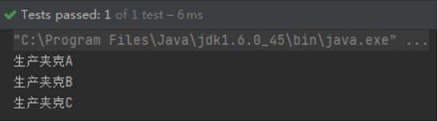
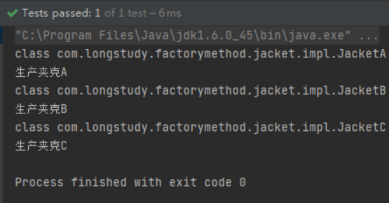
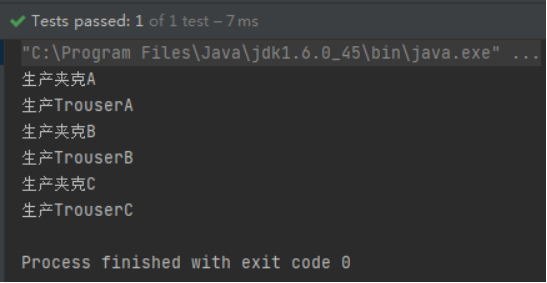
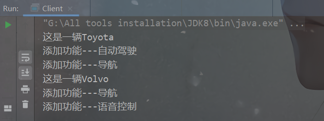
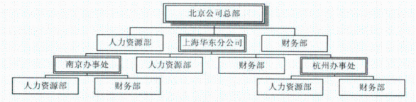
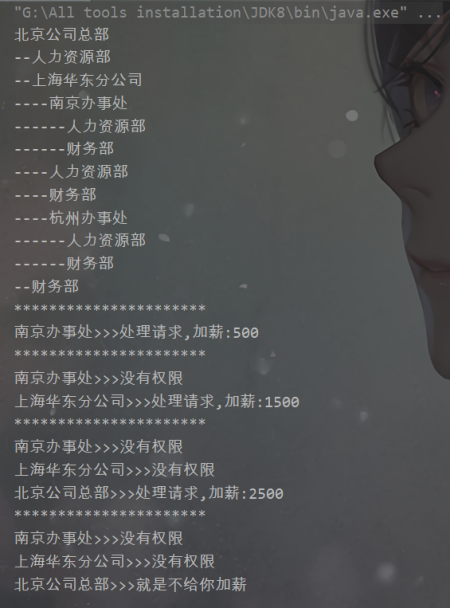
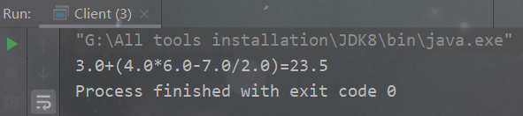

# 实验一：工程方法与抽象工厂模式

## 实验题目

利用工厂方法和抽象工厂模式模拟实现服装工厂生产衣服的过程，具体内容如下：

现有三种品牌A、B和C的夹克，分别利用简单工厂模式和工厂方法模式实现生产各种品牌夹克的代码（即打印“生产A品牌夹克”之类的句子即可）

A、B和C各品牌除了生产夹克，还可以再生产裤子，利用抽象工厂模式实现各品牌夹克与裤子生产过程。

## 目录结构

```bash
D:.
└─com
    └─longstudy
        ├─abstractfactory
        │  ├─factory
        │  │  │  AbstractFactory.java
        │  │  │
        │  │  └─impl
        │  │          AFactory.java
        │  │          BFactory.java
        │  │          CFactory.java
        │  │
        │  ├─jacket
        │  │  │  Jacket.java
        │  │  │
        │  │  └─impl
        │  │          JacketA.java
        │  │          JacketB.java
        │  │          JacketC.java
        │  │
        │  └─trouser
        │      │  Trouser.java
        │      │
        │      └─impl
        │              TrouserA.java
        │              TrouserB.java
        │              TrouserC.java
        │
        ├─factory
        │  │  JacketFactory.java
        │  │
        │  └─jacket
        │      │  Jacket.java
        │      │
        │      └─impl
        │              JacketA.java
        │              JacketB.java
        │              JacketC.java
        │
        └─factorymethod
            ├─factory
            │  │  JFactory.java
            │  │
            │  └─impl
            │          JacketAFractory.java
            │          JacketBFractory.java
            │          JacketCFractory.java
            │
            └─jacket
                │  Jacket.java
                │
                └─impl
                        JacketA.java
                        JacketB.java
                        JacketC.java
```

## 实验代码

### 简单工厂

```java
public interface Jacket {
    void printJacket();
}
```

```java
public class JacketA implements Jacket {
    @Override
    public void printJacket() {
        System.out.println("生产夹克A");
    }
}
```

```java
public class JacketB implements Jacket {
    @Override
    public void printJacket() {
        System.out.println("生产夹克B");
    }
}
```

```java
public class JacketC implements Jacket {
    @Override
    public void printJacket() {
        System.out.println("生产夹克C");
    }
}
```

```java
public class JacketFactory {
    public Jacket getJacket(String jacket){
        if(jacket==null){
            return null;
        }
        if (jacket.equals("A")){
            return new JacketA();
        }else if(jacket.equals("B")){
            return new JacketB();
        }else if(jacket.equals("C")){
            return new JacketC();
        }
        return null;
	}
}
```

测试：

```java
public class JacketFactory {
    public Jacket getJacket(String jacket){
        if(jacket==null){
            return null;
        }
        if (jacket.equals("A")){
            return new JacketA();
        }else if(jacket.equals("B")){
            return new JacketB();
        }else if(jacket.equals("C")){
            return new JacketC();
        }
        return null;
    }
}
```



### 工厂方法

```java
public interface JFactory {
    Jacket createJacket();
}
```

```java
public class JacketAFractory implements JFactory {
    @Override
    public Jacket createJacket() {
        return new JacketA();
    }
}
```

```java
public class JacketBFractory implements JFactory {
    @Override
    public Jacket createJacket() {
        return new JacketB();
    }
}
```

```java
public class JacketCFractory implements JFactory {
    @Override
    public Jacket createJacket() {
        return new JacketC();
    }
}
```

测试：

```java
public class MyTest2 {
    @Test
    public void factoryMethodTest(){
        JFactory afactoty = new JacketAFractory();
        Jacket a = afactoty.createJacket();
        System.out.println(a.getClass());
        a.printJacket();

        JFactory bfactoty = new JacketBFractory();
        Jacket b = bfactoty.createJacket();
        System.out.println(b.getClass());
        b.printJacket();

        JFactory cfactoty = new JacketCFractory();
        Jacket c = cfactoty.createJacket();
        System.out.println(c.getClass());
        c.printJacket();
    }
}
```



### 抽象工厂

```java
public abstract class AbstractFactory {
    public abstract Jacket getJacket();
    public abstract Trouser getTrouser();
}
```

```java
public class AFactory extends AbstractFactory {
    @Override
    public Jacket getJacket() {
        return new JacketA();
    }

    @Override
    public Trouser getTrouser() {
        return new TrouserA();
    }
}
```

```java
public class BFactory extends AbstractFactory {
    @Override
    public Jacket getJacket() {
        return new JacketB();
    }

    @Override
    public Trouser getTrouser() {
        return new TrouserB();
    }
}
```

```java
public class CFactory extends AbstractFactory {
    @Override
    public Jacket getJacket() {
        return new JacketC();
    }

    @Override
    public Trouser getTrouser() {
        return new TrouserC();
    }
}
```

测试：

```java
public class MyTest3 {
    @Test
    public void abstractFactoryTest(){
        try{
            AbstractFactory afactory = new AFactory();
            afactory.getJacket().printJacket();
            afactory.getTrouser().trouserPrint();
            AbstractFactory bfactory = new BFactory();
            bfactory.getJacket().printJacket();
            bfactory.getTrouser().trouserPrint();
            AbstractFactory cfactory = new CFactory();
            cfactory.getJacket().printJacket();
            cfactory.getTrouser().trouserPrint();
        }catch (NullPointerException e){
            e.printStackTrace();
        }
    }
}
```



# 实验二：生成器模式与原型模式的编程实现

## 实验题目

使用生产器模式模拟实现IBM电脑的生产，其中IBM电脑的主要结构用如下表示：

```c++
class IBM{
	string monitor = "IBM的显示器";
    string keyboard = "IBM的键盘";
    string mouse = "IBM的鼠标";
    Motherboard* MB;
    void display();
}
```

其中MB是一个主板类，其主要接哦股如下：

```c++
class Motherboard{
    string CPU;
    string RAM;
}
```

即主板包含CPU和RAM，display是一个打印各个组件的函数，主要用于检查是否生产正确。

建造顺序为先生产主板，再一次生产显示器、键盘、鼠标。

使用生产器模式生产出第一台IBM电脑后，利用原型模式，将该电脑再赋值两台。

## 目录结构

```bash
│  Director.java
│  IBMProduct.java
│  Main.java
│  Motherboard.java
└─builder
        Builder.java
        ConcreteBuilderPlan.java
```

## 实验代码

Motherboard类：

```java
public class Motherboard {
    private String CPU;
    private String RAM;

    public Motherboard() {
    }

    public Motherboard(String CPU, String RAM) {
        this.CPU = CPU;
        this.RAM = RAM;
    }

    @Override
    public String toString() {
        return "Motherboard{" + CPU + "," + RAM  + '}';
    }

    public Motherboard clone(){
        Motherboard motherboard = new Motherboard();
        motherboard.setCPU(this.CPU);
        motherboard.setRAM(this.RAM);
        return motherboard;
    }

    public String getCPU() {
        return CPU;
    }

    public void setCPU(String CPU) {
        this.CPU = CPU;
    }

    public String getRAM() {
        return RAM;
    }

    public void setRAM(String RAM) {
        this.RAM = RAM;
    }
}
```

IBMProduct：

```java
public class IBMProduct {
    private String monitor;
    private String keyboard;
    private String mouse;
    private Motherboard MB;

    public IBMProduct() {
    }

    public IBMProduct clone(){
        IBMProduct ibmProduct = new IBMProduct();
        ibmProduct.setKeyboard(this.keyboard);
        ibmProduct.setMonitor(this.monitor);
        ibmProduct.setMouse(this.mouse);
        Motherboard mb = MB.clone();
        ibmProduct.setMB(mb);
        return ibmProduct;
    }

    public void show() {
        System.out.println("IBM product:");
        System.out.println(this.MB.getCPU()+","+this.MB.getRAM());
        System.out.println(this.monitor);
        System.out.println(this.keyboard);
        System.out.println(this.mouse);
    }

    public void setMonitor(String monitor) {
        this.monitor = monitor;
    }

    public void setKeyboard(String keyboard) {
        this.keyboard = keyboard;
    }

    public void setMouse(String mouse) {
        this.mouse = mouse;
    }

    public void setMB(Motherboard MB) {
        this.MB = MB;
    }
}
```

Builder接口：

```java
public interface Builder {
    void BuildMonitor();
    void BuildKeyboard();
    void BuildMouse();
    void BuildMotherBoard();
    default IBMProduct getResult(){
        return null;
    }
}
```

Builder接口的实现类：

```java
public class ConcreteBuilderPlan implements Builder {
    private IBMProduct product = new IBMProduct();

    @Override
    public void BuildMonitor() {
        product.setMonitor("IBM----显示器");
    }

    @Override
    public void BuildKeyboard() {
        product.setKeyboard("IBM----显示器");
    }

    @Override
    public void BuildMouse() {
        product.setMouse("IBM----鼠标");
    }

    @Override
    public void BuildMotherBoard() {
        Motherboard motherboard = new Motherboard();
        motherboard.setCPU("IBM----CPU");
        motherboard.setRAM("IBM----RAM");
        product.setMB(motherboard);
    }

    @Override
    public IBMProduct getResult() {
        return product;
    }
}
```

指挥者类：

```java
public class Director {
    public void construct(Builder builder){
        builder.BuildMotherBoard();
        builder.BuildMonitor();
        builder.BuildKeyboard();
        builder.BuildMouse();
    }
}
```

测试：

```java
public class Main {
    public static void main(String[] args) {
        Director director = new Director();
        ConcreteBuilderPlan concreteBuilderPlan = new ConcreteBuilderPlan();
        director.construct(concreteBuilderPlan);
        IBMProduct result = concreteBuilderPlan.getResult();
        result.show();

        System.out.println("*************原型模式***************");

        IBMProduct clone = result.clone();
        clone.setMouse("惠普----鼠标");
        clone.setKeyboard("华硕----键盘");
        clone.setMouse("惠普----鼠标");
        clone.setMB(new Motherboard("英特尔----CPU","AMD----RAM"));
        clone.show();

        System.out.println("*************原型模式2***************");

        IBMProduct clone2 = result.clone();
        clone2.setMouse("AMD----鼠标");
        clone2.setKeyboard("AMD----键盘");
        clone2.setMonitor("AMD----键盘");
        clone2.setMouse("AMD----鼠标");
        clone2.setMB(new Motherboard("AMD----CPU","AMD----RAM"));
        clone2.show();
    }
}
```

# 实验三：装饰模式的编程实现

## 实验题目

利用工厂方法模式实例化两个汽车类，例如丰田和沃尔沃。

对于这两种初始的汽车类（丰田和沃尔沃），利用装饰模式分别给它们添加新功能，其中丰田可以导航和自动驾驶，沃尔沃可以导航和语音控制。

## 目录结构

```bash
G:.
│  Client.java
├─car
│      Car.java
│      Toyota.java
│      Volvo.java
├─decorator
│      NewToyota.java
│      NewVolvo.java
│      ToyotaDecorator.java
│      VolvoDecorator.java
└─factory
        CarFactory.java
        ToyotaFactory.java
        VolvoFactory.java
```

## 实现代码

实例：

```java
public interface Car {
    void printCar();
}
```

```java
public class Toyota implements Car {
    @Override
    public void printCar() {
        System.out.println("这是一辆Toyota");
    }
}
```

```java
public class Volvo implements Car {
    @Override
    public void printCar() {
        System.out.println("这是一辆Volvo");
    }
}
```

工厂：

```java
public interface CarFactory {
    Car createCar();
}
```

```java
public class ToyotaFactory implements CarFactory {
    @Override
    public Toyota createCar() {
        return new Toyota();
    }
}
```

```java
public class VolvoFactory implements CarFactory{
    @Override
    public Volvo createCar() {
        return new Volvo();
    }
}
```

装饰器：

```java
public interface NewToyota extends Car {
    // 导航
    void navigation();
    // 自动驾驶
    void autopilot();
}
```

```java
public interface NewVolvo extends Car {
    // 导航
    void navigation();
    // 语音控制
    void voiceControl();
}
```

```java
public class ToyotaDecorator implements NewToyota {
    private final Car car;

    public ToyotaDecorator(Car car) {
        this.car = car;
    }

    @Override
    public void navigation() {
        System.out.println("添加功能---导航");
    }

    @Override
    public void autopilot() {
        System.out.println("添加功能---自动驾驶");
    }

    @Override
    public void printCar() {
        car.printCar();
    }
}
```

```java
public class VolvoDecorator implements NewVolvo {
    private final Car car;

    public VolvoDecorator(Car car) {
        this.car = car;
    }

    @Override
    public void navigation() {
        System.out.println("添加功能---导航");
    }

    @Override
    public void voiceControl() {
        System.out.println("添加功能---语音控制");
    }

    @Override
    public void printCar() {
        car.printCar();
    }
}
```

客户端调用：

```java
public class Client {
    public static void main(String[] args) {
        /**
         * 丰田
         */
        // 工厂生产
        ToyotaFactory toyotaFactory = new ToyotaFactory();
        Toyota toyota = toyotaFactory.createCar();
        // 装饰
        ToyotaDecorator toyotaDecorator = new ToyotaDecorator(toyota);
        toyotaDecorator.printCar();
        toyotaDecorator.autopilot();
        toyotaDecorator.navigation();
        /**
         * 沃尔沃
         */
        VolvoFactory volvoFactory = new VolvoFactory();
        Volvo volvo = volvoFactory.createCar();

        VolvoDecorator volvoDecorator = new VolvoDecorator(volvo);
        volvoDecorator.printCar();
        volvoDecorator.navigation();
        volvoDecorator.voiceControl();
    }
}
```



# 实验四：组合模式与责任链模式

## 实验题目

根据下图，利用组合模式构建该公司的结构。



即总公司下设上海华东分公司，华东分公司下设南京办事处和杭州办事处。其中，各级分公司均设有人力资源部和财务部。

利用组合模式构建好该结构后，利用职责链模式处理各地员工加薪请求。

例如，一南京员工提出加薪请求，如果加薪不超过1000元，南京办事处即可批准；如果超过1000元，则上报华东分公司，如果2000元以内，则批准；超过则上报北京总公司，如果不超过3000元，则总公司批准，否则拒绝。

## 实验代码

```java
public interface Component {
    void add(Component c);
    void remove(Component c);
    void print(int depth);
    void handlerRequest(int request);
}
```

```java
public class Department implements Component{
    private String name;
    // 最低工资和最高工资区间
    private int low;
    private int high;
    private Component successor;
    private List<Component> departmentsList = new LinkedList<>();

    public Department() { }

    public Department(String name) {
        this.name = name;
    }

    // 设置薪资上下限
    public void setBound(int low,int high){
        this.low=low;
        this.high=high;
    }

    public void setSuccessor(Component c){
        this.successor=c;
    }

    @Override
    public void add(Component c) {
        this.departmentsList.add(c);
    }

    @Override
    public void remove(Component c) {
        this.departmentsList.remove(c);
    }

    // 递归打印构建的树
    public void print(int depth){
        for(int i=1;i<=depth;i++){
            System.out.print("--");
        }
        System.out.println(this.name);
        for (Component department : departmentsList) {
            department.print(depth+1);
        }
    }

    @Override
    public void handlerRequest(int request) {
        if(request>=low && request<=high){
            System.out.println(this.name+">>>处理请求,加薪:"+request);
        }else if(successor!=null){
            System.out.println(this.name+">>>没有权限");
            successor.handlerRequest(request);
        }else{
            System.out.println(this.name+">>>就是不给你加薪");
        }
    }
}
```

客户端测试：

```java
public class Client {
    public static void main(String[] args) {
        Department node1 = new Department("北京公司总部");
        Department node2 = new Department("人力资源部");
        Department node3 = new Department("上海华东分公司");
        Department node4 = new Department("财务部");
        Department node5 = new Department("南京办事处");
        Department node6 = new Department("杭州办事处");
        // 构建树
        node1.add(node2);
        node1.add(node3);
        node1.add(node4);
        node3.add(node5);
        node3.add(node2);
        node3.add(node4);
        node3.add(node6);
        node5.add(node2);
        node5.add(node4);
        node6.add(node2);
        node6.add(node4);
        node1.print(0);
        // 构建责任链
        node5.setSuccessor(node3);
        node6.setSuccessor(node3);
        node3.setSuccessor(node1);
        // 设置加薪边界
        node5.setBound(0,1000);
        node6.setBound(0,1000);
        node3.setBound(1000,2000);
        node1.setBound(2000,3000);
        // 请求加薪
        System.out.println("**********************");
        node5.handlerRequest(500);
        System.out.println("**********************");
        node5.handlerRequest(1500);
        System.out.println("**********************");
        node5.handlerRequest(2500);
        System.out.println("**********************");
        node5.handlerRequest(3500);
    }
}
```



# 实验五：解释器模式

## 实验题目

利用解释器模式，打印并计算实现浮点数的四则运算

例如：3+(4*6-(7/2))=23.5

## 目录结构

```bash
G:.
│  Client.java
└─expression
    │  Context.java
    │  Expression.java
    │  Variable.java
    └─impl
            AddExpression.java
            Bracket.java
            DivExpression.java
            MulExpression.java
            SubExpression.java
```

## 实验代码

声明抽象类：

```java
public abstract class Expression {
    /**
     * 解析
     * @param con 变量对象-数字
     * @return 数字
     */
    public abstract double interpreter(Context con);

    /**
     * 打印
     * @param con 变量对象-数字
     */
    public abstract void display(Context con);
}
```

变量封装：

```java
public class Variable extends Expression {
    @Override
    public double interpreter(Context con) {
        return con.LookupValue(this);
    }

    @Override
    public void display(Context con) {
        System.out.print(con.LookupValue(this));
    }
}
```

```java
public class Context {
    private Map<Variable,Double> valueMap = new HashMap<>();

    /**
     * 将变量存放到HashMap中以便后面的运算
     * @param x 变量对象
     * @param y 数字
     */
    public void addValue(Variable x,double y){
        valueMap.put(x, y);
    }

    /**
     * 获取变量x对应的映射的数字
     * @param x 变量对象
     * @return 获取的数字
     */
    public double LookupValue(Variable x){
        return valueMap.get(x);
    }
}
```

具体实现的加减乘除括号操作：

```java
public class AddExpression extends Expression{
    private Expression left;
    private Expression right;

    public AddExpression(Expression left, Expression right) {
        this.left = left;
        this.right = right;
    }

    /**
     * 将变量对象解析成数字后进行运算
     * @param con 变量对象-数字
     * @return
     */
    @Override
    public double interpreter(Context con) {
        return left.interpreter(con)+right.interpreter(con);
    }

    @Override
    public void display(Context con) {
        left.display(con);
        System.out.print("+");
        right.display(con);
    }
}
```

```java
public class SubExpression extends Expression{
    private Expression left;
    private Expression right;

    public SubExpression(Expression left, Expression right) {
        this.left = left;
        this.right = right;
    }

    @Override
    public double interpreter(Context con) {
        return left.interpreter(con)-right.interpreter(con);
    }

    @Override
    public void display(Context con) {
        left.display(con);
        System.out.print("-");
        right.display(con);
    }
}
```

```java
public class MulExpression extends Expression {
    private Expression left;
    private Expression right;

    public MulExpression(Expression left, Expression right) {
        this.left = left;
        this.right = right;
    }

    @Override
    public double interpreter(Context con) {
        return left.interpreter(con)*right.interpreter(con);
    }

    @Override
    public void display(Context con) {
        left.display(con);
        System.out.print("*");
        right.display(con);
    }
}
```

```java
public class DivExpression extends Expression {
    private Expression left;
    private Expression right;

    public DivExpression(Expression left, Expression right) {
        this.left = left;
        this.right = right;
    }

    @Override
    public double interpreter(Context con) {
        return (1.0*left.interpreter(con))/right.interpreter(con);
    }

    @Override
    public void display(Context con) {
        left.display(con);
        System.out.print("/");
        right.display(con);
    }
}
```

```java
/**
 * 括号解析
 * @author Jonny Long
 * @date 2021/6/17 9:15
 */
public class Bracket extends Expression {
    private Expression exp;

    public Bracket(Expression exp) {
        this.exp = exp;
    }

    @Override
    public double interpreter(Context con) {
        return exp.interpreter(con);
    }

    @Override
    public void display(Context con) {
        System.out.print("(");
        exp.display(con);
        System.out.print(")");
    }
}
```

客户端测试：

```java
public class Client {
    public static void main(String[] args) {
        Expression exp;
        Context con = new Context();
        Variable a = new Variable();
        Variable b = new Variable();
        Variable c = new Variable();
        Variable d = new Variable();
        Variable e = new Variable();
        con.addValue(a,3);
        con.addValue(b,4);
        con.addValue(c,6);
        con.addValue(d,7);
        con.addValue(e,2);
        exp = new AddExpression(a,new Bracket(new SubExpression(new MulExpression(b,c),new DivExpression(d,e))));
        exp.display(con);
        System.out.print("="+exp.interpreter(con));
    }
}
```



