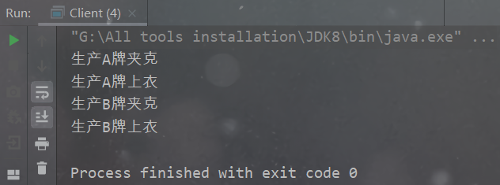
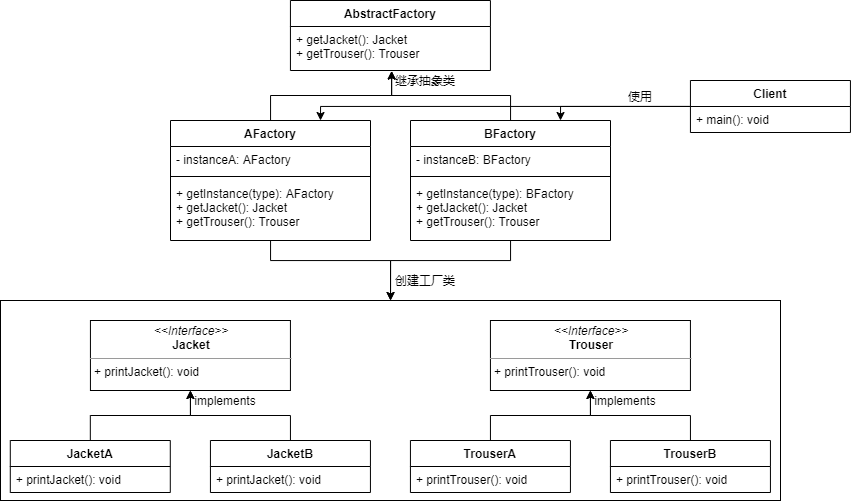
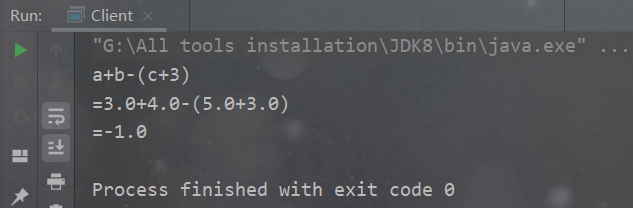
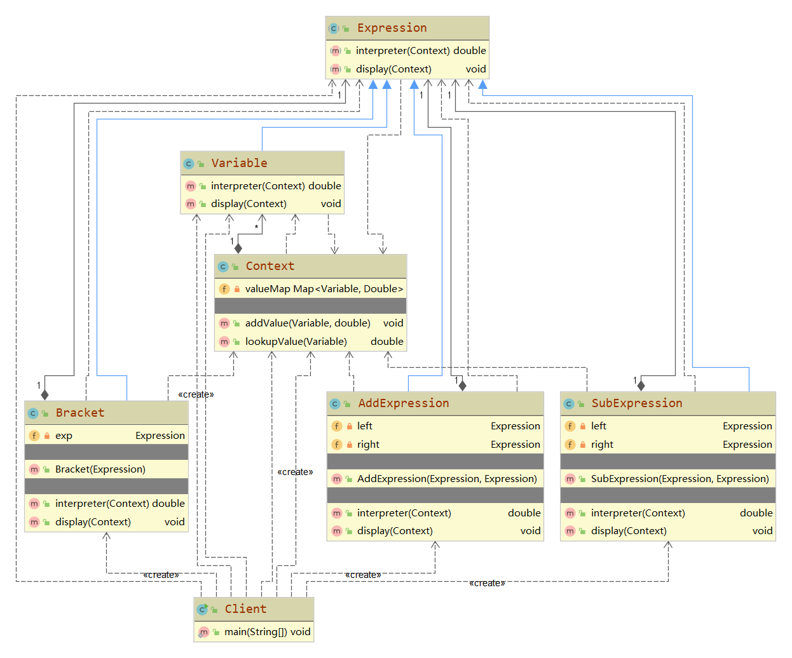
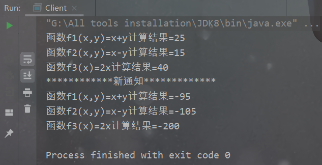
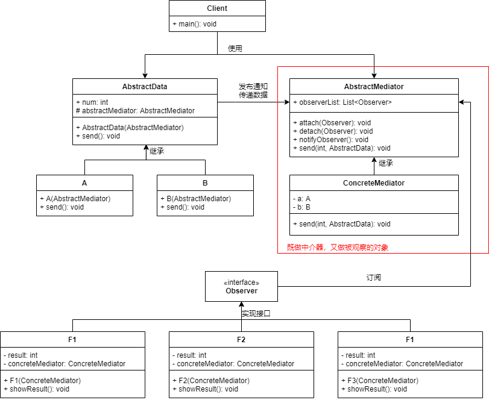

> 学号：Y01814110
>
> 姓名：龙征宇

## 一

### 题目

综合利用抽象工厂模式和单件模式，模拟实现服装工厂生产衣服的过程，具体内容如下：

现有两种服装品牌的工厂A和B，品牌A和品牌B的工厂都可以生产夹克和裤子，利用抽象工厂模式实现生产各种品牌的夹克和裤子的代码(即打印“生产A品牌夹克”之类的句子即可)，并且利用单件模式，将品牌A和品牌B的工厂实现为单件。

试完成以下工作：

（1）画出UML类图

（2）给出核心实现代码

### 项目目录结构

```bash
G:.
│  Client.java
├─bean
│  │  Jacket.java
│  │  Trouser.java
│  │
│  ├─jacket
│  │      JacketA.java
│  │      JacketB.java
│  └─trouser
│          TrouserA.java
│          TrouserB.java
└─factory
    │  AbstractFactory.java
    └─impl
            AFactory.java
            BFactory.java
```

### 实现代码

夹克和上衣接口及实现类：

```java
public interface Jacket {
    void printJacket();
}
```

```java
public interface Trouser {
    void printTrouser();
}
```

```java
public class JacketA implements Jacket {
    @Override
    public void printJacket() {
        System.out.println("生产A牌夹克");
    }
}
```

```java
public class JacketB implements Jacket {
    @Override
    public void printJacket() {
        System.out.println("生产B牌夹克");
    }
}
```

```java
public class TrouserA implements Trouser {
    @Override
    public void printTrouser() {
        System.out.println("生产A牌上衣");
    }
}
```

```java
public class TrouserB implements Trouser {
    @Override
    public void printTrouser() {
        System.out.println("生产B牌上衣");
    }
}
```

定义工厂：

```java
/**
 * @author Jonny Long
 * @date 2021/7/2 16:52
 */
public abstract class AbstractFactory {
    public abstract Jacket getJacket();
    public abstract Trouser getTrouser();
}
```

```java
public class AFactory extends AbstractFactory {
    private static AFactory instanceA = new AFactory();

    public static AFactory getInstanceA(){
        return instanceA;
    }

    @Override
    public Jacket getJacket() {
        return new JacketA();
    }

    @Override
    public Trouser getTrouser() {
        return new TrouserA();
    }
}
```

```java
public class BFactory extends AbstractFactory {
    private static BFactory instanceB = new BFactory();

    public static BFactory getInstanceB(){
        return instanceB;
    }

    @Override
    public Jacket getJacket() {
        return new JacketB();
    }

    @Override
    public Trouser getTrouser() {
        return new TrouserB();
    }
}
```

客户端测试：

```java
public class Client {
    public static void main(String[] args) {
        AFactory instanceA = AFactory.getInstanceA();
        instanceA.getJacket().printJacket();
        instanceA.getTrouser().printTrouser();

        BFactory instanceB = BFactory.getInstanceB();
        instanceB.getJacket().printJacket();
        instanceB.getTrouser().printTrouser();
    }
}
```



### UML图



## 二

### 题目

利用解释器模式，实现只含**加减法**及**括号**的代数表达式的打印及运算。例如对于代数表达式a+b-(c+3)，当给a赋值3，b赋值4，c赋值5时，输出如下：

```bash
a+b-(c+3)
=3+4-(5+3)
=-1
```

其中变量名只能是‘a’,’b’,…,’z’,所有变量赋值以及常数都是**0-9之间的整数**。输出结果中第一行打印原始表达式，`a+b-(c+3)`，即含有变量名；第二行将变量替换为所赋的值，即`3+4-(5+3)`；第三行打印计算结果。

试完成以下工作：

（1）给出**文法表达式**

（2）画出**UML类图**

（3）给出核心**实现代码**

### 项目目录结构

```bash
G:.
│  Client.java
│  Context.java
│  Expression.java
│  Variable.java
└─impl
        AddExpression.java
        Bracket.java
        SubExpression.java
```

### 实现代码

接口与变量类：

```java
public abstract class Expression {
    public abstract double interpreter(Context con);
    public abstract void display(Context con);
}
```

```java
public class Context {
    private Map<Variable,Double> valueMap = new HashMap<>();
    public void addValue(Variable x,double y){
        valueMap.put(x,y);
    }
    public double lookupValue(Variable x){
        return valueMap.get(x);
    }
}
```

```java
public class Variable extends Expression {
    @Override
    public double interpreter(Context con) {
        return con.lookupValue(this);
    }
    @Override
    public void display(Context con) {
        System.out.print(con.lookupValue(this));
    }
}
```

实现的运算：

```java
public class AddExpression extends Expression {
    private Expression left;
    private Expression right;

    public AddExpression(Expression left, Expression right) {
        this.left = left;
        this.right = right;
    }

    @Override
    public double interpreter(Context con) {
        return left.interpreter(con)+right.interpreter(con);
    }

    @Override
    public void display(Context con) {
        left.display(con);
        System.out.print("+");
        right.display(con);
    }
}
```

```java
public class SubExpression extends Expression {
    private Expression left;
    private Expression right;

    public SubExpression(Expression left, Expression right) {
        this.left = left;
        this.right = right;
    }

    @Override
    public double interpreter(Context con) {
        return left.interpreter(con)-right.interpreter(con);
    }

    @Override
    public void display(Context con) {
        left.display(con);
        System.out.print("-");
        right.display(con);
    }
}
```

```java
public class Bracket extends Expression {
    private Expression exp;

    public Bracket(Expression exp) {
        this.exp = exp;
    }

    @Override
    public double interpreter(Context con) {
        return exp.interpreter(con);
    }

    @Override
    public void display(Context con) {
        System.out.print("(");
        exp.display(con);
        System.out.print(")");
    }
}
```

客户端测试：

```java
public class Client {
    public static void main(String[] args) {
        Expression exp;
        Context con = new Context();
        Variable a = new Variable();
        Variable b = new Variable();
        Variable c = new Variable();
        con.addValue(a,3);
        con.addValue(b,4);
        con.addValue(c,5);
        Variable d = new Variable();
        con.addValue(d,3);
        exp = new SubExpression(new AddExpression(a,b),new Bracket(new AddExpression(c,d)));
        System.out.print("a+b-(c+3)\n=");
        exp.display(con);
        System.out.println("\n="+exp.interpreter(con));
    }
}
```



### UML图



## 三

### 题目

利用观察者模式和中介者模式，实现一个二元函数的函数计算器。该计算器含有两个数据类：

```c++
class A{
    int x;
}
class B{
    int y;
}
```

分别存储整型变量x和y。需要实现三个函数计算器类，分别计算`f1(x,y)=x+y`，`f2(x,y)=x-y`和`f3(x)=2x`。

要求：

（1）当且仅当类A和类B都发布通知时，3个函数计算器才相应地计算出3个新的值。

（2）类A、类B与三个函数计算器类尽可能解耦。

（3）可以动态地增加和减少函数计算器。

试完成以下工作：

（1）画出UML类图

（2）通过修改类A和类B，以及增加适当的类，实现其代码

### 项目目录结构

```bash
G:.
│  Client.java
├─data
│      A.java
│      AbstractData.java
│      B.java
├─mediator
│      AbstractMediator.java
│      ConcreteMediator.java
└─observer
        F1.java
        F2.java
        F3.java
        Observer.java
```

### 实现代码

数据类：

```java
public abstract class AbstractData {
    protected AbstractMediator abstractMediator;
    public int num;

    public AbstractData(AbstractMediator abstractMediator) {
        this.abstractMediator = abstractMediator;
    }

    public abstract void send(int num);
}
```

```java
public class A extends AbstractData {
    public A(AbstractMediator abstractMediator) {
        super(abstractMediator);
    }

    @Override
    public void send(int num) {
        abstractMediator.send(num,this);
    }
}
```

```java
public class B extends AbstractData {
    public B(AbstractMediator abstractMediator) {
        super(abstractMediator);
    }

    @Override
    public void send(int num) {
        abstractMediator.send(num,this);
    }
}
```

中介者+被观察者：

> 这个中介者类兼有两种智能：
>
> + 作为中介器
> + 作为被观察的对象

```java
/**
 * @author Jonny Long
 * @date 2021/7/3 10:35
 */
public abstract class AbstractMediator {
    // 作为中介器的接口
    public abstract void send(int num, AbstractData abstractData);

    // 被观察者
    private List<Observer> observerList = new LinkedList<>();

    public void attach(Observer observer){
        observerList.add(observer);
    }
    public void detach(Observer observer){
        observerList.remove(observer);
    }
    public void notifyObserver(){
        for (Observer o:observerList) {
            o.update();
        }
    }
}
```

```java
public class ConcreteMediator extends AbstractMediator {
    private A a;
    private B b;

    @Override
    public void send(int num, AbstractData abstractData) {
        if (a == abstractData) {
            a.num = num;
        } else if (b == abstractData) {
            b.num = num;
        }
    }

    public void setA(A a) {
        this.a = a;
    }

    public void setB(B b) {
        this.b = b;
    }

    public A getA() {
        return a;
    }

    public B getB() {
        return b;
    }
}
```

观察者类：

```java
public interface Observer {
    void update();
}
```

```java
public class F1 implements Observer{
    private int result;
    private ConcreteMediator concreteMediator;

    public F1(ConcreteMediator concreteMediator) {
        this.concreteMediator = concreteMediator;
    }

    @Override
    public void update() {
        result = concreteMediator.getA().num+concreteMediator.getB().num;
        showResult();
    }

    public void showResult() {
        System.out.println("函数f1(x,y)=x+y计算结果="+result);
    }
}
```

```java
public class F2 implements Observer {
    private int result;
    private ConcreteMediator concreteMediator;

    public F2(ConcreteMediator concreteMediator) {
        this.concreteMediator = concreteMediator;
    }
    @Override
    public void update() {
        result = concreteMediator.getA().num-concreteMediator.getB().num;
        showResult();
    }

    public void showResult() {
        System.out.println("函数f2(x,y)=x-y计算结果="+result);
    }
}
```

```java
public class F3 implements Observer {
    private int result;
    private ConcreteMediator concreteMediator;

    public F3(ConcreteMediator concreteMediator) {
        this.concreteMediator = concreteMediator;
    }

    @Override
    public void update() {
        result = concreteMediator.getA().num*2;
        showResult();
    }

    public void showResult() {
        System.out.println("函数f3(x)=2x计算结果="+result);
    }
}
```

```java
/**
 * @author Jonny Long
 * @date 2021/7/3 11:37
 */
public class Client {
    public static void main(String[] args) {
        // mediator既做中介器，又做被观察的对象
        ConcreteMediator mediator = new ConcreteMediator();
        A a = new A(mediator);
        B b = new B(mediator);
        mediator.setA(a);
        mediator.setB(b);
        a.send(20);
        b.send(5);

        mediator.attach(new F1(mediator));
        mediator.attach(new F2(mediator));
        mediator.attach(new F3(mediator));
        mediator.notifyObserver();
        // 让对象a发布新的通知
        System.out.println("************新通知*************");
        a.send(-100);
        mediator.notifyObserver();
    }
}
```



### UML图




